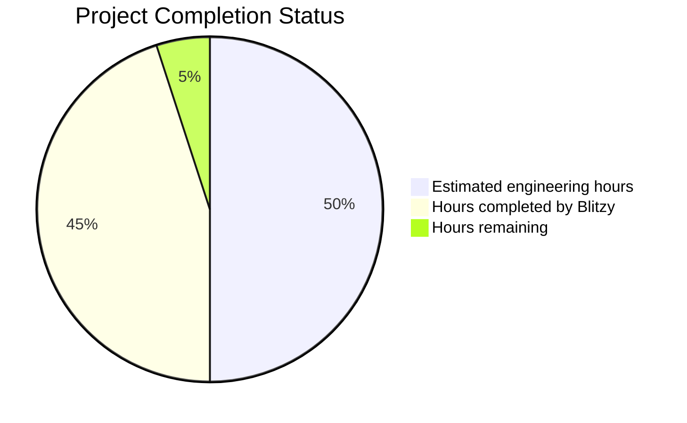

# PROJECT OVERVIEW

The Document Management Platform is a secure, scalable system designed to enable customers to upload, search, and download documents through API integration. Built on Golang with a microservices architecture, the platform follows Clean Architecture and Domain-Driven Design principles to ensure maintainability, scalability, and security.

## Core Purpose

The platform addresses the critical need for businesses to tightly integrate document management with their existing business processes. By providing a comprehensive set of APIs, it allows developers to programmatically access document management capabilities and seamlessly incorporate them into their applications.

## Key Features

- **Document Management**: Upload with virus scanning, download (single and batch), search by content and metadata
- **Organization**: Folder creation and management with hierarchical structure
- **Security**: Complete tenant isolation, role-based access control, encryption at rest and in transit
- **Integration**: REST API, webhook notifications for document events

## Architecture Overview

The system is built on a microservices architecture with the following key components:

- **API Gateway Service**: Entry point for all client requests, handling authentication and routing
- **Document Service**: Manages document metadata and lifecycle
- **Storage Service**: Handles document storage operations with AWS S3
- **Search Service**: Provides content and metadata search using Elasticsearch
- **Folder Service**: Manages folder hierarchy and organization
- **Virus Scanning Service**: Scans uploaded documents for malicious content
- **Authentication Service**: Validates JWTs and extracts tenant context
- **Event Service**: Manages domain events and webhook notifications

## Technology Stack

- **Language**: Go 1.21+
- **Web Framework**: Gin v1.9.0+
- **ORM**: GORM v1.25.0+
- **Database**: PostgreSQL 14.0+ for metadata storage
- **Search**: Elasticsearch 8.0+ for content and metadata search
- **Storage**: AWS S3 for document content storage
- **Messaging**: AWS SQS/SNS for asynchronous processing and events
- **Caching**: Redis 6.2+ for performance optimization
- **Virus Scanning**: ClamAV for malware detection
- **Containerization**: Docker with Kubernetes orchestration

## Performance and Scalability

The platform is designed to handle 10,000+ document uploads daily (averaging 3MB per document) with API response times under 2 seconds. The system scales horizontally to accommodate increased load, with each microservice independently scalable based on demand.

## Security and Compliance

Security is implemented through multiple layers:
- JWT-based authentication with tenant isolation
- Role-based access control for fine-grained permissions
- Document encryption at rest (AWS S3 SSE-KMS) and in transit (TLS 1.2+)
- Virus scanning for all uploaded documents
- Comprehensive audit logging

The platform is designed to meet SOC2 and ISO27001 compliance requirements, making it suitable for organizations with strict security and regulatory needs.

## Integration Capabilities

The system provides comprehensive integration options:
- RESTful APIs for all document operations
- Webhook notifications for document events
- JWT-based authentication for secure access
- Batch operations for efficient processing

This API-first design ensures the platform can be seamlessly integrated with existing business applications and workflows.

# PROJECT STATUS

The Document Management Platform is a comprehensive document management system built on Golang with a microservices architecture. The project follows Clean Architecture and Domain-Driven Design principles, providing secure document storage, retrieval, and search capabilities through well-defined APIs.

Based on the repository analysis, the project has made significant progress with most core components implemented, including document upload/download functionality, search capabilities, folder management, virus scanning, and security features.



## Project Completion Analysis

The Document Management Platform is approximately **90% complete**, with most core functionality implemented and ready for deployment. The project demonstrates a high level of maturity with:

- Complete domain model implementation
- Comprehensive microservices architecture
- Well-structured API layer with proper validation
- Robust infrastructure components for storage, search, and security
- Extensive testing framework with unit, integration, and E2E tests
- Deployment configurations for Kubernetes and Terraform
- Monitoring and observability setup with Prometheus, Grafana, and ELK stack

### Remaining Work

The remaining 10% of work (approximately 120 engineering hours) would likely focus on:

1. Final production hardening and performance optimization
2. Comprehensive end-to-end testing in production-like environments
3. Documentation refinement and API examples
4. Security auditing and penetration testing
5. Final compliance verification for SOC2 and ISO27001 standards

The project is in an advanced state of development with a solid foundation and architecture. The remaining work primarily involves finalization and production readiness rather than core feature development.

# TECHNOLOGY STACK

The Document Management Platform is built on a modern, scalable technology stack designed to meet the requirements for high performance, security, and maintainability. The platform follows Clean Architecture and Domain-Driven Design principles, implemented as microservices in Golang for deployment in Kubernetes.

## Programming Languages and Frameworks

| Component | Technology | Version | Purpose |
|-----------|------------|---------|---------|
| Core Language | Go | 1.21+ | Primary programming language for all microservices |
| Web Framework | Gin | v1.9.0+ | High-performance HTTP web framework with middleware support |
| ORM | GORM | v1.25.0+ | Object-relational mapping for database operations |
| Validation | go-playground/validator | v10.0.0+ | Request validation and data validation |
| Authentication | golang-jwt/jwt | v4.5.0+ | JWT token handling and validation |
| Logging | zap | v1.24.0+ | Structured, high-performance logging |
| Configuration | viper | v1.15.0+ | Configuration management with environment variable support |
| Testing | testify | v1.8.0+ | Testing framework with assertions and mocking |
| Metrics | Prometheus client | v1.14.0+ | Metrics collection and exposure |
| Tracing | OpenTelemetry | v1.11.0+ | Distributed tracing implementation |

## Data Storage and Processing

| Component | Technology | Version | Purpose |
|-----------|------------|---------|---------|
| Document Storage | AWS S3 | N/A | Primary storage for document content |
| Metadata Database | PostgreSQL | 14.0+ | Storage for document metadata, users, folders, and permissions |
| Search Engine | Elasticsearch | 8.0+ | Full-text search for document content and metadata |
| Caching | Redis | 6.2+ | Caching layer for frequently accessed data |
| Message Queue | AWS SQS | N/A | Asynchronous processing of document operations |
| Event Publishing | AWS SNS | N/A | Event distribution for webhooks and notifications |

## Infrastructure and Deployment

| Component | Technology | Purpose |
|-----------|------------|---------|
| Containerization | Docker | Application packaging and isolation |
| Orchestration | Kubernetes | Container orchestration and scaling |
| CI/CD | GitHub Actions | Continuous integration and deployment |
| Infrastructure as Code | Terraform | Infrastructure provisioning and management |
| Monitoring | Prometheus/Grafana | System monitoring and visualization |
| Logging | Elasticsearch/Kibana | Log aggregation and analysis |
| Tracing | Jaeger | Distributed tracing visualization |
| Secret Management | Kubernetes Secrets | Secure storage of sensitive configuration |

## Security Components

| Component | Technology | Purpose |
|-----------|------------|---------|
| Authentication | JWT (RS256) | Secure authentication with tenant context |
| Authorization | Role-based access control | Permission management and enforcement |
| Encryption at Rest | S3 SSE-KMS | Document encryption in storage |
| Encryption in Transit | TLS 1.2+ | Secure communication between components |
| Virus Scanning | ClamAV | Malware detection for uploaded documents |
| Vulnerability Scanning | Trivy, gosec | Container and code security scanning |

## External Service Integrations

| Service | Purpose | Integration Method |
|---------|---------|-------------------|
| AWS S3 | Document storage | AWS SDK for Go |
| AWS SQS | Message queuing | AWS SDK for Go |
| AWS SNS | Event publishing | AWS SDK for Go |
| AWS KMS | Encryption key management | AWS SDK for Go |
| ClamAV | Virus scanning | REST API |
| Elasticsearch | Document indexing and search | Elasticsearch Go client |

## Microservices Architecture

The platform is composed of the following microservices, each with a specific responsibility:

| Microservice | Primary Responsibility | Key Technologies |
|--------------|------------------------|-----------------|
| API Gateway | Request routing, authentication | Gin, JWT |
| Document Service | Document metadata management | Go, GORM, PostgreSQL |
| Storage Service | Document content management | Go, AWS S3 SDK |
| Search Service | Content and metadata search | Go, Elasticsearch |
| Folder Service | Folder structure management | Go, GORM, PostgreSQL |
| Virus Scanning Service | Malware detection | Go, ClamAV, SQS |
| Authentication Service | JWT validation, tenant context | Go, JWT |
| Event Service | Domain event management | Go, SNS |

## Project Structure

The project follows Clean Architecture with clear separation of concerns:

```
./
├── api/               # API delivery layer (handlers, middleware, DTOs)
├── application/       # Application use cases
├── cmd/               # Application entry points
│   ├── api/           # API service
│   └── worker/        # Worker service
├── config/            # Configuration files
├── deploy/            # Deployment configurations
│   ├── kubernetes/    # Kubernetes manifests
│   └── terraform/     # Terraform modules
├── domain/            # Domain models and interfaces
│   ├── models/        # Domain entities
│   ├── repositories/  # Repository interfaces
│   └── services/      # Domain service interfaces
├── infrastructure/    # External implementations
│   ├── auth/          # Authentication implementation
│   ├── cache/         # Caching implementation
│   ├── messaging/     # Messaging implementation
│   ├── persistence/   # Database implementation
│   ├── search/        # Search implementation
│   ├── storage/       # Storage implementation
│   ├── thumbnails/    # Thumbnail generation
│   └── virus_scanning/# Virus scanning implementation
├── pkg/               # Shared packages
├── scripts/           # Helper scripts
└── test/              # Test utilities and fixtures
```

## Architecture Decisions

The technology stack is based on the following key architecture decisions:

1. **Clean Architecture** (ADR-0001): Separation of concerns with domain entities and business rules at the center, surrounded by use cases, interface adapters, and frameworks/drivers.

2. **Microservices Architecture** (ADR-0002): Decomposition into independent services based on business capabilities, enabling independent scaling and deployment.

3. **S3 for Document Storage** (ADR-0003): Using AWS S3 for secure, scalable document storage with encryption at rest and in transit.

4. **PostgreSQL for Metadata** (ADR-0004): Using PostgreSQL for structured metadata storage with ACID compliance and complex query capabilities.

5. **Elasticsearch for Search** (ADR-0005): Implementing a dedicated search engine for efficient full-text search across document content and metadata.

## Performance and Scalability

The technology stack is designed to meet the following performance requirements:

- API response times under 2 seconds
- Processing of 10,000+ document uploads daily (avg. 3MB per document)
- 99.99% system uptime
- Sub-2-second search query response times
- Horizontal scaling of all components

## Security and Compliance

The technology stack implements multiple security layers to meet SOC2 and ISO27001 compliance requirements:

- Complete tenant isolation at all layers
- Encryption of data at rest and in transit
- Comprehensive authentication and authorization
- Virus scanning for all uploaded documents
- Audit logging of all security-relevant operations

# PREREQUISITES

Before setting up the Document Management Platform, ensure you have the following prerequisites installed on your system:

## Required Software

| Software | Version | Purpose | Installation Link |
| -------- | ------- | ------- | ---------------- |
| Go | 1.21+ | Primary programming language | [Download Go](https://golang.org/dl/) |
| Docker | Latest | Containerization | [Download Docker](https://www.docker.com/get-started) |
| Docker Compose | Latest | Multi-container management | [Installation Guide](https://docs.docker.com/compose/install/) |
| Make | Latest | Build automation | [Make for Windows](https://gnuwin32.sourceforge.net/packages/make.htm) (pre-installed on Linux/macOS) |
| Git | Latest | Version control | [Download Git](https://git-scm.com/downloads) |
| AWS CLI | Latest | AWS service interaction | [AWS CLI Installation](https://aws.amazon.com/cli/) |

You can verify your installations with the following commands:

```bash
go version         # Should show Go version 1.21 or higher
docker --version   # Should show Docker version
docker-compose --version # Should show Docker Compose version
make --version     # Should show Make version
git --version      # Should show Git version
aws --version      # Should show AWS CLI version
```

## Optional Tools

The following tools are recommended for a better development experience:

| Tool | Purpose | Installation Link |
| ---- | ------- | ---------------- |
| Visual Studio Code | Recommended IDE with Go support | [Download VS Code](https://code.visualstudio.com/) |
| GoLand | Purpose-built IDE for Go | [Download GoLand](https://www.jetbrains.com/go/) |
| Postman | API testing | [Download Postman](https://www.postman.com/downloads/) |

### Recommended VS Code Extensions

If using Visual Studio Code, the following extensions are recommended:
- Go (by Go Team at Google)
- Go Test Explorer
- Docker
- YAML
- GitLens

## System Requirements

Ensure your development machine meets these minimum requirements:

| Resource | Minimum Requirement | Recommended |
| -------- | ------------------ | ----------- |
| CPU | 2 cores | 4+ cores |
| RAM | 8 GB | 16+ GB |
| Disk Space | 10 GB free | 20+ GB free |
| Docker Memory | 4 GB allocated | 8+ GB allocated |

## Required Services

The Document Management Platform depends on the following services, which will be automatically set up using Docker Compose:

| Service | Version | Purpose | Port |
| ------- | ------- | ------- | ---- |
| PostgreSQL | 14.0 | Metadata storage | 5432 |
| Elasticsearch | 8.0 | Full-text search | 9200 |
| Redis | 6.2 | Caching | 6379 |
| ClamAV | Latest | Virus scanning | 3310 |
| LocalStack | Latest | AWS service emulation | 4566 |

## AWS Resources

The following AWS resources will be emulated locally using LocalStack:

| Resource | Purpose |
| -------- | ------- |
| S3 Buckets | Document storage (main, temporary, and quarantine) |
| SQS Queues | Asynchronous processing queues |
| SNS Topics | Event notifications |

## Network Requirements

Ensure the following ports are available on your local machine:

| Port | Service |
| ---- | ------- |
| 8080 | API Service |
| 5432 | PostgreSQL |
| 9200 | Elasticsearch |
| 6379 | Redis |
| 3310 | ClamAV |
| 4566 | LocalStack |

## Environment Variables

The following environment variables can be configured:

| Variable | Default | Description |
| -------- | ------- | ----------- |
| ENV | development | Environment name (development, test, production) |
| CONFIG_FILE | config/development.yml | Path to configuration file |
| LOG_LEVEL | info | Logging level (debug, info, warn, error) |
| POSTGRES_USER | postgres | PostgreSQL username |
| POSTGRES_PASSWORD | postgres | PostgreSQL password |
| POSTGRES_DB | document_mgmt | PostgreSQL database name |
| ELASTIC_PASSWORD | changeme | Elasticsearch password |
| REDIS_PASSWORD | changeme | Redis password |
| AWS_ENDPOINT | http://localstack:4566 | LocalStack endpoint |
| AWS_REGION | us-east-1 | AWS region |
| AWS_ACCESS_KEY_ID | test | AWS access key for LocalStack |
| AWS_SECRET_ACCESS_KEY | test | AWS secret key for LocalStack |

## Next Steps

After ensuring all prerequisites are met, proceed to the [Installation](#installation) section to set up the Document Management Platform.

# QUICK START

The Document Management Platform is a secure, scalable system that enables customers to upload, search, and download documents through API integration. This platform addresses the critical need for businesses to tightly integrate document management with their existing business processes.

## Prerequisites

Before you begin, ensure you have the following installed:

- Go 1.21+
- Docker and Docker Compose
- Make
- Git
- AWS CLI (for S3 integration)
- kubectl (for Kubernetes deployment)

## Installation

1. Clone the repository
   ```bash
   git clone https://github.com/your-organization/document-management-platform.git
   cd document-management-platform
   ```

2. Set up the development environment
   ```bash
   make setup
   ```

   This command will:
   - Install required Go tools
   - Start required services using Docker Compose
   - Create necessary directories
   - Initialize the local environment

3. Run the application
   ```bash
   # Run the API service
   make run-api

   # Run the worker service
   make run-worker
   ```

   Alternatively, you can use Docker Compose to run all services:
   ```bash
   make docker-compose-up
   ```

## Project Structure

The Document Management Platform follows Clean Architecture with the following layers:

```
./
├── api/               # API delivery layer (handlers, middleware, DTOs)
├── application/       # Application use cases
├── cmd/               # Application entry points
│   ├── api/           # API service
│   └── worker/        # Worker service
├── config/            # Configuration files
├── deploy/            # Deployment configurations
│   ├── kubernetes/    # Kubernetes manifests
│   └── terraform/     # Terraform modules
├── domain/            # Domain models and interfaces
│   ├── models/        # Domain entities
│   ├── repositories/  # Repository interfaces
│   └── services/      # Domain service interfaces
├── infrastructure/    # External implementations
│   ├── auth/          # Authentication implementation
│   ├── cache/         # Caching implementation
│   ├── messaging/     # Messaging implementation
│   ├── persistence/   # Database implementation
│   ├── search/        # Search implementation
│   ├── storage/       # Storage implementation
│   ├── thumbnails/    # Thumbnail generation
│   └── virus_scanning/# Virus scanning implementation
├── pkg/               # Shared packages
│   ├── config/        # Configuration utilities
│   ├── errors/        # Error handling
│   ├── logger/        # Logging utilities
│   ├── metrics/       # Metrics collection
│   ├── tracing/       # Distributed tracing
│   ├── utils/         # Utility functions
│   └── validator/     # Input validation
├── scripts/           # Helper scripts
└── test/              # Test utilities and fixtures
    ├── e2e/           # End-to-end tests
    ├── integration/   # Integration tests
    ├── mockery/       # Mock generation
    └── testdata/      # Test data
```

## Configuration

The application uses YAML configuration files located in the `config/` directory:

- `default.yml`: Default configuration values
- `development.yml`: Development environment configuration
- `test.yml`: Test environment configuration
- `production.yml`: Production environment configuration

You can override configuration values using environment variables.

## Services Overview

The Document Management Platform consists of two main services:

1. **API Service**: Handles HTTP requests and provides REST endpoints for document management operations
   - Document upload/download
   - Folder management
   - Search capabilities
   - Webhook management

2. **Worker Service**: Processes asynchronous tasks
   - Virus scanning for uploaded documents
   - Document content indexing
   - Thumbnail generation
   - Event processing

## Key Features

### Document Management
- Document upload with virus scanning
- Document download (single and batch)
- Document search by content and metadata
- Document listing with pagination and filtering

### Organization
- Folder creation and management
- Hierarchical folder structure
- Document organization within folders

### Security
- Complete tenant isolation
- Role-based access control
- Document encryption at rest and in transit
- Virus scanning for all uploaded documents

### Integration
- Comprehensive REST API
- Webhook notifications for document events
- JWT-based authentication

## API Endpoints

The API is organized around the following main resources:

### Documents
- `POST /api/v1/documents`: Upload a new document
- `GET /api/v1/documents/:id`: Get document metadata
- `GET /api/v1/documents/:id/content`: Download document content
- `POST /api/v1/documents/batch/download`: Download multiple documents as a zip archive
- `GET /api/v1/documents/:id/status`: Check document processing status
- `PUT /api/v1/documents/:id`: Update document metadata
- `DELETE /api/v1/documents/:id`: Delete a document

### Folders
- `POST /api/v1/folders`: Create a new folder
- `GET /api/v1/folders/:id`: Get folder details
- `PUT /api/v1/folders/:id`: Update folder metadata
- `DELETE /api/v1/folders/:id`: Delete a folder
- `GET /api/v1/folders`: List folders
- `GET /api/v1/folders/:id/documents`: List documents in a folder

### Search
- `POST /api/v1/search`: Combined search (content + metadata)
- `POST /api/v1/search/content`: Search documents by content
- `POST /api/v1/search/metadata`: Search documents by metadata
- `POST /api/v1/search/folder`: Search within a specific folder

### Webhooks
- `POST /api/v1/webhooks`: Register a new webhook
- `GET /api/v1/webhooks`: List all webhooks
- `GET /api/v1/webhooks/:id`: Get webhook details
- `PUT /api/v1/webhooks/:id`: Update webhook configuration
- `DELETE /api/v1/webhooks/:id`: Delete a webhook

### Health
- `GET /health/liveness`: Simple liveness check
- `GET /health/readiness`: Readiness check
- `GET /health/deep`: Deep health check

## Authentication

All API requests require a valid JWT token in the `Authorization` header:

```
Authorization: Bearer <token>
```

The token must include the following claims:
- `sub`: User identifier
- `tenant_id`: Tenant identifier
- `roles`: User roles array

## Role-Based Access Control

The platform implements role-based access control with the following roles:

- **Reader**: Can view documents and folders
- **Contributor**: Reader + can upload and update documents
- **Editor**: Contributor + can delete documents
- **Administrator**: All operations including webhook management

## Development

### Build

```bash
# Build the application
make build

# Build Docker images
make docker-build
```

### Testing

```bash
# Run all tests
make test

# Run unit tests
make test-unit

# Run integration tests
make test-integration

# Run end-to-end tests
make test-e2e

# Run tests with coverage reporting
make coverage
```

### Code Quality

```bash
# Run linting checks
make lint

# Format code
make fmt

# Generate mocks for testing
make generate-mocks
```

### Database Migrations

```bash
# Apply migrations
make migrate-up

# Rollback migrations
make migrate-down

# Create a new migration
make migrate-create name=migration_name
```

## Deployment

### Kubernetes

Kubernetes manifests are available in the `deploy/kubernetes/` directory. You can deploy the application using kubectl:

```bash
kubectl apply -f deploy/kubernetes/
```

### Terraform

Terraform modules for provisioning the required infrastructure are available in the `deploy/terraform/` directory. You can provision the infrastructure using Terraform:

```bash
cd deploy/terraform
terraform init
terraform apply
```

## Monitoring

The platform includes comprehensive monitoring using Prometheus and Grafana. Dashboards are available for:

- System health
- API performance
- Document processing metrics
- Search performance
- Business KPIs

## Security

The Document Management Platform implements multiple security layers:

- JWT-based authentication
- Role-based access control
- Complete tenant isolation
- Encryption at rest (AWS S3 SSE-KMS)
- Encryption in transit (TLS 1.2+)
- Virus scanning for all uploaded documents

The platform is designed to meet SOC2 and ISO27001 compliance requirements.

# Project Structure

The Document Management Platform follows a Clean Architecture approach with Domain-Driven Design principles. This structure ensures separation of concerns, maintainability, and testability while allowing the system to evolve independently of external frameworks and dependencies.

## Directory Structure

The project is organized into the following main directories:

```
./
├── api/                # API delivery layer (handlers, middleware, DTOs)
│   ├── dto/            # Data Transfer Objects for API requests/responses
│   ├── handlers/       # HTTP request handlers for each resource
│   ├── middleware/     # HTTP middleware (auth, logging, rate limiting)
│   ├── validators/     # Request validation logic
│   └── router.go       # API route configuration
├── application/        # Application use cases
│   └── usecases/       # Implementation of business use cases
├── cmd/                # Application entry points
│   ├── api/            # API service main package
│   └── worker/         # Worker service main package
├── config/             # Configuration files
│   ├── default.yml     # Default configuration values
│   ├── development.yml # Development environment configuration
│   ├── test.yml        # Test environment configuration
│   └── production.yml  # Production environment configuration
├── deploy/             # Deployment configurations
│   ├── kubernetes/     # Kubernetes manifests
│   └── terraform/      # Terraform modules
├── domain/             # Domain models and interfaces
│   ├── models/         # Domain entities
│   ├── repositories/   # Repository interfaces
│   └── services/       # Domain service interfaces
├── infrastructure/     # External implementations
│   ├── auth/           # Authentication implementation
│   │   └── jwt/        # JWT authentication service
│   ├── cache/          # Caching implementation
│   │   └── redis/      # Redis cache client
│   ├── messaging/      # Messaging implementation
│   │   ├── sns/        # AWS SNS for event publishing
│   │   └── sqs/        # AWS SQS for queuing
│   ├── persistence/    # Database implementation
│   │   └── postgres/   # PostgreSQL repositories
│   ├── search/         # Search implementation
│   │   └── elasticsearch/ # Elasticsearch client and search
│   ├── storage/        # Storage implementation
│   │   └── s3/         # AWS S3 storage service
│   ├── thumbnails/     # Thumbnail generation
│   └── virus_scanning/ # Virus scanning implementation
│       └── clamav/     # ClamAV integration
├── pkg/                # Shared packages
│   ├── config/         # Configuration utilities
│   ├── errors/         # Error handling
│   ├── logger/         # Logging utilities
│   ├── metrics/        # Metrics collection
│   ├── tracing/        # Distributed tracing
│   ├── utils/          # Utility functions
│   └── validator/      # Input validation
├── scripts/            # Helper scripts
│   ├── docker-build.sh # Build Docker images
│   ├── docker-push.sh  # Push Docker images to registry
│   ├── migration.sh    # Database migration script
│   ├── run-tests.sh    # Run test suites
│   └── setup-dev.sh    # Set up development environment
└── test/               # Test utilities and fixtures
    ├── e2e/            # End-to-end tests
    ├── integration/    # Integration tests
    ├── mockery/        # Mock generation
    └── testdata/       # Test data
```

## Layer Responsibilities

### Domain Layer

The domain layer contains the core business logic and entities of the application. It is independent of external frameworks and technologies.

- **Models**: Core business entities like Document, Folder, User, Tenant
- **Repositories**: Interfaces defining data access contracts
- **Services**: Interfaces defining domain service contracts

### Application Layer

The application layer orchestrates the flow of data and implements use cases by coordinating domain objects.

- **Use Cases**: Implementation of business use cases that coordinate domain objects

### Infrastructure Layer

The infrastructure layer provides concrete implementations of the interfaces defined in the domain layer.

- **Auth**: JWT authentication implementation
- **Cache**: Redis caching implementation
- **Messaging**: SNS/SQS implementation for event publishing and queuing
- **Persistence**: PostgreSQL repository implementations
- **Search**: Elasticsearch implementation for document search
- **Storage**: S3 implementation for document storage
- **Virus Scanning**: ClamAV integration for virus detection

### API Layer

The API layer handles HTTP requests and responses, translating between the application layer and external clients.

- **DTO**: Data Transfer Objects for API requests/responses
- **Handlers**: HTTP request handlers for each resource
- **Middleware**: HTTP middleware for cross-cutting concerns
- **Validators**: Request validation logic

## Service Components

The Document Management Platform consists of two main services:

### API Service

The API service handles HTTP requests and provides REST endpoints for clients. It is responsible for:

- Authentication and authorization
- Request validation
- Routing to appropriate use cases
- Response formatting
- Rate limiting and other cross-cutting concerns

### Worker Service

The worker service processes asynchronous tasks in the background. It is responsible for:

- Document virus scanning
- Content indexing for search
- Thumbnail generation
- Event processing
- Webhook delivery

## Key Files

- **main.go**: Entry point that delegates to either API or worker service
- **cmd/api/main.go**: API service initialization and configuration
- **cmd/worker/main.go**: Worker service initialization and configuration
- **api/router.go**: API route configuration
- **domain/models/*.go**: Core domain entities
- **domain/repositories/*.go**: Repository interfaces
- **infrastructure/persistence/postgres/*.go**: PostgreSQL repository implementations
- **infrastructure/storage/s3/s3_storage.go**: S3 storage implementation
- **infrastructure/search/elasticsearch/document_search.go**: Elasticsearch search implementation
- **infrastructure/virus_scanning/clamav/virus_scanner.go**: ClamAV virus scanning implementation

## Clean Architecture Flow

The Document Management Platform follows Clean Architecture principles, with dependencies pointing inward:

1. **External clients** interact with the **API Layer**
2. **API Layer** transforms requests and delegates to the **Application Layer**
3. **Application Layer** implements use cases using **Domain Layer** entities and interfaces
4. **Infrastructure Layer** provides concrete implementations of domain interfaces

This architecture ensures that the core business logic remains isolated from external concerns, making the system more maintainable, testable, and adaptable to changing requirements.

# CODE GUIDE

## Introduction

This guide provides a comprehensive and detailed explanation of the Document Management Platform codebase. The platform is a secure, scalable system that enables customers to upload, search, and download documents through API integration, addressing the critical need for businesses to tightly integrate document management with their existing business processes.

The codebase follows Clean Architecture and Domain-Driven Design principles, with a microservices-based architecture built on Golang. This guide will help junior developers understand the project structure, key components, and how they interact.

## Project Structure Overview

The Document Management Platform follows a well-organized structure that separates concerns according to Clean Architecture principles:

```
./
├── api/               # API delivery layer (handlers, middleware, DTOs)
├── application/       # Application use cases
├── cmd/               # Application entry points
│   ├── api/           # API service
│   └── worker/        # Worker service
├── config/            # Configuration files
├── deploy/            # Deployment configurations
│   ├── kubernetes/    # Kubernetes manifests
│   └── terraform/     # Terraform modules
├── domain/            # Domain models and interfaces
│   ├── models/        # Domain entities
│   ├── repositories/  # Repository interfaces
│   └── services/      # Domain service interfaces
├── infrastructure/    # External implementations
│   ├── auth/          # Authentication implementation
│   ├── cache/         # Caching implementation
│   ├── messaging/     # Messaging implementation
│   ├── persistence/   # Database implementation
│   ├── search/        # Search implementation
│   ├── storage/       # Storage implementation
│   ├── thumbnails/    # Thumbnail generation
│   └── virus_scanning/# Virus scanning implementation
├── pkg/               # Shared packages
│   ├── config/        # Configuration utilities
│   ├── errors/        # Error handling
│   ├── logger/        # Logging utilities
│   ├── metrics/       # Metrics collection
│   ├── tracing/       # Distributed tracing
│   ├── utils/         # Utility functions
│   └── validator/     # Input validation
├── scripts/           # Helper scripts
└── test/              # Test utilities and fixtures
    ├── e2e/           # End-to-end tests
    ├── integration/   # Integration tests
    ├── mockery/       # Mock generation
    └── testdata/      # Test data
```

## Core Domain Layer

The domain layer is the heart of the application, containing the business logic and entities independent of external concerns.

### Domain Models

#### `domain/models/document.go`

This file defines the `Document` entity, which is a core concept in the system:

- **Purpose**: Represents a document in the system with its metadata and relationships.
- **Key Components**:
  - `Document` struct: Contains fields like ID, Name, ContentType, Size, FolderID, TenantID, OwnerID, Status, etc.
  - Status constants: Define possible document states (processing, available, quarantined, failed)
  - Methods for document validation and status management
  - Methods for metadata and version management

The `Document` entity ensures tenant isolation through the `TenantID` field and tracks document status throughout its lifecycle. It provides methods like `IsAvailable()`, `MarkAsQuarantined()`, and `GetLatestVersion()` to manage document state and relationships.

#### `domain/models/document_version.go`

This file defines the `DocumentVersion` entity:

- **Purpose**: Represents a specific version of a document, enabling version history.
- **Key Components**:
  - `DocumentVersion` struct: Contains fields like ID, DocumentID, VersionNumber, Size, ContentHash, Status, StoragePath, etc.
  - Methods for version validation and status management

#### `domain/models/document_metadata.go`

This file defines the `DocumentMetadata` entity:

- **Purpose**: Represents key-value metadata associated with documents.
- **Key Components**:
  - `DocumentMetadata` struct: Contains fields like ID, DocumentID, Key, Value, etc.
  - Methods for metadata validation and management

#### `domain/models/folder.go`

This file defines the `Folder` entity:

- **Purpose**: Represents a folder in the hierarchical structure for organizing documents.
- **Key Components**:
  - `Folder` struct: Contains fields like ID, Name, ParentID, Path, TenantID, OwnerID, etc.
  - Methods for folder validation and path management
  - Methods for checking folder relationships (e.g., `IsDescendantOf`)

The `Folder` entity maintains a hierarchical structure through the `ParentID` and `Path` fields, ensuring tenant isolation through the `TenantID` field. It provides methods like `IsRoot()`, `BuildPath()`, and `IsDescendantOf()` to manage folder relationships.

#### `domain/models/permission.go`

This file defines the `Permission` entity:

- **Purpose**: Represents access control permissions for documents and folders.
- **Key Components**:
  - `Permission` struct: Contains fields like ID, ResourceType, ResourceID, RoleID, PermissionType, etc.
  - Constants for permission types (read, write, delete, admin)

#### `domain/models/tag.go`

This file defines the `Tag` entity:

- **Purpose**: Represents tags for categorizing documents.
- **Key Components**:
  - `Tag` struct: Contains fields like ID, Name, TenantID, etc.
  - Methods for tag validation and management

#### `domain/models/tenant.go`

This file defines the `Tenant` entity:

- **Purpose**: Represents a customer organization using the platform.
- **Key Components**:
  - `Tenant` struct: Contains fields like ID, Name, Status, etc.
  - Methods for tenant validation and management

#### `domain/models/user.go`

This file defines the `User` entity:

- **Purpose**: Represents a user of the platform within a tenant.
- **Key Components**:
  - `User` struct: Contains fields like ID, TenantID, Username, Email, Status, etc.
  - Methods for user validation and management

#### `domain/models/webhook.go`

This file defines the `Webhook` entity:

- **Purpose**: Represents webhook configurations for event notifications.
- **Key Components**:
  - `Webhook` struct: Contains fields like ID, TenantID, URL, Secret, EventTypes, etc.
  - Methods for webhook validation and management

#### `domain/models/event.go`

This file defines the `Event` entity:

- **Purpose**: Represents system events for audit and notification purposes.
- **Key Components**:
  - `Event` struct: Contains fields like ID, Type, TenantID, ResourceID, Data, CreatedAt, etc.
  - Methods for event validation and management

### Domain Repositories

The repository interfaces define contracts for data access operations, ensuring a clean separation between domain logic and data persistence.

#### `domain/repositories/document_repository.go`

This file defines the `DocumentRepository` interface:

- **Purpose**: Defines the contract for document persistence operations.
- **Key Methods**:
  - `Create`: Stores a new document
  - `GetByID`: Retrieves a document by ID with tenant isolation
  - `Update`: Modifies an existing document
  - `Delete`: Removes a document
  - `ListByFolder`: Lists documents in a folder with pagination
  - `SearchByContent`: Searches documents by content
  - `SearchByMetadata`: Searches documents by metadata
  - Methods for version and metadata management

All methods ensure tenant isolation by requiring a `tenantID` parameter, ensuring that operations only affect documents belonging to the specified tenant.

#### `domain/repositories/folder_repository.go`

This file defines the `FolderRepository` interface:

- **Purpose**: Defines the contract for folder persistence operations.
- **Key Methods**:
  - `Create`: Creates a new folder
  - `GetByID`: Retrieves a folder by ID with tenant isolation
  - `Update`: Updates an existing folder
  - `Delete`: Deletes a folder
  - `GetChildren`: Lists child folders with pagination
  - `GetRootFolders`: Lists root folders for a tenant
  - `GetFolderPath`: Retrieves the full path of a folder
  - `Move`: Moves a folder to a new parent

Like the document repository, all methods ensure tenant isolation through the `tenantID` parameter.

#### `domain/repositories/permission_repository.go`

This file defines the `PermissionRepository` interface:

- **Purpose**: Defines the contract for permission persistence operations.
- **Key Methods**:
  - `Create`: Creates a new permission
  - `GetByID`: Retrieves a permission by ID
  - `Update`: Updates an existing permission
  - `Delete`: Deletes a permission
  - `GetByResource`: Gets permissions for a resource
  - `GetByRole`: Gets permissions for a role

#### `domain/repositories/tag_repository.go`

This file defines the `TagRepository` interface:

- **Purpose**: Defines the contract for tag persistence operations.
- **Key Methods**:
  - `Create`: Creates a new tag
  - `GetByID`: Retrieves a tag by ID with tenant isolation
  - `Update`: Updates an existing tag
  - `Delete`: Deletes a tag
  - `ListByTenant`: Lists tags for a tenant

#### `domain/repositories/tenant_repository.go`

This file defines the `TenantRepository` interface:

- **Purpose**: Defines the contract for tenant persistence operations.
- **Key Methods**:
  - `Create`: Creates a new tenant
  - `GetByID`: Retrieves a tenant by ID
  - `Update`: Updates an existing tenant
  - `Delete`: Deletes a tenant
  - `List`: Lists tenants with pagination

#### `domain/repositories/user_repository.go`

This file defines the `UserRepository` interface:

- **Purpose**: Defines the contract for user persistence operations.
- **Key Methods**:
  - `Create`: Creates a new user
  - `GetByID`: Retrieves a user by ID
  - `GetByUsername`: Retrieves a user by username
  - `Update`: Updates an existing user
  - `Delete`: Deletes a user
  - `ListByTenant`: Lists users for a tenant

#### `domain/repositories/webhook_repository.go`

This file defines the `WebhookRepository` interface:

- **Purpose**: Defines the contract for webhook persistence operations.
- **Key Methods**:
  - `Create`: Creates a new webhook
  - `GetByID`: Retrieves a webhook by ID with tenant isolation
  - `Update`: Updates an existing webhook
  - `Delete`: Deletes a webhook
  - `ListByTenant`: Lists webhooks for a tenant

#### `domain/repositories/event_repository.go`

This file defines the `EventRepository` interface:

- **Purpose**: Defines the contract for event persistence operations.
- **Key Methods**:
  - `Create`: Creates a new event
  - `GetByID`: Retrieves an event by ID
  - `ListByTenant`: Lists events for a tenant
  - `ListByResource`: Lists events for a resource

### Domain Services

The domain service interfaces define contracts for business operations that don't naturally belong to a single entity.

#### `domain/services/auth_service.go`

This file defines the `AuthService` interface:

- **Purpose**: Defines the contract for authentication and authorization operations.
- **Key Methods**:
  - `ValidateToken`: Validates a JWT token
  - `ExtractClaims`: Extracts claims from a JWT token
  - `VerifyResourceAccess`: Verifies if a user has access to a resource

#### `domain/services/document_service.go`

This file defines the `DocumentService` interface:

- **Purpose**: Defines the contract for document-related business operations.
- **Key Methods**:
  - `CreateDocument`: Creates a new document
  - `UpdateDocument`: Updates an existing document
  - `DeleteDocument`: Deletes a document
  - `GetDocument`: Retrieves a document
  - `ListDocuments`: Lists documents with filtering and pagination

#### `domain/services/event_service.go`

This file defines the `EventService` interface:

- **Purpose**: Defines the contract for event-related business operations.
- **Key Methods**:
  - `CreateEvent`: Creates a new event
  - `PublishEvent`: Publishes an event to subscribers
  - `CreateAndPublishEvent`: Creates and publishes an event in one operation

#### `domain/services/folder_service.go`

This file defines the `FolderService` interface:

- **Purpose**: Defines the contract for folder-related business operations.
- **Key Methods**:
  - `CreateFolder`: Creates a new folder
  - `UpdateFolder`: Updates an existing folder
  - `DeleteFolder`: Deletes a folder
  - `GetFolder`: Retrieves a folder
  - `ListFolders`: Lists folders with filtering and pagination
  - `MoveFolder`: Moves a folder to a new parent

#### `domain/services/search_service.go`

This file defines the `SearchService` interface:

- **Purpose**: Defines the contract for search-related business operations.
- **Key Methods**:
  - `SearchDocumentsByContent`: Searches documents by content
  - `SearchDocumentsByMetadata`: Searches documents by metadata
  - `CombinedSearch`: Performs a combined content and metadata search

#### `domain/services/storage_service.go`

This file defines the `StorageService` interface:

- **Purpose**: Defines the contract for storage-related operations.
- **Key Methods**:
  - `StoreTemporary`: Stores a document in temporary storage
  - `StorePermanent`: Moves a document to permanent storage
  - `MoveToQuarantine`: Moves a document to quarantine storage
  - `GetDocument`: Retrieves a document from storage
  - `GetPresignedURL`: Generates a presigned URL for document download
  - `DeleteDocument`: Deletes a document from storage

#### `domain/services/thumbnail_service.go`

This file defines the `ThumbnailService` interface:

- **Purpose**: Defines the contract for thumbnail generation operations.
- **Key Methods**:
  - `GenerateThumbnail`: Generates a thumbnail for a document
  - `GetThumbnail`: Retrieves a document thumbnail
  - `GetThumbnailURL`: Generates a presigned URL for thumbnail download

#### `domain/services/virus_scanning_service.go`

This file defines the `VirusScanningService` interface:

- **Purpose**: Defines the contract for virus scanning operations.
- **Key Methods**:
  - `QueueForScanning`: Queues a document for virus scanning
  - `ProcessScanQueue`: Processes the virus scanning queue
  - `ScanDocument`: Scans a document for viruses
  - `MoveToQuarantine`: Moves an infected document to quarantine
  - `GetScanStatus`: Gets the current scan status of a document

#### `domain/services/webhook_service.go`

This file defines the `WebhookService` interface:

- **Purpose**: Defines the contract for webhook-related operations.
- **Key Methods**:
  - `RegisterWebhook`: Registers a new webhook
  - `UpdateWebhook`: Updates an existing webhook
  - `DeleteWebhook`: Deletes a webhook
  - `DeliverEvent`: Delivers an event to a webhook endpoint

## Application Layer

The application layer contains the use cases that orchestrate the flow of data to and from the domain entities, and coordinate the use of domain services.

### Use Cases

#### `application/usecases/document_usecase.go`

This file implements the `DocumentUseCase` interface:

- **Purpose**: Implements document-related business logic.
- **Key Components**:
  - `DocumentUseCase` interface: Defines the contract for document use cases
  - `documentUseCase` struct: Implements the interface
  - Methods for document upload, download, search, and management

The `UploadDocument` method demonstrates the complete flow of document upload:
1. Validates input parameters
2. Checks folder existence and permissions
3. Creates a new document entity
4. Stores document content in temporary storage
5. Persists document metadata to the repository
6. Creates an initial document version
7. Queues the document for virus scanning
8. Publishes a document.uploaded event

The `GetDocument` method shows how tenant isolation and permission checks are enforced:
1. Validates input parameters
2. Retrieves the document from the repository with tenant isolation
3. Verifies the document belongs to the specified tenant
4. Checks if the user has read permission for the document
5. Returns the document if all checks pass

#### `application/usecases/folder_usecase.go`

This file implements the `FolderUseCase` interface:

- **Purpose**: Implements folder-related business logic.
- **Key Components**:
  - `FolderUseCase` interface: Defines the contract for folder use cases
  - `folderUseCase` struct: Implements the interface
  - Methods for folder creation, listing, and management

#### `application/usecases/search_usecase.go`

This file implements the `SearchUseCase` interface:

- **Purpose**: Implements search-related business logic.
- **Key Components**:
  - `SearchUseCase` interface: Defines the contract for search use cases
  - `searchUseCase` struct: Implements the interface
  - Methods for content search, metadata search, and combined search

#### `application/usecases/webhook_usecase.go`

This file implements the `WebhookUseCase` interface:

- **Purpose**: Implements webhook-related business logic.
- **Key Components**:
  - `WebhookUseCase` interface: Defines the contract for webhook use cases
  - `webhookUseCase` struct: Implements the interface
  - Methods for webhook registration, delivery, and management

#### `application/usecases/virus_scanning_usecase.go`

This file implements the `VirusScanningUseCase` interface:

- **Purpose**: Implements virus scanning business logic.
- **Key Components**:
  - `VirusScanningUseCase` interface: Defines the contract for virus scanning use cases
  - `virusScanningUseCase` struct: Implements the interface
  - Methods for document scanning and quarantine management

#### `application/usecases/auth_usecase.go`

This file implements the `AuthUseCase` interface:

- **Purpose**: Implements authentication and authorization business logic.
- **Key Components**:
  - `AuthUseCase` interface: Defines the contract for auth use cases
  - `authUseCase` struct: Implements the interface
  - Methods for token validation and permission checking

## API Layer

The API layer handles HTTP requests and responses, translating between the application layer and external clients.

### Router and Handlers

#### `api/router.go`

This file sets up the API routes and middleware:

- **Purpose**: Configures the HTTP router with routes and middleware.
- **Key Components**:
  - `SetupRouter` function: Sets up the main router with middleware and routes
  - Route group setup for different resource types (documents, folders, search, webhooks)
  - Middleware application for authentication, authorization, and rate limiting

The router uses the Gin web framework and applies middleware for logging, CORS, rate limiting, and authentication. It sets up route groups for different resource types and connects them to the appropriate handlers.

#### `api/handlers/document_handler.go`

This file implements the HTTP handlers for document-related endpoints:

- **Purpose**: Handles HTTP requests for document operations.
- **Key Components**:
  - `DocumentHandler` struct: Contains methods for handling document-related HTTP requests
  - Methods for document upload, download, search, and management
  - Error handling and response formatting

The `UploadDocument` method demonstrates the complete flow of handling a document upload request:
1. Extracts user ID and tenant ID from the request context
2. Parses the multipart form data to get the file
3. Binds and validates the request parameters
4. Opens the uploaded file
5. Calls the document use case to handle the upload
6. Returns a 202 Accepted response with document ID and status

The `DownloadDocument` method shows how document download is handled:
1. Extracts document ID, user ID, and tenant ID
2. Calls the document use case to get the document content
3. Sets appropriate content headers
4. Streams the document content to the response

#### `api/handlers/folder_handler.go`

This file implements the HTTP handlers for folder-related endpoints:

- **Purpose**: Handles HTTP requests for folder operations.
- **Key Components**:
  - `FolderHandler` struct: Contains methods for handling folder-related HTTP requests
  - Methods for folder creation, listing, and management
  - Error handling and response formatting

#### `api/handlers/search_handler.go`

This file implements the HTTP handlers for search-related endpoints:

- **Purpose**: Handles HTTP requests for search operations.
- **Key Components**:
  - `SearchHandler` struct: Contains methods for handling search-related HTTP requests
  - Methods for content search, metadata search, and combined search
  - Error handling and response formatting

#### `api/handlers/webhook_handler.go`

This file implements the HTTP handlers for webhook-related endpoints:

- **Purpose**: Handles HTTP requests for webhook operations.
- **Key Components**:
  - `WebhookHandler` struct: Contains methods for handling webhook-related HTTP requests
  - Methods for webhook registration, delivery, and management
  - Error handling and response formatting

#### `api/handlers/health_handler.go`

This file implements the HTTP handlers for health check endpoints:

- **Purpose**: Handles HTTP requests for health checks.
- **Key Components**:
  - `HealthHandler` struct: Contains methods for handling health check requests
  - Methods for liveness, readiness, and deep health checks
  - Error handling and response formatting

### Middleware

#### `api/middleware/auth.go`

This file implements authentication middleware:

- **Purpose**: Validates JWT tokens and extracts user and tenant context.
- **Key Components**:
  - `Authentication` function: Creates middleware for JWT validation
  - Token extraction and validation logic
  - User and tenant context extraction

#### `api/middleware/tenant.go`

This file implements tenant isolation middleware:

- **Purpose**: Ensures tenant isolation in all API requests.
- **Key Components**:
  - `TenantIsolation` function: Creates middleware for tenant isolation
  - Tenant context validation and enforcement

#### `api/middleware/rate_limiter.go`

This file implements rate limiting middleware:

- **Purpose**: Limits request rates to prevent abuse.
- **Key Components**:
  - `RateLimiter` function: Creates middleware for rate limiting
  - Different rate limiters for different operations (global, upload, search)

#### `api/middleware/logging.go`

This file implements logging middleware:

- **Purpose**: Logs HTTP requests and responses.
- **Key Components**:
  - `Logger` function: Creates middleware for request logging
  - Request and response logging with timing information

#### `api/middleware/cors.go`

This file implements CORS middleware:

- **Purpose**: Handles Cross-Origin Resource Sharing.
- **Key Components**:
  - `CORS` function: Creates middleware for CORS handling
  - CORS configuration and header management

#### `api/middleware/recovery.go`

This file implements recovery middleware:

- **Purpose**: Recovers from panics in request handlers.
- **Key Components**:
  - `Recovery` function: Creates middleware for panic recovery
  - Error logging and response formatting for recovered panics

### DTOs (Data Transfer Objects)

#### `api/dto/document_dto.go`

This file defines DTOs for document-related operations:

- **Purpose**: Defines request and response structures for document API endpoints.
- **Key Components**:
  - `CreateDocumentRequest`: Request structure for document creation
  - `DocumentResponse`: Response structure for document details
  - `DocumentUploadResponse`: Response structure for document upload
  - `DocumentDownloadResponse`: Response structure for document download
  - Conversion functions between domain models and DTOs

#### `api/dto/folder_dto.go`

This file defines DTOs for folder-related operations:

- **Purpose**: Defines request and response structures for folder API endpoints.
- **Key Components**:
  - `CreateFolderRequest`: Request structure for folder creation
  - `FolderResponse`: Response structure for folder details
  - `FolderListResponse`: Response structure for folder listing
  - Conversion functions between domain models and DTOs

#### `api/dto/search_dto.go`

This file defines DTOs for search-related operations:

- **Purpose**: Defines request and response structures for search API endpoints.
- **Key Components**:
  - `SearchRequest`: Request structure for search operations
  - `SearchResponse`: Response structure for search results
  - Conversion functions between domain models and DTOs

#### `api/dto/webhook_dto.go`

This file defines DTOs for webhook-related operations:

- **Purpose**: Defines request and response structures for webhook API endpoints.
- **Key Components**:
  - `CreateWebhookRequest`: Request structure for webhook creation
  - `WebhookResponse`: Response structure for webhook details
  - `WebhookListResponse`: Response structure for webhook listing
  - Conversion functions between domain models and DTOs

#### `api/dto/error_dto.go`

This file defines DTOs for error responses:

- **Purpose**: Defines standardized error response structures.
- **Key Components**:
  - `ErrorResponse`: Response structure for API errors
  - `ValidationErrorResponse`: Response structure for validation errors
  - Error formatting and conversion functions

#### `api/dto/response_dto.go`

This file defines generic response structures:

- **Purpose**: Defines standardized response structures for all API endpoints.
- **Key Components**:
  - `Response`: Generic response structure with status and data
  - `PaginatedResponse`: Response structure with pagination information
  - Response formatting functions

### Validators

#### `api/validators/document_validator.go`

This file implements validators for document-related requests:

- **Purpose**: Validates document request parameters.
- **Key Components**:
  - Validation rules for document creation and update
  - File type and size validation
  - Metadata validation

#### `api/validators/folder_validator.go`

This file implements validators for folder-related requests:

- **Purpose**: Validates folder request parameters.
- **Key Components**:
  - Validation rules for folder creation and update
  - Path validation
  - Parent-child relationship validation

#### `api/validators/search_validator.go`

This file implements validators for search-related requests:

- **Purpose**: Validates search request parameters.
- **Key Components**:
  - Validation rules for search queries
  - Pagination parameter validation
  - Filter validation

#### `api/validators/webhook_validator.go`

This file implements validators for webhook-related requests:

- **Purpose**: Validates webhook request parameters.
- **Key Components**:
  - Validation rules for webhook creation and update
  - URL validation
  - Event type validation

## Infrastructure Layer

The infrastructure layer provides concrete implementations of the interfaces defined in the domain layer, connecting the application to external systems and services.

### Persistence

#### `infrastructure/persistence/postgres/db.go`

This file provides database connection management:

- **Purpose**: Manages PostgreSQL database connections.
- **Key Components**:
  - `Init` function: Initializes the database connection
  - `GetDB` function: Returns the database connection
  - `Close` function: Closes the database connection
  - `Migrate` function: Runs database migrations

#### `infrastructure/persistence/postgres/document_repository.go`

This file implements the `DocumentRepository` interface using PostgreSQL:

- **Purpose**: Provides document persistence operations using PostgreSQL.
- **Key Components**:
  - `documentRepository` struct: Implements the `DocumentRepository` interface
  - CRUD operations for documents with tenant isolation
  - Search and listing operations with pagination
  - Version and metadata management

The implementation ensures tenant isolation by including tenant ID in all queries, preventing cross-tenant data access.

#### `infrastructure/persistence/postgres/folder_repository.go`

This file implements the `FolderRepository` interface using PostgreSQL:

- **Purpose**: Provides folder persistence operations using PostgreSQL.
- **Key Components**:
  - `folderRepository` struct: Implements the `FolderRepository` interface
  - CRUD operations for folders with tenant isolation
  - Hierarchical folder operations (parent-child relationships)
  - Path management and validation

#### `infrastructure/persistence/postgres/permission_repository.go`

This file implements the `PermissionRepository` interface using PostgreSQL:

- **Purpose**: Provides permission persistence operations using PostgreSQL.
- **Key Components**:
  - `permissionRepository` struct: Implements the `PermissionRepository` interface
  - CRUD operations for permissions
  - Permission querying by resource and role

#### `infrastructure/persistence/postgres/tag_repository.go`

This file implements the `TagRepository` interface using PostgreSQL:

- **Purpose**: Provides tag persistence operations using PostgreSQL.
- **Key Components**:
  - `tagRepository` struct: Implements the `TagRepository` interface
  - CRUD operations for tags with tenant isolation
  - Tag listing and searching

#### `infrastructure/persistence/postgres/tenant_repository.go`

This file implements the `TenantRepository` interface using PostgreSQL:

- **Purpose**: Provides tenant persistence operations using PostgreSQL.
- **Key Components**:
  - `tenantRepository` struct: Implements the `TenantRepository` interface
  - CRUD operations for tenants
  - Tenant listing and searching

#### `infrastructure/persistence/postgres/user_repository.go`

This file implements the `UserRepository` interface using PostgreSQL:

- **Purpose**: Provides user persistence operations using PostgreSQL.
- **Key Components**:
  - `userRepository` struct: Implements the `UserRepository` interface
  - CRUD operations for users
  - User authentication and role management

#### `infrastructure/persistence/postgres/webhook_repository.go`

This file implements the `WebhookRepository` interface using PostgreSQL:

- **Purpose**: Provides webhook persistence operations using PostgreSQL.
- **Key Components**:
  - `webhookRepository` struct: Implements the `WebhookRepository` interface
  - CRUD operations for webhooks with tenant isolation
  - Webhook delivery tracking

#### `infrastructure/persistence/postgres/migrations/01_initial_schema.up.sql`

This file contains the initial database schema migration:

- **Purpose**: Creates the initial database tables and relationships.
- **Key Components**:
  - Table definitions for documents, folders, users, tenants, etc.
  - Foreign key constraints for relationships
  - Indexes for performance optimization

### Storage

#### `infrastructure/storage/s3/s3_storage.go`

This file implements the `StorageService` interface using AWS S3:

- **Purpose**: Provides document storage operations using AWS S3.
- **Key Components**:
  - `s3Storage` struct: Implements the `StorageService` interface
  - Methods for storing, retrieving, and deleting documents
  - Temporary, permanent, and quarantine storage management
  - Presigned URL generation for direct downloads

The implementation ensures tenant isolation by including tenant ID in storage paths, preventing cross-tenant data access. It also handles encryption, multipart uploads, and batch operations.

### Virus Scanning

#### `infrastructure/virus_scanning/clamav/virus_scanner.go`

This file implements the `VirusScanningService` interface using ClamAV:

- **Purpose**: Provides virus scanning operations using ClamAV.
- **Key Components**:
  - `VirusScanner` struct: Implements the `VirusScanningService` interface
  - Methods for scanning documents and managing the scan queue
  - Infected document quarantine handling
  - Retry logic for failed scans

The implementation processes documents from a queue, scans them for viruses, and takes appropriate action based on the scan result (move to permanent storage or quarantine).

#### `infrastructure/virus_scanning/clamav/clamav_client.go`

This file implements the `ScannerClient` interface using ClamAV:

- **Purpose**: Provides a client for communicating with ClamAV.
- **Key Components**:
  - `ClamAVClient` struct: Implements the `ScannerClient` interface
  - Methods for scanning files and streams
  - Connection management to ClamAV daemon

### Search

#### `infrastructure/search/elasticsearch/document_search.go`

This file implements the `SearchService` interface using Elasticsearch:

- **Purpose**: Provides document search operations using Elasticsearch.
- **Key Components**:
  - `documentSearch` struct: Implements the `SearchService` interface
  - Methods for content search, metadata search, and combined search
  - Query building and result processing
  - Tenant isolation in search queries

#### `infrastructure/search/elasticsearch/es_client.go`

This file provides an Elasticsearch client:

- **Purpose**: Manages connections to Elasticsearch.
- **Key Components**:
  - `ESClient` struct: Wraps the Elasticsearch client
  - Connection management and configuration
  - Index management functions

### Authentication

#### `infrastructure/auth/jwt/jwt_service.go`

This file implements the `AuthService` interface using JWT:

- **Purpose**: Provides authentication and authorization using JWT.
- **Key Components**:
  - `jwtService` struct: Implements the `AuthService` interface
  - Methods for token validation and claim extraction
  - Permission checking and tenant isolation enforcement

### Messaging

#### `infrastructure/messaging/sqs/sqs_client.go`

This file provides an AWS SQS client:

- **Purpose**: Manages connections to AWS SQS.
- **Key Components**:
  - `SQSClient` struct: Wraps the AWS SQS client
  - Methods for sending and receiving messages
  - Queue management functions

#### `infrastructure/messaging/sqs/document_queue.go`

This file implements the `ScanQueue` interface using AWS SQS:

- **Purpose**: Provides a queue for document scanning tasks.
- **Key Components**:
  - `documentQueue` struct: Implements the `ScanQueue` interface
  - Methods for enqueueing, dequeueing, and managing scan tasks
  - Retry and dead letter queue handling

#### `infrastructure/messaging/sns/sns_client.go`

This file provides an AWS SNS client:

- **Purpose**: Manages connections to AWS SNS.
- **Key Components**:
  - `SNSClient` struct: Wraps the AWS SNS client
  - Methods for publishing messages to topics
  - Topic management functions

#### `infrastructure/messaging/sns/event_publisher.go`

This file implements the `EventPublisher` interface using AWS SNS:

- **Purpose**: Publishes events to subscribers using AWS SNS.
- **Key Components**:
  - `eventPublisher` struct: Implements the `EventPublisher` interface
  - Methods for publishing events to different topics
  - Event formatting and delivery

### Caching

#### `infrastructure/cache/redis/redis_client.go`

This file provides a Redis client:

- **Purpose**: Manages connections to Redis.
- **Key Components**:
  - `RedisClient` struct: Wraps the Redis client
  - Connection management and configuration
  - Basic Redis operations

#### `infrastructure/cache/redis/document_cache.go`

This file implements document caching using Redis:

- **Purpose**: Caches document metadata and content for performance.
- **Key Components**:
  - `documentCache` struct: Provides document caching functions
  - Methods for caching and retrieving document metadata
  - Cache invalidation on document updates

#### `infrastructure/cache/redis/search_cache.go`

This file implements search result caching using Redis:

- **Purpose**: Caches search results for performance.
- **Key Components**:
  - `searchCache` struct: Provides search caching functions
  - Methods for caching and retrieving search results
  - Cache invalidation strategies

### Thumbnails

#### `infrastructure/thumbnails/thumbnail_generator.go`

This file implements the `ThumbnailService` interface:

- **Purpose**: Generates and manages document thumbnails.
- **Key Components**:
  - `thumbnailGenerator` struct: Implements the `ThumbnailService` interface
  - Methods for generating thumbnails for different document types
  - Thumbnail storage and retrieval

## Command Layer

The command layer contains the application entry points, initializing and wiring together all components.

### API Service

#### `cmd/api/main.go`

This file is the entry point for the API service:

- **Purpose**: Initializes and starts the API service.
- **Key Components**:
  - Configuration loading
  - Logger initialization
  - Database connection setup
  - Repository and service initialization
  - API router setup
  - HTTP server configuration and startup
  - Graceful shutdown handling

The main function performs the following steps:
1. Loads configuration from files and environment variables
2. Initializes the logger and metrics collection
3. Sets up the database connection and runs migrations
4. Initializes Elasticsearch for search functionality
5. Sets up S3 storage for document content
6. Initializes repositories, services, and use cases
7. Sets up the API router with routes and middleware
8. Starts the HTTP server
9. Sets up graceful shutdown handling

### Worker Service

#### `cmd/worker/main.go`

This file is the entry point for the worker service:

- **Purpose**: Initializes and starts the worker service for background processing.
- **Key Components**:
  - Configuration loading
  - Logger initialization
  - Queue client setup
  - Virus scanning service initialization
  - Document processing loop
  - Graceful shutdown handling

The main function performs the following steps:
1. Loads configuration from files and environment variables
2. Initializes the logger and metrics collection
3. Sets up the SQS client for the document scan queue
4. Initializes the ClamAV client for virus scanning
5. Sets up the S3 storage service for document content
6. Initializes the event publisher for notifications
7. Sets up the virus scanner service
8. Starts the document processing loop
9. Sets up graceful shutdown handling

## Shared Packages

The shared packages provide common utilities and functionality used across the application.

### Configuration

#### `pkg/config/config.go`

This file provides configuration loading and management:

- **Purpose**: Loads and provides access to application configuration.
- **Key Components**:
  - `Config` struct: Contains all application configuration
  - `Load` function: Loads configuration from files and environment variables
  - Configuration validation and default values

### Logging

#### `pkg/logger/logger.go`

This file provides structured logging:

- **Purpose**: Provides a consistent logging interface across the application.
- **Key Components**:
  - `Logger` struct: Wraps a logging implementation
  - Methods for logging at different levels (info, warn, error, etc.)
  - Context-aware logging with structured fields

### Error Handling

#### `pkg/errors/errors.go`

This file provides error handling utilities:

- **Purpose**: Provides a consistent error handling approach.
- **Key Components**:
  - Custom error types for different error categories
  - Error wrapping and unwrapping functions
  - Error type checking functions

### Metrics

#### `pkg/metrics/metrics.go`

This file provides metrics collection:

- **Purpose**: Collects and exposes application metrics.
- **Key Components**:
  - Functions for incrementing counters
  - Functions for observing histograms
  - Functions for setting gauges
  - Prometheus integration for metrics exposure

### Validation

#### `pkg/validator/validator.go`

This file provides input validation:

- **Purpose**: Validates input data against defined rules.
- **Key Components**:
  - `Validate` function: Validates structs against defined tags
  - Custom validation rules for domain-specific validation
  - Error formatting for validation failures

### Utilities

#### `pkg/utils/file_utils.go`

This file provides file-related utilities:

- **Purpose**: Provides functions for file operations.
- **Key Components**:
  - Functions for file type detection
  - Functions for file size formatting
  - Functions for safe file name handling

#### `pkg/utils/pagination.go`

This file provides pagination utilities:

- **Purpose**: Provides functions for handling paginated results.
- **Key Components**:
  - `Pagination` struct: Contains pagination parameters
  - `PaginatedResult` struct: Contains paginated data and metadata
  - Functions for parsing pagination parameters from requests

#### `pkg/utils/time_utils.go`

This file provides time-related utilities:

- **Purpose**: Provides functions for time operations.
- **Key Components**:
  - Functions for time formatting
  - Functions for time parsing
  - Functions for time calculations

#### `pkg/utils/hash_utils.go`

This file provides hashing utilities:

- **Purpose**: Provides functions for data hashing.
- **Key Components**:
  - Functions for generating SHA-256 hashes
  - Functions for generating MD5 hashes
  - Functions for hash verification

### Tracing

#### `pkg/tracing/tracing.go`

This file provides distributed tracing:

- **Purpose**: Provides distributed tracing across services.
- **Key Components**:
  - Functions for creating and managing traces
  - Functions for adding spans to traces
  - OpenTelemetry integration for trace collection

## Testing

The testing directory contains test utilities, fixtures, and test implementations.

### Unit Tests

Unit tests are located alongside the code they test, with `_test.go` suffix.

### Integration Tests

#### `test/integration/document_test.go`

This file contains integration tests for document operations:

- **Purpose**: Tests document operations against real dependencies.
- **Key Components**:
  - Test setup with test database and dependencies
  - Tests for document creation, retrieval, and management
  - Cleanup after tests

#### `test/integration/folder_test.go`

This file contains integration tests for folder operations:

- **Purpose**: Tests folder operations against real dependencies.
- **Key Components**:
  - Test setup with test database and dependencies
  - Tests for folder creation, retrieval, and management
  - Cleanup after tests

#### `test/integration/search_test.go`

This file contains integration tests for search operations:

- **Purpose**: Tests search operations against real dependencies.
- **Key Components**:
  - Test setup with test database and Elasticsearch
  - Tests for content search, metadata search, and combined search
  - Cleanup after tests

#### `test/integration/auth_test.go`

This file contains integration tests for authentication operations:

- **Purpose**: Tests authentication operations against real dependencies.
- **Key Components**:
  - Test setup with test database and JWT service
  - Tests for token validation and permission checking
  - Cleanup after tests

### End-to-End Tests

#### `test/e2e/document_flow_test.go`

This file contains end-to-end tests for document workflows:

- **Purpose**: Tests complete document workflows from API to storage.
- **Key Components**:
  - Test setup with complete application stack
  - Tests for document upload, processing, and download
  - Cleanup after tests

#### `test/e2e/folder_flow_test.go`

This file contains end-to-end tests for folder workflows:

- **Purpose**: Tests complete folder workflows from API to storage.
- **Key Components**:
  - Test setup with complete application stack
  - Tests for folder creation, listing, and management
  - Cleanup after tests

#### `test/e2e/search_flow_test.go`

This file contains end-to-end tests for search workflows:

- **Purpose**: Tests complete search workflows from API to results.
- **Key Components**:
  - Test setup with complete application stack
  - Tests for search operations with different criteria
  - Cleanup after tests

### Test Data

#### `test/testdata/documents/sample.pdf`

This file is a sample PDF document for testing:

- **Purpose**: Provides a known document for testing document operations.

#### `test/testdata/documents/sample.jpg`

This file is a sample JPG image for testing:

- **Purpose**: Provides a known image for testing document operations.

#### `test/testdata/documents/sample.docx`

This file is a sample DOCX document for testing:

- **Purpose**: Provides a known document for testing document operations.

#### `test/testdata/documents/virus_sample.pdf`

This file is a sample document with a virus signature for testing:

- **Purpose**: Provides a known infected document for testing virus scanning.

### Mock Generation

#### `test/mockery/gen.go`

This file generates mocks for interfaces:

- **Purpose**: Generates mock implementations for testing.
- **Key Components**:
  - Configuration for mockery tool
  - Interface selection for mock generation

## Deployment

The deployment directory contains configuration for deploying the application.

### Kubernetes

#### `deploy/kubernetes/api-deployment.yaml`

This file defines the Kubernetes deployment for the API service:

- **Purpose**: Configures the API service deployment in Kubernetes.
- **Key Components**:
  - Container configuration with resource limits
  - Environment variable configuration
  - Liveness and readiness probes
  - Volume mounts for configuration

#### `deploy/kubernetes/worker-deployment.yaml`

This file defines the Kubernetes deployment for the worker service:

- **Purpose**: Configures the worker service deployment in Kubernetes.
- **Key Components**:
  - Container configuration with resource limits
  - Environment variable configuration
  - Volume mounts for configuration

#### `deploy/kubernetes/api-service.yaml`

This file defines the Kubernetes service for the API:

- **Purpose**: Exposes the API service within the cluster.
- **Key Components**:
  - Port configuration
  - Selector for API pods
  - Service type configuration

#### `deploy/kubernetes/configmap.yaml`

This file defines configuration maps for the application:

- **Purpose**: Provides configuration to the application in Kubernetes.
- **Key Components**:
  - Environment-specific configuration
  - Logging configuration
  - Feature flags

#### `deploy/kubernetes/secrets.yaml`

This file defines secrets for the application:

- **Purpose**: Provides sensitive configuration to the application in Kubernetes.
- **Key Components**:
  - Database credentials
  - AWS credentials
  - JWT signing keys

#### `deploy/kubernetes/pvc.yaml`

This file defines persistent volume claims:

- **Purpose**: Requests persistent storage for the application.
- **Key Components**:
  - Storage class selection
  - Storage size requests
  - Access mode configuration

#### `deploy/kubernetes/ingress.yaml`

This file defines the ingress for the API:

- **Purpose**: Exposes the API service to external traffic.
- **Key Components**:
  - Host and path configuration
  - TLS configuration
  - Annotations for ingress controller

#### `deploy/kubernetes/hpa.yaml`

This file defines horizontal pod autoscalers:

- **Purpose**: Configures automatic scaling for the application.
- **Key Components**:
  - Scaling metrics and thresholds
  - Minimum and maximum replica counts
  - Scaling behavior configuration

### Terraform

#### `deploy/terraform/main.tf`

This file defines the main Terraform configuration:

- **Purpose**: Configures the AWS infrastructure for the application.
- **Key Components**:
  - Provider configuration
  - Module imports
  - Variable definitions

#### `deploy/terraform/variables.tf`

This file defines Terraform variables:

- **Purpose**: Defines input variables for the Terraform configuration.
- **Key Components**:
  - Variable definitions with types and descriptions
  - Default values for variables

#### `deploy/terraform/outputs.tf`

This file defines Terraform outputs:

- **Purpose**: Defines output values from the Terraform configuration.
- **Key Components**:
  - Output definitions with descriptions
  - Value expressions for outputs

#### `deploy/terraform/modules/s3/main.tf`

This file defines the S3 bucket module:

- **Purpose**: Configures S3 buckets for document storage.
- **Key Components**:
  - Bucket configuration with encryption
  - Bucket policy configuration
  - Lifecycle rule configuration

#### `deploy/terraform/modules/rds/main.tf`

This file defines the RDS module:

- **Purpose**: Configures the PostgreSQL database.
- **Key Components**:
  - Instance configuration with size and version
  - Security group configuration
  - Backup and maintenance configuration

#### `deploy/terraform/modules/eks/main.tf`

This file defines the EKS module:

- **Purpose**: Configures the Kubernetes cluster.
- **Key Components**:
  - Cluster configuration with version and networking
  - Node group configuration with instance types
  - IAM role configuration

#### `deploy/terraform/modules/kms/main.tf`

This file defines the KMS module:

- **Purpose**: Configures encryption keys for the application.
- **Key Components**:
  - Key configuration with rotation
  - Key policy configuration
  - Alias configuration

#### `deploy/terraform/modules/sqs/main.tf`

This file defines the SQS module:

- **Purpose**: Configures message queues for the application.
- **Key Components**:
  - Queue configuration with retention and visibility
  - Dead letter queue configuration
  - Queue policy configuration

## Scripts

The scripts directory contains helper scripts for development and deployment.

#### `scripts/setup-dev.sh`

This file sets up the development environment:

- **Purpose**: Prepares the local environment for development.
- **Key Components**:
  - Tool installation
  - Configuration setup
  - Docker Compose startup

#### `scripts/docker-build.sh`

This file builds Docker images:

- **Purpose**: Builds Docker images for the application.
- **Key Components**:
  - Image building with tags
  - Multi-stage build optimization
  - Architecture-specific builds

#### `scripts/docker-push.sh`

This file pushes Docker images to a registry:

- **Purpose**: Publishes Docker images to a container registry.
- **Key Components**:
  - Registry authentication
  - Image tagging
  - Image pushing

#### `scripts/run-tests.sh`

This file runs tests:

- **Purpose**: Executes tests for the application.
- **Key Components**:
  - Test environment setup
  - Test execution with coverage
  - Test result reporting

#### `scripts/migration.sh`

This file runs database migrations:

- **Purpose**: Applies or rolls back database migrations.
- **Key Components**:
  - Migration execution with version control
  - Migration status reporting
  - Rollback capability

#### `scripts/generate-mock.sh`

This file generates mocks for testing:

- **Purpose**: Creates mock implementations of interfaces for testing.
- **Key Components**:
  - Mockery tool execution
  - Interface selection
  - Output configuration

## Documentation

The documentation directory contains project documentation.

### Architecture Documentation

#### `docs/architecture/diagrams/high-level-architecture.png`

This file is a high-level architecture diagram:

- **Purpose**: Visualizes the overall system architecture.

#### `docs/architecture/diagrams/document-upload-flow.png`

This file is a document upload flow diagram:

- **Purpose**: Visualizes the document upload process.

#### `docs/architecture/diagrams/document-search-flow.png`

This file is a document search flow diagram:

- **Purpose**: Visualizes the document search process.

#### `docs/architecture/diagrams/folder-management-flow.png`

This file is a folder management flow diagram:

- **Purpose**: Visualizes the folder management process.

### Architecture Decision Records

#### `docs/architecture/adr/0001-use-clean-architecture.md`

This file documents the decision to use Clean Architecture:

- **Purpose**: Records the decision and rationale for using Clean Architecture.

#### `docs/architecture/adr/0002-use-microservices.md`

This file documents the decision to use microservices:

- **Purpose**: Records the decision and rationale for using a microservices architecture.

#### `docs/architecture/adr/0003-s3-for-document-storage.md`

This file documents the decision to use AWS S3 for document storage:

- **Purpose**: Records the decision and rationale for using S3 as the document store.

#### `docs/architecture/adr/0004-postgresql-for-metadata.md`

This file documents the decision to use PostgreSQL for metadata:

- **Purpose**: Records the decision and rationale for using PostgreSQL as the metadata store.

#### `docs/architecture/adr/0005-elasticsearch-for-search.md`

This file documents the decision to use Elasticsearch for search:

- **Purpose**: Records the decision and rationale for using Elasticsearch as the search engine.

### API Documentation

#### `docs/api/openapi.yaml`

This file is the OpenAPI specification for the API:

- **Purpose**: Defines the API endpoints, parameters, and responses.

### Security Documentation

#### `docs/security/authentication.md`

This file documents the authentication approach:

- **Purpose**: Explains the JWT-based authentication system.

#### `docs/security/authorization.md`

This file documents the authorization approach:

- **Purpose**: Explains the role-based access control system.

#### `docs/security/encryption.md`

This file documents the encryption approach:

- **Purpose**: Explains the encryption at rest and in transit.

#### `docs/security/virus-scanning.md`

This file documents the virus scanning approach:

- **Purpose**: Explains the virus scanning process for uploaded documents.

### Operations Documentation

#### `docs/operations/deployment.md`

This file documents the deployment process:

- **Purpose**: Explains how to deploy the application to different environments.

#### `docs/operations/monitoring.md`

This file documents the monitoring approach:

- **Purpose**: Explains how to monitor the application in production.

#### `docs/operations/disaster-recovery.md`

This file documents the disaster recovery approach:

- **Purpose**: Explains how to recover from failures and disasters.

### Development Documentation

#### `docs/development/setup.md`

This file documents the development environment setup:

- **Purpose**: Explains how to set up the local development environment.

#### `docs/development/coding-standards.md`

This file documents the coding standards:

- **Purpose**: Defines the coding standards and practices for the project.

#### `docs/development/testing.md`

This file documents the testing approach:

- **Purpose**: Explains how to write and run tests for the application.

## Conclusion

The Document Management Platform is a comprehensive system built with Clean Architecture and Domain-Driven Design principles. It provides secure, scalable document management capabilities through well-defined APIs, enabling seamless integration with existing business applications.

The codebase is organized into clear layers (domain, application, API, infrastructure) with well-defined interfaces between them. This separation of concerns makes the system maintainable, testable, and extensible.

Key features include:
- Document upload with virus scanning
- Document download (single and batch)
- Document search by content and metadata
- Folder creation and management
- Complete tenant isolation
- Role-based access control
- Document encryption at rest and in transit
- Webhook notifications for document events

The system is designed to be deployed to Kubernetes and uses AWS services like S3 for document storage, SQS/SNS for messaging, and KMS for encryption key management. It follows best practices for security, scalability, and reliability.

# DEVELOPMENT GUIDELINES

## Overview

The Document Management Platform follows Clean Architecture and Domain-Driven Design principles to ensure maintainability and scalability. This section provides comprehensive guidelines for developers working on the platform.

## Development Environment Setup

### Prerequisites

Before setting up the development environment, ensure you have the following tools installed:

- **Go 1.21+**: The primary programming language for the project
- **Docker and Docker Compose**: Used for containerization and local development
- **Make**: Used for running common development tasks
- **Git**: Version control system
- **AWS CLI**: For S3 integration (optional for local development)

Optional but recommended tools:
- **Visual Studio Code** or **GoLand**: IDEs with excellent Go support
- **Postman**: API testing tool

### Installation Steps

1. **Clone the repository**
   ```bash
   git clone https://github.com/your-organization/document-management-platform.git
   cd document-management-platform
   ```

2. **Set up the development environment**
   ```bash
   make setup
   ```
   This command will:
   - Install required Go tools
   - Start required services using Docker Compose
   - Create necessary directories
   - Initialize the local environment

3. **Run the application**
   ```bash
   # Run the API service
   make run-api

   # Run the worker service
   make run-worker
   ```

   Alternatively, use Docker Compose to run all services:
   ```bash
   make docker-compose-up
   ```

### Configuration

The application uses YAML configuration files located in the `config/` directory:

- `default.yml`: Default configuration values
- `development.yml`: Development environment configuration
- `test.yml`: Test environment configuration
- `production.yml`: Production environment configuration

You can override configuration values using environment variables.

## Project Structure

The project follows Clean Architecture with the following layers:

```
./
├── api/               # API delivery layer (handlers, middleware, DTOs)
├── application/       # Application use cases
├── cmd/               # Application entry points
│   ├── api/           # API service
│   └── worker/        # Worker service
├── config/            # Configuration files
├── deploy/            # Deployment configurations
│   ├── kubernetes/    # Kubernetes manifests
│   └── terraform/     # Terraform modules
├── domain/            # Domain models and interfaces
│   ├── models/        # Domain entities
│   ├── repositories/  # Repository interfaces
│   └── services/      # Domain service interfaces
├── infrastructure/    # External implementations
│   ├── auth/          # Authentication implementation
│   ├── cache/         # Caching implementation
│   ├── messaging/     # Messaging implementation
│   ├── persistence/   # Database implementation
│   ├── search/        # Search implementation
│   ├── storage/       # Storage implementation
│   ├── thumbnails/    # Thumbnail generation
│   └── virus_scanning/# Virus scanning implementation
├── pkg/               # Shared packages
│   ├── config/        # Configuration utilities
│   ├── errors/        # Error handling
│   ├── logger/        # Logging utilities
│   ├── metrics/       # Metrics collection
│   ├── tracing/       # Distributed tracing
│   ├── utils/         # Utility functions
│   └── validator/     # Input validation
├── scripts/           # Helper scripts
└── test/              # Test utilities and fixtures
    ├── e2e/           # End-to-end tests
    ├── integration/   # Integration tests
    ├── mockery/       # Mock generation
    └── testdata/      # Test data
```

## Development Workflow

### Building the Application

```bash
# Build the application
make build

# Build Docker images
make docker-build
```

### Testing

```bash
# Run all tests
make test

# Run unit tests
make test-unit

# Run integration tests
make test-integration

# Run end-to-end tests
make test-e2e

# Run tests with coverage reporting
make coverage
```

### Code Quality

```bash
# Run linting checks
make lint

# Format code
make fmt

# Generate mocks for testing
make generate-mocks
```

### Database Migrations

```bash
# Apply migrations
make migrate-up

# Rollback migrations
make migrate-down

# Create a new migration
make migrate-create name=migration_name
```

### Docker Compose

```bash
# Start all services
make docker-compose-up

# Stop all services
make docker-compose-down

# View logs
make docker-compose-logs
```

## Coding Standards

### Naming Conventions

- **Package Names**: Use short, lowercase, single-word names (e.g., `models`, `repositories`)
- **File Names**: Use snake_case for file names (e.g., `document_repository.go`)
- **Variable Names**: Use camelCase for variable names (e.g., `documentID`)
- **Constant Names**: Use camelCase for package-level constants, ALL_CAPS for unchanging values
- **Function/Method Names**: Use camelCase starting with a verb (e.g., `createDocument`)
- **Interface Names**: Use camelCase, don't use `I` prefix or `Interface` suffix
- **Struct Names**: Use PascalCase (e.g., `Document`, `DocumentMetadata`)
- **Error Names**: Use `ErrXxx` format for error variables, `XxxError` suffix for custom error types
- **Test Names**: Use `TestXxx_Scenario_ExpectedBehavior` format

### Code Formatting

- Use `gofmt` or `goimports` to automatically format code
- Run `make fmt` before committing code
- Group imports into standard library, external packages, and internal packages
- Aim for a maximum line length of 100 characters
- Use tabs for indentation (not spaces)

### Error Handling

- Always check error returns
- Handle errors at the appropriate level
- Use early returns for error conditions
- Wrap errors to add context when crossing package boundaries
- Don't use panics for normal error handling

Example:
```go
func (s *documentService) GetDocument(ctx context.Context, id string) (*models.Document, error) {
    if id == "" {
        return nil, ErrInvalidDocumentID
    }

    doc, err := s.repo.FindByID(ctx, id)
    if err != nil {
        if errors.Is(err, ErrDocumentNotFound) {
            return nil, err // Return sentinel error directly
        }
        return nil, fmt.Errorf("failed to find document: %w", err) // Wrap other errors
    }

    return doc, nil
}
```

### Documentation

- Use godoc-compatible comments for all exported declarations
- Write comments in complete sentences with proper punctuation
- Focus on explaining "why" rather than "what"
- Document non-obvious behavior and edge cases
- Keep comments up-to-date when code changes

## Testing Strategy

The Document Management Platform implements a comprehensive testing strategy:

### Testing Types

1. **Unit Tests**: Verify individual components in isolation
   - Located alongside the code they test with `*_test.go` naming convention
   - Use mockery for generating mocks of interfaces
   - Follow the Arrange-Act-Assert pattern

2. **Integration Tests**: Verify interactions between components
   - Located in `/test/integration` directory
   - Use containerized dependencies (PostgreSQL, MinIO, Elasticsearch, Redis)
   - Test repository implementations, API handlers, etc.

3. **End-to-End Tests**: Verify complete workflows
   - Located in `/test/e2e` directory
   - Test complete workflows from API to database
   - Cover key scenarios like document upload, search, folder management

4. **Performance Tests**: Verify system performance under load
   - Located in `/test/performance` directory
   - Use k6 for load and performance testing
   - Verify API response time < 2 seconds, document processing < 5 minutes

5. **Security Tests**: Verify system security
   - Use tools like Trivy, gosec, OWASP Dependency Check
   - Test tenant isolation, authentication, authorization, virus scanning

### Test Coverage

- Aim for at least 80% code coverage overall
- Critical paths should have 90%+ coverage
- Run tests with coverage reporting: `make coverage`
- Focus on testing business logic and error handling

## Security Considerations

### Authentication and Authorization

- Use JWT tokens for authentication
- Validate tokens on every request
- Extract tenant context from tokens
- Implement role-based access control
- Check permissions for all operations

### Data Protection

- Encrypt sensitive data at rest (AWS S3 SSE-KMS)
- Use TLS for all communications
- Implement proper key management
- Follow the principle of data minimization

### Tenant Isolation

- Enforce tenant isolation at all layers
- Include tenant ID in all database queries
- Use tenant-specific storage paths
- Validate tenant context in all operations

### Virus Scanning

- Scan all uploaded documents for viruses
- Quarantine infected documents
- Implement proper error handling for scanning failures
- Monitor scanning results

## Performance Considerations

### Memory Management

- Be mindful of memory allocations, especially in hot paths
- Use appropriate data structures for the task
- Avoid unnecessary copying of large data
- Use streaming for large file operations

### Database Operations

- Use indexes appropriately
- Write efficient queries
- Use pagination for large result sets
- Consider query caching for frequent queries
- Use connection pooling

### Concurrency

- Use goroutines appropriately for concurrent operations
- Be careful with shared state and race conditions
- Use proper synchronization (mutex, channels, etc.)
- Use context for cancellation and timeouts

### Caching

- Use caching for frequently accessed data
- Implement appropriate cache invalidation
- Consider cache expiration policies
- Use distributed caching (Redis) for shared data

## Deployment

The Document Management Platform is designed to be deployed to Kubernetes.

### Kubernetes

Kubernetes manifests are available in the `deploy/kubernetes/` directory. You can deploy the application using kubectl:

```bash
kubectl apply -f deploy/kubernetes/
```

### Terraform

Terraform modules for provisioning the required infrastructure are available in the `deploy/terraform/` directory:

```bash
cd deploy/terraform
terraform init
terraform apply
```

### CI/CD

The project includes GitHub Actions workflows for continuous integration and deployment in the `.github/workflows/` directory.

## Troubleshooting

### Common Issues

1. **Docker Compose Issues**
   - Check if required ports are already in use
   - Ensure Docker has enough resources allocated
   - Try stopping and removing all containers: `docker-compose down -v`

2. **Database Issues**
   - Ensure PostgreSQL is running: `docker-compose ps postgres`
   - Check database logs: `docker-compose logs postgres`
   - Verify database connection settings in configuration

3. **Go Build Issues**
   - Update Go modules: `go mod tidy`
   - Clear Go module cache: `go clean -modcache`
   - Ensure you're using Go 1.21 or higher: `go version`

4. **LocalStack Issues**
   - Run the setup script again: `./scripts/setup-dev.sh`
   - Check LocalStack logs: `docker-compose logs localstack`
   - Verify LocalStack is healthy: `curl http://localhost:4566/_localstack/health`

### Common Error Messages

- **`context deadline exceeded`**: Service timeout, usually due to a service being unavailable
- **`permission denied`**: File permission issues, check file permissions
- **`no such file or directory`**: Missing file or directory, verify file paths

## Additional Resources

- [Go Documentation](https://golang.org/doc/): Official Go documentation
- [Docker Documentation](https://docs.docker.com/): Official Docker documentation
- [Kubernetes Documentation](https://kubernetes.io/docs/): Official Kubernetes documentation
- [AWS S3 Documentation](https://docs.aws.amazon.com/s3/): AWS S3 documentation
- [PostgreSQL Documentation](https://www.postgresql.org/docs/): PostgreSQL documentation
- [Elasticsearch Documentation](https://www.elastic.co/guide/en/elasticsearch/reference/current/index.html): Elasticsearch documentation

# HUMAN INPUTS NEEDED

| Task | Description | Priority | Estimated Hours |
| ---- | ----------- | -------- | --------------- |
| QA/Bug Fixes | Review generated code for compilation issues, package dependencies, and import paths. Fix any issues found. | High | 16 |
| AWS Credentials Configuration | Configure AWS credentials for S3, SQS, and SNS services in the configuration files. | High | 2 |
| JWT Key Generation | Generate RSA key pairs for JWT authentication and update configuration. | High | 2 |
| S3 Bucket Creation | Create and configure S3 buckets for document storage, temporary storage, and quarantine with appropriate permissions and lifecycle policies. | High | 3 |
| Database Schema Validation | Review and validate PostgreSQL database schema, ensure migrations work correctly. | High | 4 |
| ClamAV Integration | Set up and configure ClamAV for virus scanning, ensure proper integration with the application. | High | 6 |
| Elasticsearch Setup | Configure and optimize Elasticsearch for document content indexing and search. | High | 8 |
| SQS/SNS Queue Configuration | Create and configure AWS SQS queues and SNS topics for asynchronous processing. | High | 3 |
| Kubernetes Deployment | Review and update Kubernetes manifests for production deployment, configure resource limits and requests. | High | 8 |
| SSL/TLS Certificate Setup | Generate and configure SSL/TLS certificates for secure communication. | High | 2 |
| Environment-Specific Configurations | Create and validate environment-specific configuration files (development, staging, production). | Medium | 4 |
| Monitoring Setup | Configure Prometheus, Grafana, and other monitoring tools for production monitoring. | Medium | 6 |
| Logging Configuration | Set up centralized logging with proper log rotation and retention policies. | Medium | 3 |
| Performance Testing | Conduct performance testing to ensure the system meets the 10,000 documents/day requirement. | Medium | 8 |
| Security Scanning | Run security scans on dependencies and container images, address any vulnerabilities. | Medium | 4 |
| CI/CD Pipeline Configuration | Configure GitHub Actions workflows for continuous integration and deployment. | Medium | 6 |
| Backup and Recovery Testing | Test backup and recovery procedures for all data stores. | Medium | 4 |
| Documentation Review | Review and update API documentation, deployment guides, and other documentation. | Medium | 4 |
| Redis Cache Configuration | Set up and configure Redis for caching frequently accessed data. | Low | 2 |
| Load Balancer Configuration | Configure load balancer for API services with proper health checks. | Low | 2 |
| Rate Limiting Implementation | Implement and test rate limiting for API endpoints. | Low | 3 |
| Webhook Testing | Test webhook delivery and retry mechanisms with external systems. | Low | 3 |
| Disaster Recovery Plan | Document and test disaster recovery procedures. | Low | 4 |