# Technical Specifications

## 1. INTRODUCTION

### 1.1 EXECUTIVE SUMMARY

The Document Management Platform project aims to develop a secure, scalable system that enables customers to upload, search, and download documents through API integration. This platform addresses the critical need for businesses to tightly integrate document management with their existing business processes.

The system will serve developers who require programmatic access to document management capabilities through well-defined APIs. By implementing this platform, customers will gain the ability to organize, retrieve, and manage documents efficiently while maintaining strict security and compliance standards.

Key stakeholders include API users (developers), tenant organizations, and system administrators. The platform is expected to deliver significant business value through improved document workflow integration, enhanced security, and reliable document management capabilities.

### 1.2 SYSTEM OVERVIEW

#### 1.2.1 Project Context

| Aspect | Description |
| ------ | ----------- |
| Business Context | The platform serves as a critical infrastructure component for businesses requiring document management capabilities integrated with their existing applications |
| Current Limitations | Existing solutions lack tenant isolation, content search capabilities, and tight integration with business processes |
| Enterprise Integration | The system will integrate with existing applications through APIs, enabling seamless document workflows |

#### 1.2.2 High-Level Description

The Document Management Platform is a microservices-based system built on Golang that provides comprehensive document management capabilities. The architecture follows Clean Architecture and Domain-Driven Design principles to ensure maintainability and scalability.

Key architectural decisions include:
- Microservices architecture for modularity and scalability
- AWS S3 for secure document storage
- Kubernetes for container orchestration
- JWT-based authentication with tenant isolation
- Content and metadata search capabilities
- Folder organization structure

Major system components include:
- Document upload service with virus scanning
- Document retrieval and search service
- Folder management service
- Security and access control service

#### 1.2.3 Success Criteria

| Criteria Type | Description |
| ------------- | ----------- |
| Performance | API response times under 2 seconds |
| Scalability | Handling 10,000 uploads daily (avg. 3MB per document) |
| Reliability | 99.99% system uptime |
| Security | Complete tenant isolation, encryption at rest and in transit |
| Compliance | Adherence to SOC2 and ISO27001 standards |

### 1.3 SCOPE

#### 1.3.1 In-Scope

**Core Features and Functionalities:**
- Document upload with virus scanning
- Document search by content and metadata
- Single and batch document downloads
- Folder creation and management
- Document and folder listing
- Tenant isolation
- Role-based access control

**Implementation Boundaries:**
- API-only access (no UI components)
- JWT authentication for all operations
- Multi-tenant architecture with strict isolation
- AWS infrastructure integration
- Document encryption at rest and in transit

#### 1.3.2 Out-of-Scope

- User interface or frontend components
- Direct end-user access (non-developer)
- Document editing capabilities
- Optical character recognition (OCR)
- Document versioning and revision history
- Workflow automation features
- Non-AWS cloud provider support
- On-premises deployment options

## 2. PRODUCT REQUIREMENTS

### 2.1 FEATURE CATALOG

#### 2.1.1 Document Management Features

| Feature ID | Feature Name | Category | Priority | Status |
| ---------- | ------------ | -------- | -------- | ------ |
| F-001 | Document Upload | Core Document Management | Critical | Approved |
| F-002 | Document Download | Core Document Management | Critical | Approved |
| F-003 | Document Search | Core Document Management | Critical | Approved |
| F-004 | Folder Management | Organization | High | Approved |
| F-005 | Document Listing | Core Document Management | Critical | Approved |
| F-006 | Tenant Isolation | Security | Critical | Approved |
| F-007 | Virus Scanning | Security | Critical | Approved |
| F-008 | Role-Based Access Control | Security | Critical | Approved |
| F-009 | Document Thumbnails | Enhancement | Medium | Proposed |
| F-010 | Event Notifications | Integration | Medium | Proposed |

#### 2.1.2 Feature Descriptions

**F-001: Document Upload**

- **Overview**: Enables API users to upload documents to the platform
- **Business Value**: Allows customers to store documents securely in the cloud
- **User Benefits**: Programmatic document storage with security scanning
- **Technical Context**: Implements multi-part uploads with virus scanning integration

**F-002: Document Download**

- **Overview**: Enables API users to download single or multiple documents
- **Business Value**: Provides access to stored documents when needed for business processes
- **User Benefits**: Flexible retrieval options for individual or batch processing
- **Technical Context**: Supports both single document and batch download operations

**F-003: Document Search**

- **Overview**: Enables searching documents by content and metadata
- **Business Value**: Improves document discoverability and retrieval efficiency
- **User Benefits**: Quickly locate documents based on content or attributes
- **Technical Context**: Implements full-text search and metadata filtering capabilities

**F-004: Folder Management**

- **Overview**: Enables creation and management of folder structures
- **Business Value**: Provides organizational capabilities for document storage
- **User Benefits**: Logical organization of documents to mirror business processes
- **Technical Context**: Implements hierarchical folder structures with access controls

**F-005: Document Listing**

- **Overview**: Provides listing capabilities for documents and folders
- **Business Value**: Enables navigation and discovery of stored content
- **User Benefits**: Comprehensive view of available documents and organization
- **Technical Context**: Supports pagination, filtering, and sorting options

**F-006: Tenant Isolation**

- **Overview**: Ensures complete isolation of documents between tenants
- **Business Value**: Maintains data security and confidentiality for customers
- **User Benefits**: Prevents unauthorized access to documents across tenant boundaries
- **Technical Context**: Implements tenant context in all operations and storage paths

**F-007: Virus Scanning**

- **Overview**: Scans all uploaded documents for malicious content
- **Business Value**: Protects system integrity and prevents malware distribution
- **User Benefits**: Ensures document safety and compliance
- **Technical Context**: Integrates with virus scanning services during upload process

**F-008: Role-Based Access Control**

- **Overview**: Implements role-based permissions for document operations
- **Business Value**: Ensures appropriate access controls within organizations
- **User Benefits**: Granular control over document access and operations
- **Technical Context**: Enforces permission checks on all document operations

### 2.2 FUNCTIONAL REQUIREMENTS

#### 2.2.1 Document Upload Requirements (F-001)

| Requirement ID | Description | Acceptance Criteria | Priority |
| -------------- | ----------- | ------------------- | -------- |
| F-001-RQ-001 | System must accept document uploads via API | API successfully accepts document uploads with appropriate metadata | Must-Have |
| F-001-RQ-002 | System must validate uploaded documents | Document size, type, and metadata are validated before acceptance | Must-Have |
| F-001-RQ-003 | System must scan uploaded documents for viruses | All documents are scanned before being made available | Must-Have |
| F-001-RQ-004 | System must quarantine malicious documents | Infected files are moved to quarantine and made inaccessible to users | Must-Have |
| F-001-RQ-005 | System must encrypt documents at rest | All stored documents are encrypted using AWS S3 encryption | Must-Have |

**Technical Specifications**:
- **Input Parameters**: Document binary, metadata (filename, content type, custom attributes)
- **Output/Response**: Document ID, status, location path
- **Performance Criteria**: Upload processing completed within 5 minutes
- **Data Requirements**: Document size limit of 100MB per file

**Validation Rules**:
- **Business Rules**: All required metadata fields must be provided
- **Data Validation**: File type verification, size limits, metadata format validation
- **Security Requirements**: JWT authentication with tenant context
- **Compliance Requirements**: SOC2 and ISO27001 standards for data handling

#### 2.2.2 Document Download Requirements (F-002)

| Requirement ID | Description | Acceptance Criteria | Priority |
| -------------- | ----------- | ------------------- | -------- |
| F-002-RQ-001 | System must support single document downloads | API returns requested document with correct content | Must-Have |
| F-002-RQ-002 | System must support batch document downloads | API returns multiple requested documents as a compressed archive | Must-Have |
| F-002-RQ-003 | System must verify user permissions before download | Access is granted only to authorized users | Must-Have |
| F-002-RQ-004 | System must log all download activities | Download events are recorded with user, tenant, and document information | Should-Have |

**Technical Specifications**:
- **Input Parameters**: Document ID(s), optional format parameters
- **Output/Response**: Document binary or compressed archive
- **Performance Criteria**: Download initiated within 2 seconds
- **Data Requirements**: Support for various document formats and compression methods

**Validation Rules**:
- **Business Rules**: Users can only download documents they have access to
- **Security Requirements**: JWT authentication with tenant context
- **Compliance Requirements**: SOC2 and ISO27001 standards for data access

#### 2.2.3 Document Search Requirements (F-003)

| Requirement ID | Description | Acceptance Criteria | Priority |
| -------------- | ----------- | ------------------- | -------- |
| F-003-RQ-001 | System must support content-based search | API returns documents matching content search criteria | Must-Have |
| F-003-RQ-002 | System must support metadata-based search | API returns documents matching metadata search criteria | Must-Have |
| F-003-RQ-003 | System must respect tenant boundaries in search | Search results only include documents from user's tenant | Must-Have |
| F-003-RQ-004 | System must support pagination of search results | Results are paginated with configurable page size | Should-Have |
| F-003-RQ-005 | System must support sorting of search results | Results can be sorted by relevance, date, name, etc. | Should-Have |

**Technical Specifications**:
- **Input Parameters**: Search query, filters, pagination parameters
- **Output/Response**: Paginated list of matching documents with metadata
- **Performance Criteria**: Search results returned within 2 seconds
- **Data Requirements**: Indexed document content and metadata

**Validation Rules**:
- **Business Rules**: Search limited to user's accessible documents
- **Security Requirements**: JWT authentication with tenant context
- **Compliance Requirements**: SOC2 and ISO27001 standards for data access

### 2.3 FEATURE RELATIONSHIPS

#### 2.3.1 Feature Dependencies Map

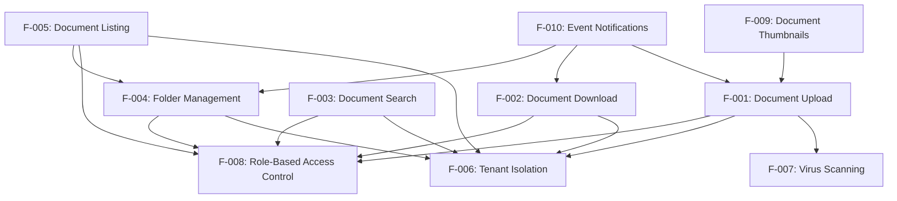
```mermaid
graph TD
    F001[F-001: Document Upload] --> F007[F-007: Virus Scanning]
    F001 --> F006[F-006: Tenant Isolation]
    F001 --> F008[F-008: Role-Based Access Control]
    F002[F-002: Document Download] --> F006
    F002 --> F008
    F003[F-003: Document Search] --> F006
    F003 --> F008
    F004[F-004: Folder Management] --> F006
    F004 --> F008
    F005[F-005: Document Listing] --> F006
    F005 --> F008
    F005 --> F004
    F009[F-009: Document Thumbnails] --> F001
    F010[F-010: Event Notifications] --> F001
    F010 --> F002
    F010 --> F004
```

#### 2.3.2 Integration Points

| Integration Point | Related Features | Description |
| ----------------- | ---------------- | ----------- |
| AWS S3 Storage | F-001, F-002, F-004, F-005 | Document storage and retrieval integration |
| Virus Scanning Service | F-001, F-007 | Integration with virus scanning capabilities |
| Search Indexing Service | F-003 | Integration with content and metadata indexing |
| Event System | F-010 | Integration with event publishing system |

#### 2.3.3 Shared Components

| Component | Related Features | Description |
| --------- | ---------------- | ----------- |
| Authentication Service | All Features | JWT validation and tenant context extraction |
| Authorization Service | All Features | Role-based permission verification |
| Document Metadata Service | F-001, F-002, F-003, F-005 | Metadata management and validation |
| Storage Adapter | F-001, F-002, F-004, F-005 | Abstraction for S3 storage operations |

### 2.4 IMPLEMENTATION CONSIDERATIONS

#### 2.4.1 Technical Constraints

| Feature ID | Technical Constraints |
| ---------- | --------------------- |
| All Features | Must be implemented as microservices in Golang |
| All Features | Must follow Clean Architecture and DDD principles |
| All Features | Must be containerized for Kubernetes deployment |
| F-001, F-002 | Must use AWS S3 for document storage |
| F-003 | Must implement efficient search indexing for content and metadata |
| F-007 | Must integrate with virus scanning capabilities |

#### 2.4.2 Performance Requirements

| Requirement | Description |
| ----------- | ----------- |
| API Response Time | All API endpoints must respond within 2 seconds |
| Document Processing | Document processing (upload, scan) must complete within 5 minutes |
| Search Performance | Search queries must return results within 2 seconds |
| Concurrent Operations | System must support at least 100 concurrent operations |
| Daily Upload Capacity | System must handle 10,000 uploads per day (avg. 3MB per document) |

#### 2.4.3 Scalability Considerations

| Consideration | Description |
| ------------- | ----------- |
| Horizontal Scaling | Microservices must support horizontal scaling in Kubernetes |
| Storage Scaling | Document storage solution must scale to handle increasing volumes |
| Search Scaling | Search capabilities must scale with growing document corpus |
| Processing Scaling | Document processing must scale to handle upload spikes |

#### 2.4.4 Security Implications

| Security Aspect | Description |
| --------------- | ----------- |
| Tenant Isolation | Complete isolation of data between tenants |
| Authentication | JWT-based authentication for all API requests |
| Authorization | Role-based access control for all operations |
| Data Encryption | Encryption of documents at rest and in transit |
| Virus Protection | Scanning of all uploaded documents for malicious content |
| Audit Logging | Comprehensive logging of all security-relevant operations |

### 2.5 TRACEABILITY MATRIX

| Requirement ID | Feature ID | Business Requirement | Technical Implementation |
| -------------- | ---------- | -------------------- | ------------------------ |
| F-001-RQ-001 | F-001 | Document upload capability | Golang microservice with S3 integration |
| F-001-RQ-003 | F-001, F-007 | Virus scanning for uploads | Integration with virus scanning service |
| F-002-RQ-001 | F-002 | Document download capability | S3 presigned URL or direct download API |
| F-003-RQ-001 | F-003 | Content-based search | Full-text search implementation |
| F-004-RQ-001 | F-004 | Folder creation capability | Folder structure in S3 or metadata |
| F-005-RQ-001 | F-005 | Document listing capability | API endpoint with pagination and filtering |
| F-006-RQ-001 | F-006 | Tenant isolation | Tenant context in all operations |
| F-008-RQ-001 | F-008 | Role-based access control | Permission verification middleware |

## 3. TECHNOLOGY STACK

### 3.1 PROGRAMMING LANGUAGES

| Component | Language | Version | Justification |
| --------- | -------- | ------- | ------------- |
| Microservices | Golang | 1.21+ | Selected for performance, concurrency support, and explicit requirement in technical constraints. Golang's strong typing and efficient memory management make it ideal for high-throughput document processing. |
| Infrastructure Scripts | YAML | N/A | Used for Kubernetes manifests and configuration files. |
| Build Scripts | Shell | Bash 5.0+ | Used for automation scripts in the CI/CD pipeline. |

### 3.2 FRAMEWORKS & LIBRARIES

#### 3.2.1 Core Frameworks

| Framework | Version | Purpose | Justification |
| --------- | ------- | ------- | ------------- |
| Gin | v1.9.0+ | HTTP Web Framework | Provides high-performance routing and middleware capabilities for REST APIs with minimal memory footprint. |
| GORM | v1.25.0+ | ORM Library | Simplifies database operations while maintaining performance for metadata storage. |
| go-clean-arch | N/A | Architecture Framework | Implements Clean Architecture patterns as required by technical constraints. |
| testify | v1.8.0+ | Testing Framework | Comprehensive testing toolkit for unit and integration tests. |

#### 3.2.2 Supporting Libraries

| Library | Version | Purpose | Justification |
| ------- | ------- | ------- | ------------- |
| aws-sdk-go | v2.0.0+ | AWS Integration | Official SDK for S3 integration and other AWS services. |
| jwt-go | v4.0.0+ | JWT Authentication | Handles JWT token validation and tenant context extraction. |
| zap | v1.24.0+ | Logging | High-performance, structured logging for production environments. |
| validator | v10.0.0+ | Input Validation | Ensures proper validation of all API inputs. |
| minio-go | v7.0.0+ | S3 Client | Simplified S3 operations for document storage. |
| elasticsearch-go | v8.0.0+ | Search Integration | Client for Elasticsearch integration for document content search. |

### 3.3 DATABASES & STORAGE

| Component | Technology | Version | Purpose | Justification |
| --------- | ---------- | ------- | ------- | ------------- |
| Document Storage | AWS S3 | N/A | Primary storage for documents | Explicitly required in technical constraints. Provides durability, scalability, and encryption at rest. |
| Metadata Database | PostgreSQL | 14.0+ | Storage for document metadata | ACID compliance for critical metadata, supports complex queries and JSON data types. |
| Search Index | Elasticsearch | 8.0+ | Full-text search engine | Enables efficient content and metadata search capabilities required by F-003. |
| Cache | Redis | 6.2+ | Caching layer | Improves performance for frequently accessed metadata and search results. |
| Queue | AWS SQS | N/A | Message queue | Enables asynchronous processing for document uploads and virus scanning. |

### 3.4 THIRD-PARTY SERVICES

| Service | Purpose | Integration Method | Justification |
| ------- | ------- | ------------------ | ------------- |
| AWS S3 | Document storage | AWS SDK | Required by technical constraints for secure document storage. |
| AWS KMS | Encryption key management | AWS SDK | Manages encryption keys for document encryption at rest. |
| ClamAV | Virus scanning | API/Container | Open-source virus scanning solution for document security requirements. |
| AWS CloudWatch | Monitoring and logging | AWS SDK | Provides comprehensive monitoring for meeting 99.99% uptime requirement. |
| AWS X-Ray | Distributed tracing | AWS SDK | Helps identify performance bottlenecks to meet 2-second API SLA. |
| Prometheus | Metrics collection | Client library | Collects detailed performance metrics for microservices. |
| Grafana | Metrics visualization | API | Visualizes performance metrics for operational monitoring. |

### 3.5 DEVELOPMENT & DEPLOYMENT

#### 3.5.1 Development Tools

| Tool | Version | Purpose | Justification |
| ---- | ------- | ------- | ------------- |
| Visual Studio Code | Latest | IDE | Provides excellent Golang support with extensions. |
| GoLand | Latest | IDE | Purpose-built IDE for Golang development. |
| Postman | Latest | API Testing | Enables comprehensive API testing during development. |
| Docker Desktop | Latest | Local containerization | Allows developers to run the system locally. |
| Git | 2.30+ | Version control | Industry standard for source code management. |

#### 3.5.2 Build & Deployment

| Component | Technology | Version | Purpose | Justification |
| --------- | ---------- | ------- | ------- | ------------- |
| Containerization | Docker | 20.10+ | Application packaging | Required for Kubernetes deployment as specified in constraints. |
| Container Registry | AWS ECR | N/A | Container storage | Integrates with AWS infrastructure and Kubernetes. |
| Orchestration | Kubernetes | 1.25+ | Container orchestration | Explicitly required in technical constraints. |
| CI/CD | GitHub Actions | N/A | Automation pipeline | Automates testing, building, and deployment processes. |
| Infrastructure as Code | Terraform | 1.5+ | Infrastructure provisioning | Enables reproducible infrastructure deployment. |
| Secrets Management | AWS Secrets Manager | N/A | Secure credentials storage | Securely manages sensitive configuration values. |

### 3.6 ARCHITECTURE DIAGRAM

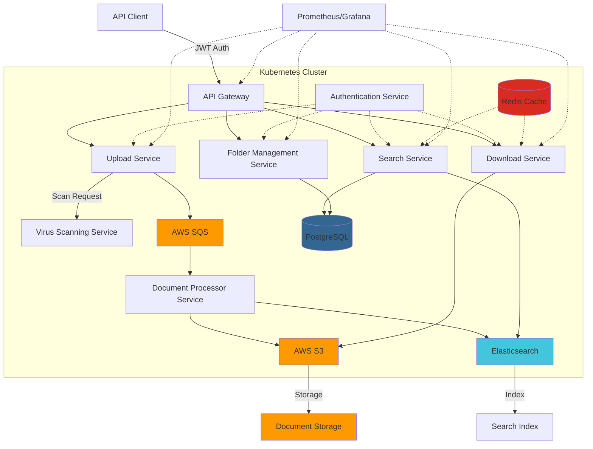
```mermaid
graph TD
    Client[API Client] -->|JWT Auth| APIGateway[API Gateway]
    
    subgraph "Kubernetes Cluster"
        APIGateway --> UploadSvc[Upload Service]
        APIGateway --> DownloadSvc[Download Service]
        APIGateway --> SearchSvc[Search Service]
        APIGateway --> FolderSvc[Folder Management Service]
        
        UploadSvc -->|Scan Request| VirusScan[Virus Scanning Service]
        UploadSvc --> SQS[AWS SQS]
        SQS --> ProcessorSvc[Document Processor Service]
        
        ProcessorSvc --> S3[AWS S3]
        ProcessorSvc --> ES[Elasticsearch]
        
        DownloadSvc --> S3
        SearchSvc --> ES
        SearchSvc --> MetadataDB[(PostgreSQL)]
        FolderSvc --> MetadataDB
        
        AuthSvc[Authentication Service] -.-> UploadSvc
        AuthSvc -.-> DownloadSvc
        AuthSvc -.-> SearchSvc
        AuthSvc -.-> FolderSvc
        
        Redis[(Redis Cache)] -.-> SearchSvc
        Redis -.-> DownloadSvc
    end
    
    S3 -->|Storage| DocumentStore[Document Storage]
    ES -->|Index| SearchIndex[Search Index]
    
    Monitoring[Prometheus/Grafana] -.-> APIGateway
    Monitoring -.-> UploadSvc
    Monitoring -.-> DownloadSvc
    Monitoring -.-> SearchSvc
    Monitoring -.-> FolderSvc
    
    style S3 fill:#FF9900
    style SQS fill:#FF9900
    style ES fill:#43C6DB
    style MetadataDB fill:#336791
    style Redis fill:#D82C20
    style DocumentStore fill:#FF9900
```

## 4. PROCESS FLOWCHART

### 4.1 SYSTEM WORKFLOWS

#### 4.1.1 Core Business Processes

##### Document Upload Process

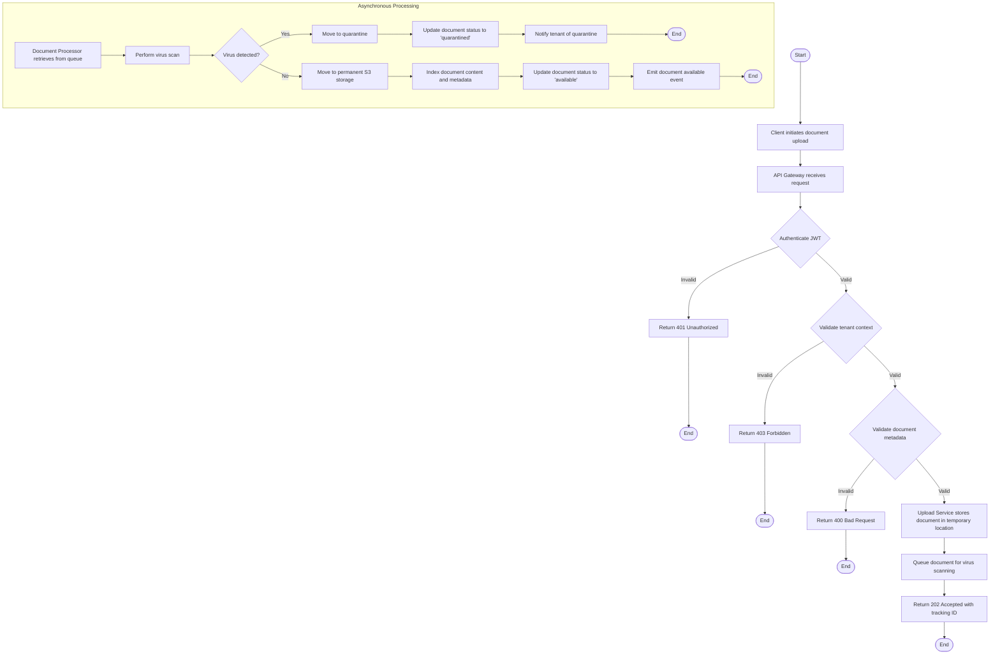
```mermaid
flowchart TD
    Start([Start]) --> A[Client initiates document upload]
    A --> B[API Gateway receives request]
    B --> C{Authenticate JWT}
    C -->|Invalid| D[Return 401 Unauthorized]
    D --> End1([End])
    C -->|Valid| E{Validate tenant context}
    E -->|Invalid| F[Return 403 Forbidden]
    F --> End2([End])
    E -->|Valid| G{Validate document metadata}
    G -->|Invalid| H[Return 400 Bad Request]
    H --> End3([End])
    G -->|Valid| I[Upload Service stores document in temporary location]
    I --> J[Queue document for virus scanning]
    J --> K[Return 202 Accepted with tracking ID]
    K --> End4([End])
    
    subgraph "Asynchronous Processing"
        L[Document Processor retrieves from queue]
        L --> M[Perform virus scan]
        M --> N{Virus detected?}
        N -->|Yes| O[Move to quarantine]
        O --> P[Update document status to 'quarantined']
        P --> Q[Notify tenant of quarantine]
        Q --> End5([End])
        N -->|No| R[Move to permanent S3 storage]
        R --> S[Index document content and metadata]
        S --> T[Update document status to 'available']
        T --> U[Emit document available event]
        U --> End6([End])
    end
```

##### Document Search Process

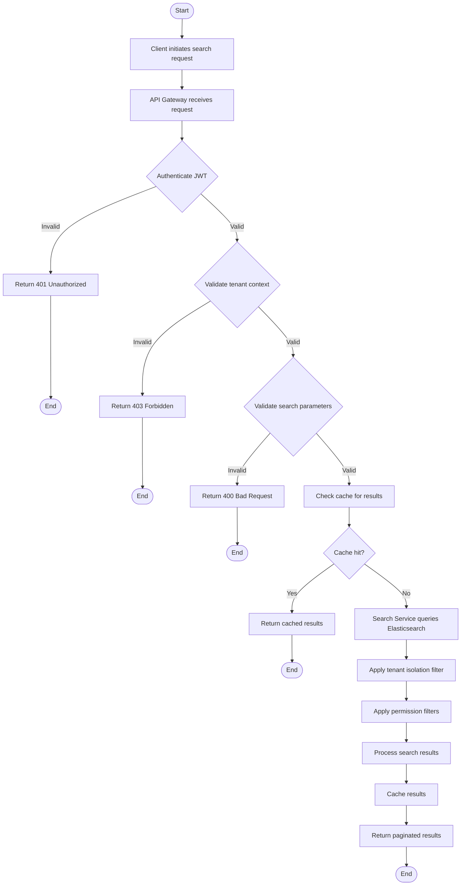
```mermaid
flowchart TD
    Start([Start]) --> A[Client initiates search request]
    A --> B[API Gateway receives request]
    B --> C{Authenticate JWT}
    C -->|Invalid| D[Return 401 Unauthorized]
    D --> End1([End])
    C -->|Valid| E{Validate tenant context}
    E -->|Invalid| F[Return 403 Forbidden]
    F --> End2([End])
    E -->|Valid| G{Validate search parameters}
    G -->|Invalid| H[Return 400 Bad Request]
    H --> End3([End])
    G -->|Valid| I[Check cache for results]
    I --> J{Cache hit?}
    J -->|Yes| K[Return cached results]
    K --> End4([End])
    J -->|No| L[Search Service queries Elasticsearch]
    L --> M[Apply tenant isolation filter]
    M --> N[Apply permission filters]
    N --> O[Process search results]
    O --> P[Cache results]
    P --> Q[Return paginated results]
    Q --> End5([End])
```

##### Document Download Process

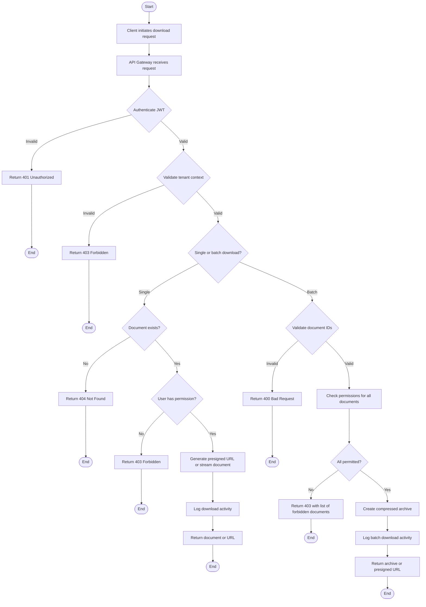
```mermaid
flowchart TD
    Start([Start]) --> A[Client initiates download request]
    A --> B[API Gateway receives request]
    B --> C{Authenticate JWT}
    C -->|Invalid| D[Return 401 Unauthorized]
    D --> End1([End])
    C -->|Valid| E{Validate tenant context}
    E -->|Invalid| F[Return 403 Forbidden]
    F --> End2([End])
    E -->|Valid| G{Single or batch download?}
    
    G -->|Single| H{Document exists?}
    H -->|No| I[Return 404 Not Found]
    I --> End3([End])
    H -->|Yes| J{User has permission?}
    J -->|No| K[Return 403 Forbidden]
    K --> End4([End])
    J -->|Yes| L[Generate presigned URL or stream document]
    L --> M[Log download activity]
    M --> N[Return document or URL]
    N --> End5([End])
    
    G -->|Batch| O{Validate document IDs}
    O -->|Invalid| P[Return 400 Bad Request]
    P --> End6([End])
    O -->|Valid| Q[Check permissions for all documents]
    Q --> R{All permitted?}
    R -->|No| S[Return 403 with list of forbidden documents]
    S --> End7([End])
    R -->|Yes| T[Create compressed archive]
    T --> U[Log batch download activity]
    U --> V[Return archive or presigned URL]
    V --> End8([End])
```

##### Folder Management Process

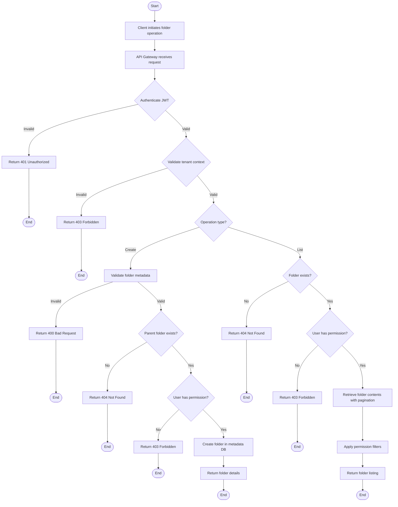
```mermaid
flowchart TD
    Start([Start]) --> A[Client initiates folder operation]
    A --> B[API Gateway receives request]
    B --> C{Authenticate JWT}
    C -->|Invalid| D[Return 401 Unauthorized]
    D --> End1([End])
    C -->|Valid| E{Validate tenant context}
    E -->|Invalid| F[Return 403 Forbidden]
    F --> End2([End])
    E -->|Valid| G{Operation type?}
    
    G -->|Create| H[Validate folder metadata]
    H -->|Invalid| I[Return 400 Bad Request]
    I --> End3([End])
    H -->|Valid| J{Parent folder exists?}
    J -->|No| K[Return 404 Not Found]
    K --> End4([End])
    J -->|Yes| L{User has permission?}
    L -->|No| M[Return 403 Forbidden]
    M --> End5([End])
    L -->|Yes| N[Create folder in metadata DB]
    N --> O[Return folder details]
    O --> End6([End])
    
    G -->|List| P{Folder exists?}
    P -->|No| Q[Return 404 Not Found]
    Q --> End7([End])
    P -->|Yes| R{User has permission?}
    R -->|No| S[Return 403 Forbidden]
    S --> End8([End])
    R -->|Yes| T[Retrieve folder contents with pagination]
    T --> U[Apply permission filters]
    U --> V[Return folder listing]
    V --> End9([End])
```

#### 4.1.2 Integration Workflows

##### Document Processing Integration Flow

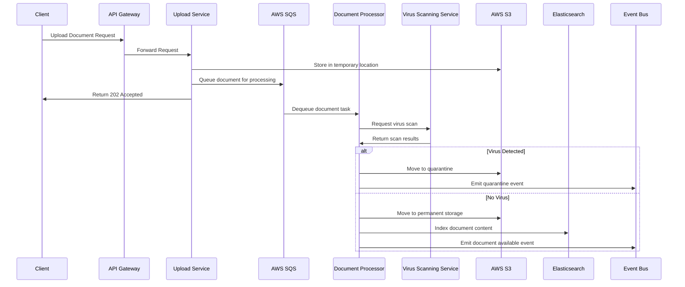
```mermaid
sequenceDiagram
    participant Client
    participant APIGateway as API Gateway
    participant UploadSvc as Upload Service
    participant SQS as AWS SQS
    participant ProcessorSvc as Document Processor
    participant VirusScan as Virus Scanning Service
    participant S3 as AWS S3
    participant ES as Elasticsearch
    participant EventBus as Event Bus

    Client->>APIGateway: Upload Document Request
    APIGateway->>UploadSvc: Forward Request
    UploadSvc->>S3: Store in temporary location
    UploadSvc->>SQS: Queue document for processing
    UploadSvc->>Client: Return 202 Accepted
    
    SQS->>ProcessorSvc: Dequeue document task
    ProcessorSvc->>VirusScan: Request virus scan
    VirusScan->>ProcessorSvc: Return scan results
    
    alt Virus Detected
        ProcessorSvc->>S3: Move to quarantine
        ProcessorSvc->>EventBus: Emit quarantine event
    else No Virus
        ProcessorSvc->>S3: Move to permanent storage
        ProcessorSvc->>ES: Index document content
        ProcessorSvc->>EventBus: Emit document available event
    end
```

##### Search Integration Flow

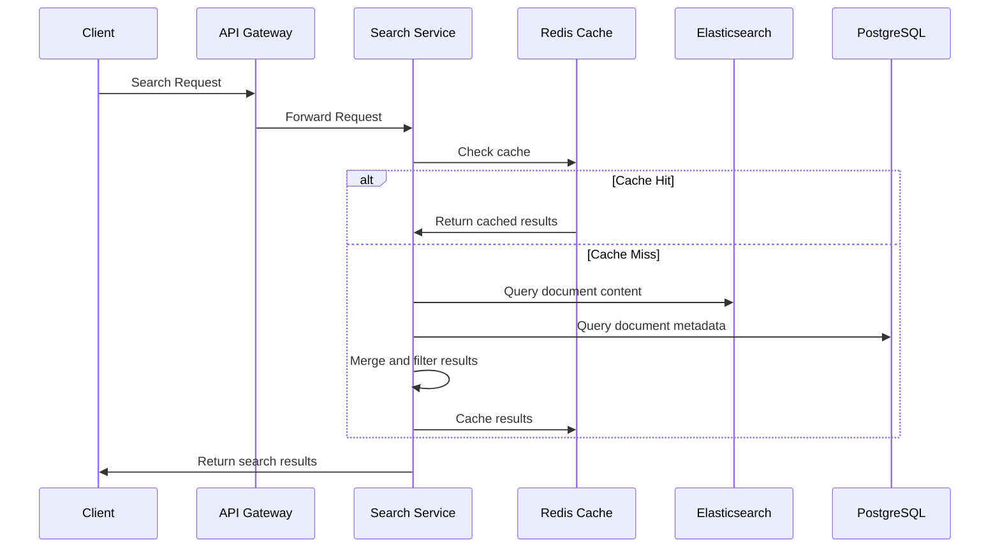
```mermaid
sequenceDiagram
    participant Client
    participant APIGateway as API Gateway
    participant SearchSvc as Search Service
    participant Redis as Redis Cache
    participant ES as Elasticsearch
    participant MetadataDB as PostgreSQL

    Client->>APIGateway: Search Request
    APIGateway->>SearchSvc: Forward Request
    
    SearchSvc->>Redis: Check cache
    
    alt Cache Hit
        Redis->>SearchSvc: Return cached results
    else Cache Miss
        SearchSvc->>ES: Query document content
        SearchSvc->>MetadataDB: Query document metadata
        SearchSvc->>SearchSvc: Merge and filter results
        SearchSvc->>Redis: Cache results
    end
    
    SearchSvc->>Client: Return search results
```

### 4.2 FLOWCHART REQUIREMENTS

#### 4.2.1 Document Upload Validation Flow

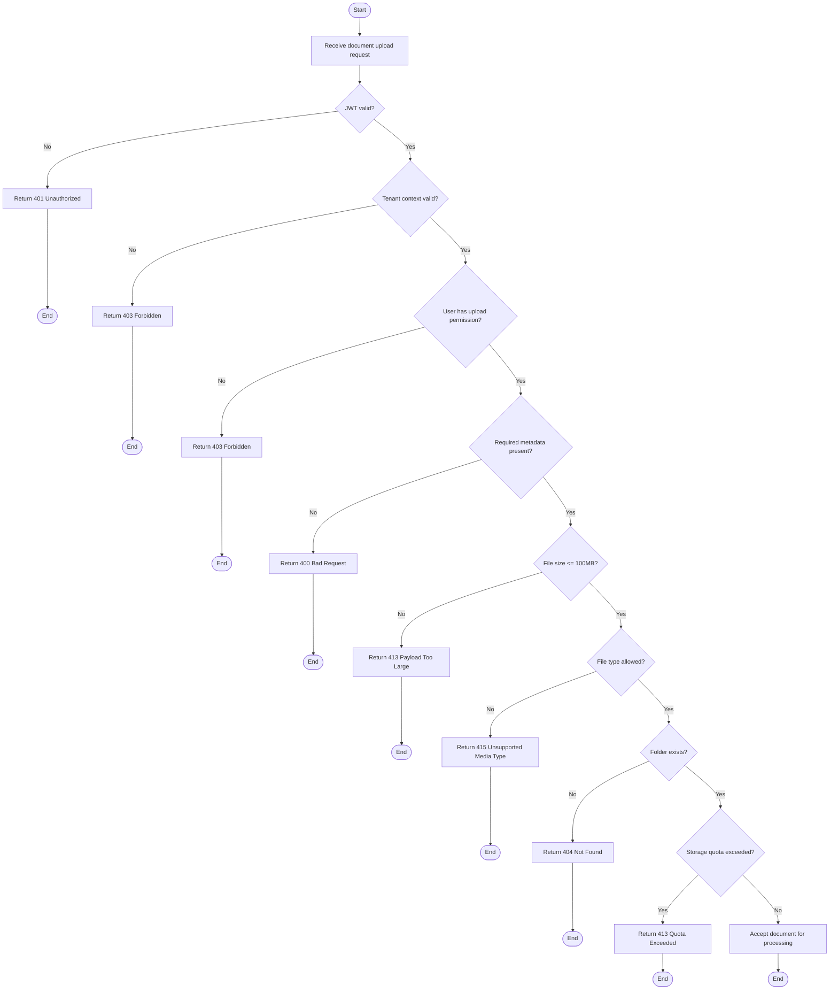
```mermaid
flowchart TD
    Start([Start]) --> A[Receive document upload request]
    A --> B{JWT valid?}
    B -->|No| C[Return 401 Unauthorized]
    C --> End1([End])
    
    B -->|Yes| D{Tenant context valid?}
    D -->|No| E[Return 403 Forbidden]
    E --> End2([End])
    
    D -->|Yes| F{User has upload permission?}
    F -->|No| G[Return 403 Forbidden]
    G --> End3([End])
    
    F -->|Yes| H{Required metadata present?}
    H -->|No| I[Return 400 Bad Request]
    I --> End4([End])
    
    H -->|Yes| J{File size <= 100MB?}
    J -->|No| K[Return 413 Payload Too Large]
    K --> End5([End])
    
    J -->|Yes| L{File type allowed?}
    L -->|No| M[Return 415 Unsupported Media Type]
    M --> End6([End])
    
    L -->|Yes| N{Folder exists?}
    N -->|No| O[Return 404 Not Found]
    O --> End7([End])
    
    N -->|Yes| P{Storage quota exceeded?}
    P -->|Yes| Q[Return 413 Quota Exceeded]
    Q --> End8([End])
    
    P -->|No| R[Accept document for processing]
    R --> End9([End])
```

#### 4.2.2 Error Handling and Recovery Flow

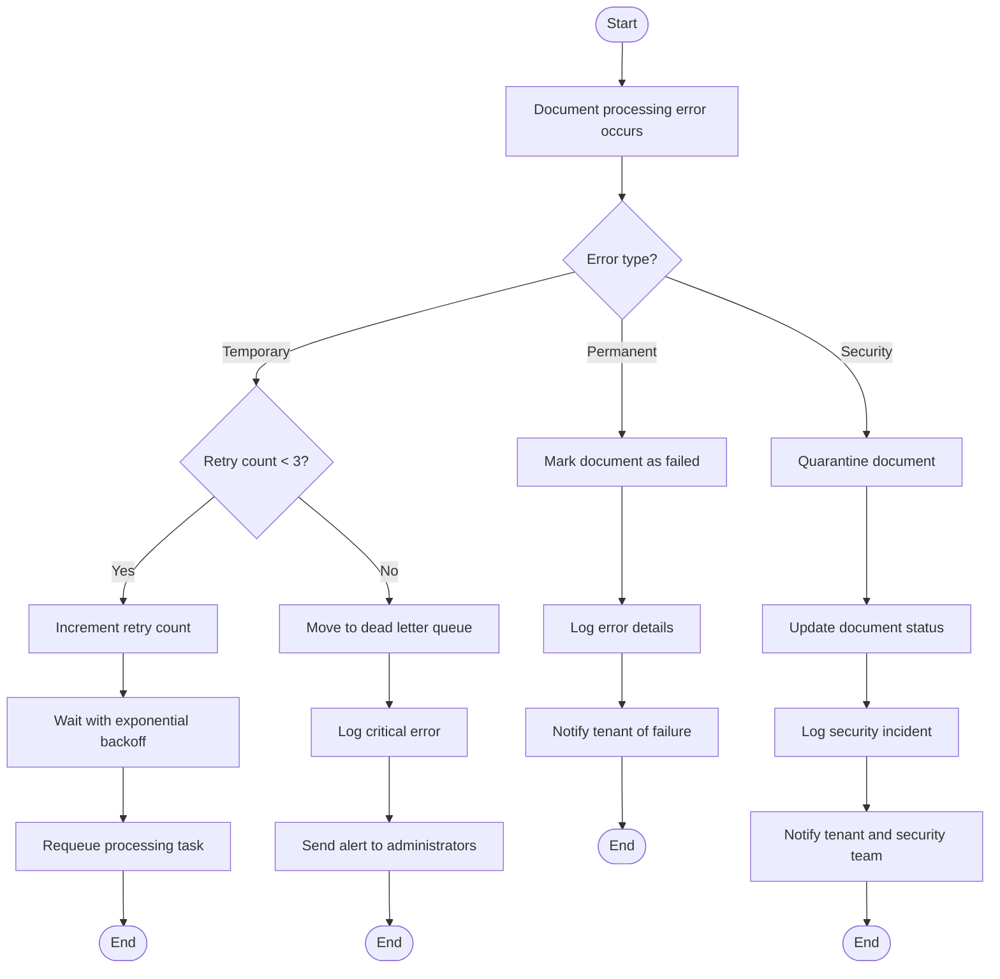
```mermaid
flowchart TD
    Start([Start]) --> A[Document processing error occurs]
    A --> B{Error type?}
    
    B -->|Temporary| C{Retry count < 3?}
    C -->|Yes| D[Increment retry count]
    D --> E[Wait with exponential backoff]
    E --> F[Requeue processing task]
    F --> End1([End])
    
    C -->|No| G[Move to dead letter queue]
    G --> H[Log critical error]
    H --> I[Send alert to administrators]
    I --> End2([End])
    
    B -->|Permanent| J[Mark document as failed]
    J --> K[Log error details]
    K --> L[Notify tenant of failure]
    L --> End3([End])
    
    B -->|Security| M[Quarantine document]
    M --> N[Update document status]
    N --> O[Log security incident]
    O --> P[Notify tenant and security team]
    P --> End4([End])
```

### 4.3 TECHNICAL IMPLEMENTATION

#### 4.3.1 Document State Transition Diagram

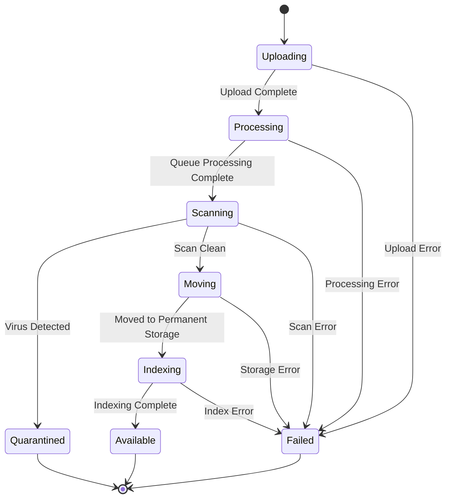
```mermaid
stateDiagram-v2
    [*] --> Uploading
    Uploading --> Processing: Upload Complete
    Processing --> Scanning: Queue Processing Complete
    
    Scanning --> Quarantined: Virus Detected
    Quarantined --> [*]
    
    Scanning --> Moving: Scan Clean
    Moving --> Indexing: Moved to Permanent Storage
    Indexing --> Available: Indexing Complete
    Available --> [*]
    
    Uploading --> Failed: Upload Error
    Processing --> Failed: Processing Error
    Scanning --> Failed: Scan Error
    Moving --> Failed: Storage Error
    Indexing --> Failed: Index Error
    Failed --> [*]
```

#### 4.3.2 Document Lifecycle Management

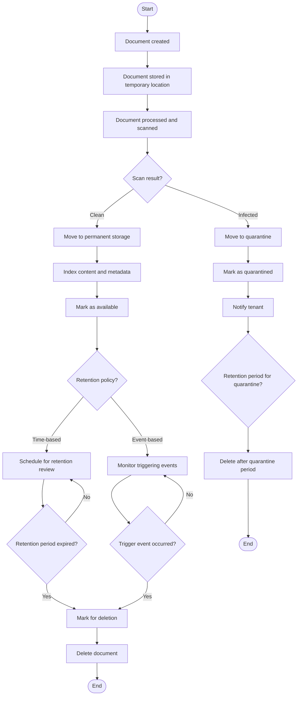
```mermaid
flowchart TD
    Start([Start]) --> A[Document created]
    A --> B[Document stored in temporary location]
    B --> C[Document processed and scanned]
    
    C --> D{Scan result?}
    D -->|Clean| E[Move to permanent storage]
    E --> F[Index content and metadata]
    F --> G[Mark as available]
    G --> H{Retention policy?}
    
    H -->|Time-based| I[Schedule for retention review]
    I --> J{Retention period expired?}
    J -->|No| I
    J -->|Yes| K[Mark for deletion]
    
    H -->|Event-based| L[Monitor triggering events]
    L --> M{Trigger event occurred?}
    M -->|No| L
    M -->|Yes| K
    
    K --> N[Delete document]
    N --> End1([End])
    
    D -->|Infected| O[Move to quarantine]
    O --> P[Mark as quarantined]
    P --> Q[Notify tenant]
    Q --> R{Retention period for quarantine?}
    R --> S[Delete after quarantine period]
    S --> End2([End])
```

### 4.4 REQUIRED DIAGRAMS

#### 4.4.1 High-Level System Workflow

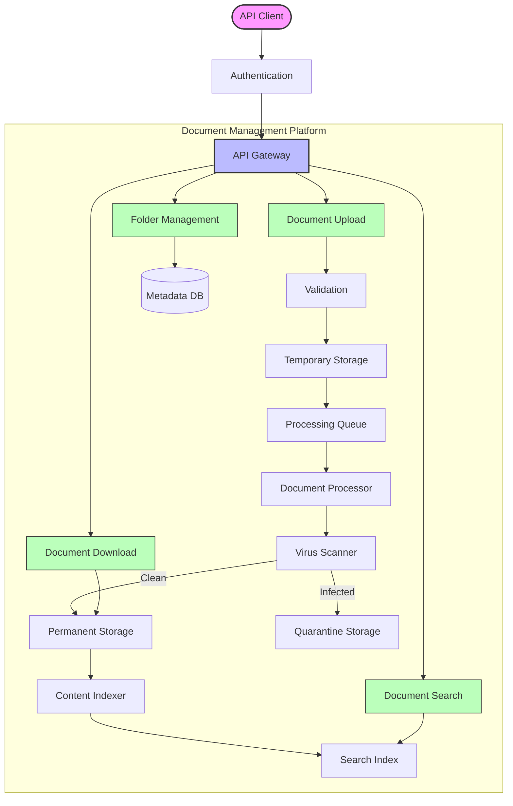
```mermaid
flowchart TD
    Client([API Client]) --> Auth[Authentication]
    Auth --> API[API Gateway]
    
    subgraph "Document Management Platform"
        API --> Upload[Document Upload]
        API --> Download[Document Download]
        API --> Search[Document Search]
        API --> Folder[Folder Management]
        
        Upload --> Validation[Validation]
        Validation --> Storage[Temporary Storage]
        Storage --> Queue[Processing Queue]
        
        Queue --> Processor[Document Processor]
        Processor --> Scanner[Virus Scanner]
        
        Scanner -->|Clean| PermanentStorage[Permanent Storage]
        Scanner -->|Infected| Quarantine[Quarantine Storage]
        
        PermanentStorage --> Indexer[Content Indexer]
        Indexer --> SearchIndex[Search Index]
        
        Search --> SearchIndex
        Download --> PermanentStorage
        Folder --> MetadataDB[(Metadata DB)]
    end
    
    style Client fill:#f9f,stroke:#333,stroke-width:2px
    style API fill:#bbf,stroke:#333,stroke-width:2px
    style Upload fill:#bfb,stroke:#333,stroke-width:1px
    style Download fill:#bfb,stroke:#333,stroke-width:1px
    style Search fill:#bfb,stroke:#333,stroke-width:1px
    style Folder fill:#bfb,stroke:#333,stroke-width:1px
```

#### 4.4.2 Detailed Error Handling Flow

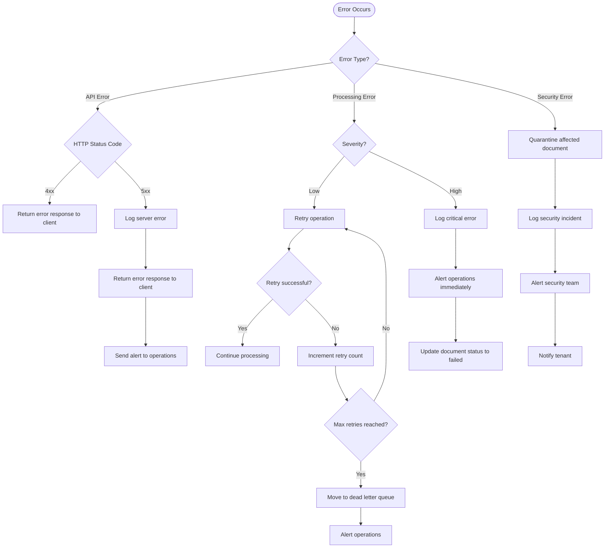
```mermaid
flowchart TD
    Start([Error Occurs]) --> A{Error Type?}
    
    A -->|API Error| B{HTTP Status Code}
    B -->|4xx| C[Return error response to client]
    B -->|5xx| D[Log server error]
    D --> E[Return error response to client]
    E --> F[Send alert to operations]
    
    A -->|Processing Error| G{Severity?}
    G -->|Low| H[Retry operation]
    H --> I{Retry successful?}
    I -->|Yes| J[Continue processing]
    I -->|No| K[Increment retry count]
    K --> L{Max retries reached?}
    L -->|No| H
    L -->|Yes| M[Move to dead letter queue]
    M --> N[Alert operations]
    
    G -->|High| O[Log critical error]
    O --> P[Alert operations immediately]
    P --> Q[Update document status to failed]
    
    A -->|Security Error| R[Quarantine affected document]
    R --> S[Log security incident]
    S --> T[Alert security team]
    T --> U[Notify tenant]
```

#### 4.4.3 Document Upload Sequence with Timing Constraints

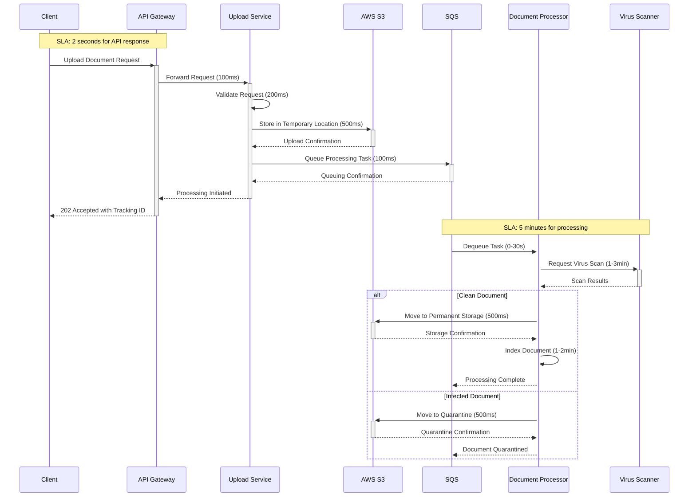
```mermaid
sequenceDiagram
    participant Client
    participant API as API Gateway
    participant Upload as Upload Service
    participant S3 as AWS S3
    participant Queue as SQS
    participant Processor as Document Processor
    participant Scanner as Virus Scanner
    
    note over Client,API: SLA: 2 seconds for API response
    Client->>+API: Upload Document Request
    API->>+Upload: Forward Request (100ms)
    Upload->>Upload: Validate Request (200ms)
    Upload->>+S3: Store in Temporary Location (500ms)
    S3-->>-Upload: Upload Confirmation
    Upload->>+Queue: Queue Processing Task (100ms)
    Queue-->>-Upload: Queuing Confirmation
    Upload-->>-API: Processing Initiated
    API-->>-Client: 202 Accepted with Tracking ID
    
    note over Queue,Scanner: SLA: 5 minutes for processing
    Queue->>+Processor: Dequeue Task (0-30s)
    Processor->>+Scanner: Request Virus Scan (1-3min)
    Scanner-->>-Processor: Scan Results
    
    alt Clean Document
        Processor->>+S3: Move to Permanent Storage (500ms)
        S3-->>-Processor: Storage Confirmation
        Processor->>Processor: Index Document (1-2min)
        Processor-->>Queue: Processing Complete
    else Infected Document
        Processor->>+S3: Move to Quarantine (500ms)
        S3-->>-Processor: Quarantine Confirmation
        Processor-->>Queue: Document Quarantined
    end
```

#### 4.4.4 Multi-tenant Access Control Flow

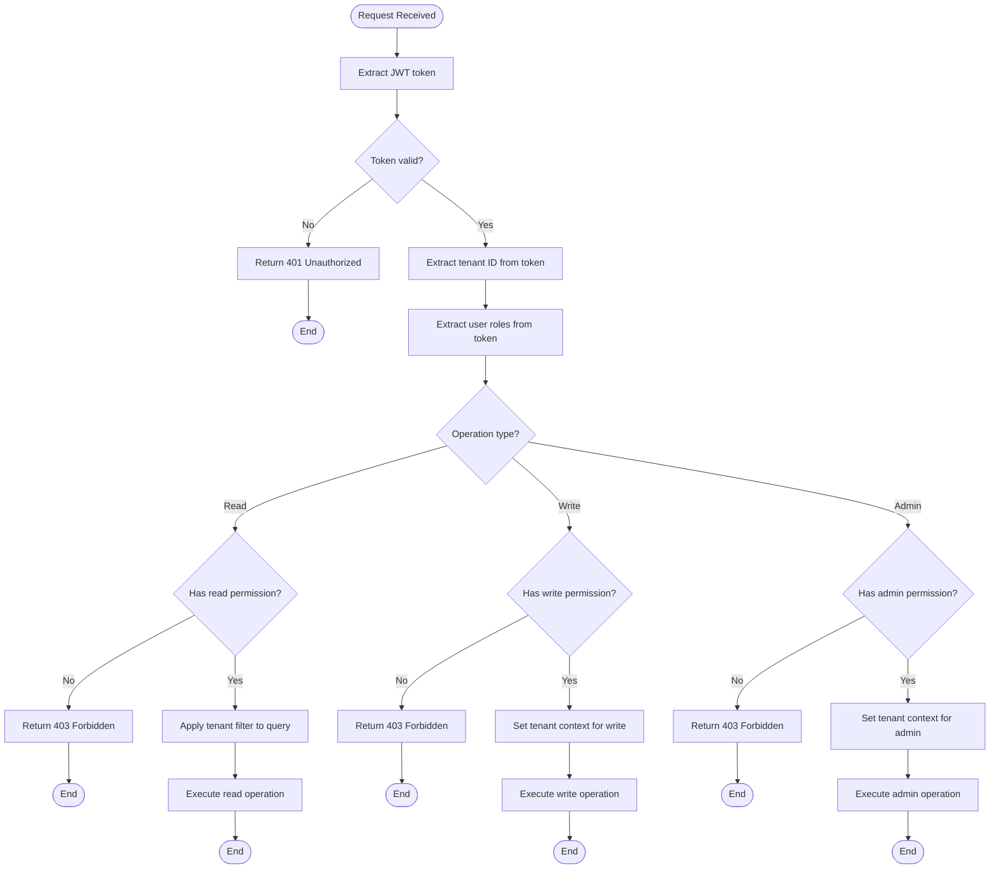
```mermaid
flowchart TD
    Start([Request Received]) --> A[Extract JWT token]
    A --> B{Token valid?}
    B -->|No| C[Return 401 Unauthorized]
    C --> End1([End])
    
    B -->|Yes| D[Extract tenant ID from token]
    D --> E[Extract user roles from token]
    E --> F{Operation type?}
    
    F -->|Read| G{Has read permission?}
    G -->|No| H[Return 403 Forbidden]
    H --> End2([End])
    G -->|Yes| I[Apply tenant filter to query]
    I --> J[Execute read operation]
    J --> End3([End])
    
    F -->|Write| K{Has write permission?}
    K -->|No| L[Return 403 Forbidden]
    L --> End4([End])
    K -->|Yes| M[Set tenant context for write]
    M --> N[Execute write operation]
    N --> End5([End])
    
    F -->|Admin| O{Has admin permission?}
    O -->|No| P[Return 403 Forbidden]
    P --> End6([End])
    O -->|Yes| Q[Set tenant context for admin]
    Q --> R[Execute admin operation]
    R --> End7([End])
```

## 5. SYSTEM ARCHITECTURE

### 5.1 HIGH-LEVEL ARCHITECTURE

#### 5.1.1 System Overview

The Document Management Platform employs a microservices architecture built on Golang, following Clean Architecture and Domain-Driven Design principles. This architectural approach was selected to ensure:

- **Modularity**: Independent services with clear boundaries enable isolated development, testing, and deployment
- **Scalability**: Individual components can scale independently based on demand
- **Resilience**: Failure isolation prevents cascading failures across the system
- **Technology flexibility**: Services can evolve independently while maintaining consistent interfaces

The system follows these key architectural principles:

- **Clean Architecture**: Core business logic remains independent of external concerns
- **Domain-Driven Design**: Services are organized around business capabilities
- **API-First Design**: All functionality is exposed through well-defined APIs
- **Defense in Depth**: Multiple security layers protect documents and metadata
- **Tenant Isolation**: Complete separation of data and processing between tenants

System boundaries are defined by the API Gateway, which serves as the entry point for all client interactions, and AWS S3 as the document storage repository. Major interfaces include REST APIs for client communication and internal service-to-service communication using both synchronous (HTTP) and asynchronous (message queue) patterns.

#### 5.1.2 Core Components Table

| Component | Primary Responsibility | Key Dependencies | Critical Considerations |
| --------- | ---------------------- | ---------------- | ----------------------- |
| API Gateway | Route requests, authenticate users, enforce rate limits | Authentication Service | Must handle high throughput, JWT validation |
| Document Service | Manage document metadata, coordinate upload/download workflows | Storage Service, Search Service | Tenant isolation, permission enforcement |
| Storage Service | Handle document storage operations with AWS S3 | AWS S3, Virus Scanning Service | Encryption, temporary/permanent storage management |
| Search Service | Index and search document content and metadata | Elasticsearch, Document Service | Search performance, index management |
| Folder Service | Manage folder hierarchy and organization | Document Service | Hierarchical data modeling, permission inheritance |
| Virus Scanning Service | Scan uploaded documents for malicious content | ClamAV, Storage Service | Isolation of potentially malicious files |
| Authentication Service | Validate JWTs, extract tenant context | - | Token validation, tenant context extraction |

#### 5.1.3 Data Flow Description

The Document Management Platform's data flows follow distinct patterns based on the operation type:

**Document Upload Flow**: Client requests initiate at the API Gateway, which authenticates the JWT and routes to the Document Service. The Document Service validates metadata and permissions before the Storage Service stores the document in a temporary location. The document ID and location are queued for virus scanning. The Virus Scanning Service processes the queue, scanning each document and determining its disposition. Clean documents move to permanent storage and are indexed by the Search Service. Infected documents are quarantined with appropriate status updates.

**Document Retrieval Flow**: Authenticated requests flow through the API Gateway to the Document Service, which verifies permissions and retrieves metadata. For downloads, the Storage Service generates presigned URLs or streams content directly. For searches, the Search Service queries the index and filters results based on tenant context and permissions.

**Folder Management Flow**: Folder operations flow through the API Gateway to the Folder Service, which manages the hierarchical structure in the metadata database. Document-folder relationships are maintained by the Document Service, ensuring proper organization and permission inheritance.

Key data stores include:
- AWS S3 for document content storage (temporary, permanent, and quarantine buckets)
- PostgreSQL for document and folder metadata
- Elasticsearch for search indexing
- Redis for caching frequently accessed data and search results

#### 5.1.4 External Integration Points

| System Name | Integration Type | Data Exchange Pattern | Protocol/Format | SLA Requirements |
| ----------- | ---------------- | --------------------- | --------------- | ---------------- |
| AWS S3 | Storage | Synchronous | HTTPS/REST | 99.99% availability, <500ms response time |
| AWS KMS | Encryption | Synchronous | HTTPS/REST | 99.99% availability, <200ms response time |
| ClamAV | Virus Scanning | Asynchronous | Internal API | Complete scan within 3 minutes |
| Elasticsearch | Search Engine | Synchronous | HTTPS/REST | <1s query response time |
| AWS SQS | Message Queue | Asynchronous | HTTPS/REST | 99.99% availability, <200ms enqueue/dequeue |

### 5.2 COMPONENT DETAILS

#### 5.2.1 API Gateway

**Purpose and Responsibilities**:
- Serve as the single entry point for all client requests
- Authenticate JWT tokens and extract tenant context
- Route requests to appropriate microservices
- Enforce rate limiting and request validation
- Provide API documentation and discovery

**Technologies and Frameworks**:
- Golang with Gin web framework
- JWT authentication middleware
- OpenAPI/Swagger for API documentation

**Key Interfaces**:
- REST API endpoints for all document operations
- Internal service discovery for routing

**Scaling Considerations**:
- Horizontally scalable with stateless design
- Load balancing across multiple instances
- Auto-scaling based on request volume

#### 5.2.2 Document Service

**Purpose and Responsibilities**:
- Manage document metadata and lifecycle
- Coordinate document upload and download workflows
- Enforce document-level permissions
- Maintain document-folder relationships

**Technologies and Frameworks**:
- Golang with Clean Architecture
- GORM for database operations
- AWS SDK for S3 integration

**Key Interfaces**:
- Internal APIs for document operations
- Database access for metadata storage
- Integration with Storage Service for content operations

**Data Persistence Requirements**:
- PostgreSQL for document metadata
- Transaction support for multi-step operations

**Scaling Considerations**:
- Stateless design for horizontal scaling
- Database connection pooling
- Read replicas for high-volume deployments

#### 5.2.3 Storage Service

**Purpose and Responsibilities**:
- Manage document storage in AWS S3
- Handle document encryption and decryption
- Manage temporary and permanent storage locations
- Generate presigned URLs for direct downloads

**Technologies and Frameworks**:
- Golang with AWS SDK
- S3 encryption client
- Streaming upload/download capabilities

**Key Interfaces**:
- Internal APIs for storage operations
- AWS S3 API integration
- Integration with Virus Scanning Service

**Data Persistence Requirements**:
- AWS S3 for document content storage
- Separate buckets for temporary, permanent, and quarantine storage

**Scaling Considerations**:
- S3 handles storage scaling automatically
- Service instances scale horizontally
- Multipart uploads for large documents

#### 5.2.4 Search Service

**Purpose and Responsibilities**:
- Index document content and metadata
- Provide search capabilities across documents
- Filter search results based on permissions and tenant context
- Maintain search index integrity

**Technologies and Frameworks**:
- Golang with Elasticsearch client
- Full-text search capabilities
- Tenant-aware indexing and querying

**Key Interfaces**:
- Internal APIs for search operations
- Elasticsearch API integration
- Integration with Document Service for metadata

**Data Persistence Requirements**:
- Elasticsearch for search indexes
- Redis for caching frequent searches

**Scaling Considerations**:
- Elasticsearch cluster scaling
- Index sharding and replication
- Query result caching

#### 5.2.5 Component Interaction Diagram

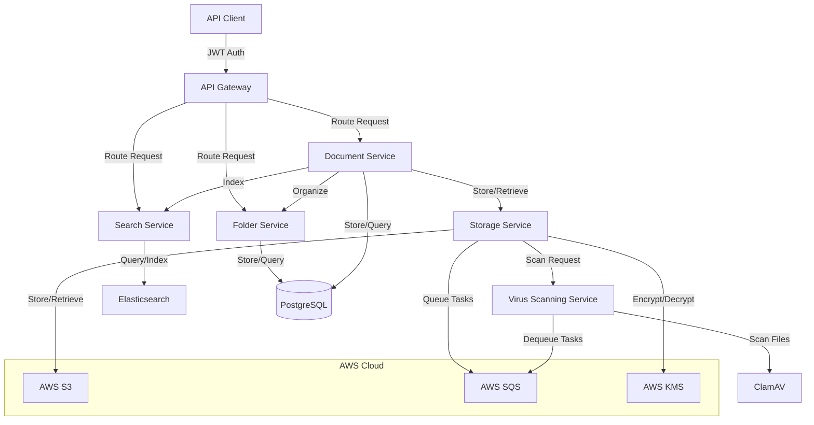
```mermaid
graph TD
    Client[API Client] -->|JWT Auth| Gateway[API Gateway]
    
    Gateway -->|Route Request| DocSvc[Document Service]
    Gateway -->|Route Request| FolderSvc[Folder Service]
    Gateway -->|Route Request| SearchSvc[Search Service]
    
    DocSvc -->|Store/Retrieve| StorageSvc[Storage Service]
    DocSvc -->|Index| SearchSvc
    DocSvc -->|Organize| FolderSvc
    
    StorageSvc -->|Store/Retrieve| S3[AWS S3]
    StorageSvc -->|Scan Request| VirusSvc[Virus Scanning Service]
    
    SearchSvc -->|Query/Index| ES[Elasticsearch]
    
    FolderSvc -->|Store/Query| DB[(PostgreSQL)]
    DocSvc -->|Store/Query| DB
    
    VirusSvc -->|Scan Files| ClamAV[ClamAV]
    
    subgraph "AWS Cloud"
        S3
        SQS[AWS SQS]
        KMS[AWS KMS]
    end
    
    StorageSvc -->|Queue Tasks| SQS
    VirusSvc -->|Dequeue Tasks| SQS
    StorageSvc -->|Encrypt/Decrypt| KMS
```

#### 5.2.6 Document Upload Sequence Diagram

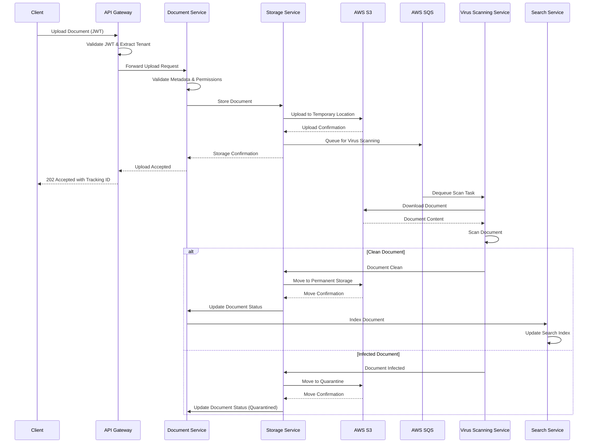
```mermaid
sequenceDiagram
    participant Client
    participant Gateway as API Gateway
    participant DocSvc as Document Service
    participant StorageSvc as Storage Service
    participant S3 as AWS S3
    participant SQS as AWS SQS
    participant VirusSvc as Virus Scanning Service
    participant SearchSvc as Search Service
    
    Client->>Gateway: Upload Document (JWT)
    Gateway->>Gateway: Validate JWT & Extract Tenant
    Gateway->>DocSvc: Forward Upload Request
    
    DocSvc->>DocSvc: Validate Metadata & Permissions
    DocSvc->>StorageSvc: Store Document
    StorageSvc->>S3: Upload to Temporary Location
    S3-->>StorageSvc: Upload Confirmation
    
    StorageSvc->>SQS: Queue for Virus Scanning
    StorageSvc-->>DocSvc: Storage Confirmation
    DocSvc-->>Gateway: Upload Accepted
    Gateway-->>Client: 202 Accepted with Tracking ID
    
    SQS->>VirusSvc: Dequeue Scan Task
    VirusSvc->>S3: Download Document
    S3-->>VirusSvc: Document Content
    VirusSvc->>VirusSvc: Scan Document
    
    alt Clean Document
        VirusSvc->>StorageSvc: Document Clean
        StorageSvc->>S3: Move to Permanent Storage
        S3-->>StorageSvc: Move Confirmation
        StorageSvc->>DocSvc: Update Document Status
        DocSvc->>SearchSvc: Index Document
        SearchSvc->>SearchSvc: Update Search Index
    else Infected Document
        VirusSvc->>StorageSvc: Document Infected
        StorageSvc->>S3: Move to Quarantine
        S3-->>StorageSvc: Move Confirmation
        StorageSvc->>DocSvc: Update Document Status (Quarantined)
    end
```

### 5.3 TECHNICAL DECISIONS

#### 5.3.1 Architecture Style Decisions

| Decision | Options Considered | Selected Approach | Rationale |
| -------- | ------------------ | ----------------- | --------- |
| Overall Architecture | Monolith, Microservices, Serverless | Microservices | Enables independent scaling, development, and deployment of components; aligns with Kubernetes deployment requirement |
| Service Communication | REST, gRPC, Message Queue | Hybrid (REST + Message Queue) | REST for synchronous operations, message queue for asynchronous processing like virus scanning |
| API Design | REST, GraphQL | REST | Better suited for document operations, wider tool support, simpler implementation |
| Container Orchestration | Kubernetes, ECS | Kubernetes | Explicitly required in technical constraints, provides robust orchestration capabilities |

#### 5.3.2 Data Storage Solution Rationale

| Data Type | Storage Solution | Rationale |
| --------- | ---------------- | --------- |
| Document Content | AWS S3 | Required by technical constraints; provides durability, scalability, and encryption capabilities |
| Document Metadata | PostgreSQL | ACID compliance for critical metadata, supports complex queries and JSON data types |
| Search Index | Elasticsearch | Optimized for full-text search across document content and metadata |
| Temporary Data | Redis | In-memory performance for caching and session data |
| Processing Queue | AWS SQS | Reliable message delivery for asynchronous processing tasks |

#### 5.3.3 Caching Strategy

| Cache Type | Implementation | Purpose | Invalidation Strategy |
| ---------- | -------------- | ------- | --------------------- |
| API Response Cache | Redis | Reduce load on backend services | TTL-based + explicit invalidation on updates |
| Search Results Cache | Redis | Improve performance for common searches | TTL-based + explicit invalidation on document changes |
| Document Metadata Cache | Redis | Reduce database load | TTL-based + explicit invalidation on metadata updates |
| Authentication Cache | In-memory | Reduce JWT validation overhead | TTL-based aligned with token expiration |

#### 5.3.4 Security Mechanism Selection

| Security Concern | Implementation | Rationale |
| ---------------- | -------------- | --------- |
| Authentication | JWT with RS256 | Stateless authentication with tenant context, suitable for distributed systems |
| Authorization | Role-based access control | Granular permission management within tenant boundaries |
| Data Encryption at Rest | AWS S3 SSE-KMS | Meets requirement for encryption at rest with key management |
| Data Encryption in Transit | TLS 1.3 | Industry standard for secure communication |
| Tenant Isolation | Tenant ID in JWT, enforced in all layers | Complete isolation of data between tenants |
| Virus Protection | ClamAV integration | Open-source solution with good detection rates and API integration |

#### 5.3.5 Architecture Decision Record Diagram

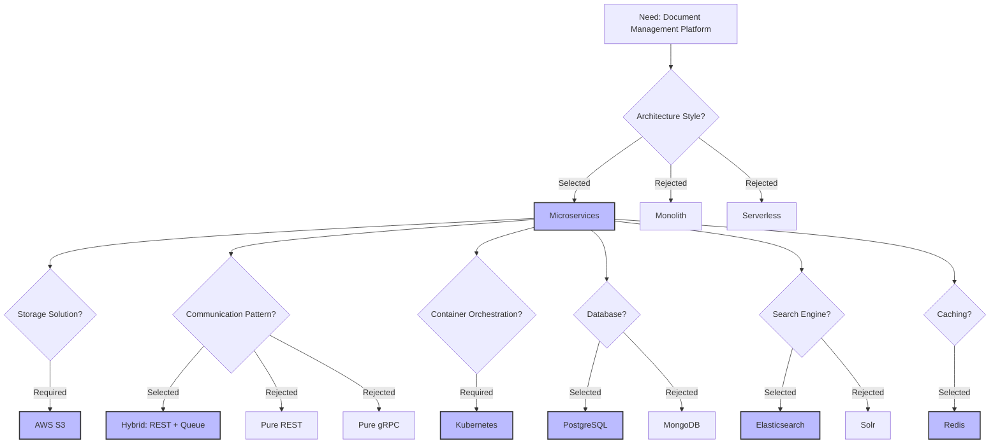
```mermaid
graph TD
    A[Need: Document Management Platform] --> B{Architecture Style?}
    B -->|Selected| C[Microservices]
    B -->|Rejected| D[Monolith]
    B -->|Rejected| E[Serverless]
    
    C --> F{Storage Solution?}
    F -->|Required| G[AWS S3]
    
    C --> H{Communication Pattern?}
    H -->|Selected| I[Hybrid: REST + Queue]
    H -->|Rejected| J[Pure REST]
    H -->|Rejected| K[Pure gRPC]
    
    C --> L{Container Orchestration?}
    L -->|Required| M[Kubernetes]
    
    C --> N{Database?}
    N -->|Selected| O[PostgreSQL]
    N -->|Rejected| P[MongoDB]
    
    C --> Q{Search Engine?}
    Q -->|Selected| R[Elasticsearch]
    Q -->|Rejected| S[Solr]
    
    C --> T{Caching?}
    T -->|Selected| U[Redis]
    
    style C fill:#bbf,stroke:#333,stroke-width:2px
    style G fill:#bbf,stroke:#333,stroke-width:2px
    style I fill:#bbf,stroke:#333,stroke-width:2px
    style M fill:#bbf,stroke:#333,stroke-width:2px
    style O fill:#bbf,stroke:#333,stroke-width:2px
    style R fill:#bbf,stroke:#333,stroke-width:2px
    style U fill:#bbf,stroke:#333,stroke-width:2px
```

### 5.4 CROSS-CUTTING CONCERNS

#### 5.4.1 Monitoring and Observability Approach

The Document Management Platform implements a comprehensive monitoring and observability strategy to ensure system health, performance, and security:

- **Metrics Collection**: Prometheus metrics exposed by all services capture:
  - Request rates, latencies, and error rates
  - Resource utilization (CPU, memory, disk)
  - Business metrics (uploads, downloads, searches)
  - Queue depths and processing times

- **Visualization**: Grafana dashboards provide:
  - Real-time system health overview
  - Service-level performance metrics
  - SLA compliance tracking
  - Capacity planning insights

- **Alerting**: Automated alerts based on:
  - SLA violations (response times > 2 seconds)
  - Error rate thresholds
  - Resource utilization thresholds
  - Security incidents (virus detections, unauthorized access attempts)

- **Health Checks**: Kubernetes liveness and readiness probes ensure:
  - Service availability
  - Dependency health (databases, queues, external services)
  - Automatic recovery from transient failures

#### 5.4.2 Logging and Tracing Strategy

| Component | Implementation | Purpose |
| --------- | -------------- | ------- |
| Structured Logging | Zap logger with JSON format | Consistent, machine-parsable logs across all services |
| Log Aggregation | AWS CloudWatch Logs | Centralized log storage and analysis |
| Log Levels | DEBUG, INFO, WARN, ERROR | Granular control over log verbosity |
| Distributed Tracing | AWS X-Ray | End-to-end request tracking across services |
| Correlation IDs | Request headers | Link related logs across service boundaries |

Key logging events include:
- Document lifecycle events (upload, scan, index, download)
- Authentication and authorization decisions
- Error conditions and exceptions
- Performance metrics for critical operations
- Security-relevant events (access attempts, permission changes)

#### 5.4.3 Error Handling Flow

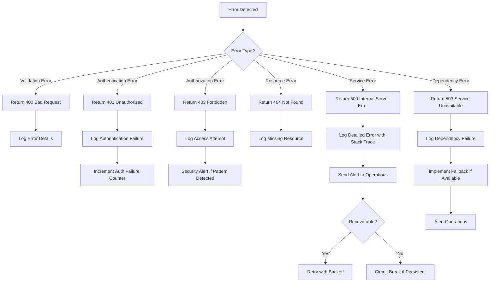
```mermaid
flowchart TD
    A[Error Detected] --> B{Error Type?}
    
    B -->|Validation Error| C[Return 400 Bad Request]
    C --> D[Log Error Details]
    
    B -->|Authentication Error| E[Return 401 Unauthorized]
    E --> F[Log Authentication Failure]
    F --> G[Increment Auth Failure Counter]
    
    B -->|Authorization Error| H[Return 403 Forbidden]
    H --> I[Log Access Attempt]
    I --> J[Security Alert if Pattern Detected]
    
    B -->|Resource Error| K[Return 404 Not Found]
    K --> L[Log Missing Resource]
    
    B -->|Service Error| M[Return 500 Internal Server Error]
    M --> N[Log Detailed Error with Stack Trace]
    N --> O[Send Alert to Operations]
    O --> P{Recoverable?}
    P -->|Yes| Q[Retry with Backoff]
    P -->|No| R[Circuit Break if Persistent]
    
    B -->|Dependency Error| S[Return 503 Service Unavailable]
    S --> T[Log Dependency Failure]
    T --> U[Implement Fallback if Available]
    U --> V[Alert Operations]
```

#### 5.4.4 Authentication and Authorization Framework

The system implements a comprehensive security framework centered around JWT-based authentication and role-based authorization:

**Authentication Flow**:
1. Client obtains JWT from authentication provider (outside system scope)
2. JWT contains claims for user identity, tenant ID, and roles
3. API Gateway validates JWT signature and expiration
4. Tenant context is extracted and passed to downstream services
5. Failed authentication returns 401 Unauthorized

**Authorization Model**:
- Role-based access control within tenant boundaries
- Common roles include Reader, Contributor, and Administrator
- Permissions are checked at service boundaries
- Document and folder permissions inherit from parent folders
- Failed authorization returns 403 Forbidden

**Tenant Isolation**:
- Tenant ID from JWT is used to scope all operations
- Database queries include tenant filters
- S3 storage paths include tenant prefix
- Search queries include tenant filter
- Cross-tenant access attempts are logged as security incidents

#### 5.4.5 Performance Requirements and SLAs

| Metric | Requirement | Implementation Approach |
| ------ | ----------- | ----------------------- |
| API Response Time | < 2 seconds | Efficient code, caching, connection pooling, optimized queries |
| Document Processing Time | < 5 minutes | Parallel processing, optimized virus scanning, efficient indexing |
| System Uptime | 99.99% | Kubernetes orchestration, redundancy, auto-scaling, health monitoring |
| Search Performance | < 2 seconds | Elasticsearch optimization, index sharding, query caching |
| Upload Capacity | 10,000 daily (3MB avg) | S3 multipart uploads, processing queue, horizontal scaling |

#### 5.4.6 Disaster Recovery Procedures

The Document Management Platform implements a comprehensive disaster recovery strategy:

**Backup Procedures**:
- S3 data: Cross-region replication for document content
- Database: Daily full backups, point-in-time recovery enabled
- Configuration: Infrastructure as Code with version control
- Indexes: Regular snapshots of Elasticsearch indexes

**Recovery Procedures**:
- RTO (Recovery Time Objective): 4 hours
- RPO (Recovery Point Objective): 15 minutes
- Automated recovery playbooks for common failure scenarios
- Regular disaster recovery testing and validation

**Failure Scenarios**:
- Service instance failure: Kubernetes automatically reschedules pods
- Zone failure: Multi-AZ deployment ensures continuity
- Region failure: Cross-region replication enables failover
- Data corruption: Point-in-time recovery from backups

**Business Continuity**:
- Read-only mode capability during major outages
- Degraded service modes with essential functionality
- Clear communication procedures for outage notification

## 6. SYSTEM COMPONENTS DESIGN

### 6.1 MICROSERVICES ARCHITECTURE

#### 6.1.1 Service Decomposition

The Document Management Platform is decomposed into the following microservices based on business capabilities and domain boundaries:

| Service Name | Primary Responsibility | Domain Boundary | Key Dependencies |
| ------------ | ---------------------- | --------------- | ---------------- |
| API Gateway Service | Request routing, authentication, rate limiting | System entry point | Authentication Service |
| Document Service | Document metadata management, lifecycle coordination | Document domain | Storage Service, Search Service |
| Storage Service | Document storage operations, encryption | Storage domain | AWS S3, Virus Scanning Service |
| Search Service | Content and metadata indexing and searching | Search domain | Elasticsearch, Document Service |
| Folder Service | Folder hierarchy management | Organization domain | Document Service |
| Virus Scanning Service | Malware detection in uploaded documents | Security domain | ClamAV, Storage Service |
| Authentication Service | JWT validation, tenant context extraction | Security domain | - |
| Event Service | Domain event publishing and subscription | Integration domain | All services |

#### 6.1.2 Service Communication Patterns

| Pattern | Use Cases | Implementation | Considerations |
| ------- | --------- | -------------- | ------------- |
| Synchronous REST | User-initiated operations requiring immediate response | HTTP/JSON with standardized error responses | Timeout handling, retry policies, circuit breaking |
| Asynchronous Messaging | Background processing, event notifications | AWS SQS for processing queues, AWS SNS for event publishing | Message delivery guarantees, dead letter queues |
| Event-Driven | Cross-service notifications, webhooks | Event Service with publish-subscribe model | Event schema versioning, delivery ordering |

#### 6.1.3 Service Boundaries and Contracts

```mermaid
graph TD
    Client[API Client] --> Gateway[API Gateway Service]
    
    subgraph "Document Domain"
        DocSvc[Document Service]
        StorageSvc[Storage Service]
        VirusSvc[Virus Scanning Service]
    end
    
    subgraph "Search Domain"
        SearchSvc[Search Service]
    end
    
    subgraph "Organization Domain"
        FolderSvc[Folder Service]
    end
    
    subgraph "Security Domain"
        AuthSvc[Authentication Service]
    end
    
    subgraph "Integration Domain"
        EventSvc[Event Service]
    end
    
    Gateway --> AuthSvc
    Gateway --> DocSvc
    Gateway --> SearchSvc
    Gateway --> FolderSvc
    
    DocSvc --> StorageSvc
    DocSvc --> SearchSvc
    DocSvc --> FolderSvc
    DocSvc --> EventSvc
    
    StorageSvc --> VirusSvc
    StorageSvc --> EventSvc
    
    SearchSvc --> EventSvc
    FolderSvc --> EventSvc
    VirusSvc --> EventSvc
```

### 6.2 DOCUMENT SERVICE DESIGN

#### 6.2.1 Core Responsibilities

- Manage document metadata and lifecycle
- Coordinate document upload and download workflows
- Enforce document-level permissions
- Maintain document-folder relationships
- Implement tenant isolation for document operations

#### 6.2.2 Domain Model

| Entity | Attributes | Relationships | Business Rules |
| ------ | ---------- | ------------- | -------------- |
| Document | ID, Name, ContentType, Size, CreatedAt, UpdatedAt, Status, TenantID, OwnerID | Belongs to Folder, Has many Tags | Must have valid ContentType, Size must be > 0 and <= 100MB |
| DocumentVersion | ID, DocumentID, VersionNumber, Size, CreatedAt, Status | Belongs to Document | Status must be one of: Processing, Available, Quarantined, Failed |
| DocumentMetadata | ID, DocumentID, Key, Value | Belongs to Document | Key must be unique per Document |
| DocumentPermission | ID, DocumentID, RoleID, PermissionType | Belongs to Document | PermissionType must be one of: Read, Write, Delete |

#### 6.2.3 API Endpoints

| Endpoint | Method | Purpose | Request Parameters | Response |
| -------- | ------ | ------- | ------------------ | -------- |
| /api/v1/documents | POST | Upload new document | Multipart form with file and metadata | Document ID and status |
| /api/v1/documents/{id} | GET | Retrieve document metadata | Document ID | Document metadata |
| /api/v1/documents/{id}/content | GET | Download document | Document ID | Document binary or presigned URL |
| /api/v1/documents/{id} | DELETE | Delete document | Document ID | Success confirmation |
| /api/v1/documents/{id}/metadata | PUT | Update document metadata | Document ID, metadata key-values | Updated metadata |
| /api/v1/documents/batch/download | POST | Batch download | Array of Document IDs | ZIP archive or presigned URL |
| /api/v1/documents/status/{id} | GET | Check document processing status | Processing ID | Current status and details |

#### 6.2.4 Internal Component Design

```mermaid
graph TD
    API[API Layer] --> UC[Use Cases Layer]
    UC --> Domain[Domain Layer]
    UC --> Repo[Repository Interfaces]
    
    Repo --> DB[(Database Repository)]
    Repo --> Storage[Storage Repository]
    Repo --> Search[Search Repository]
    
    DB --> PostgreSQL[(PostgreSQL)]
    Storage --> S3[AWS S3]
    Search --> ES[Elasticsearch]
    
    subgraph "Document Service"
        API
        UC
        Domain
        Repo
    end
    
    subgraph "External Dependencies"
        PostgreSQL
        S3
        ES
    end
```

### 6.3 STORAGE SERVICE DESIGN

#### 6.3.1 Core Responsibilities

- Manage document storage in AWS S3
- Handle document encryption and decryption
- Manage temporary and permanent storage locations
- Generate presigned URLs for direct downloads
- Coordinate with Virus Scanning Service

#### 6.3.2 Storage Architecture

| Storage Area | Purpose | S3 Bucket Structure | Lifecycle Policy |
| ------------ | ------- | ------------------- | ---------------- |
| Temporary Storage | Hold documents during processing | s3://tenant-temp/{tenantId}/{documentId} | Delete after 24 hours |
| Permanent Storage | Store validated documents | s3://tenant-docs/{tenantId}/{folderId}/{documentId} | Retain indefinitely |
| Quarantine Storage | Isolate infected documents | s3://tenant-quarantine/{tenantId}/{documentId} | Delete after 90 days |

#### 6.3.3 Encryption Strategy

| Data State | Encryption Method | Key Management | Implementation |
| ---------- | ----------------- | ------------- | -------------- |
| At Rest | AWS S3 SSE-KMS | AWS KMS with tenant-specific keys | S3 bucket policy enforcing encryption |
| In Transit | TLS 1.3 | AWS Certificate Manager | HTTPS for all API communications |
| Processing | Memory encryption | Ephemeral keys | Secure memory handling in processing services |

#### 6.3.4 Upload/Download Flow

```mermaid
sequenceDiagram
    participant Client
    participant DocSvc as Document Service
    participant StorageSvc as Storage Service
    participant S3 as AWS S3
    participant SQS as AWS SQS
    participant VirusSvc as Virus Scanning Service
    
    %% Upload Flow
    Client->>DocSvc: Upload Document
    DocSvc->>StorageSvc: Store Document
    StorageSvc->>S3: Upload to Temporary Location
    S3-->>StorageSvc: Upload Confirmation
    StorageSvc->>SQS: Queue for Virus Scanning
    StorageSvc-->>DocSvc: Storage Confirmation
    DocSvc-->>Client: Upload Accepted
    
    %% Virus Scanning Flow
    SQS->>VirusSvc: Dequeue Scan Task
    VirusSvc->>S3: Download Document
    S3-->>VirusSvc: Document Content
    VirusSvc->>VirusSvc: Scan Document
    
    alt Clean Document
        VirusSvc->>StorageSvc: Document Clean
        StorageSvc->>S3: Move to Permanent Storage
        S3-->>StorageSvc: Move Confirmation
        StorageSvc-->>DocSvc: Update Document Status
    else Infected Document
        VirusSvc->>StorageSvc: Document Infected
        StorageSvc->>S3: Move to Quarantine
        S3-->>StorageSvc: Move Confirmation
        StorageSvc-->>DocSvc: Update Document Status (Quarantined)
    end
    
    %% Download Flow
    Client->>DocSvc: Request Download
    DocSvc->>StorageSvc: Generate Download URL
    StorageSvc->>S3: Create Presigned URL
    S3-->>StorageSvc: Presigned URL
    StorageSvc-->>DocSvc: Return URL
    DocSvc-->>Client: Redirect to Download URL
    Client->>S3: Download via Presigned URL
    S3-->>Client: Document Content
```

### 6.4 SEARCH SERVICE DESIGN

#### 6.4.1 Core Responsibilities

- Index document content and metadata
- Provide search capabilities across documents
- Filter search results based on permissions and tenant context
- Maintain search index integrity

#### 6.4.2 Search Capabilities

| Search Type | Implementation | Example Query | Performance Considerations |
| ----------- | -------------- | ------------- | -------------------------- |
| Full-text Content Search | Elasticsearch text analysis | "contract agreement" | Index optimization, result scoring |
| Metadata Search | Elasticsearch keyword fields | filename:invoice* | Field mapping, term filters |
| Combined Search | Boolean queries | content:"payment" AND metadata.type:invoice | Query complexity, performance |
| Filtered Search | Post-filter by permissions | Above + tenant and permission filters | Filter caching, query optimization |

#### 6.4.3 Indexing Strategy

| Content Type | Extraction Method | Indexing Approach | Update Strategy |
| ------------ | ----------------- | ----------------- | --------------- |
| PDF | PDF text extraction | Full-text indexing with metadata | Reindex on document update |
| Office Documents | Apache Tika extraction | Full-text indexing with metadata | Reindex on document update |
| Images | No content extraction | Metadata-only indexing | Update metadata on change |
| Text Files | Direct extraction | Full-text indexing with metadata | Reindex on document update |

#### 6.4.4 Search Query Flow

```mermaid
sequenceDiagram
    participant Client
    participant Gateway as API Gateway
    participant SearchSvc as Search Service
    participant Redis as Redis Cache
    participant ES as Elasticsearch
    participant DocSvc as Document Service
    
    Client->>Gateway: Search Request
    Gateway->>SearchSvc: Forward Request
    
    SearchSvc->>SearchSvc: Extract Tenant Context
    SearchSvc->>Redis: Check Cache
    
    alt Cache Hit
        Redis->>SearchSvc: Return Cached Results
    else Cache Miss
        SearchSvc->>ES: Query with Tenant Filter
        ES->>SearchSvc: Raw Search Results
        SearchSvc->>DocSvc: Get Permission Info
        DocSvc->>SearchSvc: Permission Data
        SearchSvc->>SearchSvc: Filter by Permissions
        SearchSvc->>Redis: Cache Results
    end
    
    SearchSvc->>Gateway: Return Results
    Gateway->>Client: Search Response
```

### 6.5 FOLDER SERVICE DESIGN

#### 6.5.1 Core Responsibilities

- Manage folder hierarchy and organization
- Enforce folder-level permissions
- Maintain folder-document relationships
- Implement tenant isolation for folder operations

#### 6.5.2 Domain Model

| Entity | Attributes | Relationships | Business Rules |
| ------ | ---------- | ------------- | -------------- |
| Folder | ID, Name, ParentID, Path, CreatedAt, UpdatedAt, TenantID, OwnerID | Has many Documents, Has many Child Folders, Belongs to Parent Folder | Name must be unique within parent folder |
| FolderPermission | ID, FolderID, RoleID, PermissionType, Inherited | Belongs to Folder | PermissionType must be one of: Read, Write, Delete, Admin |

#### 6.5.3 Folder Hierarchy Management

| Operation | Implementation | Considerations |
| --------- | -------------- | ------------- |
| Create Folder | Insert with path generation | Path uniqueness, parent existence |
| Move Folder | Update path for folder and all children | Cascading updates, permission inheritance |
| Delete Folder | Recursive deletion or move to trash | Document handling, permission checks |
| List Folder Contents | Query with pagination and filtering | Performance for large folders |

#### 6.5.4 Folder Structure Diagram

```mermaid
graph TD
    Root[Root Folder] --> F1[Marketing]
    Root --> F2[Finance]
    Root --> F3[HR]
    
    F1 --> F1_1[Campaigns]
    F1 --> F1_2[Assets]
    F1_1 --> F1_1_1[2023 Q1]
    F1_1 --> F1_1_2[2023 Q2]
    
    F2 --> F2_1[Invoices]
    F2 --> F2_2[Reports]
    F2_1 --> F2_1_1[2023]
    F2_1 --> F2_1_2[2022]
    
    F3 --> F3_1[Policies]
    F3 --> F3_2[Employee Records]
    
    style Root fill:#f9f,stroke:#333,stroke-width:2px
    style F1 fill:#bbf,stroke:#333,stroke-width:1px
    style F2 fill:#bbf,stroke:#333,stroke-width:1px
    style F3 fill:#bbf,stroke:#333,stroke-width:1px
```

### 6.6 VIRUS SCANNING SERVICE DESIGN

#### 6.6.1 Core Responsibilities

- Scan uploaded documents for malicious content
- Integrate with ClamAV for virus detection
- Manage scanning queue and results
- Isolate infected documents

#### 6.6.2 Scanning Architecture

| Component | Implementation | Purpose | Considerations |
| --------- | -------------- | ------- | ------------- |
| Scanning Engine | ClamAV | Detect viruses and malware | Regular signature updates |
| Queue Consumer | AWS SQS client | Process scanning requests | Retry logic, dead letter queue |
| Result Handler | Internal API | Process scan results | Quarantine process, notification |

#### 6.6.3 Scanning Process Flow

```mermaid
flowchart TD
    A[Document Uploaded] --> B[Queue Scanning Task]
    B --> C[Dequeue Task]
    C --> D[Download from Temporary Storage]
    D --> E[Scan with ClamAV]
    E --> F{Virus Detected?}
    
    F -->|Yes| G[Move to Quarantine]
    G --> H[Update Document Status]
    H --> I[Notify Document Service]
    I --> J[Log Security Incident]
    
    F -->|No| K[Move to Permanent Storage]
    K --> L[Update Document Status]
    L --> M[Notify Document Service]
    M --> N[Trigger Content Indexing]
    
    style F fill:#ff9,stroke:#333,stroke-width:2px
    style G fill:#f99,stroke:#333,stroke-width:2px
    style K fill:#9f9,stroke:#333,stroke-width:2px
```

#### 6.6.4 Quarantine Management

| Aspect | Implementation | Purpose | Considerations |
| ------ | -------------- | ------- | ------------- |
| Quarantine Storage | Isolated S3 bucket | Secure storage of infected files | Access restrictions |
| Quarantine Metadata | Database records | Track quarantined documents | Retention policy |
| Notification | Event publication | Alert about security incidents | Compliance requirements |
| Retention | 90-day policy | Maintain for investigation | Automatic deletion |

### 6.7 AUTHENTICATION SERVICE DESIGN

#### 6.7.1 Core Responsibilities

- Validate JWT tokens
- Extract tenant context and user roles
- Enforce tenant isolation
- Provide authentication middleware

#### 6.7.2 JWT Structure

| Claim | Purpose | Validation Rules |
| ----- | ------- | ---------------- |
| sub | User identifier | Must be present and valid UUID |
| tenant_id | Tenant identifier | Must be present and valid UUID |
| roles | User roles array | Must contain at least one valid role |
| exp | Expiration timestamp | Must be in the future |
| iat | Issued at timestamp | Must be in the past |
| iss | Token issuer | Must match configured issuer |

#### 6.7.3 Authentication Flow

```mermaid
sequenceDiagram
    participant Client
    participant Gateway as API Gateway
    participant AuthSvc as Authentication Service
    participant Service as Microservice
    
    Client->>Gateway: API Request with JWT
    Gateway->>AuthSvc: Validate JWT
    
    AuthSvc->>AuthSvc: Verify Token Signature
    AuthSvc->>AuthSvc: Check Token Expiration
    AuthSvc->>AuthSvc: Extract Tenant Context
    AuthSvc->>AuthSvc: Extract User Roles
    
    alt Valid Token
        AuthSvc->>Gateway: Authentication Successful
        Gateway->>Service: Forward Request with Context
        Service->>Service: Apply Tenant Filter
        Service->>Gateway: Service Response
        Gateway->>Client: API Response
    else Invalid Token
        AuthSvc->>Gateway: Authentication Failed
        Gateway->>Client: 401 Unauthorized
    end
```

#### 6.7.4 Role-Based Access Control

| Role | Permissions | Scope |
| ---- | ----------- | ----- |
| Reader | View documents and folders | Tenant-wide or specific folders |
| Contributor | Reader + upload, update documents | Tenant-wide or specific folders |
| Editor | Contributor + delete documents | Tenant-wide or specific folders |
| Administrator | All operations including folder management | Tenant-wide |
| System | Special role for internal operations | System-wide |

### 6.8 EVENT SERVICE DESIGN

#### 6.8.1 Core Responsibilities

- Publish domain events
- Manage event subscriptions
- Deliver webhook notifications
- Ensure event delivery reliability

#### 6.8.2 Event Types

| Event Type | Triggered By | Payload | Consumers |
| ---------- | ------------ | ------- | --------- |
| document.uploaded | Document upload completion | Document ID, metadata | Search Service, Webhook subscribers |
| document.processed | Document processing completion | Document ID, status | Document Service, Webhook subscribers |
| document.quarantined | Virus detection | Document ID, scan result | Security monitoring, Webhook subscribers |
| document.downloaded | Document download | Document ID, user ID | Audit logging, Webhook subscribers |
| folder.created | Folder creation | Folder ID, metadata | Folder Service, Webhook subscribers |
| folder.updated | Folder update | Folder ID, changes | Folder Service, Webhook subscribers |

#### 6.8.3 Event Flow Architecture

```mermaid
graph TD
    DocSvc[Document Service] -->|Publish| EventBus[Event Bus]
    StorageSvc[Storage Service] -->|Publish| EventBus
    FolderSvc[Folder Service] -->|Publish| EventBus
    VirusSvc[Virus Scanning Service] -->|Publish| EventBus
    
    EventBus -->|Subscribe| SearchSvc[Search Service]
    EventBus -->|Subscribe| AuditSvc[Audit Service]
    EventBus -->|Subscribe| WebhookSvc[Webhook Service]
    
    WebhookSvc -->|Deliver| ExtSys1[External System 1]
    WebhookSvc -->|Deliver| ExtSys2[External System 2]
    
    style EventBus fill:#f96,stroke:#333,stroke-width:2px
```

#### 6.8.4 Webhook Management

| Feature | Implementation | Purpose | Considerations |
| ------- | -------------- | ------- | ------------- |
| Subscription Management | API endpoints | Register and manage webhooks | Authentication, validation |
| Delivery Retry | Exponential backoff | Handle temporary failures | Maximum retries, dead letter |
| Payload Signing | HMAC signatures | Verify webhook authenticity | Key management, rotation |
| Delivery Tracking | Database records | Monitor delivery status | Performance, cleanup |

### 6.9 CROSS-COMPONENT INTERACTIONS

#### 6.9.1 Document Upload Sequence

```mermaid
sequenceDiagram
    participant Client
    participant Gateway as API Gateway
    participant AuthSvc as Authentication Service
    participant DocSvc as Document Service
    participant StorageSvc as Storage Service
    participant S3 as AWS S3
    participant SQS as AWS SQS
    participant VirusSvc as Virus Scanning Service
    participant SearchSvc as Search Service
    participant EventSvc as Event Service
    
    Client->>Gateway: Upload Document (JWT)
    Gateway->>AuthSvc: Validate JWT
    AuthSvc->>Gateway: Valid Token + Context
    
    Gateway->>DocSvc: Forward Upload Request
    DocSvc->>DocSvc: Validate Metadata & Permissions
    DocSvc->>StorageSvc: Store Document
    
    StorageSvc->>S3: Upload to Temporary Location
    S3-->>StorageSvc: Upload Confirmation
    StorageSvc->>SQS: Queue for Virus Scanning
    StorageSvc-->>DocSvc: Storage Confirmation
    
    DocSvc->>EventSvc: Publish document.uploaded
    DocSvc-->>Gateway: Upload Accepted
    Gateway-->>Client: 202 Accepted with Tracking ID
    
    SQS->>VirusSvc: Dequeue Scan Task
    VirusSvc->>S3: Download Document
    S3-->>VirusSvc: Document Content
    VirusSvc->>VirusSvc: Scan Document
    
    alt Clean Document
        VirusSvc->>StorageSvc: Document Clean
        StorageSvc->>S3: Move to Permanent Storage
        S3-->>StorageSvc: Move Confirmation
        StorageSvc->>DocSvc: Update Document Status
        DocSvc->>SearchSvc: Index Document
        DocSvc->>EventSvc: Publish document.processed
        EventSvc->>EventSvc: Deliver Webhooks
    else Infected Document
        VirusSvc->>StorageSvc: Document Infected
        StorageSvc->>S3: Move to Quarantine
        S3-->>StorageSvc: Move Confirmation
        StorageSvc->>DocSvc: Update Document Status (Quarantined)
        DocSvc->>EventSvc: Publish document.quarantined
        EventSvc->>EventSvc: Deliver Webhooks
    end
```

#### 6.9.2 Document Search and Download Sequence

```mermaid
sequenceDiagram
    participant Client
    participant Gateway as API Gateway
    participant AuthSvc as Authentication Service
    participant SearchSvc as Search Service
    participant DocSvc as Document Service
    participant StorageSvc as Storage Service
    participant S3 as AWS S3
    participant EventSvc as Event Service
    
    %% Search Flow
    Client->>Gateway: Search Request (JWT)
    Gateway->>AuthSvc: Validate JWT
    AuthSvc->>Gateway: Valid Token + Context
    
    Gateway->>SearchSvc: Forward Search Request
    SearchSvc->>SearchSvc: Apply Tenant Filter
    SearchSvc->>SearchSvc: Execute Search Query
    SearchSvc->>DocSvc: Check Document Permissions
    DocSvc->>SearchSvc: Permission Results
    SearchSvc->>SearchSvc: Filter Results
    SearchSvc-->>Gateway: Search Results
    Gateway-->>Client: Search Response
    
    %% Download Flow
    Client->>Gateway: Download Request (JWT)
    Gateway->>AuthSvc: Validate JWT
    AuthSvc->>Gateway: Valid Token + Context
    
    Gateway->>DocSvc: Forward Download Request
    DocSvc->>DocSvc: Check Document Permissions
    DocSvc->>StorageSvc: Request Document
    
    alt Direct Download
        StorageSvc->>S3: Get Document
        S3-->>StorageSvc: Document Content
        StorageSvc-->>DocSvc: Document Content
        DocSvc-->>Gateway: Document Content
        Gateway-->>Client: Document Content
    else Presigned URL
        StorageSvc->>S3: Generate Presigned URL
        S3-->>StorageSvc: Presigned URL
        StorageSvc-->>DocSvc: Presigned URL
        DocSvc-->>Gateway: Presigned URL
        Gateway-->>Client: Presigned URL
        Client->>S3: Access via Presigned URL
        S3-->>Client: Document Content
    end
    
    DocSvc->>EventSvc: Publish document.downloaded
    EventSvc->>EventSvc: Deliver Webhooks
```

#### 6.9.3 Folder Management Sequence

```mermaid
sequenceDiagram
    participant Client
    participant Gateway as API Gateway
    participant AuthSvc as Authentication Service
    participant FolderSvc as Folder Service
    participant DocSvc as Document Service
    participant EventSvc as Event Service
    
    %% Create Folder
    Client->>Gateway: Create Folder Request (JWT)
    Gateway->>AuthSvc: Validate JWT
    AuthSvc->>Gateway: Valid Token + Context
    
    Gateway->>FolderSvc: Forward Create Request
    FolderSvc->>FolderSvc: Validate Request
    FolderSvc->>FolderSvc: Check Parent Folder Permissions
    FolderSvc->>FolderSvc: Create Folder
    FolderSvc->>EventSvc: Publish folder.created
    FolderSvc-->>Gateway: Folder Created
    Gateway-->>Client: Folder Details
    
    %% List Folder Contents
    Client->>Gateway: List Folder Contents (JWT)
    Gateway->>AuthSvc: Validate JWT
    AuthSvc->>Gateway: Valid Token + Context
    
    Gateway->>FolderSvc: Forward List Request
    FolderSvc->>FolderSvc: Check Folder Permissions
    FolderSvc->>FolderSvc: Get Subfolders
    FolderSvc->>DocSvc: Get Documents in Folder
    DocSvc->>FolderSvc: Document List
    FolderSvc->>FolderSvc: Combine Results
    FolderSvc-->>Gateway: Folder Contents
    Gateway-->>Client: Folder Listing
```

## 6.1 CORE SERVICES ARCHITECTURE

### 6.1.1 SERVICE COMPONENTS

#### Service Boundaries and Responsibilities

| Service | Primary Responsibility | Key Capabilities |
| ------- | ---------------------- | ---------------- |
| API Gateway | Entry point for all client requests | Authentication, request routing, rate limiting |
| Document Service | Document metadata management | Create, update, delete document metadata |
| Storage Service | Document content management | Upload, download, and virus scanning integration |
| Search Service | Content and metadata search | Full-text search, metadata filtering |
| Folder Service | Folder structure management | Create, list, and manage folder hierarchies |
| Virus Scanning Service | Malware detection | Scan documents for malicious content |
| Event Service | Domain event management | Publish and subscribe to system events |

#### Inter-service Communication Patterns

| Pattern | Implementation | Use Cases |
| ------- | -------------- | --------- |
| Synchronous REST | HTTP/JSON | Direct service-to-service calls requiring immediate response |
| Asynchronous Messaging | AWS SQS | Document processing, virus scanning, indexing |
| Event-Driven | AWS SNS | Notifications, webhooks, cross-service updates |
| Service Mesh | Istio | Advanced routing, traffic management, observability |

#### Service Discovery and Load Balancing

```mermaid
graph TD
    Client[API Client] --> Gateway[API Gateway]
    Gateway --> K8s[Kubernetes Service Discovery]
    
    subgraph "Kubernetes Cluster"
        K8s --> DocSvc[Document Service]
        K8s --> StorageSvc[Storage Service]
        K8s --> SearchSvc[Search Service]
        K8s --> FolderSvc[Folder Service]
        K8s --> VirusSvc[Virus Scanning Service]
        K8s --> EventSvc[Event Service]
    end
    
    DocSvc --> DocPod1[Pod 1]
    DocSvc --> DocPod2[Pod 2]
    DocSvc --> DocPod3[Pod 3]
    
    StorageSvc --> StoragePod1[Pod 1]
    StorageSvc --> StoragePod2[Pod 2]
    
    SearchSvc --> SearchPod1[Pod 1]
    SearchSvc --> SearchPod2[Pod 2]
    
    style Gateway fill:#f9f,stroke:#333,stroke-width:2px
    style K8s fill:#bbf,stroke:#333,stroke-width:2px
```

#### Circuit Breaker and Resilience Patterns

| Pattern | Implementation | Purpose |
| ------- | -------------- | ------- |
| Circuit Breaker | Hystrix/Go-Hystrix | Prevent cascading failures between services |
| Retry Mechanism | Exponential backoff | Handle transient failures in service calls |
| Fallback Strategy | Default responses | Provide degraded functionality when dependencies fail |
| Bulkhead Pattern | Resource isolation | Contain failures within service boundaries |

### 6.1.2 SCALABILITY DESIGN

#### Scaling Approach

| Service | Scaling Method | Scaling Triggers | Resource Requirements |
| ------- | -------------- | ---------------- | --------------------- |
| Document Service | Horizontal | CPU > 70%, Memory > 80% | 1 CPU, 2GB RAM per instance |
| Storage Service | Horizontal | Request queue > 100, CPU > 60% | 2 CPU, 4GB RAM per instance |
| Search Service | Horizontal + Vertical | Query latency > 1s, CPU > 75% | 4 CPU, 8GB RAM per instance |
| Virus Scanning Service | Horizontal | Queue depth > 50 items | 2 CPU, 4GB RAM per instance |

#### Auto-scaling Architecture

```mermaid
graph TD
    Metrics[Prometheus Metrics] --> HPA[Kubernetes HPA]
    HPA --> Scale[Scale Decision]
    
    subgraph "Horizontal Pod Autoscaler"
        Scale --> ScaleUp[Scale Up]
        Scale --> ScaleDown[Scale Down]
        Scale --> Maintain[Maintain Current]
    end
    
    ScaleUp --> DocSvc[Document Service]
    ScaleUp --> StorageSvc[Storage Service]
    ScaleUp --> SearchSvc[Search Service]
    ScaleUp --> VirusSvc[Virus Scanning Service]
    
    DocSvc --> DocPods[Document Pods]
    StorageSvc --> StoragePods[Storage Pods]
    SearchSvc --> SearchPods[Search Pods]
    VirusSvc --> VirusPods[Virus Scanning Pods]
    
    style HPA fill:#bbf,stroke:#333,stroke-width:2px
    style Metrics fill:#bfb,stroke:#333,stroke-width:1px
```

#### Performance Optimization Techniques

| Technique | Implementation | Services Affected |
| --------- | -------------- | ----------------- |
| Caching | Redis for frequent queries | Search, Document Services |
| Connection Pooling | Database and S3 connections | All database-dependent services |
| Asynchronous Processing | Background workers for heavy tasks | Storage, Virus Scanning Services |
| Resource Limits | Kubernetes resource quotas | All services |

#### Capacity Planning Guidelines

| Metric | Baseline | Growth Projection | Scaling Strategy |
| ------ | -------- | ----------------- | ---------------- |
| Document Uploads | 10,000/day (3MB avg) | 20% annual increase | Add Storage Service instances |
| Search Queries | 50,000/day | 30% annual increase | Scale Search Service, optimize indices |
| Concurrent Users | 500 | 25% annual increase | Scale API Gateway, Document Service |
| Storage Requirements | 30GB/day | 20% annual increase | S3 scales automatically |

### 6.1.3 RESILIENCE PATTERNS

#### Fault Tolerance Mechanisms

| Mechanism | Implementation | Purpose |
| --------- | -------------- | ------- |
| Health Checks | Kubernetes liveness/readiness probes | Detect and restart unhealthy services |
| Rate Limiting | API Gateway throttling | Prevent service overload |
| Timeout Policies | Context timeouts in service calls | Prevent blocked threads/goroutines |
| Graceful Degradation | Feature toggles | Disable non-critical features under load |

#### Disaster Recovery Approach

```mermaid
flowchart TD
    Start([Disaster Event]) --> Detect[Detect Failure]
    Detect --> Assess{Assess Impact}
    
    Assess -->|Minor| ServiceRestart[Restart Affected Services]
    ServiceRestart --> Monitor[Monitor Recovery]
    
    Assess -->|Major| ActivateDR[Activate DR Plan]
    ActivateDR --> SwitchRegion[Switch to Backup Region]
    SwitchRegion --> RestoreData[Restore from Backups]
    RestoreData --> VerifyIntegrity[Verify Data Integrity]
    VerifyIntegrity --> Monitor
    
    Monitor --> Resolved{Issues Resolved?}
    Resolved -->|Yes| Normal[Return to Normal Operations]
    Resolved -->|No| Reassess[Reassess Situation]
    Reassess --> Assess
    
    style Detect fill:#f96,stroke:#333,stroke-width:2px
    style ActivateDR fill:#f96,stroke:#333,stroke-width:2px
```

#### Data Redundancy and Failover

| Component | Redundancy Approach | Recovery Time Objective | Recovery Point Objective |
| --------- | ------------------- | ----------------------- | ------------------------ |
| Document Storage | S3 cross-region replication | < 1 hour | < 15 minutes |
| Metadata Database | Multi-AZ deployment, daily backups | < 30 minutes | < 5 minutes |
| Search Index | Elasticsearch snapshots to S3 | < 2 hours | < 1 hour |
| Service Configuration | GitOps with Infrastructure as Code | < 30 minutes | Current state |

#### Service Degradation Policies

| Degradation Level | Trigger Conditions | Service Impact | User Experience |
| ----------------- | ------------------ | -------------- | --------------- |
| Level 1 (Minor) | Single service degraded | Reduced performance | Slower response times |
| Level 2 (Moderate) | Multiple non-critical services down | Limited functionality | Some features unavailable |
| Level 3 (Severe) | Critical service failure | Core functionality affected | Read-only mode, limited operations |
| Level 4 (Critical) | System-wide failure | Minimal service | Emergency access only |

### 6.1.4 SERVICE INTERACTION ARCHITECTURE

```mermaid
graph TD
    Client[API Client] --> Gateway[API Gateway]
    
    Gateway --> AuthSvc[Authentication Service]
    Gateway --> DocSvc[Document Service]
    Gateway --> SearchSvc[Search Service]
    Gateway --> FolderSvc[Folder Service]
    
    DocSvc --> StorageSvc[Storage Service]
    DocSvc --> SearchSvc
    DocSvc --> FolderSvc
    DocSvc --> EventSvc[Event Service]
    
    StorageSvc --> S3[(AWS S3)]
    StorageSvc --> VirusSvc[Virus Scanning Service]
    StorageSvc --> EventSvc
    
    SearchSvc --> ES[(Elasticsearch)]
    SearchSvc --> EventSvc
    
    FolderSvc --> DB[(PostgreSQL)]
    FolderSvc --> EventSvc
    
    VirusSvc --> ClamAV[ClamAV]
    VirusSvc --> EventSvc
    
    EventSvc --> SNS[AWS SNS]
    EventSvc --> SQS[AWS SQS]
    
    style Gateway fill:#f9f,stroke:#333,stroke-width:2px
    style DocSvc fill:#bbf,stroke:#333,stroke-width:1px
    style StorageSvc fill:#bbf,stroke:#333,stroke-width:1px
    style SearchSvc fill:#bbf,stroke:#333,stroke-width:1px
    style FolderSvc fill:#bbf,stroke:#333,stroke-width:1px
    style VirusSvc fill:#bbf,stroke:#333,stroke-width:1px
    style EventSvc fill:#bbf,stroke:#333,stroke-width:1px
```

### 6.1.5 RESILIENCE IMPLEMENTATION

```mermaid
flowchart TD
    subgraph "Client Request Flow"
        Client[API Client] --> Gateway[API Gateway]
        Gateway --> CB{Circuit Breaker}
        
        CB -->|Closed| Service[Microservice]
        CB -->|Open| Fallback[Fallback Response]
        
        Service --> Success{Success?}
        Success -->|Yes| Response[Normal Response]
        Success -->|No| Retry{Retry Count < 3?}
        
        Retry -->|Yes| Backoff[Exponential Backoff]
        Backoff --> Service
        Retry -->|No| Fallback
        
        Response --> Client
        Fallback --> Client
    end
    
    subgraph "Circuit Breaker States"
        Closed[Closed: Normal Operation]
        HalfOpen[Half-Open: Testing Recovery]
        Open[Open: Failing Fast]
        
        Closed -->|Error Threshold Exceeded| Open
        Open -->|Timeout Period Elapsed| HalfOpen
        HalfOpen -->|Test Request Succeeds| Closed
        HalfOpen -->|Test Request Fails| Open
    end
    
    style CB fill:#f96,stroke:#333,stroke-width:2px
    style Fallback fill:#f96,stroke:#333,stroke-width:2px
    style Backoff fill:#bbf,stroke:#333,stroke-width:1px
```

## 6.2 DATABASE DESIGN

### 6.2.1 SCHEMA DESIGN

#### Entity Relationships

The Document Management Platform uses a relational database (PostgreSQL) for storing metadata, while the actual document content is stored in AWS S3. Below are the core entities and their relationships:

| Entity | Description | Primary Relationships |
| ------ | ----------- | --------------------- |
| Tenant | Represents a customer organization | Has many Users, Documents, and Folders |
| User | System user with specific roles | Belongs to a Tenant, creates/owns Documents and Folders |
| Document | Metadata for uploaded files | Belongs to a Tenant, belongs to a Folder, has many Versions |
| DocumentVersion | Specific version of a document | Belongs to a Document, has one StorageLocation |
| Folder | Organizational structure for documents | Belongs to a Tenant, has many Documents, may have a parent Folder |
| Permission | Access control for documents and folders | Associated with Users, Documents, and Folders |
| Tag | Metadata labels for documents | Many-to-many relationship with Documents |

#### Entity Relationship Diagram

```mermaid
erDiagram
    Tenant ||--o{ User : "has"
    Tenant ||--o{ Folder : "has"
    Tenant ||--o{ Document : "has"
    
    User }|--o{ Document : "creates/owns"
    User }|--o{ Folder : "creates/owns"
    User }|--o{ Permission : "has"
    
    Folder ||--o{ Document : "contains"
    Folder ||--o{ Folder : "contains"
    
    Document ||--o{ DocumentVersion : "has"
    Document }|--o{ Tag : "has"
    
    DocumentVersion ||--o| StorageLocation : "stored at"
    
    Permission }|--o{ Document : "controls access to"
    Permission }|--o{ Folder : "controls access to"
    
    Role ||--o{ User : "assigned to"
    Role ||--o{ Permission : "defines"
```

#### Data Models and Structures

**Tenants Table**

| Column | Type | Constraints | Description |
| ------ | ---- | ----------- | ----------- |
| id | UUID | PK, NOT NULL | Unique identifier |
| name | VARCHAR(255) | NOT NULL | Tenant name |
| status | VARCHAR(50) | NOT NULL | Active, Suspended, etc. |
| created_at | TIMESTAMP | NOT NULL | Creation timestamp |
| updated_at | TIMESTAMP | NOT NULL | Last update timestamp |

**Users Table**

| Column | Type | Constraints | Description |
| ------ | ---- | ----------- | ----------- |
| id | UUID | PK, NOT NULL | Unique identifier |
| tenant_id | UUID | FK, NOT NULL | Reference to tenant |
| username | VARCHAR(255) | NOT NULL | Username for login |
| email | VARCHAR(255) | NOT NULL | User email |
| status | VARCHAR(50) | NOT NULL | Active, Inactive, etc. |
| created_at | TIMESTAMP | NOT NULL | Creation timestamp |
| updated_at | TIMESTAMP | NOT NULL | Last update timestamp |

**Roles Table**

| Column | Type | Constraints | Description |
| ------ | ---- | ----------- | ----------- |
| id | UUID | PK, NOT NULL | Unique identifier |
| tenant_id | UUID | FK, NOT NULL | Reference to tenant |
| name | VARCHAR(100) | NOT NULL | Role name |
| description | TEXT | | Role description |
| created_at | TIMESTAMP | NOT NULL | Creation timestamp |
| updated_at | TIMESTAMP | NOT NULL | Last update timestamp |

**User_Roles Table**

| Column | Type | Constraints | Description |
| ------ | ---- | ----------- | ----------- |
| user_id | UUID | FK, NOT NULL | Reference to user |
| role_id | UUID | FK, NOT NULL | Reference to role |
| created_at | TIMESTAMP | NOT NULL | Creation timestamp |

**Folders Table**

| Column | Type | Constraints | Description |
| ------ | ---- | ----------- | ----------- |
| id | UUID | PK, NOT NULL | Unique identifier |
| tenant_id | UUID | FK, NOT NULL | Reference to tenant |
| parent_id | UUID | FK | Reference to parent folder |
| name | VARCHAR(255) | NOT NULL | Folder name |
| path | TEXT | NOT NULL | Full path to folder |
| owner_id | UUID | FK, NOT NULL | Reference to user |
| created_at | TIMESTAMP | NOT NULL | Creation timestamp |
| updated_at | TIMESTAMP | NOT NULL | Last update timestamp |

**Documents Table**

| Column | Type | Constraints | Description |
| ------ | ---- | ----------- | ----------- |
| id | UUID | PK, NOT NULL | Unique identifier |
| tenant_id | UUID | FK, NOT NULL | Reference to tenant |
| folder_id | UUID | FK, NOT NULL | Reference to folder |
| name | VARCHAR(255) | NOT NULL | Document name |
| content_type | VARCHAR(100) | NOT NULL | MIME type |
| size | BIGINT | NOT NULL | Size in bytes |
| owner_id | UUID | FK, NOT NULL | Reference to user |
| status | VARCHAR(50) | NOT NULL | Processing, Available, etc. |
| created_at | TIMESTAMP | NOT NULL | Creation timestamp |
| updated_at | TIMESTAMP | NOT NULL | Last update timestamp |

**Document_Versions Table**

| Column | Type | Constraints | Description |
| ------ | ---- | ----------- | ----------- |
| id | UUID | PK, NOT NULL | Unique identifier |
| document_id | UUID | FK, NOT NULL | Reference to document |
| version_number | INTEGER | NOT NULL | Sequential version number |
| size | BIGINT | NOT NULL | Size in bytes |
| content_hash | VARCHAR(64) | NOT NULL | SHA-256 hash of content |
| status | VARCHAR(50) | NOT NULL | Processing, Available, etc. |
| storage_path | TEXT | NOT NULL | S3 storage path |
| created_at | TIMESTAMP | NOT NULL | Creation timestamp |
| created_by | UUID | FK, NOT NULL | Reference to user |

**Document_Metadata Table**

| Column | Type | Constraints | Description |
| ------ | ---- | ----------- | ----------- |
| id | UUID | PK, NOT NULL | Unique identifier |
| document_id | UUID | FK, NOT NULL | Reference to document |
| key | VARCHAR(255) | NOT NULL | Metadata key |
| value | TEXT | NOT NULL | Metadata value |
| created_at | TIMESTAMP | NOT NULL | Creation timestamp |
| updated_at | TIMESTAMP | NOT NULL | Last update timestamp |

**Tags Table**

| Column | Type | Constraints | Description |
| ------ | ---- | ----------- | ----------- |
| id | UUID | PK, NOT NULL | Unique identifier |
| tenant_id | UUID | FK, NOT NULL | Reference to tenant |
| name | VARCHAR(100) | NOT NULL | Tag name |
| created_at | TIMESTAMP | NOT NULL | Creation timestamp |

**Document_Tags Table**

| Column | Type | Constraints | Description |
| ------ | ---- | ----------- | ----------- |
| document_id | UUID | FK, NOT NULL | Reference to document |
| tag_id | UUID | FK, NOT NULL | Reference to tag |
| created_at | TIMESTAMP | NOT NULL | Creation timestamp |
| created_by | UUID | FK, NOT NULL | Reference to user |

**Permissions Table**

| Column | Type | Constraints | Description |
| ------ | ---- | ----------- | ----------- |
| id | UUID | PK, NOT NULL | Unique identifier |
| tenant_id | UUID | FK, NOT NULL | Reference to tenant |
| role_id | UUID | FK, NOT NULL | Reference to role |
| resource_type | VARCHAR(50) | NOT NULL | 'document' or 'folder' |
| resource_id | UUID | NOT NULL | ID of document or folder |
| permission_type | VARCHAR(50) | NOT NULL | read, write, delete, admin |
| created_at | TIMESTAMP | NOT NULL | Creation timestamp |
| created_by | UUID | FK, NOT NULL | Reference to user |

#### Indexing Strategy

| Table | Index Name | Columns | Type | Purpose |
| ----- | ---------- | ------- | ---- | ------- |
| tenants | tenants_name_idx | name | B-tree | Optimize tenant lookup by name |
| users | users_tenant_id_idx | tenant_id | B-tree | Filter users by tenant |
| users | users_email_idx | email | B-tree | Optimize user lookup by email |
| folders | folders_tenant_id_idx | tenant_id | B-tree | Filter folders by tenant |
| folders | folders_parent_id_idx | parent_id | B-tree | Find child folders |
| folders | folders_path_idx | path | B-tree | Path-based folder lookup |
| documents | docs_tenant_id_idx | tenant_id | B-tree | Filter documents by tenant |
| documents | docs_folder_id_idx | folder_id | B-tree | Find documents in folder |
| documents | docs_content_type_idx | content_type | B-tree | Filter by content type |
| documents | docs_status_idx | status | B-tree | Filter by document status |
| document_versions | doc_ver_document_id_idx | document_id | B-tree | Find versions of document |
| document_metadata | doc_meta_document_id_idx | document_id | B-tree | Find metadata for document |
| document_metadata | doc_meta_key_value_idx | document_id, key, value | B-tree | Search by metadata |
| permissions | perms_tenant_resource_idx | tenant_id, resource_type, resource_id | B-tree | Find permissions for resource |
| permissions | perms_role_idx | role_id | B-tree | Find permissions by role |

#### Partitioning Approach

The database uses tenant-based partitioning to improve performance and maintain isolation:

| Table | Partitioning Strategy | Key | Benefits |
| ----- | --------------------- | --- | -------- |
| documents | List partitioning | tenant_id | Improved query performance, easier maintenance |
| document_versions | List partitioning | tenant_id (via document_id) | Parallel with documents table |
| folders | List partitioning | tenant_id | Improved folder operations per tenant |
| permissions | List partitioning | tenant_id | Faster permission checks |

For very large tenants, time-based partitioning may be applied to historical document data:

| Table | Secondary Partitioning | Key | Retention |
| ----- | ---------------------- | --- | --------- |
| documents | Range partitioning | created_at (monthly) | Based on retention policy |
| document_versions | Range partitioning | created_at (monthly) | Based on retention policy |

#### Replication Configuration

```mermaid
graph TD
    Primary[(Primary DB)] --> Replica1[(Read Replica 1)]
    Primary --> Replica2[(Read Replica 2)]
    Primary --> StandbyReplica[(Standby Replica)]
    
    subgraph "Primary Region"
        Primary
        Replica1
        Replica2
    end
    
    subgraph "Secondary Region"
        StandbyReplica
    end
    
    DocSvc[Document Service] --> Primary
    SearchSvc[Search Service] --> Replica1
    FolderSvc[Folder Service] --> Replica2
    
    style Primary fill:#f96,stroke:#333,stroke-width:2px
    style StandbyReplica fill:#bbf,stroke:#333,stroke-width:2px
```

**Replication Configuration Details:**

| Replica Type | Purpose | Sync Mode | Failover Capability |
| ------------ | ------- | --------- | ------------------ |
| Read Replicas | Handle read-heavy operations | Asynchronous | No automatic failover |
| Standby Replica | Disaster recovery | Synchronous | Manual promotion to primary |

#### Backup Architecture

```mermaid
graph TD
    Primary[(Primary DB)] --> BackupProcess[Backup Process]
    BackupProcess --> DailyBackup[Daily Full Backup]
    BackupProcess --> WALArchive[WAL Archiving]
    
    DailyBackup --> S3Backup[(S3 Backup Storage)]
    WALArchive --> S3WAL[(S3 WAL Storage)]
    
    S3Backup --> CrossRegion[Cross-Region Replication]
    S3WAL --> CrossRegion
    
    CrossRegion --> DR[(DR Region Storage)]
    
    style Primary fill:#f96,stroke:#333,stroke-width:2px
    style S3Backup fill:#bbf,stroke:#333,stroke-width:2px
    style S3WAL fill:#bbf,stroke:#333,stroke-width:2px
```

**Backup Schedule:**

| Backup Type | Frequency | Retention | Storage |
| ----------- | --------- | --------- | ------- |
| Full Backup | Daily | 30 days | S3 with cross-region replication |
| WAL Archives | Continuous | 7 days | S3 with cross-region replication |
| Snapshot | Weekly | 90 days | S3 with cross-region replication |

### 6.2.2 DATA MANAGEMENT

#### Migration Procedures

The system uses a structured migration approach to manage database schema changes:

| Migration Type | Tool | Execution Strategy | Validation |
| -------------- | ---- | ------------------ | ---------- |
| Schema Changes | Golang Migrate | Versioned migrations | Automated tests |
| Data Migrations | Custom scripts | Batched operations | Data integrity checks |
| Emergency Fixes | Manual + Automation | Hotfix procedures | Post-execution validation |

**Migration Workflow:**

```mermaid
flowchart TD
    Start([Migration Needed]) --> Dev[Develop Migration]
    Dev --> Test[Test in Development]
    Test --> Review[Peer Review]
    Review --> Staging[Apply to Staging]
    Staging --> Validate[Validate Results]
    Validate --> Schedule[Schedule Production Migration]
    Schedule --> Backup[Backup Production DB]
    Backup --> Apply[Apply Migration]
    Apply --> Verify[Verify Success]
    Verify --> Rollback{Issues?}
    Rollback -->|Yes| Restore[Restore from Backup]
    Rollback -->|No| Complete([Migration Complete])
    
    style Backup fill:#bbf,stroke:#333,stroke-width:2px
    style Apply fill:#f96,stroke:#333,stroke-width:2px
    style Rollback fill:#f96,stroke:#333,stroke-width:2px
```

#### Versioning Strategy

| Aspect | Approach | Implementation |
| ------ | -------- | -------------- |
| Schema Versioning | Sequential version numbers | Stored in migrations table |
| Data Versioning | Document versions | Stored in document_versions table |
| API Versioning | URL path versioning | Aligned with schema versions |

#### Archival Policies

| Data Type | Archival Trigger | Storage Location | Retrieval Method |
| --------- | ---------------- | ---------------- | ---------------- |
| Documents | Age > retention policy | S3 Glacier | Restore API |
| Metadata | Age > retention policy | Archive tables | Database query |
| Audit Logs | Age > 1 year | S3 | S3 Select queries |

**Archival Process Flow:**

```mermaid
flowchart TD
    Start([Archival Process]) --> Identify[Identify Eligible Data]
    Identify --> Validate[Validate Eligibility]
    Validate --> Archive[Archive Data]
    Archive --> UpdateRef[Update References]
    UpdateRef --> Verify[Verify Archival]
    Verify --> Cleanup[Clean Original Data]
    
    style Archive fill:#bbf,stroke:#333,stroke-width:2px
    style Cleanup fill:#f96,stroke:#333,stroke-width:2px
```

#### Data Storage and Retrieval Mechanisms

| Data Type | Storage Mechanism | Retrieval Pattern | Performance Considerations |
| --------- | ----------------- | ----------------- | -------------------------- |
| Document Content | AWS S3 | Direct or presigned URL | Multipart uploads, byte range fetches |
| Document Metadata | PostgreSQL | SQL queries | Indexed lookups, pagination |
| Search Index | Elasticsearch | Query DSL | Optimized queries, result caching |
| User Sessions | Redis | Key-value lookups | TTL-based expiration |

**Data Flow Diagram:**

```mermaid
graph TD
    Client[API Client] --> Gateway[API Gateway]
    
    Gateway --> DocSvc[Document Service]
    Gateway --> SearchSvc[Search Service]
    
    DocSvc --> DB[(PostgreSQL)]
    DocSvc --> S3[(AWS S3)]
    
    SearchSvc --> ES[(Elasticsearch)]
    SearchSvc --> Redis[(Redis Cache)]
    
    DB <-.-> DBSync[DB Sync Process]
    DBSync <-.-> ES
    
    style S3 fill:#bbf,stroke:#333,stroke-width:2px
    style ES fill:#bbf,stroke:#333,stroke-width:2px
```

#### Caching Policies

| Cache Type | Implementation | Invalidation Strategy | TTL |
| ---------- | -------------- | --------------------- | --- |
| Document Metadata | Redis | Event-based + TTL | 15 minutes |
| Folder Structure | Redis | Event-based + TTL | 30 minutes |
| Search Results | Redis | TTL only | 5 minutes |
| User Permissions | Redis | Event-based + TTL | 10 minutes |

**Cache Hierarchy:**

```mermaid
graph TD
    Request[API Request] --> L1[L1: API Gateway Cache]
    L1 --> Hit1{Cache Hit?}
    Hit1 -->|Yes| Response1[Return Response]
    Hit1 -->|No| L2[L2: Service Cache]
    
    L2 --> Hit2{Cache Hit?}
    Hit2 -->|Yes| Response2[Return Response]
    Hit2 -->|No| DB[(Database Query)]
    
    DB --> Store[Store in Cache]
    Store --> Response3[Return Response]
    
    style L1 fill:#bbf,stroke:#333,stroke-width:1px
    style L2 fill:#bbf,stroke:#333,stroke-width:1px
    style Hit1 fill:#f96,stroke:#333,stroke-width:1px
    style Hit2 fill:#f96,stroke:#333,stroke-width:1px
```

### 6.2.3 COMPLIANCE CONSIDERATIONS

#### Data Retention Rules

| Data Category | Retention Period | Justification | Implementation |
| ------------- | ---------------- | ------------- | -------------- |
| Active Documents | Per tenant policy | Business requirements | Metadata flag + scheduled jobs |
| Deleted Documents | 30 days | Recovery window | Soft delete + cleanup job |
| Quarantined Documents | 90 days | Security analysis | Isolated storage + cleanup job |
| Audit Logs | 7 years | Compliance requirements | Immutable storage in S3 |

**Retention Workflow:**

```mermaid
flowchart TD
    Start([Document Created]) --> Active[Active State]
    Active --> Event{Event}
    
    Event -->|Deleted| SoftDelete[Soft Delete State]
    Event -->|Quarantined| Quarantine[Quarantine State]
    Event -->|Retention Expired| Review[Review State]
    
    SoftDelete --> Wait[30-Day Wait]
    Wait --> HardDelete[Hard Delete]
    
    Quarantine --> QWait[90-Day Wait]
    QWait --> QDelete[Delete]
    
    Review --> Decision{Decision}
    Decision -->|Retain| Active
    Decision -->|Archive| Archive[Archive State]
    Decision -->|Delete| SoftDelete
    
    style Active fill:#bbf,stroke:#333,stroke-width:1px
    style SoftDelete fill:#f96,stroke:#333,stroke-width:1px
    style Quarantine fill:#f96,stroke:#333,stroke-width:1px
```

#### Backup and Fault Tolerance Policies

| Component | Backup Frequency | Recovery Point Objective | Recovery Time Objective |
| --------- | ---------------- | ------------------------ | ----------------------- |
| PostgreSQL | Daily full + continuous WAL | < 5 minutes | < 30 minutes |
| Elasticsearch | Daily snapshots | < 1 hour | < 2 hours |
| Document Content (S3) | Cross-region replication | < 15 minutes | < 1 hour |
| Configuration | Version-controlled | Current state | < 30 minutes |

**Fault Tolerance Architecture:**

```mermaid
graph TD
    subgraph "Primary Region"
        PrimaryDB[(Primary DB)]
        PrimaryS3[(Primary S3)]
        PrimaryES[(Primary ES)]
    end
    
    subgraph "Secondary Region"
        StandbyDB[(Standby DB)]
        StandbyS3[(Secondary S3)]
        StandbyES[(Secondary ES)]
    end
    
    PrimaryDB -->|Sync Replication| StandbyDB
    PrimaryS3 -->|Cross-Region Replication| StandbyS3
    PrimaryES -->|Snapshot Restore| StandbyES
    
    style PrimaryDB fill:#bbf,stroke:#333,stroke-width:1px
    style StandbyDB fill:#bbf,stroke:#333,stroke-width:1px
```

#### Privacy Controls

| Control Type | Implementation | Purpose | Compliance Standard |
| ------------ | -------------- | ------- | ------------------ |
| Data Encryption | TDE for PostgreSQL, S3 SSE-KMS | Protect data at rest | SOC2, ISO27001 |
| Tenant Isolation | Schema partitioning, query filters | Prevent data leakage | SOC2, ISO27001 |
| Data Minimization | Configurable retention policies | Limit unnecessary storage | GDPR principles |
| Access Controls | Role-based permissions | Limit data access | SOC2, ISO27001 |

#### Audit Mechanisms

| Audit Type | Implementation | Storage | Retention |
| ---------- | -------------- | ------- | --------- |
| Data Access | Database triggers + application logs | Immutable S3 | 7 years |
| Schema Changes | Migration logs + change tracking | Immutable S3 | 7 years |
| Authentication | API Gateway + service logs | Immutable S3 | 7 years |
| Administrative Actions | Application logs + DB triggers | Immutable S3 | 7 years |

**Audit Data Flow:**

```mermaid
graph TD
    DBAction[Database Action] --> Trigger[DB Trigger]
    Trigger --> AuditTable[Audit Tables]
    
    AppAction[Application Action] --> Logger[Application Logger]
    Logger --> CloudWatch[CloudWatch Logs]
    
    AuditTable --> Export[Log Export Process]
    CloudWatch --> Export
    
    Export --> S3Audit[(S3 Audit Storage)]
    S3Audit --> Retention[Retention Policy]
    S3Audit --> Analysis[Audit Analysis Tools]
    
    style Trigger fill:#bbf,stroke:#333,stroke-width:1px
    style S3Audit fill:#bbf,stroke:#333,stroke-width:1px
```

#### Access Controls

| Access Level | Implementation | Scope | Validation |
| ------------ | -------------- | ----- | ---------- |
| Database Users | Least privilege roles | Per service | Regular review |
| Application Access | JWT + tenant context | Per request | Token validation |
| Data Access | Row-level security | Per tenant | Query rewriting |
| Administrative | MFA + audit logging | System-wide | Regular review |

**Access Control Flow:**

```mermaid
flowchart TD
    Request[Database Request] --> Auth[Authentication]
    Auth --> Valid{Valid?}
    
    Valid -->|No| Reject[Reject Request]
    Valid -->|Yes| RLS[Row-Level Security]
    
    RLS --> TenantFilter[Apply Tenant Filter]
    TenantFilter --> PermCheck[Check Permissions]
    PermCheck --> Allowed{Allowed?}
    
    Allowed -->|No| Deny[Deny Access]
    Allowed -->|Yes| Execute[Execute Query]
    Execute --> Audit[Audit Access]
    
    style Auth fill:#bbf,stroke:#333,stroke-width:1px
    style TenantFilter fill:#f96,stroke:#333,stroke-width:1px
    style PermCheck fill:#f96,stroke:#333,stroke-width:1px
```

### 6.2.4 PERFORMANCE OPTIMIZATION

#### Query Optimization Patterns

| Pattern | Implementation | Use Cases | Benefits |
| ------- | -------------- | --------- | -------- |
| Covering Indexes | Composite indexes including all query fields | Folder listings, document searches | Reduces table lookups |
| Materialized Views | Precalculated aggregates | Document counts, storage usage | Faster reporting queries |
| Query Rewriting | Application-level transformation | Complex searches | Optimized execution plans |
| Prepared Statements | Parameterized queries | All database operations | Reduced parsing overhead |

**Example Query Patterns:**

| Query Type | Optimization Technique | Performance Impact |
| ---------- | ---------------------- | ----------------- |
| Document Listing | Covering index on folder_id + status + created_at | 80% reduction in query time |
| Permission Check | Denormalized permissions in Redis | 95% reduction in auth time |
| Folder Tree | Recursive CTE with path indexing | 70% reduction for deep trees |
| Metadata Search | GIN index on JSONB metadata | 85% reduction for complex filters |

#### Caching Strategy

| Cache Level | Implementation | Data Types | Invalidation Method |
| ----------- | -------------- | --------- | ------------------ |
| L1: API Response | API Gateway cache | Complete responses | TTL + API-based invalidation |
| L2: Application | Redis | Objects, permissions | Event-based + TTL |
| L3: Database | PgBouncer | Connection pooling | Automatic |
| L4: Query | PostgreSQL | Query plans, temp results | Automatic |

**Cache Effectiveness Metrics:**

| Cache Type | Hit Rate Target | Memory Allocation | Eviction Policy |
| ---------- | --------------- | ----------------- | --------------- |
| Document Metadata | > 90% | 2GB | LRU |
| Folder Structure | > 85% | 1GB | LRU |
| Permission Cache | > 95% | 1GB | LRU |
| Search Results | > 75% | 4GB | TTL |

#### Connection Pooling

| Service | Pool Size | Idle Timeout | Max Lifetime | Implementation |
| ------- | --------- | ------------ | ------------ | -------------- |
| Document Service | 20-50 connections | 5 minutes | 30 minutes | PgBouncer |
| Search Service | 10-30 connections | 5 minutes | 30 minutes | PgBouncer |
| Folder Service | 10-30 connections | 5 minutes | 30 minutes | PgBouncer |
| Batch Processors | 5-15 connections | 10 minutes | 60 minutes | PgBouncer |

**Connection Management:**

```mermaid
graph TD
    Services[Microservices] --> PgBouncer[PgBouncer]
    PgBouncer --> Primary[(Primary DB)]
    PgBouncer --> Replica1[(Read Replica 1)]
    PgBouncer --> Replica2[(Read Replica 2)]
    
    subgraph "Connection Types"
        Write[Write Connections]
        Read[Read Connections]
        Admin[Admin Connections]
    end
    
    Write --> Primary
    Read --> Replica1
    Read --> Replica2
    Admin --> Primary
    
    style PgBouncer fill:#bbf,stroke:#333,stroke-width:2px
```

#### Read/Write Splitting

| Operation Type | Database Target | Implementation | Consistency Model |
| -------------- | --------------- | -------------- | ----------------- |
| Writes | Primary | Direct routing | Strong consistency |
| Critical Reads | Primary | Direct routing | Strong consistency |
| Standard Reads | Read Replicas | Load balanced | Eventually consistent |
| Reporting Reads | Read Replicas | Dedicated instances | Eventually consistent |

**Read/Write Flow:**

```mermaid
flowchart TD
    Request[Database Request] --> Type{Operation Type}
    
    Type -->|Write| Primary[(Primary DB)]
    Type -->|Critical Read| Primary
    Type -->|Standard Read| LoadBalancer[Load Balancer]
    Type -->|Reporting| ReportingReplica[(Reporting Replica)]
    
    LoadBalancer --> Replica1[(Read Replica 1)]
    LoadBalancer --> Replica2[(Read Replica 2)]
    
    style Type fill:#f96,stroke:#333,stroke-width:1px
    style Primary fill:#bbf,stroke:#333,stroke-width:1px
```

#### Batch Processing Approach

| Process Type | Implementation | Scheduling | Resource Management |
| ------------ | -------------- | ---------- | ------------------ |
| Document Indexing | Worker pool with queue | Event-driven | Throttled, max 50 concurrent |
| Retention Cleanup | Scheduled job | Daily, off-peak | Batched, max 1000 per batch |
| Statistics Generation | Materialized view refresh | Hourly | Dedicated connection pool |
| Audit Log Export | Streaming process | Continuous | Rate-limited |

**Batch Processing Architecture:**

```mermaid
graph TD
    Trigger[Process Trigger] --> Queue[SQS Queue]
    Queue --> Workers[Worker Pool]
    Workers --> Batching[Batch Processor]
    Batching --> DB[(Database)]
    
    subgraph "Worker Scaling"
        QueueDepth[Queue Depth] --> AutoScale[Auto Scaling]
        AutoScale --> Workers
    end
    
    style Queue fill:#bbf,stroke:#333,stroke-width:1px
    style Workers fill:#bbf,stroke:#333,stroke-width:1px
```

## 6.3 INTEGRATION ARCHITECTURE

### 6.3.1 API DESIGN

#### Protocol Specifications

| Aspect | Specification | Details |
| ------ | ------------- | ------- |
| Protocol | REST over HTTPS | All API endpoints use HTTPS with TLS 1.2+ |
| Data Format | JSON | Request and response bodies use JSON format |
| HTTP Methods | GET, POST, PUT, DELETE | Standard HTTP methods for CRUD operations |
| Status Codes | Standard HTTP | 2xx for success, 4xx for client errors, 5xx for server errors |

#### Authentication Methods

| Method | Implementation | Use Case |
| ------ | -------------- | -------- |
| JWT Authentication | RS256 signed tokens | All API requests require a valid JWT |
| Token Validation | Signature and expiration checks | Performed at API Gateway level |
| Token Claims | Tenant ID, user ID, roles | Used for authorization and tenant isolation |
| Token Refresh | Refresh token flow | Allows obtaining new access tokens |

#### Authorization Framework

```mermaid
flowchart TD
    Request[API Request] --> JWT[Extract JWT]
    JWT --> Validate{Valid Token?}
    
    Validate -->|No| Reject[401 Unauthorized]
    Validate -->|Yes| Tenant[Extract Tenant Context]
    
    Tenant --> Role[Extract User Roles]
    Role --> Permission{Has Permission?}
    
    Permission -->|No| Forbidden[403 Forbidden]
    Permission -->|Yes| Resource{Resource in Tenant?}
    
    Resource -->|No| Forbidden
    Resource -->|Yes| Allow[Process Request]
    
    style JWT fill:#bbf,stroke:#333,stroke-width:1px
    style Validate fill:#f96,stroke:#333,stroke-width:1px
    style Permission fill:#f96,stroke:#333,stroke-width:1px
    style Resource fill:#f96,stroke:#333,stroke-width:1px
```

#### Rate Limiting Strategy

| Limit Type | Implementation | Default Limit | Customization |
| ---------- | -------------- | ------------- | ------------- |
| Request Rate | Token bucket algorithm | 100 requests/minute | Configurable per tenant |
| Concurrent Uploads | Leaky bucket algorithm | 10 concurrent uploads | Configurable per tenant |
| Bandwidth | Fixed window counter | 1GB/hour | Configurable per tenant |
| Burst Allowance | Token bucket with burst | 150% of base rate | Applied to all limits |

#### Versioning Approach

| Aspect | Approach | Example |
| ------ | -------- | ------- |
| API Versioning | URL path versioning | `/api/v1/documents` |
| Compatibility | Backward compatible changes | Adding optional fields |
| Breaking Changes | New API version | Moving from v1 to v2 |
| Deprecation | Header warnings | `X-API-Deprecated: true` |

#### Documentation Standards

| Documentation Type | Tool/Format | Purpose |
| ------------------ | ----------- | ------- |
| API Reference | OpenAPI 3.0 | Machine-readable API specification |
| Developer Guide | Markdown | Implementation guidance for API consumers |
| Code Examples | Multiple languages | Ready-to-use integration examples |
| Postman Collection | JSON | Interactive API testing and exploration |

### 6.3.2 MESSAGE PROCESSING

#### Event Processing Patterns

| Pattern | Implementation | Use Cases |
| ------- | -------------- | --------- |
| Publish-Subscribe | AWS SNS | Document state changes, folder updates |
| Request-Response | Synchronous REST | Direct API interactions |
| Command | AWS SQS | Document processing tasks |
| Event Sourcing | Event log | Audit trail, system history |

#### Message Queue Architecture

```mermaid
graph TD
    Upload[Upload Service] -->|Document Tasks| DocQueue[Document Processing Queue]
    DocQueue --> Processor[Document Processor]
    
    Processor -->|Scan Request| ScanQueue[Virus Scan Queue]
    ScanQueue --> Scanner[Virus Scanner]
    
    Scanner -->|Clean| IndexQueue[Indexing Queue]
    Scanner -->|Infected| QuarantineQueue[Quarantine Queue]
    
    IndexQueue --> Indexer[Content Indexer]
    QuarantineQueue --> Quarantine[Quarantine Handler]
    
    style DocQueue fill:#bbf,stroke:#333,stroke-width:1px
    style ScanQueue fill:#bbf,stroke:#333,stroke-width:1px
    style IndexQueue fill:#bbf,stroke:#333,stroke-width:1px
    style QuarantineQueue fill:#f96,stroke:#333,stroke-width:1px
```

#### Stream Processing Design

| Stream Type | Implementation | Purpose | Processing Model |
| ----------- | -------------- | ------- | ---------------- |
| Document Events | AWS SNS + SQS | Notify about document changes | Fan-out to subscribers |
| Audit Events | AWS Kinesis | Security and compliance logging | Continuous processing |
| Webhook Events | AWS EventBridge | External notifications | Filtered distribution |
| System Metrics | Prometheus | Performance monitoring | Time-series analysis |

#### Batch Processing Flows

```mermaid
sequenceDiagram
    participant Scheduler as Scheduler
    participant BatchJob as Batch Job
    participant Queue as SQS Queue
    participant Worker as Worker Pool
    participant DB as Database
    participant S3 as S3 Storage
    
    Scheduler->>BatchJob: Trigger batch job
    BatchJob->>DB: Query eligible items
    DB-->>BatchJob: Return batch items
    
    loop For each batch
        BatchJob->>Queue: Enqueue batch items
        Queue->>Worker: Process batch items
        Worker->>DB: Update metadata
        Worker->>S3: Update storage if needed
        Worker-->>Queue: Acknowledge completion
    end
    
    BatchJob->>Scheduler: Report completion
```

#### Error Handling Strategy

| Error Type | Handling Approach | Retry Strategy | Fallback |
| ---------- | ----------------- | -------------- | -------- |
| Transient Errors | Retry with backoff | Exponential backoff, max 3 retries | Dead letter queue |
| Validation Errors | Fail fast, no retry | None | Error response with details |
| Resource Errors | Circuit breaker | Configurable per service | Degraded mode operation |
| Critical Errors | Alert and manual intervention | None | System status notification |

### 6.3.3 EXTERNAL SYSTEMS

#### Third-party Integration Patterns

| Integration Type | Pattern | Implementation | Example |
| ---------------- | ------- | -------------- | ------- |
| Virus Scanning | Synchronous | Direct API call | ClamAV integration |
| Storage | Resource Adapter | AWS SDK | S3 for document storage |
| Search | Service Adapter | Client library | Elasticsearch for content search |
| Notifications | Event-Driven | Webhooks | External system notifications |

#### Legacy System Interfaces

| System Type | Integration Method | Data Exchange | Transformation |
| ----------- | ------------------ | ------------- | ------------- |
| Document Repositories | API Gateway | REST/JSON | Adapter services |
| Authentication Systems | Token Exchange | JWT | Claims mapping |
| Metadata Systems | Batch Synchronization | CSV/JSON | ETL processes |
| Reporting Systems | Data Export | JSON/CSV | Scheduled exports |

#### API Gateway Configuration

```mermaid
graph TD
    Client[API Client] --> Gateway[API Gateway]
    
    Gateway --> Auth[Authentication]
    Gateway --> RateLimit[Rate Limiting]
    Gateway --> Routing[Request Routing]
    Gateway --> Logging[Request Logging]
    
    Auth --> DocAPI[Document API]
    Auth --> SearchAPI[Search API]
    Auth --> FolderAPI[Folder API]
    
    DocAPI --> DocSvc[Document Service]
    SearchAPI --> SearchSvc[Search Service]
    FolderAPI --> FolderSvc[Folder Service]
    
    style Gateway fill:#f9f,stroke:#333,stroke-width:2px
    style Auth fill:#bbf,stroke:#333,stroke-width:1px
    style RateLimit fill:#bbf,stroke:#333,stroke-width:1px
```

#### External Service Contracts

| Service | Contract Type | Version Control | Testing Approach |
| ------- | ------------- | --------------- | ---------------- |
| AWS S3 | AWS SDK | Semantic versioning | Integration tests |
| Elasticsearch | REST API | API versioning | Contract tests |
| ClamAV | REST API | Semantic versioning | Mock-based tests |
| Webhook Consumers | REST API | Contract-first design | Consumer-driven contracts |

### 6.3.4 INTEGRATION FLOWS

#### Document Upload Integration Flow

```mermaid
sequenceDiagram
    participant Client as API Client
    participant Gateway as API Gateway
    participant DocSvc as Document Service
    participant StorageSvc as Storage Service
    participant S3 as AWS S3
    participant SQS as AWS SQS
    participant VirusSvc as Virus Scanning Service
    participant EventBus as Event Bus
    participant Webhook as Webhook Service
    
    Client->>Gateway: Upload Document (JWT)
    Gateway->>Gateway: Authenticate & Authorize
    Gateway->>DocSvc: Forward Upload Request
    
    DocSvc->>DocSvc: Validate Metadata
    DocSvc->>StorageSvc: Store Document
    StorageSvc->>S3: Upload to Temporary Location
    S3-->>StorageSvc: Upload Confirmation
    
    StorageSvc->>SQS: Queue for Processing
    StorageSvc-->>DocSvc: Storage Confirmation
    DocSvc-->>Gateway: Upload Accepted
    Gateway-->>Client: 202 Accepted with Tracking ID
    
    SQS->>VirusSvc: Dequeue Scan Task
    VirusSvc->>S3: Download Document
    S3-->>VirusSvc: Document Content
    VirusSvc->>VirusSvc: Scan Document
    
    alt Clean Document
        VirusSvc->>StorageSvc: Document Clean
        StorageSvc->>S3: Move to Permanent Storage
        S3-->>StorageSvc: Move Confirmation
        StorageSvc->>DocSvc: Update Document Status
        DocSvc->>EventBus: Publish document.available
        EventBus->>Webhook: Trigger Webhooks
        Webhook->>Client: Webhook Notification
    else Infected Document
        VirusSvc->>StorageSvc: Document Infected
        StorageSvc->>S3: Move to Quarantine
        S3-->>StorageSvc: Move Confirmation
        StorageSvc->>DocSvc: Update Document Status
        DocSvc->>EventBus: Publish document.quarantined
        EventBus->>Webhook: Trigger Webhooks
        Webhook->>Client: Webhook Notification
    end
```

#### Search Integration Flow

```mermaid
sequenceDiagram
    participant Client as API Client
    participant Gateway as API Gateway
    participant SearchSvc as Search Service
    participant ES as Elasticsearch
    participant DocSvc as Document Service
    participant DB as PostgreSQL
    
    Client->>Gateway: Search Request (JWT)
    Gateway->>Gateway: Authenticate & Authorize
    Gateway->>SearchSvc: Forward Search Request
    
    SearchSvc->>SearchSvc: Apply Tenant Filter
    SearchSvc->>ES: Execute Search Query
    ES-->>SearchSvc: Raw Search Results
    
    SearchSvc->>DocSvc: Verify Document Access
    DocSvc->>DB: Check Permissions
    DB-->>DocSvc: Permission Results
    DocSvc-->>SearchSvc: Access Control Results
    
    SearchSvc->>SearchSvc: Filter Results by Permissions
    SearchSvc-->>Gateway: Filtered Search Results
    Gateway-->>Client: Search Response
```

#### Webhook Integration Architecture

```mermaid
graph TD
    Event[Domain Event] --> EventBus[Event Bus]
    
    EventBus --> Filter[Event Filter]
    Filter --> Router[Webhook Router]
    
    Router --> Tenant1[Tenant 1 Webhooks]
    Router --> Tenant2[Tenant 2 Webhooks]
    Router --> TenantN[Tenant N Webhooks]
    
    Tenant1 --> Endpoint1[External Endpoint 1]
    Tenant1 --> Endpoint2[External Endpoint 2]
    Tenant2 --> Endpoint3[External Endpoint 3]
    TenantN --> EndpointN[External Endpoint N]
    
    subgraph "Delivery Guarantees"
        Router --> Queue[Delivery Queue]
        Queue --> Retry[Retry Mechanism]
        Retry --> DLQ[Dead Letter Queue]
    end
    
    style EventBus fill:#bbf,stroke:#333,stroke-width:1px
    style Router fill:#bbf,stroke:#333,stroke-width:1px
    style Retry fill:#f96,stroke:#333,stroke-width:1px
```

### 6.3.5 API SPECIFICATIONS

#### Document API Endpoints

| Endpoint | Method | Purpose | Request/Response |
| -------- | ------ | ------- | ---------------- |
| `/api/v1/documents` | POST | Upload document | Multipart form with file and metadata / Document ID and status |
| `/api/v1/documents/{id}` | GET | Get document metadata | Document ID / Document metadata |
| `/api/v1/documents/{id}/content` | GET | Download document | Document ID / Document binary or URL |
| `/api/v1/documents/batch` | POST | Batch operations | Array of document IDs / Operation results |
| `/api/v1/documents/{id}` | DELETE | Delete document | Document ID / Success confirmation |

#### Search API Endpoints

| Endpoint | Method | Purpose | Request/Response |
| -------- | ------ | ------- | ---------------- |
| `/api/v1/search` | POST | Search documents | Search query / Paginated results |
| `/api/v1/search/metadata` | POST | Metadata search | Metadata filters / Paginated results |
| `/api/v1/search/content` | POST | Content search | Text query / Paginated results |
| `/api/v1/search/advanced` | POST | Combined search | Complex query / Paginated results |

#### Folder API Endpoints

| Endpoint | Method | Purpose | Request/Response |
| -------- | ------ | ------- | ---------------- |
| `/api/v1/folders` | POST | Create folder | Folder metadata / Folder details |
| `/api/v1/folders/{id}` | GET | Get folder details | Folder ID / Folder metadata |
| `/api/v1/folders/{id}/contents` | GET | List folder contents | Folder ID / Paginated contents |
| `/api/v1/folders/{id}` | PUT | Update folder | Folder ID and updates / Updated folder |
| `/api/v1/folders/{id}` | DELETE | Delete folder | Folder ID / Success confirmation |

#### Webhook API Endpoints

| Endpoint | Method | Purpose | Request/Response |
| -------- | ------ | ------- | ---------------- |
| `/api/v1/webhooks` | POST | Register webhook | Webhook configuration / Webhook ID |
| `/api/v1/webhooks/{id}` | GET | Get webhook details | Webhook ID / Webhook configuration |
| `/api/v1/webhooks/{id}` | PUT | Update webhook | Webhook ID and updates / Updated webhook |
| `/api/v1/webhooks/{id}` | DELETE | Delete webhook | Webhook ID / Success confirmation |

## 6.4 SECURITY ARCHITECTURE

### 6.4.1 AUTHENTICATION FRAMEWORK

#### Identity Management

| Component | Implementation | Purpose |
| --------- | -------------- | ------- |
| Identity Source | External identity provider | Source of truth for user identities |
| JWT Claims | Tenant ID, User ID, Roles | Identity context for all operations |
| Token Validation | RS256 signature verification | Ensure token authenticity |
| Identity Context | Tenant-scoped identities | Maintain tenant isolation |

#### Token Handling

```mermaid
flowchart TD
    Client[API Client] -->|1. Request with JWT| Gateway[API Gateway]
    Gateway -->|2. Extract JWT| TokenValidator[Token Validator]
    
    TokenValidator -->|3. Verify Signature| TokenValidator
    TokenValidator -->|4. Validate Claims| TokenValidator
    TokenValidator -->|5. Extract Tenant Context| TokenValidator
    
    TokenValidator -->|6a. Invalid Token| Reject[401 Unauthorized]
    TokenValidator -->|6b. Valid Token| Context[Identity Context]
    
    Context -->|7. Forward with Context| Service[Microservice]
    Service -->|8. Apply Tenant Filter| Service
    
    style TokenValidator fill:#f96,stroke:#333,stroke-width:2px
    style Context fill:#bbf,stroke:#333,stroke-width:1px
```

#### JWT Structure and Validation

| Claim | Purpose | Validation Rules |
| ----- | ------- | ---------------- |
| `sub` | User identifier | Must be present and valid UUID |
| `tenant_id` | Tenant identifier | Must be present and valid UUID |
| `roles` | User roles array | Must contain at least one valid role |
| `exp` | Expiration timestamp | Must be in the future |
| `iat` | Issued at timestamp | Must be in the past |
| `iss` | Token issuer | Must match configured issuer |

#### Session Management

| Aspect | Implementation | Security Controls |
| ------ | -------------- | ---------------- |
| Token Lifetime | Short-lived (15-60 minutes) | Minimize exposure window |
| Token Refresh | Refresh token flow (optional) | Separate from access tokens |
| Token Storage | Client responsibility | Transport in Authorization header |
| Token Revocation | Not directly supported | Short expiration mitigates risk |

### 6.4.2 AUTHORIZATION SYSTEM

#### Role-Based Access Control

| Role | Permissions | Scope |
| ---- | ----------- | ----- |
| Reader | View documents and folders | Tenant-wide or specific folders |
| Contributor | Reader + upload, update documents | Tenant-wide or specific folders |
| Editor | Contributor + delete documents | Tenant-wide or specific folders |
| Administrator | All operations including folder management | Tenant-wide |
| System | Special role for internal operations | System-wide |

#### Permission Management

```mermaid
flowchart TD
    Request[API Request] --> Auth[Authenticated Request]
    Auth --> Extract[Extract User Context]
    Extract --> Roles[Determine User Roles]
    
    Roles --> Resource[Identify Resource]
    Resource --> TenantCheck{Resource in User's Tenant?}
    
    TenantCheck -->|No| Deny[403 Forbidden]
    TenantCheck -->|Yes| PermCheck{Has Required Permission?}
    
    PermCheck -->|No| Deny
    PermCheck -->|Yes| Allow[Allow Operation]
    
    subgraph "Permission Sources"
        DirectPerm[Direct Permissions]
        RolePerm[Role-based Permissions]
        InheritedPerm[Inherited Permissions]
    end
    
    DirectPerm --> PermCheck
    RolePerm --> PermCheck
    InheritedPerm --> PermCheck
    
    style TenantCheck fill:#f96,stroke:#333,stroke-width:2px
    style PermCheck fill:#f96,stroke:#333,stroke-width:2px
```

#### Resource Authorization Flow

```mermaid
sequenceDiagram
    participant Client
    participant Gateway as API Gateway
    participant AuthSvc as Authorization Service
    participant DocSvc as Document Service
    participant PermDB as Permission Store
    
    Client->>Gateway: Request Document Operation
    Gateway->>Gateway: Validate JWT
    Gateway->>AuthSvc: Authorize Operation
    
    AuthSvc->>AuthSvc: Extract User Context
    AuthSvc->>DocSvc: Get Resource Metadata
    DocSvc->>AuthSvc: Return Resource Context
    
    AuthSvc->>PermDB: Check Direct Permissions
    PermDB->>AuthSvc: Direct Permission Result
    
    AuthSvc->>PermDB: Check Role Permissions
    PermDB->>AuthSvc: Role Permission Result
    
    AuthSvc->>PermDB: Check Inherited Permissions
    PermDB->>AuthSvc: Inherited Permission Result
    
    AuthSvc->>AuthSvc: Evaluate Permission Decision
    
    alt Authorized
        AuthSvc->>Gateway: Authorization Granted
        Gateway->>DocSvc: Forward Operation
        DocSvc->>Client: Operation Result
    else Unauthorized
        AuthSvc->>Gateway: Authorization Denied
        Gateway->>Client: 403 Forbidden
    end
```

#### Policy Enforcement Points

| Enforcement Point | Implementation | Responsibility |
| ----------------- | -------------- | -------------- |
| API Gateway | JWT validation middleware | Authentication, basic authorization |
| Service Layer | Authorization service | Fine-grained permission checks |
| Data Layer | Tenant filtering | Ensure tenant isolation |
| Storage Layer | Access controls | Prevent direct storage access |

#### Audit Logging

| Event Type | Data Captured | Storage | Retention |
| ---------- | ------------- | ------- | --------- |
| Authentication | User ID, Tenant ID, IP, Timestamp | Immutable S3 | 7 years |
| Authorization | Resource, Action, Decision, Context | Immutable S3 | 7 years |
| Data Access | Resource ID, Operation, User Context | Immutable S3 | 7 years |
| Admin Actions | Action Details, Before/After State | Immutable S3 | 7 years |

### 6.4.3 DATA PROTECTION

#### Encryption Standards

| Data State | Encryption Standard | Implementation | Key Strength |
| ---------- | ------------------- | -------------- | ------------ |
| Data at Rest | AES-256 | S3 SSE-KMS | 256-bit keys |
| Data in Transit | TLS 1.2+ | HTTPS for all communications | ECDHE ciphers |
| Data in Processing | Memory encryption | Secure memory handling | Platform-dependent |

#### Key Management

```mermaid
graph TD
    subgraph "AWS KMS"
        CMK[Customer Master Key]
        DEK[Data Encryption Keys]
    end
    
    subgraph "Document Storage"
        S3[S3 Buckets]
    end
    
    subgraph "Application Layer"
        App[Application Services]
    end
    
    CMK -->|Generate| DEK
    DEK -->|Encrypt| S3
    
    App -->|Request| DEK
    App -->|Use| S3
    
    subgraph "Key Rotation"
        Schedule[Rotation Schedule]
        Schedule -->|Trigger| CMK
    end
    
    subgraph "Access Control"
        IAM[IAM Policies]
        IAM -->|Restrict| CMK
        IAM -->|Restrict| DEK
    end
    
    style CMK fill:#f96,stroke:#333,stroke-width:2px
    style DEK fill:#bbf,stroke:#333,stroke-width:1px
```

#### Encryption Implementation

| Component | Encryption Method | Key Management | Implementation |
| --------- | ----------------- | ------------- | -------------- |
| Document Storage | S3 SSE-KMS | AWS KMS | Server-side encryption |
| Database | TDE (Transparent Data Encryption) | AWS RDS | Database-level encryption |
| Backups | AES-256 | AWS KMS | Encrypted backups |
| API Communication | TLS 1.2+ | AWS Certificate Manager | HTTPS for all endpoints |

#### Data Masking Rules

| Data Type | Masking Approach | Visibility | Implementation |
| --------- | ---------------- | ---------- | -------------- |
| Document Content | Full encryption | Authorized users only | S3 encryption + access controls |
| Metadata | Selective masking | Based on field sensitivity | Application-level filtering |
| Audit Logs | Partial masking | Security personnel | Masked sensitive fields |
| User Information | Tokenization | Administrative users | Replace with tokens |

#### Secure Communication

```mermaid
graph TD
    Client[API Client] -->|HTTPS| Gateway[API Gateway]
    
    subgraph "Security Zones"
        subgraph "Public Zone"
            Gateway
        end
        
        subgraph "Service Zone"
            Services[Microservices]
        end
        
        subgraph "Data Zone"
            DB[(Databases)]
            S3[(S3 Storage)]
        end
    end
    
    Gateway -->|HTTPS| Services
    Services -->|TLS| DB
    Services -->|HTTPS| S3
    
    style Gateway fill:#bbf,stroke:#333,stroke-width:1px
    style Services fill:#bbf,stroke:#333,stroke-width:1px
    style DB fill:#f96,stroke:#333,stroke-width:1px
    style S3 fill:#f96,stroke:#333,stroke-width:1px
```

#### Compliance Controls

| Requirement | Implementation | Validation Method |
| ----------- | -------------- | ---------------- |
| SOC2 - Access Control | RBAC, JWT authentication | Access review, penetration testing |
| SOC2 - Data Protection | Encryption at rest and in transit | Encryption validation |
| SOC2 - Audit Logging | Comprehensive audit trail | Log review, retention verification |
| ISO27001 - Risk Management | Security controls matrix | Regular assessment |
| ISO27001 - Incident Response | Security incident procedures | Tabletop exercises |

### 6.4.4 THREAT MITIGATION

#### Security Controls Matrix

| Threat | Control | Implementation | Verification |
| ------ | ------- | -------------- | ------------ |
| Unauthorized Access | Authentication, Authorization | JWT validation, RBAC | Penetration testing |
| Data Leakage | Tenant Isolation, Encryption | Query filters, S3 encryption | Security review |
| Malicious Files | Virus Scanning | ClamAV integration | Malware testing |
| Man-in-the-Middle | TLS Encryption | HTTPS, certificate validation | TLS configuration audit |
| Injection Attacks | Input Validation | Parameter validation, prepared statements | SAST, DAST |

#### Virus Scanning Architecture

```mermaid
flowchart TD
    Upload[Document Upload] --> TempStore[Temporary Storage]
    TempStore --> ScanQueue[Scan Queue]
    ScanQueue --> Scanner[Virus Scanner]
    
    Scanner --> Decision{Malicious?}
    Decision -->|Yes| Quarantine[Quarantine Storage]
    Decision -->|No| Clean[Clean Storage]
    
    Quarantine --> Alert[Security Alert]
    Clean --> Index[Document Indexing]
    
    subgraph "Isolation Boundary"
        Scanner
        Decision
    end
    
    style Scanner fill:#f96,stroke:#333,stroke-width:2px
    style Decision fill:#f96,stroke:#333,stroke-width:2px
    style Quarantine fill:#f96,stroke:#333,stroke-width:1px
```

#### Security Zones

```mermaid
graph TD
    Internet((Internet)) --> WAF[WAF/Shield]
    WAF --> ALB[Load Balancer]
    
    subgraph "Public Zone"
        ALB --> Gateway[API Gateway]
    end
    
    subgraph "Service Zone"
        Gateway --> DocSvc[Document Service]
        Gateway --> SearchSvc[Search Service]
        Gateway --> FolderSvc[Folder Service]
        Gateway --> AuthSvc[Auth Service]
    end
    
    subgraph "Data Zone"
        DocSvc --> DB[(PostgreSQL)]
        SearchSvc --> ES[(Elasticsearch)]
        DocSvc --> S3[(S3 Storage)]
        FolderSvc --> DB
    end
    
    subgraph "Security Zone"
        DocSvc --> VirusSvc[Virus Scanning]
        VirusSvc --> Quarantine[(Quarantine)]
    end
    
    style WAF fill:#f96,stroke:#333,stroke-width:2px
    style Gateway fill:#f96,stroke:#333,stroke-width:2px
    style VirusSvc fill:#f96,stroke:#333,stroke-width:1px
    style Quarantine fill:#f96,stroke:#333,stroke-width:1px
```

### 6.4.5 SECURITY MONITORING AND RESPONSE

#### Security Monitoring

| Monitoring Type | Implementation | Alert Triggers | Response |
| --------------- | -------------- | -------------- | -------- |
| Authentication Failures | Log analysis | Threshold exceeded | Account lockout, investigation |
| Authorization Violations | Log analysis | Pattern detection | Access review, investigation |
| Malware Detection | Virus scan results | Positive detection | Quarantine, investigation |
| Unusual Access Patterns | Behavioral analysis | Deviation from baseline | Investigation, potential lockout |

#### Incident Response Workflow

```mermaid
flowchart TD
    Detect[Detection] --> Triage{Severity?}
    
    Triage -->|Low| Log[Log and Monitor]
    Triage -->|Medium| Investigate[Investigate]
    Triage -->|High| Contain[Contain Threat]
    
    Investigate --> Evidence[Gather Evidence]
    Evidence --> Analysis[Analyze Impact]
    Analysis --> ContainmentNeeded{Containment Needed?}
    
    ContainmentNeeded -->|Yes| Contain
    ContainmentNeeded -->|No| Resolve[Resolve Issue]
    
    Contain --> Eradicate[Eradicate Threat]
    Eradicate --> Recover[Recover Systems]
    Recover --> Resolve
    
    Resolve --> Review[Post-Incident Review]
    Review --> Improve[Improve Controls]
    
    style Detect fill:#bbf,stroke:#333,stroke-width:1px
    style Triage fill:#f96,stroke:#333,stroke-width:2px
    style Contain fill:#f96,stroke:#333,stroke-width:2px
```

#### Security Testing

| Test Type | Frequency | Scope | Remediation |
| --------- | --------- | ----- | ----------- |
| Penetration Testing | Annual | External and internal interfaces | Critical findings fixed immediately |
| Vulnerability Scanning | Monthly | All infrastructure components | High/critical fixed within 30 days |
| Code Security Review | Continuous | All code changes | Must be fixed before deployment |
| Compliance Audit | Annual | All security controls | Findings addressed within 90 days |

## 6.5 MONITORING AND OBSERVABILITY

### 6.5.1 MONITORING INFRASTRUCTURE

#### Metrics Collection Architecture

The Document Management Platform implements a comprehensive metrics collection system to ensure visibility into system health, performance, and business operations:

| Component | Implementation | Purpose | Collection Frequency |
| --------- | -------------- | ------- | ------------------- |
| Application Metrics | Prometheus client libraries | Collect service-level metrics | Real-time |
| Infrastructure Metrics | Prometheus Node Exporter | Monitor host-level resources | 15-second intervals |
| Custom Business Metrics | Prometheus counters/gauges | Track business operations | Real-time |
| AWS Service Metrics | CloudWatch Exporter | Monitor AWS resources | 1-minute intervals |

The metrics collection architecture follows a pull-based model where Prometheus servers scrape metrics endpoints exposed by each service:

```mermaid
graph TD
    subgraph "Kubernetes Cluster"
        DocSvc[Document Service] -->|Expose /metrics| Prom[Prometheus]
        StorageSvc[Storage Service] -->|Expose /metrics| Prom
        SearchSvc[Search Service] -->|Expose /metrics| Prom
        FolderSvc[Folder Service] -->|Expose /metrics| Prom
        VirusSvc[Virus Scanning Service] -->|Expose /metrics| Prom
        
        NodeExp[Node Exporter] -->|Host Metrics| Prom
        KubeState[Kube State Metrics] -->|K8s Metrics| Prom
    end
    
    subgraph "AWS Services"
        S3[S3 Metrics] -->|CloudWatch| CWExp[CloudWatch Exporter]
        RDS[RDS Metrics] -->|CloudWatch| CWExp
        SQS[SQS Metrics] -->|CloudWatch| CWExp
        CWExp -->|Expose /metrics| Prom
    end
    
    Prom -->|Store| TSDB[(Time Series DB)]
    TSDB -->|Query| Grafana[Grafana Dashboards]
    
    Prom -->|Alert Rules| AM[Alert Manager]
    AM -->|Notifications| PagerDuty[PagerDuty]
    AM -->|Notifications| Slack[Slack]
    
    style Prom fill:#f96,stroke:#333,stroke-width:2px
    style Grafana fill:#bbf,stroke:#333,stroke-width:2px
    style AM fill:#f96,stroke:#333,stroke-width:2px
```

#### Log Aggregation System

The platform implements a centralized logging architecture to collect, process, and analyze logs from all components:

| Log Source | Collection Method | Processing | Storage |
| ---------- | ----------------- | ---------- | ------- |
| Application Logs | Fluent Bit | Structured JSON parsing | Elasticsearch |
| Kubernetes Logs | Fluent Bit | Metadata enrichment | Elasticsearch |
| AWS Service Logs | CloudWatch Logs | Filtering, transformation | Elasticsearch |
| System Logs | Fluent Bit | Severity classification | Elasticsearch |

All services use structured logging with consistent fields:

```mermaid
graph TD
    subgraph "Log Sources"
        AppLogs[Application Logs]
        K8sLogs[Kubernetes Logs]
        SysLogs[System Logs]
        AWSLogs[AWS Service Logs]
    end
    
    subgraph "Collection"
        AppLogs -->|JSON| FluentBit[Fluent Bit]
        K8sLogs -->|JSON| FluentBit
        SysLogs -->|Text| FluentBit
        AWSLogs -->|JSON| CWLogs[CloudWatch Logs]
        CWLogs -->|Subscription| Lambda[Lambda Forwarder]
        Lambda -->|Forward| FluentBit
    end
    
    subgraph "Processing & Storage"
        FluentBit -->|Transform| Kafka[Kafka]
        Kafka -->|Consume| Logstash[Logstash]
        Logstash -->|Index| ES[(Elasticsearch)]
    end
    
    subgraph "Visualization & Analysis"
        ES -->|Search| Kibana[Kibana]
        ES -->|Query| Grafana[Grafana]
    end
    
    style FluentBit fill:#bbf,stroke:#333,stroke-width:2px
    style ES fill:#f96,stroke:#333,stroke-width:2px
    style Kibana fill:#bbf,stroke:#333,stroke-width:2px
```

#### Distributed Tracing Implementation

To understand request flows across microservices, the platform implements distributed tracing:

| Component | Implementation | Purpose | Sampling Rate |
| --------- | -------------- | ------- | ------------ |
| Trace Generation | OpenTelemetry SDK | Create spans for operations | 10% of requests |
| Context Propagation | W3C Trace Context | Pass trace context between services | All sampled requests |
| Trace Collection | OpenTelemetry Collector | Receive and process traces | Real-time |
| Trace Storage | Jaeger | Store and index traces | 30-day retention |

```mermaid
graph TD
    Client[API Client] -->|Request with Trace Header| Gateway[API Gateway]
    
    Gateway -->|Propagate Context| DocSvc[Document Service]
    DocSvc -->|Propagate Context| StorageSvc[Storage Service]
    DocSvc -->|Propagate Context| SearchSvc[Search Service]
    
    Gateway -->|Export Spans| OtelCol[OpenTelemetry Collector]
    DocSvc -->|Export Spans| OtelCol
    StorageSvc -->|Export Spans| OtelCol
    SearchSvc -->|Export Spans| OtelCol
    
    OtelCol -->|Process & Forward| Jaeger[Jaeger]
    Jaeger -->|Store| JaegerDB[(Jaeger Storage)]
    
    JaegerDB -->|Query| JaegerUI[Jaeger UI]
    
    style OtelCol fill:#bbf,stroke:#333,stroke-width:2px
    style Jaeger fill:#f96,stroke:#333,stroke-width:2px
```

#### Alert Management System

The alert management system ensures timely notification of critical issues:

| Alert Type | Trigger Condition | Notification Channel | Priority |
| ---------- | ----------------- | ------------------- | -------- |
| Service Health | Instance count < target | PagerDuty, Slack | Critical |
| Performance | API response time > 1.5s | PagerDuty, Slack | High |
| Error Rate | Error rate > 1% | PagerDuty, Slack | High |
| Resource Utilization | CPU/Memory > 85% | Slack | Medium |
| Security | Virus detection, auth failures | PagerDuty, Slack, Email | Critical |

```mermaid
flowchart TD
    Prometheus[Prometheus] -->|Evaluate Rules| AlertManager[Alert Manager]
    
    subgraph "Alert Classification"
        AlertManager --> Critical[Critical Alerts]
        AlertManager --> High[High Priority]
        AlertManager --> Medium[Medium Priority]
        AlertManager --> Low[Low Priority]
    end
    
    Critical -->|Immediate| PagerDuty[PagerDuty]
    Critical -->|Immediate| Slack[Slack #incidents]
    
    High -->|15min Delay| PagerDuty
    High -->|Immediate| Slack
    
    Medium -->|No Page| Slack[Slack #alerts]
    Low -->|Daily Digest| Email[Email Report]
    
    PagerDuty -->|Escalation| OnCall[On-Call Engineer]
    OnCall -->|Escalation| Manager[Engineering Manager]
    
    style AlertManager fill:#f96,stroke:#333,stroke-width:2px
    style Critical fill:#f96,stroke:#333,stroke-width:1px
    style PagerDuty fill:#bbf,stroke:#333,stroke-width:1px
```

#### Dashboard Design

The monitoring system includes purpose-built dashboards for different stakeholders:

| Dashboard | Audience | Content | Refresh Rate |
| --------- | -------- | ------- | ------------ |
| Service Health | Operations | Service status, error rates, SLAs | 30 seconds |
| Performance | Engineering | Latency, throughput, resource usage | 1 minute |
| Business Metrics | Product/Business | Upload counts, search usage, tenant activity | 5 minutes |
| Security | Security Team | Auth failures, virus detections, access patterns | 2 minutes |

### 6.5.2 OBSERVABILITY PATTERNS

#### Health Check Implementation

The platform implements multi-level health checks to ensure system availability:

| Health Check Type | Implementation | Purpose | Check Frequency |
| ----------------- | -------------- | ------- | --------------- |
| Liveness Probe | HTTP endpoint | Detect service crashes | 10 seconds |
| Readiness Probe | HTTP endpoint | Verify service can handle traffic | 30 seconds |
| Dependency Check | HTTP endpoint | Verify external dependencies | 1 minute |
| Deep Health Check | HTTP endpoint | Comprehensive system check | 5 minutes |

Health check endpoints implement the following logic:

```mermaid
flowchart TD
    Start([Health Check Request]) --> LivenessCheck{Basic Process Check}
    
    LivenessCheck -->|Fail| LivenessFail[Return 503]
    LivenessCheck -->|Pass| ReadinessCheck{Dependencies Available?}
    
    ReadinessCheck -->|Fail| ReadinessFail[Return 503]
    ReadinessCheck -->|Pass| Type{Check Type?}
    
    Type -->|Basic| Success[Return 200 OK]
    
    Type -->|Deep| DBCheck{Database Check}
    DBCheck -->|Fail| DeepFail[Return 503 + Details]
    DBCheck -->|Pass| S3Check{S3 Check}
    
    S3Check -->|Fail| DeepFail
    S3Check -->|Pass| QueueCheck{Queue Check}
    
    QueueCheck -->|Fail| DeepFail
    QueueCheck -->|Pass| Success
    
    style LivenessCheck fill:#bbf,stroke:#333,stroke-width:1px
    style ReadinessCheck fill:#bbf,stroke:#333,stroke-width:1px
    style DBCheck fill:#f96,stroke:#333,stroke-width:1px
```

#### Performance Metrics

The system tracks key performance indicators to ensure optimal operation:

| Metric Category | Key Metrics | Collection Method | Visualization |
| --------------- | ----------- | ----------------- | ------------- |
| API Performance | Response time, throughput, error rate | Middleware instrumentation | Time-series graphs |
| Resource Usage | CPU, memory, disk, network | Node exporter | Utilization heatmaps |
| Database | Query time, connection count, cache hit ratio | Database exporter | Time-series graphs |
| External Services | S3 latency, SQS queue depth | CloudWatch exporter | Time-series graphs |

Performance metric thresholds:

| Metric | Warning Threshold | Critical Threshold | Action |
| ------ | ----------------- | ------------------ | ------ |
| API Response Time | > 1.5 seconds | > 2 seconds | Scale services, optimize code |
| Error Rate | > 0.5% | > 1% | Investigate errors, potential rollback |
| CPU Utilization | > 70% | > 85% | Scale horizontally, optimize resource usage |
| Memory Usage | > 75% | > 90% | Check for leaks, scale vertically |
| Queue Depth | > 100 items | > 500 items | Scale consumers, check processing rate |

#### Business Metrics

Business metrics provide insights into platform usage and adoption:

| Metric | Purpose | Collection Method | Target |
| ------ | ------- | ----------------- | ------ |
| Document Uploads | Track upload volume | Custom instrumentation | 10,000/day |
| Document Downloads | Measure retrieval activity | Custom instrumentation | N/A - Tracking |
| Search Queries | Monitor search usage | Custom instrumentation | N/A - Tracking |
| Active Tenants | Track tenant engagement | Database queries | N/A - Tracking |
| Storage Usage | Monitor storage growth | S3 metrics | N/A - Tracking |

```mermaid
graph TD
    subgraph "Business Metrics Dashboard"
        UploadTrend[Upload Trend]
        DownloadTrend[Download Trend]
        SearchTrend[Search Trend]
        TenantActivity[Tenant Activity]
        StorageGrowth[Storage Growth]
        
        subgraph "Upload Breakdown"
            UploadByType[By Document Type]
            UploadByTenant[By Tenant]
            UploadSuccess[Success Rate]
        end
        
        subgraph "Search Analytics"
            SearchLatency[Search Latency]
            SearchVolume[Search Volume]
            SearchTerms[Popular Terms]
        end
    end
    
    style UploadTrend fill:#bbf,stroke:#333,stroke-width:1px
    style SearchTrend fill:#bbf,stroke:#333,stroke-width:1px
    style StorageGrowth fill:#f96,stroke:#333,stroke-width:1px
```

#### SLA Monitoring

The platform implements dedicated SLA monitoring to ensure compliance with service level agreements:

| SLA Type | Target | Measurement Method | Reporting Frequency |
| -------- | ------ | ------------------ | ------------------ |
| API Response Time | 99% < 2 seconds | Percentile tracking | Real-time + Daily reports |
| System Uptime | 99.99% | Synthetic monitoring | Daily + Monthly reports |
| Document Processing | 99% < 5 minutes | Process tracking | Real-time + Daily reports |
| Search Performance | 99% < 2 seconds | Query timing | Real-time + Daily reports |

SLA dashboard layout:

```mermaid
graph TD
    subgraph "SLA Dashboard"
        subgraph "API Response Time"
            APICurrentSLA[Current: 99.8%]
            APITrend[30-Day Trend]
            APIBreakdown[Endpoint Breakdown]
        end
        
        subgraph "System Uptime"
            UptimeCurrent[Current: 100%]
            UptimeTrend[30-Day Trend]
            UptimeIncidents[Recent Incidents]
        end
        
        subgraph "Document Processing"
            DocProcessCurrent[Current: 99.9%]
            DocProcessTrend[30-Day Trend]
            DocProcessBreakdown[By Document Type]
        end
        
        subgraph "Search Performance"
            SearchCurrent[Current: 99.7%]
            SearchTrend[30-Day Trend]
            SearchBreakdown[By Query Complexity]
        end
    end
    
    style APICurrentSLA fill:#9f9,stroke:#333,stroke-width:1px
    style UptimeCurrent fill:#9f9,stroke:#333,stroke-width:1px
    style DocProcessCurrent fill:#9f9,stroke:#333,stroke-width:1px
    style SearchCurrent fill:#9f9,stroke:#333,stroke-width:1px
```

#### Capacity Tracking

The system implements capacity tracking to predict and manage resource needs:

| Resource | Metrics Tracked | Forecasting Method | Scaling Trigger |
| -------- | --------------- | ------------------ | --------------- |
| Storage | Usage growth rate, available space | Linear regression | 70% utilization |
| Compute | CPU/memory trends, request volume | Time-series analysis | 75% sustained utilization |
| Database | Connection count, query volume, storage | Growth pattern analysis | 70% utilization |
| Network | Bandwidth usage, request rate | Peak analysis | 60% of capacity |

```mermaid
graph TD
    subgraph "Capacity Planning Dashboard"
        StorageCapacity[Storage Capacity]
        ComputeCapacity[Compute Capacity]
        DatabaseCapacity[Database Capacity]
        NetworkCapacity[Network Capacity]
        
        subgraph "Forecasting"
            CurrentUsage[Current Usage]
            ProjectedGrowth[Projected Growth]
            ScalingEvents[Planned Scaling Events]
        end
        
        subgraph "Historical Trends"
            DailyPattern[Daily Pattern]
            WeeklyPattern[Weekly Pattern]
            MonthlyGrowth[Monthly Growth]
        end
    end
    
    style StorageCapacity fill:#bbf,stroke:#333,stroke-width:1px
    style ProjectedGrowth fill:#f96,stroke:#333,stroke-width:1px
    style ScalingEvents fill:#f96,stroke:#333,stroke-width:1px
```

### 6.5.3 INCIDENT RESPONSE

#### Alert Routing Framework

The platform implements a structured alert routing framework to ensure the right teams are notified:

| Alert Category | Primary Responder | Secondary Responder | Notification Method |
| -------------- | ----------------- | ------------------- | ------------------- |
| Service Availability | On-call Engineer | DevOps Lead | PagerDuty (P1) |
| Performance Degradation | On-call Engineer | Performance Team | PagerDuty (P2) |
| Security Incidents | Security On-call | Security Lead | PagerDuty (P1) + Security Channel |
| Data Issues | Data Team On-call | Engineering Lead | PagerDuty (P2) |

Alert routing flow:

```mermaid
flowchart TD
    Alert[Alert Triggered] --> Classify{Alert Type}
    
    Classify -->|Availability| P1[P1 - Critical]
    Classify -->|Performance| Severity{Severity}
    Classify -->|Security| P1
    Classify -->|Data| P2[P2 - High]
    
    Severity -->|Major| P1
    Severity -->|Minor| P2
    
    P1 --> OnCall[Primary On-Call]
    P1 --> Slack1[#incidents Channel]
    
    P2 --> OnCall
    P2 --> Slack2[#alerts Channel]
    
    OnCall --> Ack{Acknowledged?}
    
    Ack -->|No (15min)| Escalate1[Escalate to Secondary]
    Ack -->|Yes| Resolve{Resolved?}
    
    Escalate1 --> Ack2{Acknowledged?}
    Ack2 -->|No (15min)| Escalate2[Escalate to Manager]
    Ack2 -->|Yes| Resolve
    
    Resolve -->|Yes| Close[Close Alert]
    Resolve -->|No (SLA Breach)| Incident[Create Incident]
    
    style Alert fill:#bbf,stroke:#333,stroke-width:1px
    style Classify fill:#f96,stroke:#333,stroke-width:2px
    style P1 fill:#f96,stroke:#333,stroke-width:1px
    style Ack fill:#f96,stroke:#333,stroke-width:1px
```

#### Escalation Procedures

The platform defines clear escalation paths for different incident types:

| Incident Level | Initial Response | Escalation Path | Time Thresholds |
| -------------- | ---------------- | --------------- | --------------- |
| P1 - Critical | On-call Engineer | Team Lead → Engineering Manager → CTO | 15min → 30min → 1hr |
| P2 - High | On-call Engineer | Team Lead → Engineering Manager | 30min → 1hr |
| P3 - Medium | On-call Engineer | Team Lead (next business day) | 2hr |
| P4 - Low | Ticket | Handled during business hours | N/A |

For major incidents affecting multiple systems:

```mermaid
flowchart TD
    P1[P1 Incident Detected] --> OnCall[On-Call Response]
    OnCall --> Assess{Assess Scope}
    
    Assess -->|Single Service| ServiceIncident[Service Incident Process]
    Assess -->|Multiple Services| Major[Declare Major Incident]
    
    Major --> IC[Assign Incident Commander]
    IC --> Comms[Establish Communication Channel]
    Comms --> Teams[Engage Required Teams]
    
    Teams --> Status[Regular Status Updates]
    Status --> Resolved{Resolved?}
    
    Resolved -->|No| Status
    Resolved -->|Yes| Recover[Recovery Actions]
    Recover --> Postmortem[Schedule Postmortem]
    
    style P1 fill:#f96,stroke:#333,stroke-width:1px
    style Major fill:#f96,stroke:#333,stroke-width:2px
    style IC fill:#bbf,stroke:#333,stroke-width:1px
```

#### Runbook Documentation

The platform maintains comprehensive runbooks for common incident scenarios:

| Runbook Category | Contents | Update Frequency | Automation Level |
| ---------------- | -------- | ---------------- | ---------------- |
| Service Outages | Diagnostic steps, recovery procedures | After each incident | Partial automation |
| Performance Issues | Troubleshooting guides, scaling procedures | Quarterly | Partial automation |
| Security Incidents | Containment steps, investigation procedures | Quarterly | Manual with tools |
| Data Recovery | Backup restoration, data validation | Quarterly | Partial automation |

Example runbook structure for service outage:

```mermaid
graph TD
    Start([Service Outage Detected]) --> Verify[Verify Outage Scope]
    Verify --> Cause{Determine Cause}
    
    Cause -->|Infrastructure| InfraChecks[Infrastructure Checks]
    Cause -->|Application| AppChecks[Application Checks]
    Cause -->|Database| DBChecks[Database Checks]
    Cause -->|External Dependency| ExtChecks[External Dependency Checks]
    
    InfraChecks --> InfraActions[Infrastructure Recovery Actions]
    AppChecks --> AppActions[Application Recovery Actions]
    DBChecks --> DBActions[Database Recovery Actions]
    ExtChecks --> ExtActions[External Dependency Actions]
    
    InfraActions --> Verify2[Verify Service Restoration]
    AppActions --> Verify2
    DBActions --> Verify2
    ExtActions --> Verify2
    
    Verify2 --> Success{Successful?}
    Success -->|Yes| Communicate[Communicate Resolution]
    Success -->|No| Escalate[Escalate to Next Tier]
    
    style Verify fill:#bbf,stroke:#333,stroke-width:1px
    style Cause fill:#f96,stroke:#333,stroke-width:2px
    style Success fill:#f96,stroke:#333,stroke-width:1px
```

#### Post-mortem Processes

The platform implements a blameless post-mortem process for all significant incidents:

| Post-mortem Element | Purpose | Timeframe | Participants |
| ------------------- | ------- | --------- | ------------ |
| Incident Timeline | Document sequence of events | Within 24 hours | Incident responders |
| Root Cause Analysis | Identify underlying causes | Within 48 hours | Technical team + stakeholders |
| Impact Assessment | Quantify business impact | Within 48 hours | Product + Engineering |
| Action Items | Prevent recurrence | Within 1 week | Cross-functional team |

Post-mortem workflow:

```mermaid
flowchart TD
    Incident[Incident Resolved] --> Schedule[Schedule Post-mortem]
    Schedule --> Prepare[Prepare Timeline & Data]
    Prepare --> Meeting[Conduct Post-mortem Meeting]
    
    Meeting --> Timeline[Review Timeline]
    Timeline --> RCA[Root Cause Analysis]
    RCA --> Impact[Impact Assessment]
    Impact --> Actions[Define Action Items]
    
    Actions --> Document[Document Findings]
    Document --> Share[Share with Organization]
    Share --> Track[Track Action Items]
    Track --> Review[Review Effectiveness]
    
    style Meeting fill:#bbf,stroke:#333,stroke-width:1px
    style RCA fill:#f96,stroke:#333,stroke-width:2px
    style Actions fill:#f96,stroke:#333,stroke-width:1px
```

#### Improvement Tracking

The platform implements a continuous improvement process based on incident learnings:

| Improvement Type | Tracking Method | Review Frequency | Success Metrics |
| ---------------- | --------------- | ---------------- | --------------- |
| Process Improvements | JIRA tickets | Bi-weekly | Reduced MTTR |
| System Resilience | Engineering backlog | Sprint planning | Reduced incident frequency |
| Monitoring Enhancements | Monitoring backlog | Monthly | Reduced MTTD |
| Runbook Updates | Documentation system | After each incident | Runbook effectiveness |

```mermaid
graph TD
    subgraph "Improvement Tracking Dashboard"
        OpenItems[Open Action Items]
        CompletedItems[Completed Items]
        EffectivenessMetrics[Effectiveness Metrics]
        
        subgraph "Incident Metrics Trends"
            MTTD[Mean Time to Detect]
            MTTR[Mean Time to Resolve]
            RecurrenceRate[Recurrence Rate]
        end
        
        subgraph "Action Item Categories"
            ProcessItems[Process Improvements]
            SystemItems[System Resilience]
            MonitoringItems[Monitoring Enhancements]
            DocumentationItems[Documentation Updates]
        end
    end
    
    style OpenItems fill:#f96,stroke:#333,stroke-width:1px
    style EffectivenessMetrics fill:#bbf,stroke:#333,stroke-width:1px
    style MTTR fill:#bbf,stroke:#333,stroke-width:1px
```

### 6.5.4 MONITORING ARCHITECTURE DIAGRAM

```mermaid
graph TD
    subgraph "Data Sources"
        Services[Microservices]
        Infra[Infrastructure]
        AWS[AWS Resources]
        K8s[Kubernetes]
    end
    
    subgraph "Collection Layer"
        Services -->|Metrics| Prometheus[Prometheus]
        Services -->|Logs| FluentBit[Fluent Bit]
        Services -->|Traces| OtelCol[OpenTelemetry Collector]
        
        Infra -->|Metrics| NodeExp[Node Exporter]
        NodeExp --> Prometheus
        
        AWS -->|Metrics| CWExporter[CloudWatch Exporter]
        CWExporter --> Prometheus
        
        AWS -->|Logs| CWLogs[CloudWatch Logs]
        CWLogs --> FluentBit
        
        K8s -->|Metrics| KSM[Kube State Metrics]
        KSM --> Prometheus
        
        K8s -->|Logs| FluentBit
    end
    
    subgraph "Processing Layer"
        Prometheus -->|Store| TSDB[(Prometheus TSDB)]
        Prometheus -->|Alert Rules| AlertManager[Alert Manager]
        
        FluentBit -->|Forward| Elasticsearch[(Elasticsearch)]
        
        OtelCol -->|Process| Jaeger[Jaeger]
        Jaeger -->|Store| JaegerDB[(Jaeger Storage)]
    end
    
    subgraph "Visualization Layer"
        TSDB -->|Query| Grafana[Grafana]
        Elasticsearch -->|Query| Kibana[Kibana]
        Elasticsearch -->|Query| Grafana
        JaegerDB -->|Query| JaegerUI[Jaeger UI]
        JaegerDB -->|Query| Grafana
    end
    
    subgraph "Alerting Layer"
        AlertManager -->|Notify| PagerDuty[PagerDuty]
        AlertManager -->|Notify| Slack[Slack]
        AlertManager -->|Notify| Email[Email]
    end
    
    style Prometheus fill:#f96,stroke:#333,stroke-width:2px
    style Elasticsearch fill:#f96,stroke:#333,stroke-width:2px
    style Grafana fill:#bbf,stroke:#333,stroke-width:2px
    style AlertManager fill:#f96,stroke:#333,stroke-width:1px
```

### 6.5.5 ALERT FLOW DIAGRAM

```mermaid
flowchart TD
    subgraph "Alert Generation"
        Prometheus[Prometheus] -->|Evaluate Rules| AlertManager[Alert Manager]
        LogAlert[Log-based Alerts] -->|Forward| AlertManager
        SyntheticAlert[Synthetic Monitors] -->|Forward| AlertManager
    end
    
    subgraph "Alert Processing"
        AlertManager -->|Group| GroupedAlerts[Grouped Alerts]
        GroupedAlerts -->|Deduplicate| UniqueAlerts[Unique Alerts]
        UniqueAlerts -->|Route| RoutedAlerts[Routed Alerts]
    end
    
    subgraph "Notification Channels"
        RoutedAlerts -->|P1 Critical| PagerDuty[PagerDuty]
        RoutedAlerts -->|All Alerts| Slack[Slack]
        RoutedAlerts -->|Daily Digest| Email[Email]
        RoutedAlerts -->|Ticket Creation| JIRA[JIRA]
    end
    
    subgraph "Response Flow"
        PagerDuty -->|Notify| OnCall[On-Call Engineer]
        OnCall -->|Acknowledge| Investigation[Investigation]
        Investigation -->|Update| Status[Status Updates]
        Investigation -->|Resolve| Resolution[Resolution]
        Resolution -->|Document| Postmortem[Post-mortem]
    end
    
    style AlertManager fill:#f96,stroke:#333,stroke-width:2px
    style RoutedAlerts fill:#bbf,stroke:#333,stroke-width:1px
    style PagerDuty fill:#f96,stroke:#333,stroke-width:1px
    style Investigation fill:#bbf,stroke:#333,stroke-width:1px
```

### 6.5.6 DASHBOARD LAYOUT DIAGRAM

```mermaid
graph TD
    subgraph "Executive Dashboard"
        SLAs[SLA Compliance]
        SystemHealth[System Health]
        BusinessMetrics[Business Metrics]
        Incidents[Recent Incidents]
    end
    
    subgraph "Operations Dashboard"
        ServiceStatus[Service Status]
        ErrorRates[Error Rates]
        ResourceUtilization[Resource Utilization]
        ActiveAlerts[Active Alerts]
        
        subgraph "Service Details"
            APILatency[API Latency]
            QueueDepths[Queue Depths]
            DBPerformance[DB Performance]
            S3Metrics[S3 Metrics]
        end
    end
    
    subgraph "Developer Dashboard"
        ServicePerformance[Service Performance]
        EndpointLatency[Endpoint Latency]
        ErrorBreakdown[Error Breakdown]
        Traces[Recent Traces]
        
        subgraph "Deployment Metrics"
            DeploymentSuccess[Deployment Success]
            BuildTimes[Build Times]
            TestCoverage[Test Coverage]
        end
    end
    
    subgraph "Security Dashboard"
        AuthFailures[Authentication Failures]
        VirusDetections[Virus Detections]
        AccessPatterns[Access Patterns]
        SecurityIncidents[Security Incidents]
    end
    
    style SLAs fill:#bbf,stroke:#333,stroke-width:1px
    style ServiceStatus fill:#bbf,stroke:#333,stroke-width:1px
    style ErrorRates fill:#f96,stroke:#333,stroke-width:1px
    style ServicePerformance fill:#bbf,stroke:#333,stroke-width:1px
    style AuthFailures fill:#f96,stroke:#333,stroke-width:1px
```

## 6.6 TESTING STRATEGY

### 6.6.1 TESTING APPROACH

#### Unit Testing

The Document Management Platform will implement a comprehensive unit testing strategy to ensure the reliability and correctness of individual components:

| Aspect | Implementation | Details |
| ------ | -------------- | ------- |
| Testing Framework | Go's built-in testing package with Testify | Provides assertions, mocks, and suite functionality |
| Directory Structure | Tests alongside production code | `*_test.go` files in the same package as code under test |
| Mocking Strategy | Interface-based mocking with mockery | Generate mocks for all interfaces to isolate dependencies |
| Coverage Requirements | Minimum 80% code coverage | Critical paths require 90%+ coverage |

**Test Organization Structure:**

```
/service
  /domain
    entity.go
    entity_test.go
  /usecase
    service.go
    service_test.go
  /repository
    repository.go
    repository_test.go
    repository_mock.go
  /delivery
    http.go
    http_test.go
```

**Mocking Strategy:**

The testing approach will leverage Go's interface-based design to facilitate effective mocking:

```mermaid
graph TD
    A[Test] -->|Uses| B[Mock Implementation]
    B -->|Implements| C[Interface]
    D[Production Code] -->|Uses| C
    D -->|Depends on| E[Real Implementation]
    E -->|Implements| C
```

**Test Naming Conventions:**

| Pattern | Example | Purpose |
| ------- | ------- | ------- |
| TestFunctionName_Scenario_ExpectedBehavior | TestUploadDocument_ValidFile_ReturnsDocumentID | Clearly describes test purpose |
| TestFunctionName_When_Then | TestUploadDocument_WhenFileTooLarge_ThenReturnsError | Alternative BDD-style naming |

**Test Data Management:**

| Approach | Implementation | Use Case |
| -------- | -------------- | -------- |
| Test Fixtures | JSON/YAML files in testdata/ directory | Complex test data scenarios |
| In-memory Test Data | Defined within test functions | Simple test cases |
| Test Data Builders | Builder pattern for test objects | Flexible test data creation |

#### Integration Testing

Integration tests will verify the correct interaction between components and external dependencies:

| Test Type | Scope | Implementation |
| --------- | ----- | -------------- |
| Service Integration | Inter-service communication | Test service boundaries with real or containerized dependencies |
| API Integration | External API contracts | Test API endpoints with HTTP clients |
| Database Integration | Data persistence | Test with test database instances |
| External Service | AWS S3, SQS, etc. | Use localstack for AWS service emulation |

**API Testing Strategy:**

| Aspect | Implementation | Details |
| ------ | -------------- | ------- |
| Framework | Go's httptest package | Test HTTP handlers without network calls |
| Contract Testing | OpenAPI validation | Ensure API responses match specification |
| Authentication | JWT token mocking | Test with various permission scenarios |
| Error Scenarios | Comprehensive error testing | Test all error paths and responses |

**Database Integration Testing:**

```mermaid
flowchart TD
    A[Integration Test] --> B{Use Real DB?}
    B -->|Yes| C[Test Container]
    B -->|No| D[In-memory DB]
    C --> E[Run Migrations]
    D --> E
    E --> F[Execute Test]
    F --> G[Verify Results]
    G --> H[Cleanup]
```

**Test Environment Management:**

| Environment | Purpose | Implementation |
| ----------- | ------- | -------------- |
| Local | Developer testing | Docker Compose for dependencies |
| CI | Automated testing | Ephemeral test containers |
| Staging | Pre-production validation | Dedicated test environment |

#### End-to-End Testing

End-to-end tests will validate complete user workflows across the entire system:

| Scenario | Description | Validation Points |
| -------- | ----------- | ----------------- |
| Document Upload | Upload document, scan, index | Document stored, searchable, downloadable |
| Document Search | Search by content and metadata | Correct results returned with proper filtering |
| Folder Management | Create, list, and manage folders | Folder structure maintained correctly |
| Batch Operations | Download multiple documents | Correct documents included in batch |

**Performance Testing Requirements:**

| Test Type | Tool | Metrics | Thresholds |
| --------- | ---- | ------- | ---------- |
| Load Testing | k6 | Response time, throughput | 95th percentile < 2s under load |
| Stress Testing | k6 | Breaking point, recovery | System handles 2x expected load |
| Endurance Testing | k6 | Resource leaks | Stable performance over 24 hours |
| Capacity Testing | Custom scripts | Max document throughput | 10,000+ uploads per day |

**Security Testing Approach:**

| Test Type | Tool/Approach | Focus Areas |
| --------- | ------------- | ----------- |
| Vulnerability Scanning | OWASP ZAP | API endpoints, authentication |
| Penetration Testing | Manual + automated tools | Access controls, tenant isolation |
| Dependency Scanning | OWASP Dependency Check | Third-party vulnerabilities |
| Secret Scanning | git-secrets | Prevent credential leakage |

### 6.6.2 TEST AUTOMATION

The Document Management Platform will implement a comprehensive test automation strategy integrated with the CI/CD pipeline:

| Stage | Trigger | Tests Executed | Success Criteria |
| ----- | ------- | -------------- | ---------------- |
| Pre-commit | Local git hook | Linting, formatting, unit tests | All tests pass |
| Pull Request | GitHub Actions | Unit, integration tests | All tests pass, coverage thresholds met |
| Merge to Main | GitHub Actions | All tests including E2E | All tests pass |
| Deployment | GitHub Actions | Smoke tests, security scans | All tests pass |

**CI/CD Test Flow:**

```mermaid
flowchart TD
    A[Developer Commit] --> B[Pre-commit Hooks]
    B --> C[Push to Branch]
    C --> D[PR Created]
    D --> E[CI Pipeline Triggered]
    
    E --> F[Lint & Format]
    F --> G[Unit Tests]
    G --> H[Integration Tests]
    H --> I[Coverage Analysis]
    
    I --> J{All Tests Pass?}
    J -->|No| K[Fix Issues]
    K --> A
    J -->|Yes| L[Merge to Main]
    
    L --> M[E2E Tests]
    M --> N[Security Scans]
    N --> O{Deploy to Staging?}
    O -->|No| P[Fix Issues]
    P --> A
    O -->|Yes| Q[Deploy to Staging]
    
    Q --> R[Smoke Tests]
    R --> S[Performance Tests]
    S --> T{Production Ready?}
    T -->|No| U[Fix Issues]
    U --> A
    T -->|Yes| V[Deploy to Production]
    
    style J fill:#f96,stroke:#333,stroke-width:2px
    style O fill:#f96,stroke:#333,stroke-width:2px
    style T fill:#f96,stroke:#333,stroke-width:2px
```

**Parallel Test Execution:**

To optimize test execution time, tests will be executed in parallel where possible:

| Test Type | Parallelization Strategy | Resource Requirements |
| --------- | ------------------------ | --------------------- |
| Unit Tests | Package-level parallelism | 4 CPU cores, 8GB RAM |
| Integration Tests | Service-level parallelism | 8 CPU cores, 16GB RAM |
| E2E Tests | Scenario-based parallelism | 16 CPU cores, 32GB RAM |

**Test Reporting Requirements:**

| Report Type | Format | Distribution | Retention |
| ----------- | ------ | ------------ | --------- |
| Test Results | JUnit XML | CI/CD dashboard | 90 days |
| Coverage Reports | HTML, XML | CI/CD dashboard | 90 days |
| Performance Reports | HTML, JSON | Dedicated dashboard | 1 year |

**Failed Test Handling:**

```mermaid
flowchart TD
    A[Test Failure] --> B{Failure Type?}
    
    B -->|Infrastructure| C[Mark as Infrastructure Issue]
    C --> D[Retry Test]
    D --> E{Passes on Retry?}
    E -->|Yes| F[Log Flaky Test]
    E -->|No| G[Block Pipeline]
    
    B -->|Test Logic| H[Mark as Test Failure]
    H --> G
    
    B -->|Application Code| I[Mark as Code Issue]
    I --> G
    
    G --> J[Notify Team]
    F --> K[Add to Flaky Test Registry]
    
    style B fill:#f96,stroke:#333,stroke-width:2px
    style E fill:#f96,stroke:#333,stroke-width:2px
```

**Flaky Test Management:**

| Strategy | Implementation | Criteria |
| -------- | -------------- | -------- |
| Detection | Track test results over time | Tests that fail intermittently |
| Quarantine | Separate flaky tests | Tests that fail >5% of runs |
| Remediation | Prioritize fixing flaky tests | Fix top 3 flaky tests each sprint |

### 6.6.3 QUALITY METRICS

The Document Management Platform will track the following quality metrics to ensure high-quality software delivery:

| Metric | Target | Measurement Method | Reporting Frequency |
| ------ | ------ | ------------------ | ------------------ |
| Code Coverage | >80% overall, >90% critical paths | Go test with -cover | Every build |
| Test Success Rate | 100% | CI/CD pipeline results | Every build |
| Defect Density | <1 per 1000 lines of code | Bug tracking system | Weekly |
| Technical Debt | <5% of development time | SonarQube analysis | Weekly |

**Code Coverage Targets by Component:**

| Component | Coverage Target | Justification |
| --------- | --------------- | ------------- |
| Domain Layer | 95% | Core business logic requires highest coverage |
| Use Case Layer | 90% | Business workflows need thorough testing |
| Repository Layer | 85% | Data access requires comprehensive testing |
| Delivery Layer | 80% | HTTP handlers need good coverage |
| Infrastructure | 70% | Some infrastructure code may be difficult to test |

**Performance Test Thresholds:**

| Metric | Threshold | Environment | Load Conditions |
| ------ | --------- | ----------- | -------------- |
| API Response Time | 95th percentile < 2s | Production-like | 100 concurrent users |
| Document Processing | 99% < 5 minutes | Production-like | 100 concurrent uploads |
| Search Performance | 95th percentile < 2s | Production-like | 50 concurrent searches |
| System Throughput | >10,000 uploads/day | Production-like | Sustained load |

**Quality Gates:**

```mermaid
flowchart TD
    A[Code Changes] --> B{Unit Tests Pass?}
    B -->|No| C[Fix Unit Tests]
    C --> A
    
    B -->|Yes| D{Code Coverage Met?}
    D -->|No| E[Add Tests]
    E --> A
    
    D -->|Yes| F{Integration Tests Pass?}
    F -->|No| G[Fix Integration Issues]
    G --> A
    
    F -->|Yes| H{Security Scan Clean?}
    H -->|No| I[Fix Security Issues]
    I --> A
    
    H -->|Yes| J{Performance Criteria Met?}
    J -->|No| K[Fix Performance Issues]
    K --> A
    
    J -->|Yes| L[Proceed to Deployment]
    
    style B fill:#f96,stroke:#333,stroke-width:2px
    style D fill:#f96,stroke:#333,stroke-width:2px
    style F fill:#f96,stroke:#333,stroke-width:2px
    style H fill:#f96,stroke:#333,stroke-width:2px
    style J fill:#f96,stroke:#333,stroke-width:2px
```

**Documentation Requirements:**

| Documentation Type | Required Content | Update Frequency |
| ------------------ | ---------------- | ---------------- |
| Test Plan | Test strategy, scope, schedule | Per release |
| Test Cases | Steps, expected results, data | When tests change |
| Test Reports | Results, defects, coverage | Per build/release |
| Test Environment | Setup, configuration, data | When environment changes |

### 6.6.4 TEST ENVIRONMENT ARCHITECTURE

The Document Management Platform requires multiple test environments to support different testing needs:

```mermaid
graph TD
    subgraph "Development Environment"
        DevEnv[Developer Workstation]
        DevEnv --> LocalDocker[Docker Compose]
        LocalDocker --> LocalS3[LocalStack S3]
        LocalDocker --> LocalDB[PostgreSQL Container]
        LocalDocker --> LocalES[Elasticsearch Container]
        LocalDocker --> LocalScan[ClamAV Container]
    end
    
    subgraph "CI Environment"
        CI[CI Pipeline]
        CI --> TestContainers[Test Containers]
        TestContainers --> CIS3[LocalStack S3]
        TestContainers --> CIDB[PostgreSQL Container]
        TestContainers --> CIES[Elasticsearch Container]
        TestContainers --> CIScan[ClamAV Container]
    end
    
    subgraph "Staging Environment"
        Staging[Staging Kubernetes]
        Staging --> StagingS3[AWS S3 Test Bucket]
        Staging --> StagingDB[PostgreSQL Instance]
        Staging --> StagingES[Elasticsearch Cluster]
        Staging --> StagingScan[ClamAV Service]
    end
    
    subgraph "Production-like Environment"
        PerfTest[Performance Test Environment]
        PerfTest --> PerfS3[AWS S3 Performance Bucket]
        PerfTest --> PerfDB[PostgreSQL Performance Instance]
        PerfTest --> PerfES[Elasticsearch Performance Cluster]
        PerfTest --> PerfScan[ClamAV Performance Service]
    end
    
    style CI fill:#bbf,stroke:#333,stroke-width:2px
    style Staging fill:#bbf,stroke:#333,stroke-width:2px
    style PerfTest fill:#f96,stroke:#333,stroke-width:2px
```

**Test Environment Requirements:**

| Environment | Purpose | Infrastructure | Data Strategy |
| ----------- | ------- | -------------- | ------------- |
| Development | Local testing | Docker Compose | Generated test data |
| CI | Automated testing | Ephemeral containers | Fresh test data per run |
| Staging | Pre-production validation | Kubernetes cluster | Subset of production-like data |
| Performance | Load and stress testing | Production-sized cluster | Synthetic data at scale |

### 6.6.5 TEST DATA MANAGEMENT

Effective test data management is critical for reliable and repeatable testing:

```mermaid
flowchart TD
    A[Test Data Sources] --> B[Static Test Data]
    A --> C[Generated Test Data]
    A --> D[Anonymized Production Data]
    
    B --> E[Test Fixtures]
    C --> F[Data Generators]
    D --> G[Data Masking]
    
    E --> H[Test Data Repository]
    F --> H
    G --> H
    
    H --> I[Unit Tests]
    H --> J[Integration Tests]
    H --> K[E2E Tests]
    H --> L[Performance Tests]
    
    style H fill:#bbf,stroke:#333,stroke-width:2px
    style F fill:#bbf,stroke:#333,stroke-width:1px
```

**Test Data Strategy by Test Type:**

| Test Type | Data Strategy | Volume | Refresh Policy |
| --------- | ------------- | ------ | -------------- |
| Unit Tests | In-memory fixtures | Small | Every test run |
| Integration Tests | Test containers + fixtures | Medium | Every test run |
| E2E Tests | Seeded test environment | Large | Daily |
| Performance Tests | Data generators | Very large | Per test campaign |

**Document Test Data:**

| Document Type | Generation Method | Size Range | Quantity |
| ------------- | ----------------- | ---------- | -------- |
| PDF Documents | Sample repository | 100KB - 5MB | 1,000+ |
| Office Documents | Sample repository | 50KB - 10MB | 500+ |
| Image Files | Generated images | 1MB - 20MB | 500+ |
| Text Files | Lorem ipsum generator | 1KB - 1MB | 1,000+ |

### 6.6.6 SECURITY TESTING

The Document Management Platform requires comprehensive security testing to ensure compliance with SOC2 and ISO27001 standards:

| Test Type | Frequency | Tools | Focus Areas |
| --------- | --------- | ----- | ----------- |
| SAST | Every build | SonarQube, gosec | Code vulnerabilities |
| DAST | Weekly | OWASP ZAP | API vulnerabilities |
| Dependency Scanning | Daily | OWASP Dependency Check | Third-party vulnerabilities |
| Container Scanning | Every build | Trivy | Container vulnerabilities |
| Penetration Testing | Quarterly | Manual + automated tools | System vulnerabilities |

**Security Test Scenarios:**

| Scenario | Description | Validation Points |
| -------- | ----------- | ----------------- |
| Tenant Isolation | Attempt cross-tenant access | Access properly denied |
| Authentication Bypass | Attempt to bypass JWT validation | Access properly denied |
| Authorization Bypass | Attempt to access unauthorized resources | Access properly denied |
| Malicious File Upload | Upload virus-infected files | Files properly quarantined |
| Data Encryption | Verify encryption at rest and in transit | Data properly encrypted |

### 6.6.7 TEST EXECUTION FLOW

```mermaid
sequenceDiagram
    participant Dev as Developer
    participant CI as CI/CD Pipeline
    participant Unit as Unit Tests
    participant Int as Integration Tests
    participant E2E as E2E Tests
    participant Perf as Performance Tests
    participant Sec as Security Tests
    
    Dev->>CI: Commit Code
    CI->>Unit: Run Unit Tests
    
    alt Unit Tests Pass
        Unit->>CI: Success
        CI->>Int: Run Integration Tests
        
        alt Integration Tests Pass
            Int->>CI: Success
            CI->>E2E: Run E2E Tests
            
            alt E2E Tests Pass
                E2E->>CI: Success
                CI->>Sec: Run Security Tests
                
                alt Security Tests Pass
                    Sec->>CI: Success
                    CI->>Perf: Run Performance Tests (if needed)
                    
                    alt Performance Tests Pass
                        Perf->>CI: Success
                        CI->>Dev: All Tests Passed
                    else Performance Tests Fail
                        Perf->>CI: Failure
                        CI->>Dev: Performance Issues Detected
                    end
                else Security Tests Fail
                    Sec->>CI: Failure
                    CI->>Dev: Security Issues Detected
                end
            else E2E Tests Fail
                E2E->>CI: Failure
                CI->>Dev: E2E Issues Detected
            end
        else Integration Tests Fail
            Int->>CI: Failure
            CI->>Dev: Integration Issues Detected
        end
    else Unit Tests Fail
        Unit->>CI: Failure
        CI->>Dev: Unit Test Issues Detected
    end
```

### 6.6.8 TESTING TOOLS AND FRAMEWORKS

| Category | Tool/Framework | Purpose | Version |
| -------- | -------------- | ------- | ------- |
| Unit Testing | Go testing package | Core testing functionality | Go 1.21+ |
| Unit Testing | Testify | Assertions and mocks | v1.8.0+ |
| Unit Testing | mockery | Mock generation | v2.20.0+ |
| Integration Testing | Testcontainers | Containerized dependencies | v0.20.0+ |
| Integration Testing | httptest | HTTP handler testing | Go 1.21+ |
| E2E Testing | Custom framework | End-to-end scenarios | N/A |
| Performance Testing | k6 | Load and performance testing | 0.42.0+ |
| Security Testing | gosec | Go security scanner | 2.15.0+ |
| Security Testing | OWASP ZAP | Dynamic security testing | 2.12.0+ |
| Coverage | go-cover | Code coverage analysis | Go 1.21+ |
| CI/CD | GitHub Actions | Test automation | N/A |

### 6.6.9 EXAMPLE TEST PATTERNS

**Unit Test Example (Document Service):**

```
func TestUploadDocument_ValidDocument_ReturnsDocumentID(t *testing.T) {
    // Arrange
    mockRepo := mocks.NewDocumentRepository(t)
    mockStorage := mocks.NewStorageService(t)
    mockSecurity := mocks.NewSecurityService(t)
    
    documentService := service.NewDocumentService(mockRepo, mockStorage, mockSecurity)
    
    validDocument := domain.Document{
        Name: "test.pdf",
        ContentType: "application/pdf",
        Size: 1024,
        TenantID: "tenant-123",
    }
    
    mockStorage.On("StoreTemporary", mock.Anything, mock.Anything).Return("temp-location", nil)
    mockSecurity.On("QueueForScanning", mock.Anything).Return(nil)
    mockRepo.On("Create", mock.Anything).Return("doc-123", nil)
    
    // Act
    docID, err := documentService.UploadDocument(context.Background(), validDocument, bytes.NewReader([]byte("test content")))
    
    // Assert
    assert.NoError(t, err)
    assert.Equal(t, "doc-123", docID)
    mockRepo.AssertExpectations(t)
    mockStorage.AssertExpectations(t)
    mockSecurity.AssertExpectations(t)
}
```

**Integration Test Example (Document API):**

```
func TestDocumentAPI_Upload_Success(t *testing.T) {
    // Arrange
    router := setupTestRouter()
    
    // Create test file
    fileContent := []byte("test file content")
    body := new(bytes.Buffer)
    writer := multipart.NewWriter(body)
    part, _ := writer.CreateFormFile("file", "test.pdf")
    part.Write(fileContent)
    writer.WriteField("name", "test.pdf")
    writer.WriteField("folder_id", "folder-123")
    writer.Close()
    
    // Create request with JWT
    req := httptest.NewRequest("POST", "/api/v1/documents", body)
    req.Header.Set("Content-Type", writer.FormDataContentType())
    req.Header.Set("Authorization", "Bearer "+createTestJWT("tenant-123", "user-123", []string{"contributor"}))
    
    // Act
    recorder := httptest.NewRecorder()
    router.ServeHTTP(recorder, req)
    
    // Assert
    assert.Equal(t, http.StatusAccepted, recorder.Code)
    
    var response map[string]interface{}
    err := json.Unmarshal(recorder.Body.Bytes(), &response)
    assert.NoError(t, err)
    assert.Contains(t, response, "document_id")
    assert.Contains(t, response, "status")
    assert.Equal(t, "processing", response["status"])
}
```

**E2E Test Example (Document Upload Flow):**

```
func TestDocumentUploadFlow(t *testing.T) {
    // Arrange
    client := setupTestClient()
    testFile := createTestPDF(1024 * 1024) // 1MB test file
    
    // Act - Upload document
    uploadResp, err := client.UploadDocument(testFile, "test.pdf", "folder-123")
    assert.NoError(t, err)
    assert.NotEmpty(t, uploadResp.DocumentID)
    
    // Wait for processing to complete (with timeout)
    documentID := uploadResp.DocumentID
    err = waitForDocumentProcessing(client, documentID, 2*time.Minute)
    assert.NoError(t, err)
    
    // Verify document metadata
    docInfo, err := client.GetDocumentInfo(documentID)
    assert.NoError(t, err)
    assert.Equal(t, "test.pdf", docInfo.Name)
    assert.Equal(t, "available", docInfo.Status)
    
    // Verify document is searchable
    searchResults, err := client.SearchDocuments("test")
    assert.NoError(t, err)
    assert.Contains(t, searchResults.DocumentIDs, documentID)
    
    // Verify document can be downloaded
    downloadedContent, err := client.DownloadDocument(documentID)
    assert.NoError(t, err)
    assert.Equal(t, testFile, downloadedContent)
}
```

**Performance Test Example (k6 Script):**

```
import http from 'k6/http';
import { check, sleep } from 'k6';

export const options = {
  stages: [
    { duration: '1m', target: 50 },  // Ramp up to 50 users
    { duration: '3m', target: 50 },  // Stay at 50 users
    { duration: '1m', target: 100 }, // Ramp up to 100 users
    { duration: '3m', target: 100 }, // Stay at 100 users
    { duration: '1m', target: 0 },   // Ramp down to 0 users
  ],
  thresholds: {
    'http_req_duration': ['p95<2000'], // 95% of requests must complete within 2s
    'http_req_failed': ['rate<0.01'],  // Less than 1% of requests can fail
  },
};

export default function() {
  const token = getAuthToken();
  
  // Search documents
  const searchResponse = http.post('https://api.example.com/api/v1/search', 
    JSON.stringify({ query: 'test', limit: 10 }), 
    { headers: { 'Authorization': `Bearer ${token}`, 'Content-Type': 'application/json' } }
  );
  
  check(searchResponse, {
    'search status is 200': (r) => r.status === 200,
    'search response time < 2s': (r) => r.timings.duration < 2000,
  });
  
  sleep(1);
}
```

## 7. USER INTERFACE DESIGN

No user interface required. The Document Management Platform is designed as an API-only system for programmatic access by developers. All functionality will be exposed through well-defined REST APIs as specified in the previous sections, without any user interface components.

## 8. INFRASTRUCTURE

### 8.1 DEPLOYMENT ENVIRONMENT

#### 8.1.1 Target Environment Assessment

| Aspect | Details | Justification |
| ------ | ------- | ------------- |
| Environment Type | AWS Cloud | Required by technical constraints for S3 integration and scalability needs |
| Geographic Distribution | Multi-AZ, Single Region | Provides high availability while balancing cost and complexity |
| Compliance Requirements | SOC2, ISO27001 | Required for document management security and compliance |

**Resource Requirements:**

| Resource Type | Minimum Requirements | Recommended | Scaling Considerations |
| ------------- | -------------------- | ----------- | ---------------------- |
| Compute | 16 vCPUs | 32 vCPUs | Scale based on request volume |
| Memory | 32 GB RAM | 64 GB RAM | Scale with document processing needs |
| Storage | 500 GB SSD | 1 TB SSD | Scale with document volume growth |
| Network | 1 Gbps | 10 Gbps | Scale with concurrent user load |

The system requires multi-AZ deployment within a single AWS region to meet the 99.99% uptime requirement. This architecture provides resilience against zone failures while maintaining performance for document operations. The infrastructure must support processing 10,000 document uploads daily (averaging 3MB each), which translates to approximately 30GB of new storage daily and sustained network throughput for concurrent operations.

#### 8.1.2 Environment Management

**Infrastructure as Code Approach:**

```mermaid
flowchart TD
    GitRepo[Git Repository] --> |Terraform Code| CICD[CI/CD Pipeline]
    CICD --> TFPlan[Terraform Plan]
    TFPlan --> Approval{Approval}
    Approval -->|Yes| TFApply[Terraform Apply]
    Approval -->|No| Reject[Reject Changes]
    TFApply --> AWS[AWS Infrastructure]
    AWS --> Monitoring[Infrastructure Monitoring]
    Monitoring --> Alerts[Alerts & Dashboards]
```

| IaC Component | Technology | Purpose | Version |
| ------------- | ---------- | ------- | ------- |
| Infrastructure Definition | Terraform | Define AWS resources | 1.5+ |
| Configuration Management | AWS SSM Parameter Store | Manage configuration | Latest |
| Secret Management | AWS Secrets Manager | Secure sensitive data | Latest |
| State Management | S3 + DynamoDB | Store Terraform state | Latest |

**Environment Promotion Strategy:**

| Environment | Purpose | Promotion Criteria | Automation Level |
| ----------- | ------- | ------------------ | ---------------- |
| Development | Feature development | Passing unit tests | Fully automated |
| Staging | Pre-production validation | Passing integration tests | Semi-automated |
| Production | Live system | Manual approval | Controlled deployment |

**Backup and Disaster Recovery:**

| Component | Backup Strategy | Recovery Time Objective | Recovery Point Objective |
| --------- | --------------- | ----------------------- | ------------------------ |
| Document Storage (S3) | Cross-region replication | < 1 hour | < 15 minutes |
| Metadata (PostgreSQL) | Automated snapshots + WAL | < 30 minutes | < 5 minutes |
| Search Index (Elasticsearch) | Automated snapshots to S3 | < 2 hours | < 1 hour |
| Configuration | Version-controlled IaC | < 1 hour | Current state |

The disaster recovery plan includes regular testing of recovery procedures to ensure the system can meet the defined RTO and RPO targets. The plan addresses both infrastructure failures and data corruption scenarios with appropriate recovery workflows.

### 8.2 CLOUD SERVICES

#### 8.2.1 Cloud Provider Selection

AWS is the selected cloud provider based on technical requirements specifying AWS S3 for document storage. AWS provides comprehensive services for building a secure, scalable document management platform with strong compliance capabilities for SOC2 and ISO27001 standards.

#### 8.2.2 Core AWS Services

| Service | Purpose | Configuration | Justification |
| ------- | ------- | ------------- | ------------- |
| AWS S3 | Document storage | Standard storage class with versioning | Required for document storage |
| AWS RDS | PostgreSQL database | Multi-AZ deployment | Metadata storage with high availability |
| AWS EKS | Kubernetes orchestration | 1.25+ with managed node groups | Container orchestration for microservices |
| AWS ECR | Container registry | Private repository | Secure storage for container images |
| AWS KMS | Encryption key management | Customer managed keys | Document encryption at rest |
| AWS CloudWatch | Monitoring and logging | Enhanced monitoring enabled | System observability |
| AWS SQS | Message queuing | Standard queues with DLQ | Asynchronous processing |
| AWS CloudFront | Content delivery | HTTPS with field-level encryption | Secure document delivery |

#### 8.2.3 High Availability Design

```mermaid
graph TD
    subgraph "AWS Region"
        subgraph "Availability Zone 1"
            EKS1[EKS Node Group 1]
            RDS1[RDS Primary]
            ES1[Elasticsearch Node 1]
        end
        
        subgraph "Availability Zone 2"
            EKS2[EKS Node Group 2]
            RDS2[RDS Standby]
            ES2[Elasticsearch Node 2]
        end
        
        subgraph "Availability Zone 3"
            EKS3[EKS Node Group 3]
            ES3[Elasticsearch Node 3]
        end
        
        S3[S3 Buckets]
        SQS[SQS Queues]
        KMS[KMS Keys]
        
        ALB[Application Load Balancer]
        ALB --> EKS1
        ALB --> EKS2
        ALB --> EKS3
        
        EKS1 --> RDS1
        EKS2 --> RDS1
        EKS3 --> RDS1
        
        RDS1 <--> RDS2
        
        EKS1 --> ES1
        EKS2 --> ES2
        EKS3 --> ES3
        
        ES1 <--> ES2
        ES2 <--> ES3
        ES3 <--> ES1
        
        EKS1 --> S3
        EKS2 --> S3
        EKS3 --> S3
        
        EKS1 --> SQS
        EKS2 --> SQS
        EKS3 --> SQS
        
        S3 --> KMS
    end
```

The high availability design ensures the system can maintain 99.99% uptime by distributing components across multiple availability zones. Key considerations include:

- Multi-AZ deployment for all critical components
- Automatic failover for database and Elasticsearch clusters
- Stateless application design for horizontal scaling
- Load balancing across all availability zones
- S3 with 99.99% availability SLA for document storage

#### 8.2.4 Cost Optimization Strategy

| Strategy | Implementation | Expected Savings |
| -------- | -------------- | ---------------- |
| Right-sizing | Regular resource utilization analysis | 20-30% |
| Reserved Instances | 1-year commitment for baseline capacity | 30-40% |
| S3 Lifecycle Policies | Transition infrequently accessed documents | 40-60% on storage |
| Spot Instances | Use for batch processing workloads | 60-80% for eligible workloads |
| Auto-scaling | Scale based on actual demand | 15-25% |

**Estimated Monthly Costs:**

| Component | Estimated Cost | Scaling Factor |
| --------- | -------------- | -------------- |
| EKS Cluster | $73 (control plane) | Fixed |
| EC2 Instances | $1,500-$3,000 | Request volume |
| RDS PostgreSQL | $500-$1,000 | Data volume |
| S3 Storage | $700-$1,400 | Document volume |
| Data Transfer | $200-$500 | Download volume |
| Other Services | $300-$600 | Usage-based |
| **Total Estimate** | **$3,273-$6,573** | |

#### 8.2.5 Security and Compliance Considerations

| Security Control | Implementation | Compliance Requirement |
| ---------------- | -------------- | --------------------- |
| Data Encryption | S3 SSE-KMS, RDS encryption | SOC2, ISO27001 |
| Network Security | VPC with private subnets, Security Groups | SOC2, ISO27001 |
| Access Control | IAM roles with least privilege | SOC2, ISO27001 |
| Audit Logging | CloudTrail, VPC Flow Logs | SOC2, ISO27001 |
| Vulnerability Management | Amazon Inspector, ECR scanning | SOC2, ISO27001 |
| Compliance Monitoring | AWS Config Rules | SOC2, ISO27001 |

The security architecture implements defense in depth with multiple layers of controls to protect document data and meet compliance requirements. All data is encrypted both at rest and in transit, with strict access controls and comprehensive audit logging.

### 8.3 CONTAINERIZATION

#### 8.3.1 Container Platform Selection

Docker is selected as the container platform for the Document Management Platform, providing a standardized environment for microservices deployment. This aligns with the technical requirement to deploy microservices to Kubernetes.

#### 8.3.2 Base Image Strategy

| Service | Base Image | Size | Justification |
| ------- | ---------- | ---- | ------------- |
| API Services | golang:1.21-alpine | ~300MB | Minimal size with required Go version |
| Virus Scanning | clamav/clamav:latest | ~200MB | Official ClamAV image for virus scanning |
| Utility Services | alpine:3.17 | ~5MB | Minimal footprint for utility containers |

**Image Security Hardening:**

- Remove unnecessary packages and tools
- Run containers as non-root users
- Use multi-stage builds to minimize image size
- Apply security patches regularly
- Implement read-only file systems where possible

#### 8.3.3 Image Versioning Approach

| Aspect | Strategy | Example |
| ------ | -------- | ------- |
| Version Scheme | Semantic versioning | v1.2.3 |
| Build Identifiers | Git commit hash | v1.2.3-a1b2c3d |
| Environment Tags | Environment suffix | v1.2.3-staging |
| Latest Tag | Used for development only | latest-dev |

Images are versioned using semantic versioning with git commit hashes for traceability. Production deployments always use specific versions rather than floating tags to ensure consistency and reproducibility.

#### 8.3.4 Build Optimization Techniques

| Technique | Implementation | Benefit |
| --------- | -------------- | ------- |
| Multi-stage Builds | Separate build and runtime stages | Smaller final images |
| Layer Caching | Optimize Dockerfile order | Faster builds |
| Dependency Caching | Cache Go modules | Reduced build time |
| Parallel Builds | Build services concurrently | Faster CI/CD pipeline |
| Build Arguments | Parameterize builds | Flexible build process |

#### 8.3.5 Security Scanning Requirements

| Scan Type | Tool | Frequency | Integration Point |
| --------- | ---- | --------- | ----------------- |
| Vulnerability Scanning | Trivy | Every build | CI/CD pipeline |
| Secret Detection | git-secrets | Pre-commit | Developer workflow |
| SCA | OWASP Dependency Check | Daily | CI/CD pipeline |
| Compliance Scanning | Dockle | Every build | CI/CD pipeline |

All container images must pass security scans before deployment to any environment. Critical vulnerabilities block deployment, while medium vulnerabilities require remediation planning.

### 8.4 ORCHESTRATION

#### 8.4.1 Orchestration Platform Selection

Amazon EKS (Elastic Kubernetes Service) is selected as the orchestration platform based on the requirement to deploy microservices to Kubernetes and the selection of AWS as the cloud provider.

#### 8.4.2 Cluster Architecture

```mermaid
graph TD
    subgraph "EKS Control Plane"
        API[API Server]
        Scheduler[Scheduler]
        ControllerManager[Controller Manager]
        Etcd[etcd]
    end
    
    subgraph "Node Group - General"
        NG1[Node 1]
        NG2[Node 2]
        NG3[Node 3]
    end
    
    subgraph "Node Group - Processing"
        PG1[Processing Node 1]
        PG2[Processing Node 2]
    end
    
    subgraph "Node Group - Search"
        SG1[Search Node 1]
        SG2[Search Node 2]
    end
    
    API --> NG1
    API --> NG2
    API --> NG3
    API --> PG1
    API --> PG2
    API --> SG1
    API --> SG2
    
    subgraph "Namespaces"
        NS1[document-mgmt-dev]
        NS2[document-mgmt-staging]
        NS3[document-mgmt-prod]
        NS4[monitoring]
        NS5[logging]
    end
```

| Component | Configuration | Purpose |
| --------- | ------------- | ------- |
| EKS Version | 1.25+ | Kubernetes orchestration |
| Node Groups | 3 (General, Processing, Search) | Workload segregation |
| Node Types | General: m5.xlarge, Processing: c5.2xlarge, Search: r5.2xlarge | Optimized for workloads |
| Autoscaling | Cluster Autoscaler + HPA | Dynamic resource allocation |
| Networking | AWS VPC CNI | Pod networking |

#### 8.4.3 Service Deployment Strategy

| Service | Deployment Type | Replicas | Resource Requests | Resource Limits |
| ------- | --------------- | -------- | ----------------- | --------------- |
| API Gateway | Deployment | 3-10 | 1 CPU, 2GB RAM | 2 CPU, 4GB RAM |
| Document Service | Deployment | 3-10 | 1 CPU, 2GB RAM | 2 CPU, 4GB RAM |
| Storage Service | Deployment | 3-10 | 1 CPU, 2GB RAM | 2 CPU, 4GB RAM |
| Search Service | Deployment | 2-8 | 2 CPU, 4GB RAM | 4 CPU, 8GB RAM |
| Virus Scanning | Deployment | 2-6 | 2 CPU, 4GB RAM | 4 CPU, 8GB RAM |
| Folder Service | Deployment | 2-6 | 1 CPU, 2GB RAM | 2 CPU, 4GB RAM |

#### 8.4.4 Auto-scaling Configuration

| Scaling Type | Configuration | Trigger | Cooldown Period |
| ------------ | ------------- | ------- | --------------- |
| Horizontal Pod Autoscaler | Target CPU: 70% | CPU utilization | 3 minutes |
| Cluster Autoscaler | Min: 3, Max: 20 nodes | Pod scheduling | 10 minutes |
| Custom Metrics Scaling | Queue depth > 100 | SQS queue depth | 5 minutes |

The auto-scaling configuration ensures the system can handle the required 10,000 daily document uploads while maintaining performance during peak loads and scaling down during periods of lower activity to optimize costs.

#### 8.4.5 Resource Allocation Policies

| Resource Type | Policy | Implementation |
| ------------- | ------ | -------------- |
| CPU | Guaranteed QoS | Set requests = limits |
| Memory | Burstable QoS | Set requests < limits |
| Storage | Dynamic provisioning | StorageClass with expansion |
| Network | Calico network policies | Namespace isolation |

**Resource Quotas:**

| Namespace | CPU Quota | Memory Quota | Pod Quota | PVC Quota |
| --------- | --------- | ------------ | --------- | --------- |
| Development | 16 CPU | 32 GB | 50 | 20 |
| Staging | 32 CPU | 64 GB | 100 | 40 |
| Production | 64 CPU | 128 GB | 200 | 80 |

### 8.5 CI/CD PIPELINE

#### 8.5.1 Build Pipeline

```mermaid
flowchart TD
    Code[Code Repository] --> |Git Push| CI[CI Trigger]
    CI --> Lint[Code Linting]
    Lint --> UnitTest[Unit Tests]
    UnitTest --> SecurityScan[Security Scanning]
    SecurityScan --> Build[Build Container]
    Build --> ScanImage[Scan Container Image]
    ScanImage --> PushImage[Push to ECR]
    PushImage --> Notify[Notify Deployment Pipeline]
    
    subgraph "Quality Gates"
        QG1[Code Coverage >= 80%]
        QG2[No Critical Vulnerabilities]
        QG3[All Tests Passing]
        QG4[Linting Passed]
    end
```

| Stage | Tool | Configuration | Success Criteria |
| ----- | ---- | ------------- | ---------------- |
| Source Control | GitHub | Branch protection, signed commits | Clean checkout |
| Code Quality | golangci-lint | Strict configuration | No linting errors |
| Unit Testing | Go test | With race detection | 80%+ coverage, all tests pass |
| Security Scanning | gosec, OWASP Dependency Check | High confidence | No critical issues |
| Build | Docker | Multi-stage builds | Successful build |
| Image Scanning | Trivy | Critical and high vulnerabilities | No critical vulnerabilities |
| Artifact Storage | AWS ECR | Immutable tags | Image pushed successfully |

#### 8.5.2 Deployment Pipeline

```mermaid
flowchart TD
    Trigger[Deployment Trigger] --> Env{Environment?}
    
    Env -->|Development| DevDeploy[Deploy to Dev]
    DevDeploy --> DevTest[Run Integration Tests]
    DevTest --> DevValidate[Validate Deployment]
    
    Env -->|Staging| StageDeploy[Deploy to Staging]
    StageDeploy --> StageTest[Run E2E Tests]
    StageTest --> StageValidate[Validate Deployment]
    StageValidate --> ApprovalReq[Request Approval]
    
    Env -->|Production| Approval{Approved?}
    Approval -->|Yes| ProdDeploy[Deploy to Production]
    Approval -->|No| Reject[Reject Deployment]
    
    ProdDeploy --> BlueGreen{Deployment Strategy}
    BlueGreen -->|Blue-Green| BG[Blue-Green Deployment]
    BlueGreen -->|Canary| Canary[Canary Deployment]
    
    BG --> BGValidate[Validate Blue-Green]
    BGValidate --> BGSwitch[Switch Traffic]
    BGSwitch --> BGFinal[Finalize Deployment]
    
    Canary --> CanaryValidate[Validate Canary]
    CanaryValidate --> CanaryScale[Scale Canary]
    CanaryScale --> CanaryFinal[Finalize Deployment]
    
    BGFinal --> PostDeploy[Post-Deployment Tasks]
    CanaryFinal --> PostDeploy
    PostDeploy --> Notify[Notify Stakeholders]
```

| Deployment Strategy | Environment | Implementation | Rollback Procedure |
| ------------------- | ----------- | -------------- | ------------------ |
| Direct Deployment | Development | kubectl apply | kubectl rollout undo |
| Blue-Green | Staging, Production | Service switch | Revert service |
| Canary | Production (optional) | Traffic splitting | Adjust traffic weight |

**Environment Promotion Workflow:**

| From | To | Promotion Criteria | Approval |
| ---- | -- | ------------------ | -------- |
| Development | Staging | All integration tests pass | Automatic |
| Staging | Production | All E2E tests pass | Manual approval |

**Rollback Procedures:**

| Scenario | Detection Method | Rollback Action | Recovery Time |
| -------- | ---------------- | --------------- | ------------- |
| Failed Deployment | Deployment status | Revert to previous version | < 5 minutes |
| Service Degradation | Monitoring alerts | Revert to previous version | < 10 minutes |
| Data Issues | Application errors | Restore from backup | Depends on issue |

#### 8.5.3 Release Management Process

| Release Type | Frequency | Process | Notification |
| ------------ | --------- | ------- | ------------ |
| Feature Release | Bi-weekly | Full deployment pipeline | Advance notice |
| Hotfix | As needed | Expedited pipeline | Immediate notice |
| Infrastructure Update | Monthly | IaC pipeline | Scheduled maintenance |

### 8.6 INFRASTRUCTURE MONITORING

#### 8.6.1 Resource Monitoring Approach

```mermaid
graph TD
    subgraph "Data Collection"
        CloudWatch[AWS CloudWatch]
        Prometheus[Prometheus]
        FluentBit[Fluent Bit]
    end
    
    subgraph "Storage & Processing"
        TSDB[Prometheus TSDB]
        ES[Elasticsearch]
        CWLogs[CloudWatch Logs]
    end
    
    subgraph "Visualization & Alerting"
        Grafana[Grafana]
        AlertManager[Alert Manager]
        Kibana[Kibana]
        PagerDuty[PagerDuty]
    end
    
    CloudWatch --> TSDB
    Prometheus --> TSDB
    FluentBit --> ES
    FluentBit --> CWLogs
    
    TSDB --> Grafana
    ES --> Kibana
    ES --> Grafana
    CWLogs --> Kibana
    
    Grafana --> AlertManager
    AlertManager --> PagerDuty
```

| Monitoring Component | Tool | Scope | Retention Period |
| -------------------- | ---- | ----- | ---------------- |
| Infrastructure Metrics | CloudWatch, Prometheus | AWS resources, Kubernetes | 30 days |
| Application Metrics | Prometheus | Custom business metrics | 30 days |
| Logs | Fluent Bit, Elasticsearch | Application and system logs | 90 days |
| Traces | AWS X-Ray | Request tracing | 30 days |
| Alerts | AlertManager, PagerDuty | Critical notifications | 90 days |

#### 8.6.2 Performance Metrics Collection

| Metric Category | Key Metrics | Collection Method | Alert Threshold |
| --------------- | ----------- | ----------------- | --------------- |
| API Performance | Response time, error rate, throughput | Service instrumentation | >2s response time, >1% error rate |
| Resource Utilization | CPU, memory, disk, network | Node exporter | >80% utilization |
| Database | Query performance, connections, replication lag | RDS enhanced monitoring | >1s query time, >100ms lag |
| Document Processing | Processing time, queue depth, success rate | Custom metrics | >5min processing time, >100 queue depth |

#### 8.6.3 Cost Monitoring and Optimization

| Monitoring Aspect | Tool | Frequency | Action Threshold |
| ----------------- | ---- | --------- | ---------------- |
| Cost Tracking | AWS Cost Explorer | Daily | >10% variance from baseline |
| Resource Utilization | CloudWatch | Hourly | <30% or >80% utilization |
| Idle Resources | AWS Trusted Advisor | Weekly | Any idle resource >24 hours |
| Storage Optimization | S3 Analytics | Monthly | >50% infrequently accessed |

#### 8.6.4 Security Monitoring

| Security Aspect | Monitoring Approach | Alert Criteria | Response Time |
| --------------- | ------------------- | -------------- | ------------- |
| Authentication Failures | CloudTrail, application logs | >5 failures in 5 minutes | Immediate |
| Network Anomalies | VPC Flow Logs, GuardDuty | Unusual traffic patterns | <15 minutes |
| Virus Detection | Application metrics | Any virus detected | Immediate |
| Configuration Drift | AWS Config | Any non-compliant resource | <1 hour |

#### 8.6.5 Compliance Auditing

| Compliance Requirement | Auditing Mechanism | Frequency | Reporting |
| ---------------------- | ------------------ | --------- | --------- |
| SOC2 | AWS Config Rules, custom checks | Continuous | Monthly reports |
| ISO27001 | Security Hub, compliance checks | Continuous | Quarterly reports |
| Internal Policies | Custom auditing scripts | Weekly | Monthly reports |

### 8.7 NETWORK ARCHITECTURE

```mermaid
graph TD
    Internet((Internet)) --> CloudFront[CloudFront]
    CloudFront --> WAF[AWS WAF]
    WAF --> ALB[Application Load Balancer]
    
    subgraph "VPC"
        subgraph "Public Subnet"
            ALB
            Bastion[Bastion Host]
        end
        
        subgraph "Private Subnet - Application"
            EKS[EKS Nodes]
            ALB --> EKS
        end
        
        subgraph "Private Subnet - Data"
            RDS[RDS PostgreSQL]
            ES[Elasticsearch]
            EKS --> RDS
            EKS --> ES
        end
        
        subgraph "Private Subnet - Services"
            Endpoints[VPC Endpoints]
            EKS --> Endpoints
        end
    end
    
    Endpoints --> S3[S3]
    Endpoints --> ECR[ECR]
    Endpoints --> SQS[SQS]
    Endpoints --> KMS[KMS]
    
    Bastion --> EKS
    Bastion --> RDS
    Bastion --> ES
```

| Network Component | Configuration | Purpose | Security Controls |
| ----------------- | ------------- | ------- | ----------------- |
| VPC | CIDR: 10.0.0.0/16 | Network isolation | Flow logs, Network ACLs |
| Public Subnets | CIDR: 10.0.0.0/24, 10.0.1.0/24 | Load balancer, bastion | Security groups, NACLs |
| Private App Subnets | CIDR: 10.0.2.0/24, 10.0.3.0/24 | EKS nodes | Security groups, NACLs |
| Private Data Subnets | CIDR: 10.0.4.0/24, 10.0.5.0/24 | Databases, Elasticsearch | Security groups, NACLs |
| VPC Endpoints | Gateway and Interface | AWS service access | IAM policies, security groups |

### 8.8 DEPLOYMENT WORKFLOW

```mermaid
sequenceDiagram
    participant Dev as Developer
    participant Git as Git Repository
    participant CI as CI Pipeline
    participant Reg as Container Registry
    participant CD as CD Pipeline
    participant K8s as Kubernetes
    
    Dev->>Git: Push Code
    Git->>CI: Trigger Build
    
    CI->>CI: Lint & Test
    CI->>CI: Build Container
    CI->>CI: Scan Container
    CI->>Reg: Push Container Image
    
    Reg->>CD: Trigger Deployment
    CD->>CD: Select Environment
    
    alt Development Environment
        CD->>K8s: Deploy to Development
        K8s->>CD: Deployment Status
        CD->>CD: Run Integration Tests
    else Staging Environment
        CD->>K8s: Deploy to Staging
        K8s->>CD: Deployment Status
        CD->>CD: Run E2E Tests
        CD->>Dev: Request Approval
        Dev->>CD: Approve Deployment
    else Production Environment
        CD->>K8s: Blue-Green Deployment
        K8s->>CD: Deployment Status
        CD->>CD: Validate Deployment
        CD->>K8s: Switch Traffic
        K8s->>CD: Traffic Switch Complete
    end
    
    CD->>Dev: Notify Deployment Complete
```

### 8.9 ENVIRONMENT PROMOTION FLOW

```mermaid
flowchart TD
    Dev[Development Environment] --> DevTests{Integration Tests Pass?}
    DevTests -->|Yes| Staging[Staging Environment]
    DevTests -->|No| FixDev[Fix Issues in Dev]
    FixDev --> Dev
    
    Staging --> StagingTests{E2E Tests Pass?}
    StagingTests -->|Yes| ApprovalReq[Request Production Approval]
    StagingTests -->|No| FixStaging[Fix Issues in Staging]
    FixStaging --> Staging
    
    ApprovalReq --> Approval{Approved?}
    Approval -->|Yes| Prod[Production Environment]
    Approval -->|No| Reject[Deployment Rejected]
    
    Prod --> ProdValidation{Validation Checks Pass?}
    ProdValidation -->|Yes| Complete[Deployment Complete]
    ProdValidation -->|No| Rollback[Rollback Deployment]
    
    Rollback --> RollbackComplete[Rollback Complete]
    RollbackComplete --> FixProd[Fix Issues]
    FixProd --> Dev
```

### 8.10 INFRASTRUCTURE COST ESTIMATES

| Component | Development | Staging | Production | Annual Total |
| --------- | ----------- | ------- | ---------- | ------------ |
| EKS Cluster | $876 | $876 | $876 | $2,628 |
| EC2 Instances | $5,400 | $10,800 | $21,600 | $37,800 |
| RDS PostgreSQL | $3,600 | $6,000 | $12,000 | $21,600 |
| Elasticsearch | $3,000 | $6,000 | $12,000 | $21,000 |
| S3 Storage | $1,200 | $2,400 | $8,400 | $12,000 |
| Data Transfer | $600 | $1,200 | $6,000 | $7,800 |
| Other Services | $2,400 | $3,600 | $7,200 | $13,200 |
| **Environment Total** | **$17,076** | **$30,876** | **$68,076** | **$116,028** |

These estimates are based on the following assumptions:
- Development: Smaller instance sizes, minimal redundancy
- Staging: Medium instance sizes, basic redundancy
- Production: Larger instance sizes, full redundancy
- Document storage growth of approximately 30GB per day (10,000 documents × 3MB)
- Costs include reserved instances for baseline capacity

### 8.11 MAINTENANCE PROCEDURES

| Procedure | Frequency | Downtime Required | Responsible Team |
| --------- | --------- | ----------------- | ---------------- |
| Kubernetes Version Upgrade | Quarterly | No (rolling update) | DevOps |
| Database Patching | Monthly | Minimal (failover) | DevOps |
| Security Patches | As needed | Varies by component | DevOps/Security |
| Capacity Planning Review | Monthly | None | DevOps/Engineering |
| Disaster Recovery Testing | Quarterly | None (uses DR environment) | DevOps/Engineering |

**Maintenance Windows:**

| Environment | Scheduled Window | Notification Period | Exceptions |
| ----------- | ---------------- | ------------------ | ---------- |
| Development | Anytime | None | None |
| Staging | Weekdays 8pm-10pm | 24 hours | Critical fixes |
| Production | Sundays 2am-4am | 1 week | Critical security patches |

## APPENDICES

### ADDITIONAL TECHNICAL INFORMATION

#### Document Format Support

| Format Category | Supported Formats | Indexing Support | Notes |
| --------------- | ----------------- | ---------------- | ----- |
| Document Formats | PDF, DOC, DOCX, XLS, XLSX, PPT, PPTX | Full content | Complete text extraction |
| Image Formats | JPG, PNG, GIF, TIFF | Metadata only | No OCR in initial release |
| Text Formats | TXT, RTF, CSV, JSON, XML | Full content | Complete text extraction |
| Archive Formats | ZIP, RAR, TAR, GZ | Metadata only | Contents not indexed |

#### Virus Scanning Capabilities

| Feature | Implementation | Details |
| ------- | -------------- | ------- |
| Scanning Engine | ClamAV | Open-source antivirus engine |
| Signature Updates | Automatic daily | Can be triggered manually |
| Scan Depth | Configurable | Default: 3 levels for archives |
| File Size Limits | Configurable | Default: 100MB maximum |

#### Webhook Integration Details

| Webhook Event | Payload | Delivery Guarantee | Retry Policy |
| ------------- | ------- | ------------------ | ------------ |
| document.uploaded | Document metadata | At-least-once | 5 retries with exponential backoff |
| document.processed | Document metadata, status | At-least-once | 5 retries with exponential backoff |
| document.downloaded | Document ID, user context | At-least-once | 5 retries with exponential backoff |
| document.quarantined | Document ID, scan result | At-least-once | 5 retries with exponential backoff |

#### Thumbnail Generation

| Document Type | Thumbnail Format | Resolution | Generation Timing |
| ------------- | ---------------- | ---------- | ----------------- |
| PDF | PNG | 256x256 | After virus scanning |
| Office Documents | PNG | 256x256 | After virus scanning |
| Images | PNG | 256x256 | After virus scanning |
| Other | Generic icon | 256x256 | Immediate |

### GLOSSARY

| Term | Definition |
| ---- | ---------- |
| Clean Architecture | A software design philosophy that separates concerns into layers, with business rules at the center and frameworks/drivers at the periphery |
| Domain-Driven Design (DDD) | An approach to software development that focuses on modeling software to match a domain according to input from domain experts |
| Tenant | A customer organization using the platform with its own isolated data and users |
| Document | Any file uploaded to the system, including its content and metadata |
| Folder | A logical container for organizing documents within the system |
| Quarantine | Isolation area for documents identified as potentially malicious |
| Webhook | HTTP callbacks that deliver notifications about events to external systems |
| Presigned URL | A temporary URL that provides time-limited access to an S3 object |

### ACRONYMS

| Acronym | Expansion |
| ------- | --------- |
| API | Application Programming Interface |
| AWS | Amazon Web Services |
| CRUD | Create, Read, Update, Delete |
| DDD | Domain-Driven Design |
| DLQ | Dead Letter Queue |
| IAM | Identity and Access Management |
| JWT | JSON Web Token |
| K8s | Kubernetes |
| RBAC | Role-Based Access Control |
| S3 | Simple Storage Service |
| SLA | Service Level Agreement |
| SQS | Simple Queue Service |
| SSE-KMS | Server-Side Encryption with AWS Key Management Service |
| TDE | Transparent Data Encryption |
| TLS | Transport Layer Security |
| VPC | Virtual Private Cloud |
| WAF | Web Application Firewall |

### REFERENCE ARCHITECTURE DIAGRAM

```mermaid
graph TD
    Client[API Client] -->|JWT Auth| Gateway[API Gateway]
    
    subgraph "Core Services"
        Gateway --> DocSvc[Document Service]
        Gateway --> SearchSvc[Search Service]
        Gateway --> FolderSvc[Folder Service]
        
        DocSvc --> StorageSvc[Storage Service]
        DocSvc --> SearchSvc
        DocSvc --> FolderSvc
        DocSvc --> EventSvc[Event Service]
        
        StorageSvc --> VirusSvc[Virus Scanning Service]
        StorageSvc --> ThumbnailSvc[Thumbnail Service]
        StorageSvc --> EventSvc
        
        SearchSvc --> EventSvc
        FolderSvc --> EventSvc
        VirusSvc --> EventSvc
        ThumbnailSvc --> EventSvc
    end
    
    subgraph "AWS Services"
        StorageSvc --> S3[(AWS S3)]
        SearchSvc --> ES[(Elasticsearch)]
        FolderSvc --> DB[(PostgreSQL)]
        EventSvc --> SNS[AWS SNS]
        EventSvc --> SQS[AWS SQS]
    end
    
    subgraph "External Integration"
        EventSvc --> Webhooks[Webhook Delivery]
        Webhooks --> ExtSys[External Systems]
    end
    
    style Gateway fill:#f9f,stroke:#333,stroke-width:2px
    style DocSvc fill:#bbf,stroke:#333,stroke-width:1px
    style SearchSvc fill:#bbf,stroke:#333,stroke-width:1px
    style StorageSvc fill:#bbf,stroke:#333,stroke-width:1px
    style EventSvc fill:#f96,stroke:#333,stroke-width:1px
```

### COMPLIANCE MAPPING

| Requirement | SOC2 Control | ISO27001 Control | Implementation |
| ----------- | ------------ | ---------------- | -------------- |
| Tenant Isolation | Logical Access | A.9.4 System and application access control | JWT tenant context, query filters |
| Document Encryption | Data Protection | A.10.1 Cryptographic controls | S3 SSE-KMS encryption |
| Virus Scanning | System Protection | A.12.2 Protection from malware | ClamAV integration |
| Access Control | Access Control | A.9.2 User access management | RBAC with JWT claims |
| Audit Logging | Monitoring | A.12.4 Logging and monitoring | Comprehensive audit trail |
| Secure Communication | Communication | A.13.2 Information transfer | TLS 1.2+ for all communications |