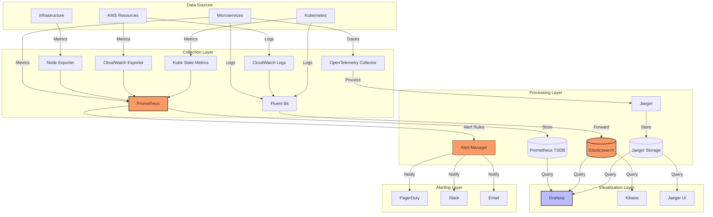
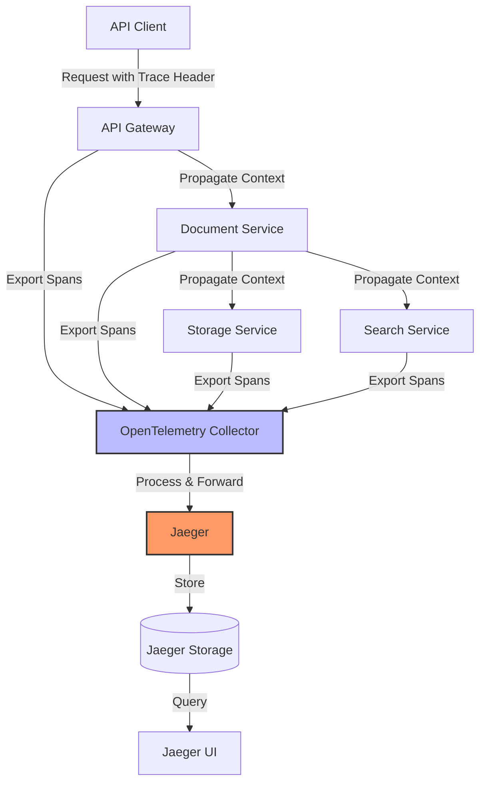
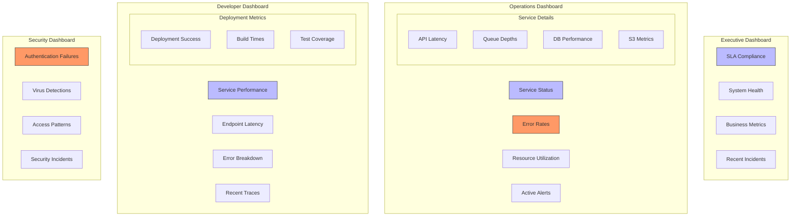
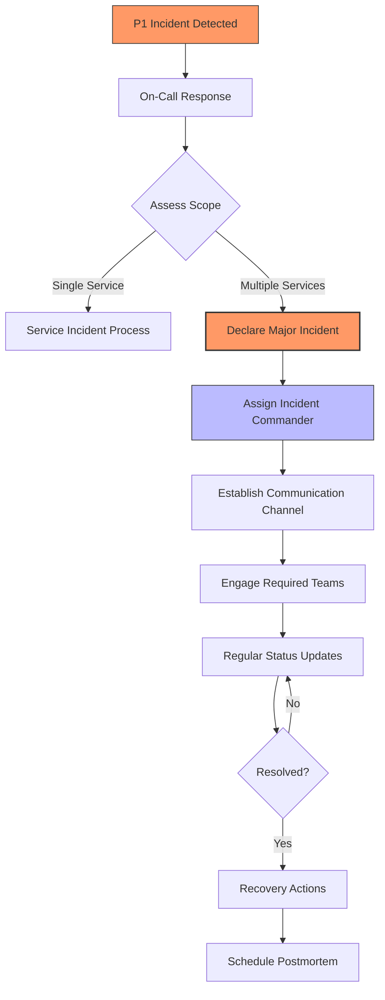
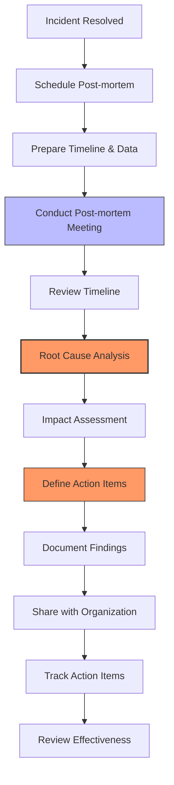
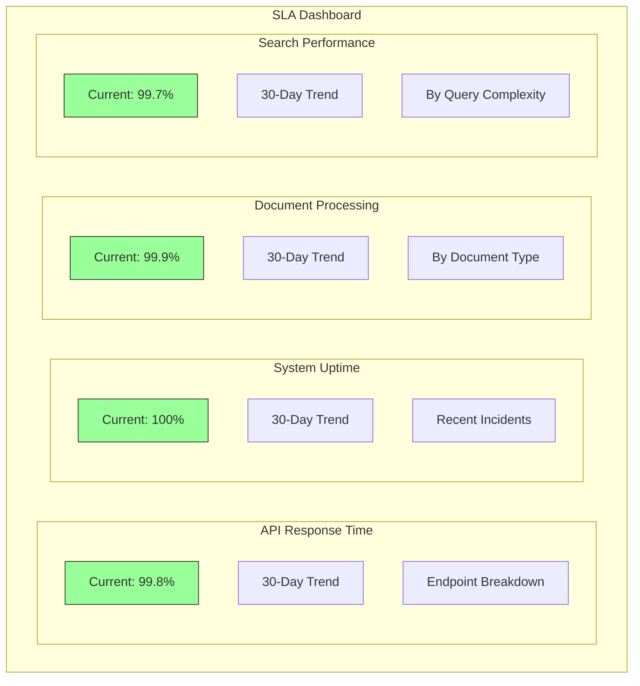
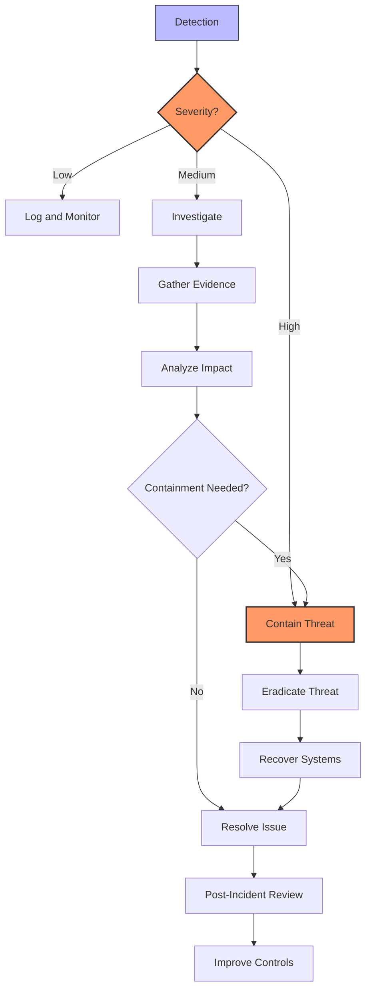
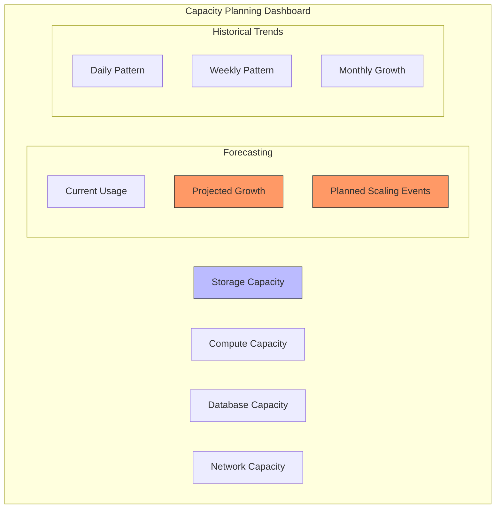

# Monitoring and Observability

## Introduction

This document provides comprehensive information about the monitoring and observability approach for the Document Management Platform. It covers metrics collection, log aggregation, distributed tracing, alerting, and incident response procedures. The monitoring infrastructure is designed to ensure 99.99% system uptime and meet the performance SLAs defined in the technical specifications.

## Monitoring Architecture

The Document Management Platform implements a comprehensive monitoring architecture that provides visibility into system health, performance, and business operations. The architecture follows a multi-layered approach with specialized tools for different observability aspects.

### Architecture Overview

The monitoring architecture consists of the following components:

- **Metrics Collection**: Prometheus for collecting and storing time-series metrics
- **Log Aggregation**: Fluent Bit for collecting logs and forwarding to Elasticsearch
- **Distributed Tracing**: Jaeger for tracking request flows across microservices
- **Visualization**: Grafana for dashboards and visualization
- **Alerting**: AlertManager for routing alerts to appropriate channels

All components are deployed in Kubernetes alongside the application services, with appropriate resource allocations and high availability configurations.



### Component Deployment

All monitoring components are deployed in the Kubernetes cluster using Helm charts with the following configuration approach:

- **High Availability**: Critical components (Prometheus, Elasticsearch, AlertManager) are deployed with multiple replicas
- **Resource Allocation**: Each component has appropriate CPU and memory requests/limits
- **Persistent Storage**: Time-series data and logs use persistent volumes with appropriate retention policies
- **Security**: All components use TLS for communication and authentication for access control

The monitoring stack is deployed in a dedicated namespace (`monitoring`) to isolate it from application workloads.

### Deployment Environments

The monitoring infrastructure is deployed across the following environments, each with specific configurations:

- **Development Environment**: Single-instance deployment with minimal resource allocation, primarily for testing monitoring configurations. Retention periods are shorter (7 days for metrics, 14 days for logs).

- **Staging Environment**: Multi-instance deployment with moderate resource allocation, mimicking production setup but at a smaller scale. Used for testing monitoring configurations before production deployment.

- **Production Environment**: Fully redundant deployment with high availability configurations. Multiple Prometheus instances, Elasticsearch cluster with 3+ nodes, and redundant alerting paths. Longer retention periods (30+ days for metrics, 90+ days for logs).

Each environment has environment-specific alerting thresholds and notification configurations to prevent alert fatigue from non-production environments.

## Metrics Collection

The Document Management Platform uses Prometheus as the primary metrics collection system. Prometheus implements a pull-based model where metrics endpoints exposed by services are scraped at regular intervals.

### Prometheus Configuration

Prometheus is configured with the following settings:

- **Scrape Interval**: 15 seconds for all targets
- **Evaluation Interval**: 15 seconds for alerting rules
- **Retention Period**: 15 days for time-series data
- **Storage**: Persistent volume with appropriate sizing

The configuration includes scrape jobs for all platform services, Kubernetes components, and AWS resources through exporters.

```yaml
global:
  scrape_interval: 15s
  evaluation_interval: 15s
  scrape_timeout: 10s

alerting:
  alertmanagers:
  - static_configs:
    - targets: ["alertmanager:9093"]
    scheme: http
    timeout: 5s
    api_version: v2

rule_files:
  - "alert-rules.yml"

scrape_configs:
  - job_name: "prometheus"
    static_configs:
    - targets: ["localhost:9090"]
  
  - job_name: "document-service"
    kubernetes_sd_configs:
    - role: service
      namespaces:
        names: ["document-mgmt-prod", "document-mgmt-staging", "document-mgmt-dev"]
    relabel_configs:
    - source_labels: ["__meta_kubernetes_service_label_app"]
      action: keep
      regex: document-service
    - source_labels: ["__meta_kubernetes_namespace"]
      target_label: namespace
    - source_labels: ["__meta_kubernetes_service_name"]
      target_label: service
```

### Metrics Instrumentation

All services in the Document Management Platform are instrumented to expose metrics endpoints with the following categories of metrics:

- **Service Metrics**: Request counts, error rates, latencies
- **Business Metrics**: Document uploads, downloads, searches
- **Resource Metrics**: CPU, memory, disk usage
- **Custom Metrics**: Domain-specific metrics like virus detection counts

Services expose metrics on the `/metrics` endpoint in Prometheus format, which is scraped by the Prometheus server.

```go
// Example of metrics instrumentation in Go service
func initMetrics() {
    // HTTP request metrics
    requestCounter = prometheus.NewCounterVec(
        prometheus.CounterOpts{
            Name: "http_requests_total",
            Help: "Total number of HTTP requests",
        },
        []string{"method", "endpoint", "status"},
    )
    
    // Request duration metrics
    requestDuration = prometheus.NewHistogramVec(
        prometheus.HistogramOpts{
            Name:    "http_request_duration_seconds",
            Help:    "HTTP request duration in seconds",
            Buckets: prometheus.DefBuckets,
        },
        []string{"method", "endpoint"},
    )
    
    // Document processing metrics
    documentProcessingDuration = prometheus.NewHistogramVec(
        prometheus.HistogramOpts{
            Name:    "document_processing_duration_seconds",
            Help:    "Document processing duration in seconds",
            Buckets: []float64{1, 5, 10, 30, 60, 120, 300, 600},
        },
        []string{"status"},
    )
    
    // Register metrics with Prometheus
    prometheus.MustRegister(requestCounter)
    prometheus.MustRegister(requestDuration)
    prometheus.MustRegister(documentProcessingDuration)
}
```

### AWS Integration

The monitoring system integrates with AWS services using the following approaches:

- **CloudWatch Exporter**: Collects metrics from AWS services (S3, SQS, RDS)
- **AWS SDK Metrics**: Application services expose AWS SDK metrics
- **Custom Exporters**: Specialized exporters for specific AWS services

This integration provides visibility into AWS resource utilization, costs, and performance metrics relevant to the Document Management Platform.

## Log Aggregation

The Document Management Platform implements a centralized logging architecture to collect, process, and analyze logs from all components. This architecture ensures that logs are consistently formatted, properly indexed, and easily searchable.

### Log Collection

Logs are collected using Fluent Bit deployed as a DaemonSet in the Kubernetes cluster. Fluent Bit collects logs from the following sources:

- **Container Logs**: All container stdout/stderr logs
- **System Logs**: Host-level system logs
- **Application Logs**: Structured logs from application services

Fluent Bit is configured to parse, filter, and enrich logs before forwarding them to Elasticsearch.

```ini
[SERVICE]
    Flush        5
    Log_Level    info
    Parsers_File parsers.conf
    HTTP_Server  On
    HTTP_Listen  0.0.0.0
    HTTP_Port    2020

[INPUT]
    Name         tail
    Tag          kube.*
    Path         /var/log/containers/*.log
    Parser       docker
    DB           /var/log/flb_kube.db
    Mem_Buf_Limit 5MB
    Skip_Long_Lines On
    Refresh_Interval 10

[FILTER]
    Name         kubernetes
    Match        kube.*
    Kube_URL     https://kubernetes.default.svc:443
    Kube_CA_File /var/run/secrets/kubernetes.io/serviceaccount/ca.crt
    Kube_Token_File /var/run/secrets/kubernetes.io/serviceaccount/token
    Merge_Log    On
    K8S-Logging.Parser On
    K8S-Logging.Exclude On

[FILTER]
    Name         parser
    Match        kube.var.log.containers.document-*.log
    Key_Name     log
    Parser       json
    Reserve_Data True

[OUTPUT]
    Name         es
    Match        kube.*
    Host         ${ELASTICSEARCH_HOST}
    Port         ${ELASTICSEARCH_PORT}
    HTTP_User    ${ELASTICSEARCH_USER}
    HTTP_Passwd  ${ELASTICSEARCH_PASSWORD}
    TLS          On
    TLS.Verify   On
    Logstash_Format On
    Logstash_Prefix document-mgmt-logs
    Time_Key     @timestamp
    Retry_Limit  5
    Buffer_Size  10MB
```

### Log Storage and Indexing

Logs are stored in Elasticsearch with the following configuration:

- **Index Pattern**: Time-based indices with daily rotation
- **Retention Policy**: 30 days for standard logs, 1 year for audit logs
- **Mapping Templates**: Custom mappings for structured log fields
- **Index Lifecycle Management**: Automated index management policies

Elasticsearch provides full-text search capabilities and efficient storage for log data, enabling quick troubleshooting and analysis.

```json
{
  "index_patterns": ["document-mgmt-logs-*"],
  "template": {
    "settings": {
      "number_of_shards": 3,
      "number_of_replicas": 1,
      "index.lifecycle.name": "document-mgmt-logs-policy",
      "index.lifecycle.rollover_alias": "document-mgmt-logs"
    },
    "mappings": {
      "properties": {
        "@timestamp": { "type": "date" },
        "kubernetes": {
          "properties": {
            "namespace_name": { "type": "keyword" },
            "pod_name": { "type": "keyword" },
            "container_name": { "type": "keyword" },
            "labels": { "type": "object" }
          }
        },
        "level": { "type": "keyword" },
        "message": { "type": "text" },
        "tenant_id": { "type": "keyword" },
        "user_id": { "type": "keyword" },
        "document_id": { "type": "keyword" },
        "request_id": { "type": "keyword" },
        "trace_id": { "type": "keyword" },
        "span_id": { "type": "keyword" }
      }
    }
  }
}
```

### Log Visualization

Logs are visualized using Kibana with the following features:

- **Dashboards**: Pre-configured dashboards for different service types
- **Discover**: Interactive log exploration and filtering
- **Alerts**: Log-based alerting for critical patterns
- **Saved Searches**: Common queries for quick access

Kibana provides a user-friendly interface for log analysis, with role-based access control to ensure appropriate access to log data.

### Structured Logging

All services in the Document Management Platform use structured logging with a consistent JSON format. The log format includes the following standard fields:

- **timestamp**: ISO 8601 timestamp
- **level**: Log level (debug, info, warn, error, fatal)
- **message**: Human-readable log message
- **service**: Service name
- **tenant_id**: Tenant identifier for multi-tenancy
- **request_id**: Unique request identifier
- **trace_id**: Distributed tracing identifier
- **span_id**: Span identifier for tracing
- **user_id**: User identifier (when available)
- **additional_context**: Service-specific context data

This structured format enables consistent parsing, filtering, and correlation of logs across the platform.

```go
// Example of structured logging in Go service
func initLogger() *zap.Logger {
    logConfig := zap.NewProductionConfig()
    logConfig.EncoderConfig.TimeKey = "timestamp"
    logConfig.EncoderConfig.EncodeTime = zapcore.ISO8601TimeEncoder
    
    logger, err := logConfig.Build()
    if err != nil {
        panic("Failed to initialize logger: " + err.Error())
    }
    
    return logger
}

func logRequest(logger *zap.Logger, r *http.Request, tenantID, userID string) *zap.Logger {
    requestID := r.Header.Get("X-Request-ID")
    if requestID == "" {
        requestID = uuid.New().String()
    }
    
    traceID := r.Header.Get("X-Trace-ID")
    spanID := r.Header.Get("X-Span-ID")
    
    return logger.With(
        zap.String("request_id", requestID),
        zap.String("trace_id", traceID),
        zap.String("span_id", spanID),
        zap.String("tenant_id", tenantID),
        zap.String("user_id", userID),
        zap.String("method", r.Method),
        zap.String("path", r.URL.Path),
    )
}
```

## Distributed Tracing

The Document Management Platform implements distributed tracing to understand request flows across microservices. This capability is essential for troubleshooting performance issues and understanding service dependencies.

### Tracing Architecture

The distributed tracing architecture consists of the following components:

- **Jaeger**: Main tracing backend for collection, storage, and visualization
- **OpenTelemetry**: Instrumentation library for generating traces
- **W3C Trace Context**: Standard for propagating trace context between services

Traces are collected with a 10% sampling rate to balance observability and performance impact.



### Jaeger Configuration

Jaeger is configured with the following settings:

- **Collector**: Multiple replicas for high availability
- **Storage**: Elasticsearch for trace storage
- **Retention**: 72 hours for trace data
- **Sampling**: Probabilistic sampling at 10% rate
- **UI**: Custom UI configuration with Document Management Platform branding

The configuration ensures efficient trace collection and storage while providing a user-friendly interface for trace analysis.

```yaml
version: "1.38.0"
service_name: "document-mgmt-platform"

collector:
  replicas: 2
  resources:
    limits:
      cpu: "1"
      memory: "1Gi"
    requests:
      cpu: "500m"
      memory: "512Mi"
  ports:
    grpc: 14250
    http: 14268
    zipkin: 9411
  options:
    log-level: "info"
    collector.queue-size: 1000
    collector.num-workers: 50

sampling:
  default_strategy:
    type: "probabilistic"
    param: 0.1
  service_strategies:
    - service: "document-service"
      type: "probabilistic"
      param: 0.1
    - service: "storage-service"
      type: "probabilistic"
      param: 0.1
    - service: "search-service"
      type: "probabilistic"
      param: 0.1

storage:
  type: "elasticsearch"
  elasticsearch:
    server-urls: "http://elasticsearch:9200"
    username: "${ES_USERNAME}"
    password: "${ES_PASSWORD}"
    index-prefix: "jaeger"
    max-span-age: "72h"
```

### Service Instrumentation

All services in the Document Management Platform are instrumented for distributed tracing using OpenTelemetry. The instrumentation includes:

- **HTTP Middleware**: Automatically traces incoming and outgoing HTTP requests
- **Database Calls**: Traces database operations with query information
- **AWS SDK Calls**: Traces AWS service calls
- **Custom Spans**: Manual instrumentation for business logic

Trace context is propagated between services using W3C Trace Context headers, ensuring consistent tracing across the entire request flow.

```go
// Example of tracing instrumentation in Go service
func initTracer() *trace.Tracer {
    exporter, err := jaeger.NewRawExporter(
        jaeger.WithCollectorEndpoint(jaeger.WithEndpoint("http://jaeger-collector:14268/api/traces")),
        jaeger.WithProcess(jaeger.Process{
            ServiceName: "document-service",
            Tags: []label.KeyValue{
                label.String("environment", os.Getenv("ENVIRONMENT")),
            },
        }),
    )
    if err != nil {
        log.Fatalf("Failed to create Jaeger exporter: %v", err)
    }
    
    tp := trace.NewTracerProvider(
        trace.WithBatcher(exporter),
        trace.WithSampler(trace.TraceIDRatioBased(0.1)),
    )
    
    otel.SetTracerProvider(tp)
    otel.SetTextMapPropagator(propagation.NewCompositeTextMapPropagator(
        propagation.TraceContext{},
        propagation.Baggage{},
    ))
    
    return tp.Tracer("document-service")
}

func tracingMiddleware(next http.Handler) http.Handler {
    return http.HandlerFunc(func(w http.ResponseWriter, r *http.Request) {
        ctx := r.Context()
        propagator := otel.GetTextMapPropagator()
        ctx = propagator.Extract(ctx, propagation.HeaderCarrier(r.Header))
        
        tracer := otel.Tracer("document-service")
        ctx, span := tracer.Start(ctx, r.URL.Path, trace.WithSpanKind(trace.SpanKindServer))
        defer span.End()
        
        span.SetAttributes(
            attribute.String("http.method", r.Method),
            attribute.String("http.url", r.URL.String()),
            attribute.String("http.user_agent", r.UserAgent()),
        )
        
        // Extract tenant ID from context and add to span
        if tenantID := ctx.Value("tenant_id"); tenantID != nil {
            span.SetAttributes(attribute.String("tenant_id", tenantID.(string)))
        }
        
        // Serve the request with the trace context
        next.ServeHTTP(w, r.WithContext(ctx))
    })
}
```

### Trace Analysis

Traces are analyzed using the Jaeger UI, which provides the following capabilities:

- **Trace Timeline**: Visual representation of spans and their timing
- **Service Dependencies**: Graph of service interactions
- **Span Details**: Detailed information about each span
- **Trace Comparison**: Compare traces to identify performance differences

Trace analysis is used for performance troubleshooting, identifying bottlenecks, and understanding service dependencies.

## Alerting

The Document Management Platform implements a comprehensive alerting system to ensure timely notification of critical issues. Alerts are defined based on metrics, logs, and traces to provide complete coverage of potential issues.

### Alert Rules

Alert rules are defined in Prometheus using PromQL expressions. The rules cover the following categories:

- **Service Availability**: Alerts for service downtime or unreachability
- **Performance**: Alerts for high response times or latency
- **Error Rates**: Alerts for elevated error rates
- **Resource Utilization**: Alerts for high CPU, memory, or disk usage
- **Business Metrics**: Alerts for abnormal business metrics
- **Security**: Alerts for security-related events

Each alert includes appropriate thresholds, evaluation periods, and severity levels.

```yaml
groups:
- name: service_availability
  rules:
  - alert: ServiceDown
    expr: up{job=~"document-service|storage-service|search-service|folder-service|virus-scanning-service"} == 0
    for: 1m
    labels:
      severity: critical
    annotations:
      summary: "Service {{ $labels.job }} is down"
      description: "Service {{ $labels.job }} in namespace {{ $labels.namespace }} has been down for more than 1 minute."
      dashboard: "https://grafana.document-mgmt.com/d/api-dashboard"
      runbook: "https://runbooks.document-mgmt.com/service-down"

- name: api_performance
  rules:
  - alert: APIHighResponseTime
    expr: histogram_quantile(0.95, sum(rate(http_request_duration_seconds_bucket{job=~"document-service|storage-service|search-service|folder-service"}[5m])) by (job, le)) > 2
    for: 5m
    labels:
      severity: high
    annotations:
      summary: "High API response time for {{ $labels.job }}"
      description: "95th percentile response time for {{ $labels.job }} is above 2 seconds for more than 5 minutes."
      dashboard: "https://grafana.document-mgmt.com/d/api-dashboard"
      runbook: "https://runbooks.document-mgmt.com/high-response-time"

- name: sla_compliance
  rules:
  - alert: APIResponseTimeSLABreach
    expr: histogram_quantile(0.99, sum(rate(http_request_duration_seconds_bucket[1h])) by (le)) > 2
    for: 5m
    labels:
      severity: critical
    annotations:
      summary: "API response time SLA breach"
      description: "99th percentile API response time is above 2 seconds for more than 5 minutes, breaching the SLA."
      dashboard: "https://grafana.document-mgmt.com/d/sla-dashboard"
      runbook: "https://runbooks.document-mgmt.com/sla-breach-response-time"
```

### Alert Routing

Alerts are routed to appropriate notification channels using AlertManager. The routing configuration includes:

- **Severity-Based Routing**: Different channels based on alert severity
- **Team-Based Routing**: Routing to specialized teams for specific alert types
- **Time-Based Routing**: Different routing during business hours vs. off-hours
- **Escalation**: Automatic escalation for unacknowledged alerts

This ensures that alerts reach the right people at the right time for prompt resolution.

```yaml
global:
  resolve_timeout: 5m
  smtp_smarthost: "smtp.example.com:587"
  smtp_from: "alertmanager@document-mgmt.com"
  smtp_auth_username: "alertmanager"
  smtp_auth_password: "${SMTP_PASSWORD}"
  smtp_require_tls: true
  pagerduty_url: "https://events.pagerduty.com/v2/enqueue"
  slack_api_url: "${SLACK_API_URL}"

route:
  receiver: operations-team
  group_by: [alertname, job, severity]
  group_wait: 30s
  group_interval: 5m
  repeat_interval: 4h
  routes:
  - matchers: [severity=critical]
    receiver: pagerduty-critical
    group_wait: 0s
    group_interval: 1m
    repeat_interval: 30m
    continue: true
  - matchers: [severity=high]
    receiver: pagerduty-high
    group_wait: 30s
    group_interval: 5m
    repeat_interval: 1h
    continue: true
  - matchers: [alertname=~"Virus.*|.*Auth.*|.*Access.*"]
    receiver: security-team
    group_wait: 0s
    group_interval: 1m
    repeat_interval: 30m
    continue: true
  - matchers: [alertname=~".*PostgreSQL.*|.*Elasticsearch.*"]
    receiver: database-team
    group_wait: 30s
    group_interval: 5m
    repeat_interval: 1h
    continue: true
```

### Notification Channels

Alerts are sent to the following notification channels:

- **PagerDuty**: For critical and high-severity alerts requiring immediate attention
- **Slack**: For team-specific channels and general alerts
- **Email**: For non-urgent notifications and daily digests
- **Webhook**: For integration with other systems

Each channel is configured with appropriate templates, throttling, and delivery guarantees.

```yaml
receivers:
- name: operations-team
  slack_configs:
  - channel: "#ops-alerts"
    send_resolved: true
    title: "{{ template \"slack.default.title\" . }}"
    text: "{{ template \"slack.default.text\" . }}"
    footer: "{{ template \"slack.default.footer\" . }}"

- name: pagerduty-critical
  pagerduty_configs:
  - service_key: "${PAGERDUTY_CRITICAL_KEY}"
    description: "{{ .CommonAnnotations.summary }}"
    details:
      severity: "{{ .CommonLabels.severity }}"
      description: "{{ .CommonAnnotations.description }}"
      instance: "{{ .CommonLabels.instance }}"
      job: "{{ .CommonLabels.job }}"
    client: "AlertManager"
    client_url: "{{ template \"pagerduty.default.clientURL\" . }}"
    severity: "critical"
  slack_configs:
  - channel: "#incidents"
    send_resolved: true
    title: "{{ template \"slack.default.title\" . }}"
    text: "{{ template \"slack.default.text\" . }}"
    footer: "{{ template \"slack.default.footer\" . }}"
```

### Alert Severity Levels

Alerts are classified into the following severity levels:

- **Critical**: Service outage or SLA breach requiring immediate attention
- **High**: Significant performance degradation or potential service impact
- **Medium**: Issues requiring attention but not affecting service
- **Low**: Informational alerts for awareness

Each severity level has associated response times, escalation procedures, and notification channels.

| Severity | Response Time | Escalation Time | Primary Channel | Secondary Channel |
| -------- | ------------- | --------------- | --------------- | ----------------- |
| Critical | Immediate | 15 minutes | PagerDuty | Slack #incidents |
| High | 15 minutes | 30 minutes | PagerDuty | Slack #alerts |
| Medium | 2 hours | None | Slack #alerts | None |
| Low | Next business day | None | Email | None |

## Dashboards

The Document Management Platform provides comprehensive dashboards for monitoring system health, performance, and business metrics. Dashboards are implemented in Grafana with appropriate access controls.

### Dashboard Categories

Dashboards are organized into the following categories:

- **Service Dashboards**: Per-service operational metrics
- **Business Dashboards**: Business metrics and KPIs
- **Infrastructure Dashboards**: Kubernetes and AWS resource metrics
- **SLA Dashboards**: SLA compliance monitoring
- **Security Dashboards**: Security-related metrics and events

Each category contains multiple dashboards focused on specific aspects of the system.

| Category | Dashboard | Purpose | Primary Audience |
| -------- | --------- | ------- | ---------------- |
| Service | API Gateway | API performance and traffic | Operations |
| Service | Document Service | Document processing metrics | Operations |
| Service | Search Service | Search performance and usage | Operations |
| Business | Document Metrics | Upload/download volumes and trends | Product/Business |
| Business | Tenant Activity | Tenant usage patterns | Product/Business |
| Infrastructure | Kubernetes | Cluster health and resource usage | Operations |
| Infrastructure | Database | PostgreSQL performance | Operations |
| SLA | SLA Compliance | SLA tracking and compliance | Operations/Management |
| Security | Security Events | Authentication, authorization, virus detection | Security |

### Dashboard Design

Dashboards follow a consistent design approach with the following principles:

- **Hierarchical Information**: Overview panels with drill-down capabilities
- **Consistent Layout**: Similar metrics positioned consistently across dashboards
- **Color Coding**: Consistent color schemes for status and metrics
- **Thresholds**: Visual indicators for warning and critical thresholds
- **Time Range Control**: Flexible time range selection

This approach ensures that dashboards are intuitive and provide quick access to relevant information.



### API Gateway Dashboard

The API Gateway Dashboard provides comprehensive monitoring of API performance, traffic, and errors. Key panels include:

- **Overview**: Current status, error rate, and response time
- **Traffic**: Request rate by service and status code
- **Performance**: Response time percentiles and trends
- **Endpoints**: Top endpoints by usage and latency
- **SLA Compliance**: SLA metrics and compliance status
- **Resources**: CPU, memory, and network usage

This dashboard is the primary entry point for monitoring API health and performance.


### Document Service Dashboard

The Document Service Dashboard focuses on document processing metrics and performance. Key panels include:

- **Document Processing**: Upload volume, processing time, success rate
- **Virus Scanning**: Scan results, detection rate, quarantine count
- **Storage Metrics**: S3 usage, document size distribution
- **Queue Metrics**: Processing queue depth and latency
- **Error Breakdown**: Processing errors by type and frequency

This dashboard provides visibility into the core document management functionality of the platform.


## Incident Response

The Document Management Platform implements a structured incident response process to ensure timely resolution of issues. This process is integrated with the monitoring and alerting system to provide a seamless workflow from detection to resolution.

### Alert Response Workflow

The alert response workflow follows these steps:

1. **Detection**: Alert triggered based on monitoring thresholds
2. **Notification**: Alert routed to appropriate team/individual
3. **Acknowledgment**: Responder acknowledges the alert
4. **Investigation**: Responder investigates the issue using monitoring tools
5. **Mitigation**: Immediate actions to mitigate the impact
6. **Resolution**: Permanent fix for the issue
7. **Post-mortem**: Analysis of the incident and improvement actions

This workflow ensures a consistent and effective response to all incidents.

```mermaid
flowchart TD
    Alert[Alert Triggered] --> Classify{Alert Type}
    
    Classify -->|Availability| P1[P1 - Critical]
    Classify -->|Performance| Severity{Severity}
    Classify -->|Security| P1
    Classify -->|Data| P2[P2 - High]
    
    Severity -->|Major| P1
    Severity -->|Minor| P2
    
    P1 --> OnCall[Primary On-Call]
    P1 --> Slack1[#incidents Channel]
    
    P2 --> OnCall
    P2 --> Slack2[#alerts Channel]
    
    OnCall --> Ack{Acknowledged?}
    
    Ack -->|No (15min)| Escalate1[Escalate to Secondary]
    Ack -->|Yes| Resolve{Resolved?}
    
    Escalate1 --> Ack2{Acknowledged?}
    Ack2 -->|No (15min)| Escalate2[Escalate to Manager]
    Ack2 -->|Yes| Resolve
    
    Resolve -->|Yes| Close[Close Alert]
    Resolve -->|No (SLA Breach)| Incident[Create Incident]
    
    style Alert fill:#bbf,stroke:#333,stroke-width:1px
    style Classify fill:#f96,stroke:#333,stroke-width:2px
    style P1 fill:#f96,stroke:#333,stroke-width:1px
    style Ack fill:#f96,stroke:#333,stroke-width:1px
```

### Incident Severity Levels

Incidents are classified into the following severity levels:

- **P1 (Critical)**: Service outage or severe degradation affecting all users
- **P2 (High)**: Partial service degradation affecting some users or functionality
- **P3 (Medium)**: Minor issues with limited impact on users
- **P4 (Low)**: Cosmetic issues or improvements

Each severity level has associated response times, escalation procedures, and communication requirements.

| Severity | Description | Response Time | Escalation Path | Communication |
| -------- | ----------- | ------------- | --------------- | ------------- |
| P1 | Service outage or severe degradation | Immediate | On-call → Team Lead → Engineering Manager → CTO | Status page, all stakeholders |
| P2 | Partial service degradation | 30 minutes | On-call → Team Lead → Engineering Manager | Status page, affected stakeholders |
| P3 | Minor issues with limited impact | 2 hours | On-call → Team Lead | Internal notification |
| P4 | Cosmetic issues or improvements | Next business day | Standard ticket | None |

### Escalation Procedures

The escalation procedures ensure that incidents receive appropriate attention based on their severity and duration. The escalation path typically follows:

1. **Primary On-Call**: Initial responder for all alerts
2. **Secondary On-Call**: Escalated if primary doesn't respond within 15 minutes
3. **Team Lead**: Escalated for P1/P2 incidents lasting more than 30 minutes
4. **Engineering Manager**: Escalated for P1 incidents lasting more than 1 hour
5. **CTO**: Escalated for P1 incidents lasting more than 2 hours

Escalation can also be manually triggered if additional expertise or authority is required.



### Runbooks

Runbooks provide step-by-step procedures for diagnosing and resolving common issues. Each alert is linked to a specific runbook that includes:

- **Diagnostic Steps**: How to investigate the issue
- **Mitigation Actions**: Immediate steps to reduce impact
- **Resolution Steps**: How to permanently fix the issue
- **Verification**: How to verify the issue is resolved
- **Related Resources**: Links to dashboards, logs, and documentation

Runbooks are maintained in a central repository and regularly updated based on incident learnings.

```markdown
# Service Down Runbook

## Alert Details
- **Alert Name**: ServiceDown
- **Severity**: Critical (P1)
- **Description**: Service is not responding or has crashed

## Diagnostic Steps
1. Check Kubernetes pod status: `kubectl get pods -n <namespace> | grep <service-name>`
2. Check pod logs: `kubectl logs <pod-name> -n <namespace>`
3. Check recent deployments: `kubectl rollout history deployment/<service-name> -n <namespace>`
4. Check resource utilization in Grafana dashboard: [Service Dashboard](https://grafana.document-mgmt.com/d/service-dashboard)

## Mitigation Actions
1. If recently deployed, rollback: `kubectl rollout undo deployment/<service-name> -n <namespace>`
2. If resource constrained, scale up: `kubectl scale deployment/<service-name> --replicas=<n> -n <namespace>`
3. If deadlocked, restart: `kubectl rollout restart deployment/<service-name> -n <namespace>`

## Resolution Steps
1. Analyze logs to determine root cause
2. Check error patterns in Elasticsearch
3. Review recent code changes that might have caused the issue
4. Implement fix and deploy through standard CI/CD pipeline

## Verification
1. Confirm pods are running: `kubectl get pods -n <namespace> | grep <service-name>`
2. Verify service is responding to health checks
3. Check alert has resolved in AlertManager
4. Verify functionality through API tests

## Related Resources
- [Service Dashboard](https://grafana.document-mgmt.com/d/service-dashboard)
- [Logs Query](https://kibana.document-mgmt.com/app/discover#/)
- [Deployment History](https://github.com/organization/repo/actions)
```

### Post-mortem Process

All P1 and P2 incidents require a post-mortem analysis to identify root causes and prevent recurrence. The post-mortem process includes:

1. **Incident Timeline**: Detailed sequence of events
2. **Root Cause Analysis**: Investigation of underlying causes
3. **Impact Assessment**: Quantification of business impact
4. **Action Items**: Specific improvements to prevent recurrence
5. **Lessons Learned**: General learnings from the incident

Post-mortems follow a blameless approach, focusing on system improvements rather than individual mistakes.



## SLA Monitoring

The Document Management Platform implements dedicated SLA monitoring to ensure compliance with service level agreements. SLA monitoring focuses on key performance indicators defined in the technical specifications.

### SLA Definitions

The platform has the following SLA targets:

- **API Response Time**: 99% of requests < 2 seconds
- **System Uptime**: 99.99% availability
- **Document Processing**: 99% of documents processed within 5 minutes
- **Search Performance**: 99% of searches completed within 2 seconds

These SLAs are monitored continuously and reported on a daily and monthly basis.

| SLA Type | Target | Measurement Method | Reporting Frequency |
| -------- | ------ | ------------------ | ------------------ |
| API Response Time | 99% < 2 seconds | Percentile tracking | Real-time + Daily reports |
| System Uptime | 99.99% | Synthetic monitoring | Daily + Monthly reports |
| Document Processing | 99% < 5 minutes | Process tracking | Real-time + Daily reports |
| Search Performance | 99% < 2 seconds | Query timing | Real-time + Daily reports |

### SLA Dashboard

The SLA Dashboard provides real-time visibility into SLA compliance. The dashboard includes:

- **Current SLA Status**: Real-time compliance indicators
- **Historical Trends**: SLA performance over time
- **Breach Analysis**: Details of any SLA breaches
- **Component Breakdown**: SLA performance by service

The dashboard is accessible to operations teams and stakeholders for transparency in service quality.



### SLA Alerting

SLA breaches trigger immediate alerts to ensure prompt attention. SLA alerts include:

- **SLA Breach Alerts**: Triggered when SLA thresholds are crossed
- **SLA Warning Alerts**: Triggered when approaching SLA thresholds
- **SLA Trend Alerts**: Triggered for negative trends in SLA metrics

These alerts are routed to operations teams with high priority to ensure quick resolution.

```yaml
- name: sla_compliance
  rules:
  - alert: APIResponseTimeSLABreach
    expr: histogram_quantile(0.99, sum(rate(http_request_duration_seconds_bucket[1h])) by (le)) > 2
    for: 5m
    labels:
      severity: critical
    annotations:
      summary: "API response time SLA breach"
      description: "99th percentile API response time is above 2 seconds for more than 5 minutes, breaching the SLA."
      dashboard: "https://grafana.document-mgmt.com/d/sla-dashboard"
      runbook: "https://runbooks.document-mgmt.com/sla-breach-response-time"
  
  - alert: DocumentProcessingSLABreach
    expr: histogram_quantile(0.99, sum(rate(document_processing_duration_seconds_bucket[1h])) by (le)) > 300
    for: 5m
    labels:
      severity: critical
    annotations:
      summary: "Document processing SLA breach"
      description: "99th percentile document processing time is above 5 minutes (300 seconds) for more than 5 minutes, breaching the SLA."
      dashboard: "https://grafana.document-mgmt.com/d/sla-dashboard"
      runbook: "https://runbooks.document-mgmt.com/sla-breach-processing"
```

### SLA Reporting

SLA performance is reported through automated reports with the following details:

- **Compliance Summary**: Overall SLA compliance percentages
- **Breach Details**: Information about any SLA breaches
- **Trend Analysis**: Performance trends over time
- **Improvement Actions**: Steps taken to address SLA issues

Reports are generated daily and monthly, with distribution to relevant stakeholders.

## Security Monitoring

The Document Management Platform implements comprehensive security monitoring to detect and respond to security threats. Security monitoring is integrated with the overall monitoring architecture while providing specialized capabilities for security events.

### Security Metrics

Security-specific metrics are collected and monitored, including:

- **Authentication Failures**: Failed login attempts and JWT validation failures
- **Authorization Failures**: Access denied events and permission violations
- **Virus Detections**: Malware identified in uploaded documents
- **Cross-Tenant Access Attempts**: Attempts to access data across tenant boundaries
- **Unusual Access Patterns**: Deviations from normal access patterns

These metrics provide visibility into potential security incidents and compliance with security policies.

```go
// Example of security metrics instrumentation in Go service
func initSecurityMetrics() {
    // Authentication failure metrics
    authFailures = prometheus.NewCounterVec(
        prometheus.CounterOpts{
            Name: "authentication_failures_total",
            Help: "Total number of authentication failures",
        },
        []string{"reason", "source_ip"},
    )
    
    // Authorization failure metrics
    authzFailures = prometheus.NewCounterVec(
        prometheus.CounterOpts{
            Name: "authorization_failures_total",
            Help: "Total number of authorization failures",
        },
        []string{"resource_type", "operation", "tenant_id"},
    )
    
    // Cross-tenant access attempt metrics
    crossTenantAttempts = prometheus.NewCounterVec(
        prometheus.CounterOpts{
            Name: "cross_tenant_access_attempts_total",
            Help: "Total number of cross-tenant access attempts",
        },
        []string{"source_tenant_id", "target_tenant_id", "resource_type"},
    )
    
    // Virus detection metrics
    virusDetections = prometheus.NewCounterVec(
        prometheus.CounterOpts{
            Name: "virus_detected_total",
            Help: "Total number of viruses detected in uploaded documents",
        },
        []string{"virus_type", "tenant_id"},
    )
    
    // Register metrics with Prometheus
    prometheus.MustRegister(authFailures)
    prometheus.MustRegister(authzFailures)
    prometheus.MustRegister(crossTenantAttempts)
    prometheus.MustRegister(virusDetections)
}
```

### Security Alerts

Security-specific alerts are configured to detect potential security incidents. These alerts include:

- **Authentication Anomalies**: Unusual patterns of authentication failures
- **Authorization Violations**: Repeated access attempts to unauthorized resources
- **Virus Detections**: Immediate alerts for malware in uploaded documents
- **Cross-Tenant Access**: Attempts to access data across tenant boundaries
- **Configuration Changes**: Unauthorized changes to security configurations

Security alerts are routed to the security team with appropriate severity levels.

```yaml
- name: security_alerts
  rules:
  - alert: VirusDetected
    expr: increase(virus_detected_total[5m]) > 0
    for: 0m
    labels:
      severity: critical
    annotations:
      summary: "Virus detected in uploaded document"
      description: "A virus has been detected in an uploaded document in namespace {{ $labels.namespace }}."
      dashboard: "https://grafana.document-mgmt.com/d/security-dashboard"
      runbook: "https://runbooks.document-mgmt.com/virus-detected"
  
  - alert: AuthenticationFailuresHigh
    expr: sum(increase(authentication_failures_total[15m])) by (job) > 10
    for: 5m
    labels:
      severity: high
    annotations:
      summary: "High authentication failures for {{ $labels.job }}"
      description: "Service {{ $labels.job }} has more than 10 authentication failures in the last 15 minutes."
      dashboard: "https://grafana.document-mgmt.com/d/security-dashboard"
      runbook: "https://runbooks.document-mgmt.com/auth-failures"
  
  - alert: CrossTenantAccessAttempt
    expr: increase(cross_tenant_access_attempts_total[5m]) > 0
    for: 0m
    labels:
      severity: critical
    annotations:
      summary: "Cross-tenant access attempt detected"
      description: "A cross-tenant access attempt has been detected in service {{ $labels.job }}."
      dashboard: "https://grafana.document-mgmt.com/d/security-dashboard"
      runbook: "https://runbooks.document-mgmt.com/cross-tenant-access"
```

### Security Dashboard

The Security Dashboard provides specialized views for security monitoring. The dashboard includes:

- **Authentication Metrics**: Login attempts, failures, and success rates
- **Authorization Metrics**: Access attempts, permissions checks, and violations
- **Virus Scanning**: Scan results, detection rates, and quarantine status
- **Tenant Isolation**: Cross-tenant access attempts and isolation metrics
- **Audit Logs**: Security-relevant events from all services

The Security Dashboard is accessible only to security personnel with appropriate permissions.


### Security Incident Response

Security incidents follow a specialized response workflow with the following steps:

1. **Detection**: Security alert triggered based on monitoring thresholds
2. **Triage**: Security team assesses the severity and scope
3. **Containment**: Immediate actions to contain the threat
4. **Investigation**: Detailed analysis of the incident
5. **Eradication**: Removal of the threat from the system
6. **Recovery**: Restoration of normal operations
7. **Post-incident Analysis**: Comprehensive review and improvements

Security incidents are handled by the security team with appropriate escalation to management and external parties as needed.



## Capacity Planning

The Document Management Platform implements capacity tracking and planning to ensure resources are appropriately provisioned for current and future needs. Capacity planning is based on monitoring data and growth projections.

### Resource Monitoring

Resource utilization is monitored across all components to identify capacity constraints. Monitored resources include:

- **Compute Resources**: CPU and memory usage by service
- **Storage Resources**: Document storage growth and database size
- **Network Resources**: Bandwidth usage and request rates
- **Database Resources**: Connection counts, query volumes, and storage

Resource monitoring provides the foundation for capacity planning decisions.



### Growth Forecasting

Growth forecasting uses historical monitoring data to predict future resource needs. Forecasting methods include:

- **Linear Regression**: For steady growth patterns
- **Time Series Analysis**: For seasonal or cyclical patterns
- **Scenario-Based Modeling**: For different business growth scenarios

Forecasts are updated monthly based on the latest monitoring data and business projections.

| Resource | Metrics Tracked | Forecasting Method | Scaling Trigger |
| -------- | --------------- | ------------------ | --------------- |
| Storage | Usage growth rate, available space | Linear regression | 70% utilization |
| Compute | CPU/memory trends, request volume | Time-series analysis | 75% sustained utilization |
| Database | Connection count, query volume, storage | Growth pattern analysis | 70% utilization |
| Network | Bandwidth usage, request rate | Peak analysis | 60% of capacity |

### Scaling Policies

Scaling policies define when and how resources are scaled based on monitoring data. Policies include:

- **Horizontal Scaling**: Adding more instances of services
- **Vertical Scaling**: Increasing resources for existing instances
- **Storage Scaling**: Expanding storage capacity
- **Database Scaling**: Scaling database resources

Scaling can be automatic (based on monitoring triggers) or planned (based on forecasts).

```yaml
# Example Kubernetes HPA configuration
apiVersion: autoscaling/v2
kind: HorizontalPodAutoscaler
metadata:
  name: document-service
  namespace: document-mgmt-prod
spec:
  scaleTargetRef:
    apiVersion: apps/v1
    kind: Deployment
    name: document-service
  minReplicas: 3
  maxReplicas: 10
  metrics:
  - type: Resource
    resource:
      name: cpu
      target:
        type: Utilization
        averageUtilization: 70
  - type: Resource
    resource:
      name: memory
      target:
        type: Utilization
        averageUtilization: 80
  - type: Pods
    pods:
      metric:
        name: http_requests_per_second
      target:
        type: AverageValue
        averageValue: 100
  behavior:
    scaleUp:
      stabilizationWindowSeconds: 60
      policies:
      - type: Percent
        value: 100
        periodSeconds: 60
    scaleDown:
      stabilizationWindowSeconds: 300
      policies:
      - type: Percent
        value: 10
        periodSeconds: 60
```

### Capacity Reviews

Regular capacity reviews ensure that resources are appropriately provisioned. Reviews include:

- **Current Utilization**: Analysis of current resource usage
- **Growth Trends**: Review of growth patterns and forecasts
- **Performance Impact**: Assessment of performance metrics
- **Cost Analysis**: Evaluation of resource costs and optimization opportunities
- **Scaling Recommendations**: Specific recommendations for scaling actions

Capacity reviews are conducted monthly with participation from operations and engineering teams.

## Monitoring Best Practices

The Document Management Platform follows established monitoring best practices to ensure effective observability and incident response.

### Instrumentation Guidelines

All services follow these instrumentation guidelines:

- **Consistent Metrics**: Standardized naming and labeling conventions
- **Appropriate Granularity**: Sufficient detail without excessive cardinality
- **Performance Impact**: Minimal overhead from instrumentation
- **Coverage**: Comprehensive instrumentation of all critical paths
- **Context Propagation**: Consistent propagation of request context

These guidelines ensure that monitoring data is consistent, comprehensive, and useful for troubleshooting.

```go
// Example of metrics naming and labeling conventions

// Metric naming convention: service_subsystem_metric_unit
// Examples:
// - http_requests_total (counter)  
// - http_request_duration_seconds (histogram)
// - document_processing_duration_seconds (histogram)
// - document_size_bytes (histogram)

// Label naming convention: snake_case
// Common labels:
// - service: Service name
// - namespace: Kubernetes namespace
// - instance: Instance identifier
// - tenant_id: Tenant identifier
// - status: HTTP status code or operation status
// - method: HTTP method
// - endpoint: API endpoint

// Cardinality guidelines:
// - Keep label values bounded (e.g., use status code families like 2xx instead of individual codes)
// - Avoid using high-cardinality labels like user_id or document_id in metrics
// - Use bucketing for histograms with appropriate bucket boundaries
```

### Alert Design Principles

Alerts follow these design principles:

- **Actionability**: Every alert should be actionable
- **Clarity**: Clear description of the issue and required actions
- **Precision**: Minimize false positives and alert fatigue
- **Prioritization**: Appropriate severity levels for different issues
- **Context**: Include relevant context for troubleshooting

These principles ensure that alerts are effective and lead to prompt resolution of issues.

| Principle | Good Example | Bad Example |
| --------- | ------------ | ----------- |
| Actionability | "Document service pod crash looping - check logs and recent deployments" | "Document service issue detected" |
| Clarity | "API response time > 2s for search endpoint - check Elasticsearch performance" | "High latency detected" |
| Precision | Alert on 95th percentile > threshold for 5 minutes | Alert on any single request > threshold |
| Prioritization | Critical severity for service outage, medium for performance degradation | Same severity for all issues |
| Context | Include links to dashboards, logs, and runbooks | No additional context provided |

### Dashboard Design Guidelines

Dashboards follow these design guidelines:

- **Purpose-Oriented**: Focused on specific use cases or audiences
- **Hierarchical Information**: Overview with drill-down capabilities
- **Visual Clarity**: Clear visualization of key metrics and status
- **Consistency**: Similar metrics positioned consistently across dashboards
- **Performance**: Efficient queries that don't overload monitoring systems

These guidelines ensure that dashboards are intuitive and provide quick access to relevant information.

### Monitoring as Code

The monitoring configuration follows the "Monitoring as Code" approach with the following practices:

- **Version Control**: All monitoring configurations in Git
- **Automated Deployment**: CI/CD pipeline for monitoring changes
- **Testing**: Validation of monitoring configurations before deployment
- **Documentation**: Inline documentation of monitoring components
- **Reusability**: Templated configurations for consistent monitoring

This approach ensures that monitoring configurations are consistent, reproducible, and properly managed.

```yaml
# Example of Prometheus alert rule template
{{ define "node_alerts" }}
groups:
- name: node_alerts
  rules:
  - alert: NodeHighCPU
    expr: avg by (instance) (rate(node_cpu_seconds_total{mode!="idle"}[5m])) > {{ .Values.thresholds.node.cpu }}
    for: 5m
    labels:
      severity: {{ .Values.severities.node.cpu }}
    annotations:
      summary: "High CPU usage on {{ "{{" }} $labels.instance {{ "}}" }}"
      description: "CPU usage on {{ "{{" }} $labels.instance {{ "}}" }} has been above {{ .Values.thresholds.node.cpu }} for more than 5 minutes."
      dashboard: "{{ .Values.dashboards.node }}"
      runbook: "{{ .Values.runbooks.node_high_cpu }}"
  
  - alert: NodeHighMemory
    expr: (node_memory_MemTotal_bytes - node_memory_MemAvailable_bytes) / node_memory_MemTotal_bytes > {{ .Values.thresholds.node.memory }}
    for: 5m
    labels:
      severity: {{ .Values.severities.node.memory }}
    annotations:
      summary: "High memory usage on {{ "{{" }} $labels.instance {{ "}}" }}"
      description: "Memory usage on {{ "{{" }} $labels.instance {{ "}}" }} has been above {{ .Values.thresholds.node.memory }} for more than 5 minutes."
      dashboard: "{{ .Values.dashboards.node }}"
      runbook: "{{ .Values.runbooks.node_high_memory }}"
{{ end }}
```

## Monitoring Setup Guide

This section provides practical guidance for setting up and configuring the monitoring system for the Document Management Platform.

### Initial Setup

To set up the monitoring infrastructure, follow these steps:

1. **Deploy Monitoring Stack**: Use Helm charts to deploy Prometheus, Grafana, Elasticsearch, Fluent Bit, and Jaeger
2. **Configure Service Discovery**: Set up Kubernetes service discovery for automatic monitoring of services
3. **Import Dashboards**: Import pre-configured dashboards for different services
4. **Configure Alerting**: Set up AlertManager and notification channels
5. **Validate Setup**: Verify that all components are working correctly

Detailed instructions for each step are provided in the deployment documentation.

```bash
# Example commands for deploying the monitoring stack

# Add Helm repositories
helm repo add prometheus-community https://prometheus-community.github.io/helm-charts
helm repo add grafana https://grafana.github.io/helm-charts
helm repo add elastic https://helm.elastic.co
helm repo add fluent https://fluent.github.io/helm-charts
helm repo add jaegertracing https://jaegertracing.github.io/helm-charts
helm repo update

# Create monitoring namespace
kubectl create namespace monitoring

# Deploy Prometheus stack (includes Prometheus, AlertManager, and Node Exporter)
helm install prometheus prometheus-community/kube-prometheus-stack \
  -f prometheus-values.yaml \
  --namespace monitoring

# Deploy Elasticsearch
helm install elasticsearch elastic/elasticsearch \
  -f elasticsearch-values.yaml \
  --namespace monitoring

# Deploy Fluent Bit
helm install fluent-bit fluent/fluent-bit \
  -f fluent-bit-values.yaml \
  --namespace monitoring

# Deploy Jaeger
helm install jaeger jaegertracing/jaeger \
  -f jaeger-values.yaml \
  --namespace monitoring

# Verify deployments
kubectl get pods -n monitoring
```

### Service Instrumentation

To instrument services for monitoring, follow these guidelines:

1. **Metrics Instrumentation**: Add Prometheus client libraries and expose metrics endpoints
2. **Logging Configuration**: Configure structured logging with appropriate fields
3. **Tracing Instrumentation**: Add OpenTelemetry instrumentation for distributed tracing
4. **Health Checks**: Implement health check endpoints for liveness and readiness probes
5. **Custom Metrics**: Add service-specific metrics for business operations

Example code snippets and configuration files are provided for each language and framework used in the platform.

```go
// Example of service instrumentation in Go

// main.go
func main() {
    // Initialize logger
    logger := initLogger()
    defer logger.Sync()
    
    // Initialize metrics
    initMetrics()
    
    // Initialize tracer
    tracer := initTracer()
    defer tracer.Shutdown(context.Background())
    
    // Create router with instrumentation
    router := gin.New()
    router.Use(ginzap.Ginzap(logger, time.RFC3339, true))
    router.Use(ginzap.RecoveryWithZap(logger, true))
    router.Use(prometheusMiddleware())
    router.Use(tracingMiddleware())
    
    // Add health check endpoints
    router.GET("/health/liveness", livenessHandler)
    router.GET("/health/readiness", readinessHandler)
    
    // Add metrics endpoint
    router.GET("/metrics", gin.WrapH(promhttp.Handler()))
    
    // Configure API routes
    configureRoutes(router)
    
    // Start server
    srv := &http.Server{
        Addr:    ":8080",
        Handler: router,
    }
    
    logger.Info("Starting server on :8080")
    if err := srv.ListenAndServe(); err != nil && err != http.ErrServerClosed {
        logger.Fatal("Failed to start server", zap.Error(err))
    }
}

// Prometheus middleware for request metrics
func prometheusMiddleware() gin.HandlerFunc {
    return func(c *gin.Context) {
        start := time.Now()
        path := c.FullPath()
        if path == "" {
            path = "unknown"
        }
        
        c.Next()
        
        status := strconv.Itoa(c.Writer.Status())
        elapsed := time.Since(start).Seconds()
        
        requestCounter.WithLabelValues(c.Request.Method, path, status).Inc()
        requestDuration.WithLabelValues(c.Request.Method, path).Observe(elapsed)
    }
}
```

### Alert Configuration

To configure alerts for the platform, follow these steps:

1. **Define Alert Rules**: Create Prometheus alert rules for different services
2. **Configure AlertManager**: Set up routing and notification channels
3. **Create Notification Templates**: Customize alert notifications for different channels
4. **Test Alerts**: Verify that alerts are triggered and routed correctly
5. **Document Runbooks**: Create runbooks for each alert type

Alert configurations should be managed as code and deployed through the CI/CD pipeline.

```yaml
# Example alert rules for document service
groups:
- name: document_service_alerts
  rules:
  - alert: DocumentServiceDown
    expr: up{job="document-service"} == 0
    for: 1m
    labels:
      severity: critical
    annotations:
      summary: "Document Service is down"
      description: "Document Service has been down for more than 1 minute."
      dashboard: "https://grafana.document-mgmt.com/d/document-service-dashboard"
      runbook: "https://runbooks.document-mgmt.com/document-service-down"
  
  - alert: DocumentProcessingDelay
    expr: histogram_quantile(0.95, sum(rate(document_processing_duration_seconds_bucket[5m])) by (le)) > 300
    for: 5m
    labels:
      severity: high
    annotations:
      summary: "Document processing delay detected"
      description: "95th percentile document processing time is above 5 minutes (300 seconds) for more than 5 minutes."
      dashboard: "https://grafana.document-mgmt.com/d/document-service-dashboard"
      runbook: "https://runbooks.document-mgmt.com/document-processing-delay"
  
  - alert: DocumentProcessingQueueBacklog
    expr: sum(aws_sqs_approximate_number_of_messages_visible{queue_name=~".*document.*|.*virus.*"}) > 100
    for: 15m
    labels:
      severity: high
    annotations:
      summary: "Document processing queue backlog"
      description: "Document processing queue has more than 100 messages for more than 15 minutes."
      dashboard: "https://grafana.document-mgmt.com/d/document-service-dashboard"
      runbook: "https://runbooks.document-mgmt.com/queue-backlog"
```

### Dashboard Creation

To create effective dashboards for the platform, follow these steps:

1. **Identify Audience**: Determine the target audience and their needs
2. **Select Metrics**: Choose relevant metrics for the dashboard purpose
3. **Design Layout**: Organize panels in a logical and intuitive layout
4. **Add Context**: Include helpful descriptions and documentation
5. **Test Usability**: Verify that the dashboard is intuitive and useful

Dashboards should be exported as JSON and managed in version control for consistency and reproducibility.

```json
// Example Grafana dashboard JSON snippet
{
  "annotations": {
    "list": [
      {
        "builtIn": 1,
        "datasource": "-- Grafana --",
        "enable": true,
        "hide": true,
        "iconColor": "rgba(0, 211, 255, 1)",
        "name": "Annotations & Alerts",
        "type": "dashboard"
      },
      {
        "datasource": "Prometheus",
        "enable": true,
        "expr": "ALERTS{alertstate=\"firing\", severity=~\"critical|high\"}",
        "iconColor": "rgba(255, 96, 96, 1)",
        "name": "Alerts",
        "step": "1m",
        "titleFormat": "{{alertname}}",
        "textFormat": "{{description}}"
      }
    ]
  },
  "editable": true,
  "gnetId": null,
  "graphTooltip": 1,
  "id": null,
  "links": [],
  "panels": [
    {
      "collapsed": false,
      "gridPos": {
        "h": 1,
        "w": 24,
        "x": 0,
        "y": 0
      },
      "id": 1,
      "panels": [],
      "title": "Service Overview",
      "type": "row"
    },
    {
      "datasource": "Prometheus",
      "fieldConfig": {
        "defaults": {
          "color": {
            "mode": "thresholds"
          },
          "mappings": [],
          "thresholds": {
            "mode": "absolute",
            "steps": [
              {
                "color": "green",
                "value": null
              },
              {
                "color": "red",
                "value": 1
              }
            ]
          }
        },
        "overrides": []
      },
      "gridPos": {
        "h": 5,
        "w": 4,
        "x": 0,
        "y": 1
      },
      "id": 2,
      "options": {
        "colorMode": "value",
        "graphMode": "none",
        "justifyMode": "auto",
        "orientation": "auto",
        "reduceOptions": {
          "calcs": [
            "lastNotNull"
          ],
          "fields": "",
          "values": false
        },
        "textMode": "auto"
      },
      "pluginVersion": "9.3.6",
      "targets": [
        {
          "expr": "sum(ALERTS{alertstate=\"firing\", severity=\"critical\"})",
          "interval": "",
          "legendFormat": "",
          "refId": "A"
        }
      ],
      "title": "Critical Alerts",
      "type": "stat"
    }
  ]
}
```

## Troubleshooting Guide

This section provides guidance for troubleshooting common monitoring issues in the Document Management Platform.

### Monitoring System Issues

Common issues with the monitoring system itself and how to resolve them:

1. **Prometheus Not Scraping Metrics**: Check service discovery configuration, network connectivity, and target endpoints
2. **Alertmanager Not Sending Notifications**: Verify alertmanager configuration, notification channel settings, and network connectivity
3. **Grafana Dashboard Errors**: Check data source configuration, query syntax, and panel settings
4. **Log Collection Issues**: Verify fluent-bit configuration, elasticsearch connectivity, and log parsing rules
5. **Tracing Collection Issues**: Check jaeger configuration, instrumentation, and sampling settings

Troubleshooting steps and commands are provided for each issue type.

```bash
# Troubleshooting Prometheus scraping issues

# Check Prometheus configuration
kubectl get configmap prometheus-server -n monitoring -o yaml

# Check Prometheus logs
kubectl logs deployment/prometheus-server -n monitoring

# Check service discovery status
kubectl port-forward svc/prometheus-server 9090:9090 -n monitoring
# Then open http://localhost:9090/service-discovery in browser

# Check target status
kubectl port-forward svc/prometheus-server 9090:9090 -n monitoring
# Then open http://localhost:9090/targets in browser

# Check if metrics endpoint is accessible
kubectl port-forward svc/document-service 8080:8080 -n document-mgmt-prod
curl http://localhost:8080/metrics
```

### Common Alert Troubleshooting

Guidance for troubleshooting common alert types:

1. **Service Down Alerts**: Check pod status, logs, and recent deployments
2. **High Response Time Alerts**: Check service logs, database performance, and resource utilization
3. **Error Rate Alerts**: Check service logs for error patterns and recent changes
4. **Resource Utilization Alerts**: Check resource usage patterns and scaling configuration
5. **Queue Backlog Alerts**: Check consumer service status and processing rate

Troubleshooting steps and commands are provided for each alert type.

```bash
# Troubleshooting Service Down alerts

# Check pod status
kubectl get pods -n document-mgmt-prod | grep document-service

# Check pod details
kubectl describe pod <pod-name> -n document-mgmt-prod

# Check container logs
kubectl logs <pod-name> -n document-mgmt-prod

# Check recent deployments
kubectl rollout history deployment/document-service -n document-mgmt-prod

# Check events
kubectl get events -n document-mgmt-prod --sort-by='.lastTimestamp'

# Check service endpoints
kubectl get endpoints document-service -n document-mgmt-prod

# Check if service is responding to health checks
kubectl port-forward svc/document-service 8080:8080 -n document-mgmt-prod
curl http://localhost:8080/health/liveness
curl http://localhost:8080/health/readiness
```

### Performance Analysis

Techniques for analyzing performance issues using monitoring data:

1. **Response Time Analysis**: Use percentile metrics and tracing to identify slow components
2. **Resource Bottleneck Identification**: Correlate CPU, memory, and I/O metrics with performance
3. **Database Query Analysis**: Use slow query logs and execution plans
4. **Network Performance Analysis**: Check latency, throughput, and error rates
5. **Concurrency Analysis**: Identify contention points and thread pool saturation

Example queries and visualization techniques are provided for each analysis type.

```promql
# PromQL queries for performance analysis

# Response time by service (p95)
histogram_quantile(0.95, sum(rate(http_request_duration_seconds_bucket[5m])) by (job, le))

# Response time by endpoint (p95)
histogram_quantile(0.95, sum(rate(http_request_duration_seconds_bucket{handler!=""}[5m])) by (handler, le))

# Error rate by service
sum(rate(http_requests_total{status=~"5.."}[5m])) by (job) / sum(rate(http_requests_total[5m])) by (job)

# CPU usage by pod
sum(rate(container_cpu_usage_seconds_total{container!="", container!="POD"}[5m])) by (pod, namespace) / sum(kube_pod_container_resource_limits{resource="cpu"}) by (pod, namespace)

# Memory usage by pod
sum(container_memory_usage_bytes{container!="", container!="POD"}) by (pod, namespace) / sum(kube_pod_container_resource_limits{resource="memory"}) by (pod, namespace)

# Document processing time (p95)
histogram_quantile(0.95, sum(rate(document_processing_duration_seconds_bucket[5m])) by (le))

# Processing queue depth
sum(aws_sqs_approximate_number_of_messages_visible{queue_name=~".*document.*|.*virus.*"})

# Database connections
sum(pg_stat_activity_count) by (instance)
```

### Log Analysis Techniques

Effective techniques for analyzing logs to troubleshoot issues:

1. **Structured Query Language**: Using Elasticsearch Query DSL for log analysis
2. **Log Correlation**: Correlating logs across services using trace IDs and request IDs
3. **Pattern Recognition**: Identifying error patterns and anomalies
4. **Time-based Analysis**: Analyzing logs around specific time periods
5. **Context Extraction**: Extracting relevant context from log entries

Example queries and analysis workflows are provided for common troubleshooting scenarios.

```json
// Elasticsearch query examples for log analysis

// Search for errors in a specific service
GET document-mgmt-logs-*/_search
{
  "query": {
    "bool": {
      "must": [
        { "match": { "kubernetes.container_name": "document-service" }},
        { "match": { "level": "error" }},
        { "range": { "@timestamp": { "gte": "now-1h" }}}
      ]
    }
  },
  "sort": [ { "@timestamp": { "order": "desc" }} ],
  "size": 100
}

// Search for logs related to a specific request ID
GET document-mgmt-logs-*/_search
{
  "query": {
    "match": { "request_id": "abcd1234-5678-efgh-9012-ijklmnopqrst" }
  },
  "sort": [ { "@timestamp": { "order": "asc" }} ],
  "size": 1000
}

// Search for logs related to a specific trace ID across services
GET document-mgmt-logs-*/_search
{
  "query": {
    "match": { "trace_id": "abcd1234567890abcdef1234567890ab" }
  },
  "sort": [ { "@timestamp": { "order": "asc" }} ],
  "size": 1000
}

// Search for logs related to a specific document ID
GET document-mgmt-logs-*/_search
{
  "query": {
    "match": { "document_id": "doc-12345678" }
  },
  "sort": [ { "@timestamp": { "order": "asc" }} ],
  "size": 1000
}

// Search for authentication failures
GET document-mgmt-logs-*/_search
{
  "query": {
    "bool": {
      "must": [
        { "match_phrase": { "message": "authentication failed" }},
        { "range": { "@timestamp": { "gte": "now-24h" }}}
      ]
    }
  },
  "sort": [ { "@timestamp": { "order": "desc" }} ],
  "size": 100
}
```

## References

Additional resources and references for monitoring the Document Management Platform.

### Internal Documentation

Links to related internal documentation:

- [Disaster Recovery Plan](../operations/disaster-recovery.md): Procedures for disaster recovery
- [Security Documentation](../security/authentication.md): Security-related monitoring information
- [Development Guidelines](../development/coding-standards.md): Standards for instrumentation and observability

These documents provide additional context and details for specific aspects of monitoring.

### External Resources

Useful external resources for monitoring best practices:

- [Prometheus Documentation](https://prometheus.io/docs/): Official Prometheus documentation
- [Grafana Documentation](https://grafana.com/docs/): Official Grafana documentation
- [Elasticsearch Documentation](https://www.elastic.co/guide/): Official Elasticsearch documentation
- [OpenTelemetry Documentation](https://opentelemetry.io/docs/): Official OpenTelemetry documentation
- [SRE Books](https://sre.google/books/): Google's Site Reliability Engineering books

These resources provide in-depth information on monitoring tools and best practices.

### Runbook Repository

The runbook repository contains detailed procedures for responding to specific alerts and incidents. The repository is available at:

- [Runbook Repository](https://runbooks.document-mgmt.com/): Central repository for all runbooks

Runbooks are organized by service and alert type, with consistent formatting and regular updates based on incident learnings.

### Monitoring Configuration Repository

The monitoring configuration repository contains all monitoring configurations as code. The repository is available at:

- [Monitoring Configuration Repository](https://github.com/organization/document-mgmt-monitoring): Git repository for monitoring configurations

This repository includes Prometheus configurations, alert rules, Grafana dashboards, and other monitoring components.